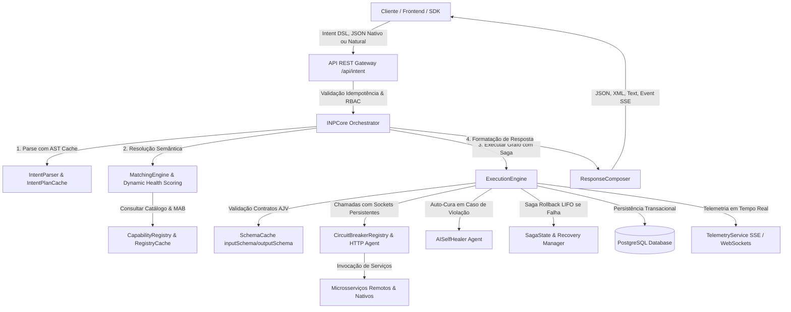
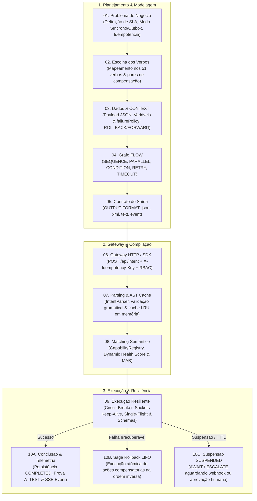

# Intent Network Protocol (INP) - Documentação Completa do Sistema

Bem-vindo à documentação oficial do **Intent Network Protocol (INP)**. Esta aplicação é um middleware de orquestração distribuído baseado em **Intenções**. Ele traduz requisições declarativas de alto nível (DSL ou linguagem natural) em execuções de microsserviços resilientes com verificação de segurança, validação de contratos, cache de performance e logs detalhados de auditoria.

---

## 1. Visão Geral da Arquitetura

O INP funciona como um intermediário inteligente (Gateway Orquestrador). Em vez de um cliente acoplar as chamadas HTTP diretamente a URLs de microsserviços, o cliente expressa o que quer fazer (**Intent**). O orquestrador INP resolve dinamicamente quais serviços cadastrados na rede podem realizar aquela ação, aplica regras de resiliência e executa o fluxo.

### Diagrama de Fluxo de Execução



---

## 2. Estrutura de Diretórios do Projeto

```text
C:\inp_protocol
├── src/
│   ├── api/
│   │   └── server.ts                 # Servidor Express HTTP (API REST)
│   ├── core/
│   │   ├── capability-registry.ts    # Descoberta de serviços e matching
│   │   ├── crypto-engine.ts          # Criptografia AES-256-GCM com rotação de chaves
│   │   ├── execution-engine.ts       # Engine de execução de grafos/passos com Saga e resiliência
│   │   ├── inp-core.ts               # Orquestrador central unificado
│   │   ├── intent-parser.ts          # Interpretador de DSL / Hook de LLM
│   │   ├── matching-engine.ts        # Resolução de dependências de capacidades
│   │   ├── queue-worker.ts           # Worker da fila transacional (SKIP LOCKED)
│   │   ├── registry-cache.ts         # Cache em memória (Performance)
│   │   ├── response-composer.ts      # Formatador de respostas multi-formato
│   │   ├── safe-evaluator.ts         # Avaliador de condições lógico seguro (AST)
│   │   ├── saga-recovery-manager.ts  # Auto-recuperação/compensação de Sagas na inicialização
│   │   ├── transaction-lock.ts       # Gerenciador de travas PostgreSQL (FOR UPDATE NOWAIT)
│   │   └── types.ts                  # Definições de tipos TypeScript do sistema
│   ├── persistence/
│   │   ├── data-source.ts            # Configuração do TypeORM e PostgreSQL
│   │   ├── entities/
│   │   │   ├── Execution.ts          # Registro de auditoria de execução
│   │   │   ├── QueueJob.ts           # Registro de Jobs da Fila Outbox
│   │   │   ├── SagaState.ts          # Estado e pilha de compensação da transação Saga
│   │   │   └── ServiceRegistration.ts# Cadastro de microsserviços no banco
│   │   └── repositories/
│   │       ├── ExecutionRepository.ts# Abstração de banco para execuções
│   │       ├── QueueJobRepository.ts # Abstração de banco para Jobs Outbox
│   │       ├── SagaStateRepository.ts# Abstração de banco para Sagas com locks
│   │       └── ServiceRepository.ts  # Abstração de banco para serviços
│   ├── services/
│   │   └── mock-payment-service.ts   # Microsserviço simulador de pagamentos
│   ├── circuit-breaker-js.d.ts       # Typings TS customizados do Circuit Breaker
│   └── index.ts                      # Ponto de entrada da aplicação
├── developer_guide.md                # Guia prático comentado para programadores
├── test-features.js                  # Script de testes de validação automatizados
├── package.json                      # Configuração de scripts e dependências
└── tsconfig.json                     # Configuração de compilação do TypeScript
```

---

## 3. Detalhes dos Componentes Core

### A. [INPCore](file:///C:/inp_protocol/src/core/inp-core.ts)
*   **Função**: Orquestrador central do protocolo. Junta todas as engrenagens em um único ponto de chamada.
*   **Funcionamento**: Recebe a entrada textual, delega o parsing para o `IntentParser`, invoca o `MatchingEngine` para associar capacidades aos serviços registrados, cria a instância do `ExecutionEngine` injetando o contexto de segurança e, por fim, compõe o formato de saída do resultado através do `ResponseComposer`.

### B. [IntentParser](file:///C:/inp_protocol/src/core/intent-parser.ts)
*   **Função**: Converte strings em objetos estruturados `ParsedIntent`.
*   **Parsing DSL**: Lê blocos bem estruturados utilizando uma máquina de estados simples auxiliada por expressões regulares de correspondência.
*   **Parsing de Linguagem Natural (LLM Hook)**: Caso configurado com `GEMINI_API_KEY` ou `OPENAI_API_KEY`, ele faz uma chamada remota para estruturar o texto via modelo de linguagem.
    *   **Injeção Dinâmica**: Para garantir 100% de flexibilidade, o orquestrador mapeia as capacidades ativas e cadastradas na rede em tempo real e as injeta no prompt da IA, permitindo que ela mapeie intenções humanas para novos microsserviços dinâmicos sem alteração de código.

### C. [CapabilityRegistry & RegistryCache](file:///C:/inp_protocol/src/core/capability-registry.ts)
*   **Função**: Armazena e resolve microsserviços que fornecem capacidades (ex: `EXECUTE PAYMENT`).
*   **Persistência**: Grava e atualiza heartbeats no PostgreSQL.
*   **Caching**: Utiliza o [registry-cache.ts](file:///C:/inp_protocol/src/core/registry-cache.ts) para evitar consultas excessivas ao PostgreSQL. O cache possui TTL de 30 segundos e é invalidado automaticamente quando novos microsserviços se registram ou saem do catálogo.

### D. [ExecutionEngine](file:///C:/inp_protocol/src/core/execution-engine.ts)
*   **Função**: Executa recursivamente o fluxo de passos do grafo (`SEQUENCE`, `PARALLEL`, `CONDITION`, `RETRY`, `FALLBACK`, `TIMEOUT`, `DEPENDENCY`, `PIPELINE`, `SCOPE`).
*   **Resiliência & Transacionalidade**:
    *   **Padrão Saga**: Rastreia dinamicamente os passos reversíveis executados e armazena suas ações de compensação na tabela `saga_states`. Se ocorrer um erro irrecuperável, executa o rollback compensatório de forma ordenada (LIFO).
    *   **Recuperação Progressiva (Forward Recovery)**: Se a política `FORWARD_RETRY` for ativada no contexto da intenção, o motor salva o progresso e reinicia a execução no exato passo que falhou, pulando e reaproveitando o resultado dos passos anteriores já concluídos com sucesso.
    *   **Retry com Backoff Exponencial**: Implementado via `axios-retry` para tentar novamente requisições em caso de falhas de conectividade temporárias.
    *   **Circuit Breaker**: Implementado via `circuit-breaker-js`. Isola microsserviços instáveis na rede, abrindo o circuito se a taxa de erros ultrapassar 50% em uma janela de tempo.
*   **Segurança (RBAC)**: Valida as permissões do usuário em trânsito contra o atributo `requiredPermissions` da capacidade requerida. Permite bypass de RBAC se estiver em modo de rollback do sistema (`isRollbackMode`).
*   **Validação de Contrato**: Utiliza a biblioteca `ajv` para compilar e validar o payload em relação ao JSON Schema do microsserviço cadastrado antes de efetuar chamadas externas.

### E. [ResponseComposer](file:///C:/inp_protocol/src/core/response-composer.ts)
*   **Função**: Transforma o resultado final em diferentes formatos suportados pelas aplicações clientes (`json`, `xml`, `text`, `event` para SSE/Websockets).

### F. [SafeEvaluator](file:///C:/inp_protocol/src/core/safe-evaluator.ts)
*   **Função**: Executa validações lógicas e matemáticas customizadas a partir de condições configuradas nos blocos `CONDITION`.
*   **Design de Sintaxe**: Desenvolvido usando um Parser de Descida Recursiva completo construído sobre AST sem o uso de `eval()` ou `new Function()`, blindando a aplicação contra ataques de injeção de código e execução remota de código (RCE).

### G. [CryptoEngine](file:///C:/inp_protocol/src/core/crypto-engine.ts)
*   **Função**: Fornece criptografia simétrica AES-256-GCM criptograficamente segura para dados sensíveis em passos `ENCRYPT` / `DECRYPT`.
*   **Rotação de Chaves**: Implementa rotação automática baseada em versões (ex: prefixos `v1:` e `v2:`), permitindo descriptografar registros antigos enquanto criptografa novos payloads com a chave ativa mais atual.

### H. [QueueWorker & TransactionLock](file:///C:/inp_protocol/src/core/queue-worker.ts)
*   **Função**: Processador transacional assíncrono do padrão Outbox (`QueueWorker`) e utilitário de travas do banco (`TransactionLock`).
*   **Locks Concorrentes**: Utiliza travas pessimistas `SKIP LOCKED` do PostgreSQL no worker para evitar contenção de filas concorrentes, e travas `FOR UPDATE NOWAIT` no rollback de Sagas para garantir exclusão mútua na recuperação distribuída.

---

## 4. Especificação da DSL (Domain Specific Language) do INP

A DSL é declarativa e suporta palavras-chaves estruturadas para o controle total do fluxo:

```text
INTENT "[Nome da Intenção]" {
  CONTEXT {
    [chave]: [valor],   // Dados de entrada passados para os microsserviços
    ...
  }
  REQUIRE {
    [VERBO TARGET]       // Capacidades obrigatórias no catálogo de serviços
  }
  FLOW {
    SEQUENCE {          // Executa passos sequencialmente
      ENCRYPT "[campo]" // Codifica em base64/criptografa dados confidenciais do contexto
      SCOPE {           // Cria um escopo isolado para os passos internos
         EXECUTE PAYMENT
      }
      DECRYPT "[campo]" // Descodifica/descriptografa o dado do contexto
      
      TIMEOUT 3000 {    // Executa blocos com limite de tempo (Promises Race)
         FETCH INVENTORY
      }
      
      DEPENDENCY "EXECUTE PAYMENT" { // Só executa o bloco se o passo especificado terminou com sucesso
         NOTIFY USER
      }
    }
  }
  OUTPUT {
    FORMAT "[json | xml | text | event]"
  }
}
```

### 4.1. Catálogo Consolidado de Verbos Semânticos (125 Verbos Operacionais — v2.8)

No INP Protocol v2.8, o catálogo semântico conta com **125 verbos oficiais** distribuídos em domínios arquiteturais: **32 Canónicos**, **18 Canónicos Adicionais**, **24 Anti-Estresse & Confiabilidade**, **6 Revolucionários ("Killer Features")**, **9 Criptográficos & Concorrência**, **16 Alta Produtividade & DevOps**, **15 Interconexão & Ergonomia** e **5 Novos Estratégicos v2.8**.

#### A. Verbos Canónicos (32 Verbos)
| Categoria | Verbos Suportados | Propósito Principal & Quando Usar |
|---|---|---|
| **CRUD & Domínio** | `CREATE`, `READ`, `UPDATE`, `DELETE` | Gestão de ciclo de vida de entidades. `CREATE` para novos objetos, `READ` para consultas locais, `UPDATE` para mutações e `DELETE` para expurgo. |
| **Execução & Operações** | `EXECUTE`, `PROCESS`, `ROUTE`, `COMPOSE` | `EXECUTE` para comandos transacionais atômicos (ex: pagamentos); `PROCESS` para filas/lotes; `ROUTE` para tráfego e nós federados; `COMPOSE` para agregação de saídas. |
| **Finanças, Estoque & Sagas** | `TRANSFER`, `REFUND`, `CANCEL`, `RESERVE`, `RELEASE` | Operações com compensação distribuída estrita: `TRANSFER` (compensado por `REFUND`), `RESERVE` (bloqueio com lease, compensado por `RELEASE`), `CANCEL` para anulação ativa. |
| **Inspeção, Validação & Regras** | `VALIDATE`, `CHECK`, `CALCULATE`, `ANALYZE`, `FILTER` | `VALIDATE` para contratos JSON Schema; `CHECK` para disponibilidade instantânea sem retenção; `CALCULATE` para fórmulas matemáticas puras; `ANALYZE` para scoring analítico/fraude; `FILTER` para predicados. |
| **Segurança & Identidade** | `AUTHENTICATE`, `AUTHORIZE`, `AUDIT` | `AUTHENTICATE` responde *"Quem é você?"*; `AUTHORIZE` valida permissões RBAC; `AUDIT` valida integridade e trilha forense de transações. |
| **Comunicação & Mensageria** | `NOTIFY`, `SEND`, `PUBLISH`, `SYNC`, `DISPATCH` | `NOTIFY` para alertas leves (SMS/Push); `SEND` para faturas/documentos; `PUBLISH` para barramentos Pub/Sub (Kafka/RabbitMQ); `SYNC` para conciliação de réplicas; `DISPATCH` para workers assíncronos. |
| **Workflow & Governança** | `APPROVE`, `REJECT`, `GENERATE`, `STORE`, `ARCHIVE`, `FETCH` | `APPROVE` / `REJECT` para deliberações de crédito; `GENERATE` para artefatos derivados (PDF/tokens); `STORE` / `FETCH` para persistência técnica; `ARCHIVE` para guarda fria legal (SOC2). |

#### B. Verbos Estratégicos & Anti-Estresse do Motor (14 Verbos - v2.6)
| Verbo | Categoria | Finalidade Arquitetural & Mitigação de Sobrecarga |
|---|---|---|
| `COALESCE` | Anti-Stress | **Single-Flight Pattern**: Deduplica requisições concorrentes idênticas em voo, colapsando 100 pedidos simultâneos numa única execução real. |
| `MEMOIZE` | Anti-Stress | **Cache-Aside Atómico**: Memoização transparente em memória com chave criptográfica (*SHA-256*) e TTL configurável. |
| `GUARD` | Resiliência | **Fail-Fast Invariants**: Barreira de validação que avalia invariantes de segurança em memória sem disparar chamadas de rede externas. |
| `THROTTLE` | Anti-Stress | **Token Bucket Pacing**: Controlo de cadência e vazão por alvo, contendo picos e respeitando limites de rate limit de APIs externas. |
| `BATCH` | Anti-Stress | **Chunking Declarativo**: Fracionamento de coleções grandes em pedaços seguros (*chunks*), eliminando o problema de sobrecarga N+1. |
| `DEFER` | Anti-Stress | **Transactional Outbox**: Agendamento assíncrono persistido na base de dados (`queue_jobs`), libertando o ciclo síncrono do motor. |
| `MERGE` | Ergonomia | **Consolidação Profunda**: Fusão declarativa de múltiplos fragmentos ou saídas de passos anteriores num único payload consolidado. |
| `AWAIT` | Ergonomia | **Suspensão Reativa de Saga**: Coloca a Saga em estado `SUSPENDED` sem reter *threads* nem *event loop*, pronta para retoma externa. |
| `PROBE` | Telemetria | **Zero-IO Health Check**: Inspeção volátil de saúde em memória (<1ms) diretamente via `ServiceMetricsCollector`, sem escritas em disco. |
| `SHADOW` | Resiliência | **Dark Launching / Canary**: Disparo assíncrono (*fire-and-forget*) de tráfego espelho para validação em segundo plano sem onerar a latência. |
| `REDACT` | Segurança | **Data Sanitization**: Ofuscação determinística de campos sensíveis (`password`, `creditCard`, `token`) com máscaras irreversíveis antes de transmissão ou gravação. |
| `CHECKPOINT` | Resiliência | **Saga Savepoint**: Registo explícito de marco intermediário no PostgreSQL para permitir recuperação granular em caso de desastre. |
| `SIMULATE` | Resiliência | **Chaos & Mocking**: Injeção controlada de latência sintética, respostas mockadas ou falhas programadas para testes de carga e resiliência. |
| `FANOUT` | Ergonomia | **Bounded Concurrency Dispatch**: Dispersão paralela com contrapressão estrita, evitando exaustão de *heap* ou sockets. |

#### C. Verbos Revolucionários ("Killer Features") (6 Verbos - v2.7)
| Verbo | Domínio Tecnológico | Proposta de Valor & Diferencial Competitivo |
|---|---|---|
| `STREAM` | Real-Time / SSE | **Transmissão Progressiva em Tempo Real**: Despacha deltas/chunks incrementais via SSE e WebSockets (`STREAM_CHUNK`) sem bloquear o ciclo do motor, permitindo UIs reativas (estilo ChatGPT/Copilot). |
| `ATTEST` | Criptografia & Compliance | **Prova Forense Inviolável**: Gera um carimbo criptográfico (*HMAC-SHA256*) e selo de atestação do estado de execução (`ATTESTATION_SEAL`), atendendo normas SOC2, HIPAA e LGPD. |
| `ADAPT` | IA & Roteamento Dinâmico | **Roteamento Inteligente com Multi-Armed Bandit**: Seleciona autonomamente o melhor provedor com base em métricas reais de latência e taxa de erro em tempo real ($\epsilon$-greedy). |
| `ESCALATE` | Human-in-the-Loop | **Suspensão Supervisionada com SLA**: Suspende Sagas de alto risco ou atípicas para aprovação humana (`SUSPENDED`), gerando token de decisão, contagem regressiva de SLA e endpoint REST de aprovação formal. |
| `REASON` | Orquestração Agêntica | **Deliberação Racional Estruturada (CoT)**: Avalia hipóteses, pondera prós e contras, calcula escores de confiança e fundamenta a decisão de forma auditável para agentes autônomos. |
| `CONSENSUS` | Concorrência Distribuída | **Acordo Distribuído de Quórum**: Consenso federado bizantino entre múltiplos nós de execução. |

#### D. Novos Verbos Estratégicos do Motor (5 Verbos - v2.8)
| Verbo | Domínio | Proposta de Valor & Funcionalidade |
|---|---|---|
| `COMPENSATE` | Saga Reativa | **Disparo Explícito de Compensação**: Aciona compensações de Saga sob demanda de forma declarativa dentro do grafo sem aguardar falha catastrófica. |
| `BENCHMARK` | Observabilidade | **Cronometragem de Precisão**: Medição em nanosegundos (`hrtime`) com cálculo de ops/s, uso de memória e telemetria inline para SLAs estritos. |
| `NORMALIZE` | Qualidade de Dados | **Padronização Semântica**: Normalização recursiva de payloads (ISO 8601, remoção de diacríticos, chaves sanitizadas e números de telefone). |
| `ENQUEUE` | Fila Outbox | **Enfileiramento com Prioridade**: Agendamento atómico na tabela transacional `queue_jobs` com prioridade configurável e atraso programado (`delayMs`). |
| `INSPECT` | Telemetria / Debug | **Inspeção Não-Invasiva**: Emissão de snapshot forense em tempo real via Server-Sent Events (SSE) sem alterar o contexto de execução. |

---

### 4.2. Estrutura Visual Explicativa: Ciclo de Vida Completo de uma Intenção (Do Zero ao Fim)

Para que programadores e arquitetos criem intenções do absoluto zero com perfeição e sem estresse, o INP Protocol estabelece o seguinte ciclo de vida canónico em 10 etapas fundamentais:



#### As 10 Etapas Detalhadas:
1. **Definição do Problema & Requisitos**: Estabeleça o objetivo, a criticidade, se o retorno deve ser imediato ou assíncrono via Transactional Outbox (`async: true`), e planeje a chave de negócio única para idempotência.
2. **Seleção Semântica dos Verbos**: Escolha os verbos adequados. Para cada ação mutável (ex.: `TRANSFER FUNDS`, `RESERVE LOCK`), defina sua ação compensatória (`REFUND PAYMENT`, `RELEASE LOCK`).
3. **Modelagem do Contexto (`CONTEXT`)**: Estruture o JSON de dados e configure a política `failurePolicy: "ROLLBACK"` (padrão financeiro LIFO) ou `"FORWARD_RETRY"` (para jobs em lote tolerantes a retomadas).
4. **Topologia do Grafo (`FLOW`)**: Conecte os passos: use `SEQUENCE` para cadeias causais, `PARALLEL` para I/O simultâneo com proteção `AbortController`, `RETRY` com backoff exponencial e `TIMEOUT` para contenção de latência.
5. **Especificação de Saída (`OUTPUT`)**: Defina o formato via `ResponseComposer`: `json`, `xml`, `text` ou `event` (Server-Sent Events para streaming).
6. **Submissão via Gateway HTTP / SDK**: Submeta via `POST /api/intent` enviando o cabeçalho `X-Idempotency-Key` e o `securityContext` com credenciais RBAC.
7. **Parsing, Validação & AST Cache**: O `IntentParser` analisa a DSL e consulta o `IntentPlanCache` para devolver o plano pré-compilado em <0.1ms caso já tenha sido processado.
8. **Matching Semântico & Dynamic Health**: O `MatchingEngine` localiza provedores ativos no `CapabilityRegistry`, ponderando `trustScore`, nível de segurança e penalização de latência em tempo real via `ServiceMetricsCollector`.
9. **Execução no Motor com Resiliência**: O `ExecutionEngine` invoca serviços utilizando conexões HTTP Keep-Alive, proteção `CircuitBreakerRegistry` por serviço, validação de contratos de entrada (`inputSchema`) e saída (`outputSchema`) com autocura via IA (`AISelfHealer`).
10. **Conclusão, Rollback ou Suspensão**: Em caso de sucesso, registra `COMPLETED` com recibo forense e emite telemetria em tempo real; em caso de falha, dispara o rollback de Saga desfazendo passos em ordem inversa (LIFO); se invocado `AWAIT` ou `ESCALATE`, suspende com segurança para retoma externa.

> 📚 **Livro Completo do Motor Atualizado**: Para a obra definitiva cobrindo a engenharia do motor, os 51 verbos minuciosamente explicados, 10 tutoriais passo a passo do zero à produção, segurança e manuais de operações, consulte [docs/LIVRO_COMPLETO_INP_PROTOCOL_v2.7.md](file:///c:/inp_protocol/docs/LIVRO_COMPLETO_INP_PROTOCOL_v2.7.md).

---

## 5. Documentação da API REST (Endpoints)

### 1. Registrar um Microsserviço
*   **Endpoint**: `POST /services/register`
*   **Body**:
```json
{
  "id": "secured-payment-service",
  "name": "Secure Payments Gateway",
  "capabilities": [
    {
      "verb": "EXECUTE",
      "target": "PAYMENT",
      "requiredPermissions": ["payments.write"],
      "inputSchema": {
        "type": "object",
        "properties": {
          "amount": { "type": "number", "minimum": 1 },
          "user_id": { "type": "string" },
          "card_token": { "type": "string" }
        },
        "required": ["amount", "user_id", "card_token"]
      }
    }
  ],
  "trustScore": 99,
  "securityLevel": "HIGH",
  "endpoint": "http://localhost:3001"
}
```

### 2. Enviar Batida de Coração (Heartbeat)
*   **Endpoint**: `POST /services/heartbeat/:serviceId`

### 3. Listar Serviços Ativos
*   **Endpoint**: `GET /services`

### 4. Processar uma Intenção (Síncrona ou Assíncrona via Outbox)
*   **Endpoint**: `POST /api/intent`
*   **Body (Síncrono)**:
```json
{
  "text": "INTENT \"buy_item\" { CONTEXT { amount: 150.0, user_id: \"usr_77\", card_token: \"tok_456\" } REQUIRE { EXECUTE PAYMENT } FLOW { SEQUENCE { EXECUTE PAYMENT } } OUTPUT { FORMAT \"json\" } }",
  "type": "dsl",
  "securityContext": {
    "userId": "usr_77",
    "permissions": ["payments.write"]
  }
}
```
*   **Body (Assíncrono via Outbox Fila)**:
```json
{
  "text": "INTENT \"buy_item\" { CONTEXT { amount: 150.0, user_id: \"usr_77\", card_token: \"tok_456\" } REQUIRE { EXECUTE PAYMENT } FLOW { SEQUENCE { EXECUTE PAYMENT } } OUTPUT { FORMAT \"json\" } }",
  "type": "dsl",
  "async": true,
  "securityContext": {
    "userId": "usr_77",
    "permissions": ["payments.write"]
  }
}
```
*   **Retorno Assíncrono**:
```json
{
  "success": true,
  "result": {
    "status": "PENDING",
    "execution_id": "d3b07384-d113-4a1e-a13d-519b7d8b5c90",
    "message": "Intent enqueued for asynchronous execution"
  }
}
```

### 5. Consultar Métricas do Painel (Dashboard Stats)
*   **Endpoint**: `GET /api/dashboard/stats`
*   **Retorno**:
```json
{
  "success": true,
  "stats": {
    "activeServices": 2,
    "totalExecutions": 16,
    "failedExecutions": 7,
    "completedExecutions": 9,
    "avgDurationMs": 44
  }
}
```

### 6. Listar Execuções Recentes
*   **Endpoint**: `GET /api/dashboard/executions`

---

## 6. Como Executar e Validar o Sistema

### Pré-requisitos
*   **Node.js** v18+ instalado.
*   **PostgreSQL** rodando com um banco chamado `inp` e usuário `inp` com senha `inp123` (configurado em `.env`).

### Executando Localmente
1.  Instale as dependências:
    ```bash
    npm install
    ```
2.  Compile o projeto (TypeScript):
    ```bash
    npm run build
    ```
3.  Inicie o servidor principal (porta `3000`):
    ```bash
    npm start
    ```
4.  Inicie o serviço mock de pagamentos de teste (porta `3001` em outro terminal):
    ```bash
    npm run mock-service
    ```
5.  Execute a suíte de testes de validação base:
    ```bash
    node test-features.js
    ```
6.  Execute a suíte de testes avançados e arquitetura distribuída (Saga, DLQ, Lock Reap, Idempotency):
    ```bash
    node test-saga.js
    ```

---

## 7. Melhorias de Nível Master (Arquitetura Avançada)

O sistema conta com três extensões de governança operacional e resiliência de nível sênior/master:

### A. Lock Reap Timeout (Auto-recuperação de Jobs)
*   **Mecanismo**: Periodicamente, o `QueueWorker` executa uma varredura para identificar e liberar locks de jobs travados no estado `PROCESSING` por tempo excessivo (limite de expiração configurável).
*   **Impacto**: Garante auto-recuperação caso uma instância de gateway sofra uma queda repentina durante o processamento.

### B. Dead Letter Queue (DLQ) & Alertas de Webhooks
*   **Mecanismo**: Transações Saga ou compensações (rollbacks) que falham definitivamente após o limite de tentativas são roteadas para uma tabela `dead_letter_queue` dedicada para auditoria manual.
*   **Alertas**: O sistema dispara uma chamada HTTP POST de webhook externa (configurada via `ALERT_WEBHOOK_URL`) com detalhes da falha operacional para alertas em tempo real. Os registros em DLQ e disparos de webhook ocorrem de forma isolada de transações que sofreram rollback.

### C. Chaves de Idempotência Determinísticas (Idempotency Keys)
*   **Mecanismo**: O motor gera automaticamente um cabeçalho `X-Idempotency-Key` único para chamadas HTTP externas. O valor da chave é um UUID gerado deterministicamente a partir do `executionId` e do índice do passo atual da fluxo (`stepIndex`), garantindo que execuções duplicadas e retentativas não resultem em efeitos colaterais.

---

## 8. Documentação Completa e Especializada

Para aprofundar-se em cada aspecto do **Intent Network Protocol (INP)**, consulte os manuais especializados na pasta [`docs/`](file:///c:/inp_protocol/docs/):

1. 🏛️ [**01-ARCHITECTURE.md**](file:///c:/inp_protocol/docs/01-ARCHITECTURE.md): Diagramas C4, fluxo de orquestração detalhado, padrões distribuídos e ciclo de vida de intenções.
2. 📜 [**02-DSL-SPECIFICATION.md**](file:///c:/inp_protocol/docs/02-DSL-SPECIFICATION.md): Especificação formal da DSL, operadores de fluxo, escopos confidenciais e exemplos para cada palavra-chave.
3. 🌐 [**03-API-REFERENCE.md**](file:///c:/inp_protocol/docs/03-API-REFERENCE.md): Guia de todos os endpoints REST, formato de Server-Sent Events (SSE), headers de rastreamento e exemplos cURL.
4. 🛡️ [**04-SECURITY-AUDIT-AND-HARDENING.md**](file:///c:/inp_protocol/docs/04-SECURITY-AUDIT-AND-HARDENING.md): Análise de ameaças STRIDE, vulnerabilidades identificadas e guia prático de blindagem.
5. 🔌 [**05-MICROSERVICES-AND-FEDERATION-GUIDE.md**](file:///c:/inp_protocol/docs/05-MICROSERVICES-AND-FEDERATION-GUIDE.md): Passo a passo para desenvolvedores criarem microsserviços integrados e nós federados P2P.
6. 🚀 [**06-OPERATIONS-AND-DEPLOYMENT.md**](file:///c:/inp_protocol/docs/06-OPERATIONS-AND-DEPLOYMENT.md): Guia DevOps de Docker, Docker Compose, variáveis de ambiente, DLQ e runbook de troubleshooting.
7. 🔍 [**07-AUDIT-REPORT.md**](file:///c:/inp_protocol/docs/07-AUDIT-REPORT.md): Relatório executivo da auditoria técnica com pontos fortes, fracos, matriz de risco e roadmap de evolução.

