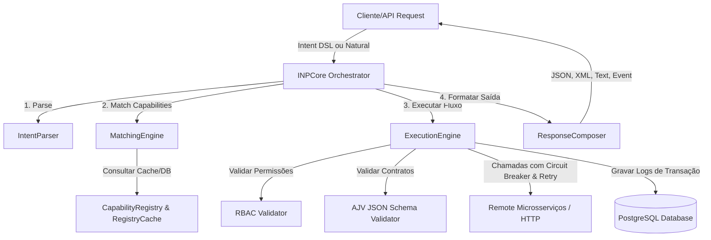

# Intent Network Protocol (INP) - Documentação Completa do Sistema

Bem-vindo à documentação oficial do **Intent Network Protocol (INP)**. Esta aplicação é um middleware de orquestração distribuído baseado em **Intenções**. Ele traduz requisições declarativas de alto nível (DSL ou linguagem natural) em execuções de microsserviços resilientes com verificação de segurança, validação de contratos, cache de performance e logs detalhados de auditoria.

---

## 1. Visão Geral da Arquitetura

O INP funciona como um intermediário inteligente (Gateway Orquestrador). Em vez de um cliente acoplar as chamadas HTTP diretamente a URLs de microsserviços, o cliente expressa o que quer fazer (**Intent**). O orquestrador INP resolve dinamicamente quais serviços cadastrados na rede podem realizar aquela ação, aplica regras de resiliência e executa o fluxo.

### Diagrama de Fluxo de Execução



---

## 2. Estrutura de Diretórios do Projeto

```text
C:\inp_protocol
├── src/
│   ├── api/
│   │   └── server.ts                 # Servidor Express HTTP (API REST)
│   ├── core/
│   │   ├── capability-registry.ts    # Descoberta de serviços e matching
│   │   ├── execution-engine.ts       # Engine de execução de grafos/passos
│   │   ├── inp-core.ts               # Orquestrador central unificado
│   │   ├── intent-parser.ts          # Interpretador de DSL / Hook de LLM
│   │   ├── matching-engine.ts        # Resolução de dependências de capacidades
│   │   ├── registry-cache.ts         # Cache em memória (Performance)
│   │   ├── response-composer.ts      # Formatador de respostas multi-formato
│   │   └── types.ts                  # Definições de tipos TypeScript do sistema
│   ├── persistence/
│   │   ├── data-source.ts            # Configuração do TypeORM e PostgreSQL
│   │   ├── entities/
│   │   │   ├── Execution.ts          # Registro de auditoria de execução
│   │   │   └── ServiceRegistration.ts# Cadastro de microsserviços no banco
│   │   └── repositories/
│   │       ├── ExecutionRepository.ts# Abstração de banco para execuções
│   │       └── ServiceRepository.ts  # Abstração de banco para serviços
│   ├── services/
│   │   └── mock-payment-service.ts   # Microsserviço simulador de pagamentos
│   ├── circuit-breaker-js.d.ts       # Typings TS customizados do Circuit Breaker
│   └── index.ts                      # Ponto de entrada da aplicação
├── developer_guide.md                # Guia prático comentado para programadores
├── test-features.js                  # Script de testes de validação automatizados
├── package.json                      # Configuração de scripts e dependências
└── tsconfig.json                     # Configuração de compilação do TypeScript
```

---

## 3. Detalhes dos Componentes Core

### A. [INPCore](file:///C:/inp_protocol/src/core/inp-core.ts)
*   **Função**: Orquestrador central do protocolo. Junta todas as engrenagens em um único ponto de chamada.
*   **Funcionamento**: Recebe a entrada textual, delega o parsing para o `IntentParser`, invoca o `MatchingEngine` para associar capacidades aos serviços registrados, cria a instância do `ExecutionEngine` injetando o contexto de segurança e, por fim, compõe o formato de saída do resultado através do `ResponseComposer`.

### B. [IntentParser](file:///C:/inp_protocol/src/core/intent-parser.ts)
*   **Função**: Converte strings em objetos estruturados `ParsedIntent`.
*   **Parsing DSL**: Lê blocos bem estruturados utilizando uma máquina de estados simples auxiliada por expressões regulares de correspondência.
*   **Parsing de Linguagem Natural (LLM Hook)**: Caso configurado com `GEMINI_API_KEY` ou `OPENAI_API_KEY`, ele faz uma chamada remota para estruturar o texto via modelo de linguagem.
    *   **Injeção Dinâmica**: Para garantir 100% de flexibilidade, o orquestrador mapeia as capacidades ativas e cadastradas na rede em tempo real e as injeta no prompt da IA, permitindo que ela mapeie intenções humanas para novos microsserviços dinâmicos sem alteração de código.

### C. [CapabilityRegistry & RegistryCache](file:///C:/inp_protocol/src/core/capability-registry.ts)
*   **Função**: Armazena e resolve microsserviços que fornecem capacidades (ex: `EXECUTE PAYMENT`).
*   **Persistência**: Grava e atualiza heartbeats no PostgreSQL.
*   **Caching**: Utiliza o [registry-cache.ts](file:///C:/inp_protocol/src/core/registry-cache.ts) para evitar consultas excessivas ao PostgreSQL. O cache possui TTL de 30 segundos e é invalidado automaticamente quando novos microsserviços se registram ou saem do catálogo.

### D. [ExecutionEngine](file:///C:/inp_protocol/src/core/execution-engine.ts)
*   **Função**: Executa recursivamente o fluxo de passos do grafo (`SEQUENCE`, `PARALLEL`, `CONDITION`, `RETRY`, `FALLBACK`, `TIMEOUT`, `DEPENDENCY`, `PIPELINE`, `SCOPE`).
*   **Resiliência**:
    *   **Retry com Backoff Exponencial**: Implementado via `axios-retry` para tentar novamente requisições em caso de falhas de conectividade temporárias.
    *   **Circuit Breaker**: Implementado via `circuit-breaker-js`. Isola microsserviços instáveis na rede, abrindo o circuito se a taxa de erros ultrapassar 50% em uma janela de tempo.
*   **Segurança (RBAC)**: Valida as permissões do usuário em trânsito contra o atributo `requiredPermissions` da capacidade requerida.
*   **Validação de Contrato**: Utiliza a biblioteca `ajv` para compilar e validar o payload em relação ao JSON Schema do microsserviço cadastrado antes de efetuar chamadas externas.

### E. [ResponseComposer](file:///C:/inp_protocol/src/core/response-composer.ts)
*   **Função**: Transforma o resultado final em diferentes formatos suportados pelas aplicações clientes (`json`, `xml`, `text`, `event` para SSE/Websockets).

---

## 4. Especificação da DSL (Domain Specific Language) do INP

A DSL é declarativa e suporta palavras-chaves estruturadas para o controle total do fluxo:

```text
INTENT "[Nome da Intenção]" {
  CONTEXT {
    [chave]: [valor],   // Dados de entrada passados para os microsserviços
    ...
  }
  REQUIRE {
    [VERBO TARGET]       // Capacidades obrigatórias no catálogo de serviços
  }
  FLOW {
    SEQUENCE {          // Executa passos sequencialmente
      ENCRYPT "[campo]" // Codifica em base64/criptografa dados confidenciais do contexto
      SCOPE {           // Cria um escopo isolado para os passos internos
         EXECUTE PAYMENT
      }
      DECRYPT "[campo]" // Descodifica/descriptografa o dado do contexto
      
      TIMEOUT 3000 {    // Executa blocos com limite de tempo (Promises Race)
         FETCH INVENTORY
      }
      
      DEPENDENCY "EXECUTE PAYMENT" { // Só executa o bloco se o passo especificado terminou com sucesso
         NOTIFY USER
      }
    }
  }
  OUTPUT {
    FORMAT "[json | xml | text | event]"
  }
}
```

---

## 5. Documentação da API REST (Endpoints)

### 1. Registrar um Microsserviço
*   **Endpoint**: `POST /services/register`
*   **Body**:
```json
{
  "id": "secured-payment-service",
  "name": "Secure Payments Gateway",
  "capabilities": [
    {
      "verb": "EXECUTE",
      "target": "PAYMENT",
      "requiredPermissions": ["payments.write"],
      "inputSchema": {
        "type": "object",
        "properties": {
          "amount": { "type": "number", "minimum": 1 },
          "user_id": { "type": "string" },
          "card_token": { "type": "string" }
        },
        "required": ["amount", "user_id", "card_token"]
      }
    }
  ],
  "trustScore": 99,
  "securityLevel": "HIGH",
  "endpoint": "http://localhost:3001"
}
```

### 2. Enviar Batida de Coração (Heartbeat)
*   **Endpoint**: `POST /services/heartbeat/:serviceId`

### 3. Listar Serviços Ativos
*   **Endpoint**: `GET /services`

### 4. Processar uma Intenção (DSL ou Natural)
*   **Endpoint**: `POST /api/intent`
*   **Body**:
```json
{
  "text": "INTENT \"buy_item\" { CONTEXT { amount: 150.0, user_id: \"usr_77\", card_token: \"tok_456\" } REQUIRE { EXECUTE PAYMENT } FLOW { SEQUENCE { EXECUTE PAYMENT } } OUTPUT { FORMAT \"json\" } }",
  "type": "dsl",
  "securityContext": {
    "userId": "usr_77",
    "permissions": ["payments.write"]
  }
}
```

### 5. Consultar Métricas do Painel (Dashboard Stats)
*   **Endpoint**: `GET /api/dashboard/stats`
*   **Retorno**:
```json
{
  "success": true,
  "stats": {
    "activeServices": 2,
    "totalExecutions": 16,
    "failedExecutions": 7,
    "completedExecutions": 9,
    "avgDurationMs": 44
  }
}
```

### 6. Listar Execuções Recentes
*   **Endpoint**: `GET /api/dashboard/executions`

---

## 6. Como Executar e Validar o Sistema

### Pré-requisitos
*   **Node.js** v18+ instalado.
*   **PostgreSQL** rodando com um banco chamado `inp` e usuário `inp` com senha `inp123` (configurado em `.env`).

### Executando Localmente
1.  Instale as dependências:
    ```bash
    npm install
    ```
2.  Inicie o servidor principal (porta `3000`):
    ```bash
    npm run dev
    ```
3.  Inicie o serviço mock de pagamentos de teste (porta `3001` em outro terminal):
    ```bash
    npm run mock-service
    ```
4.  Execute a suíte de testes de validação automatizados:
    ```bash
    node test-features.js
    ```
