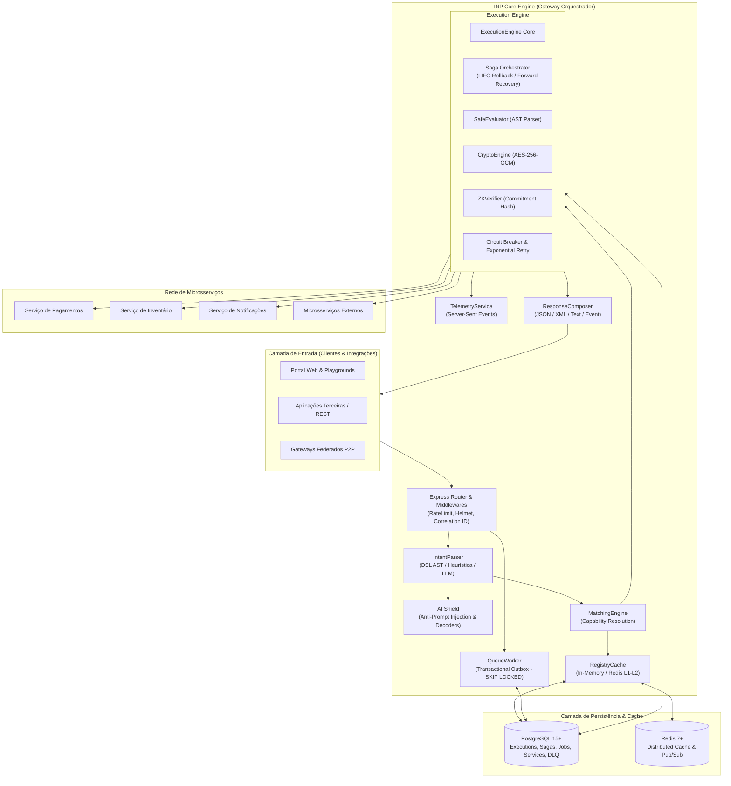
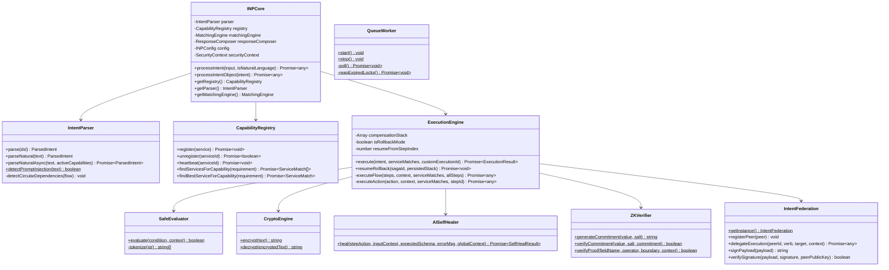

# Arquitetura do Sistema - Intent Network Protocol (INP)

O **Intent Network Protocol (INP)** é um middleware distribuído de orquestração declarativa baseado no paradigma de **Sistemas Orientados a Intenção (Intent-Based Systems)**. Em vez de aplicações clientes acoplarem-se a contratos estáticos, URLs pontuais e orquestrações imperativas de microsserviços, o cliente emite uma **Intenção de Negócio (Intent)** que especifica o *objetivo final* e as *restrições de contexto*, delegando ao INP a resolução topológica, validação de contratos, garantia de resiliência e execução de transações distribuídas.

---

## 1. Visão Geral e Princípios Arquiteturais

### Princípios Fundamentais:
1. **Desacoplamento Declarativo**: O consumidor do protocolo declara *o que* precisa ser feito (`INTENT`, `REQUIRE`), não *onde* ou *como*.
2. **Resiliência por Design**: Tolerância a falhas com isolamento de falhas (Circuit Breaker), transações distribuídas (Padrão Saga com compensação LIFO e Forward Recovery) e filas assíncronas (Transactional Outbox).
3. **Segurança de Múltiplas Camadas**: RBAC por capacidade, avaliação lógica sem interpretação arbitrária (`SafeEvaluator` sem `eval`), criptografia simétrica autenticada com rotação de chaves (`CryptoEngine`), e barreira anti-injeção de prompt (`AI Shield`).
4. **Descoberta Dinâmica e Autocura**: Serviços registram capacidades com contratos JSON Schema (`inputSchema`), batimentos cardíacos (`heartbeat`) e autocura orientada a IA (`AISelfHealer`) quando payloads divergem minimamente de contratos.

---

## 2. Diagrama de Classes e Componentes Core

---

## 3. Ciclo de Vida da Execução de uma Intenção

### Fluxo Síncrono (`POST /api/intent` com `async: false` ou omitido):
1. **Recepção HTTP**: O payload chega ao Express com Rate Limiting e cabeçalhos de segurança (Helmet). O middleware atribui ou preserva o `x-correlation-id`.
2. **Análise de Intenção (Parsing)**:
   - Se for DSL (`type: "dsl"`): `IntentParser.parse()` extrai blocos balanceados (`CONTEXT`, `REQUIRE`, `FLOW`, `OUTPUT`). É executada a verificação topológica para detecção de dependências cíclicas (`detectCircularDependencies`).
   - Se for Linguagem Natural (`type: "natural"`): O texto passa pelo `AI Shield`. Se for aprovado, é submetido ao modelo de linguagem (`gemini-pro` ou `gpt-3.5-turbo`) com injeção dinâmica do catálogo de capacidades ativas; se falhar ou não houver chave de API configurada, utiliza regras heurísticas locais baseadas em expressões regulares.
3. **Matching de Capacidades**: O `MatchingEngine` consulta o `CapabilityRegistry` (com aceleração por cache L1 em memória e L2 via Redis) para encontrar os microsserviços aptos a realizar cada capacidade exigida no `REQUIRE`.
4. **Execução de Fluxo (`ExecutionEngine`)**:
   - Inicializa registros de auditoria na tabela `executions` e o estado transacional na tabela `saga_states`.
   - Dispara eventos em tempo real para o `TelemetryService` via Server-Sent Events (SSE).
   - Executa nós do grafo recursivamente: `SEQUENCE`, `PARALLEL`, `CONDITION` (avaliado com `SafeEvaluator`), `RETRY`, `FALLBACK`, `TIMEOUT`, `DEPENDENCY`, `PIPELINE`, `SCOPE`, `CONFIDENTIAL_SCOPE`.
   - Para cada ação folha (`EXECUTE ...`, `FETCH ...`, etc.):
     - Verifica permissões de segurança RBAC (`requiredPermissions` vs `securityContext.permissions`).
     - Valida o payload contra o `inputSchema` (JSON Schema compilado via AJV).
     - Se o contrato falhar, tenta autocura com IA (`AISelfHealer`).
     - Aplica Adaptive Throttling caso o serviço esteja marcado como `DEGRADED`.
     - Faz a requisição HTTP passando `X-Idempotency-Key` (UUID determinístico) e protegida por Circuit Breaker (`timeout: 5000ms`, `errorThreshold: 50%`).
     - Registra ação de compensação (`compensateCapability`) na pilha LIFO da Saga.
5. **Composição da Resposta**: O `ResponseComposer` formata o resultado final de acordo com a cláusula `OUTPUT` (`json`, `xml`, `text`, `event`) e retorna o payload com status `200 OK`.

### Fluxo Assíncrono (`POST /api/intent` com `async: true`):
1. O Gateway não executa o fluxo imediatamente. Ele persiste uma entrada na tabela `queue_jobs` com status `PENDING` e `task_type: 'FLOW_EXECUTION'`.
2. Retorna imediatamente resposta HTTP `200 OK` contendo o `execution_id` gerado.
3. O `QueueWorker` em background seleciona o job utilizando concorrência `SKIP LOCKED` do PostgreSQL, atualiza para `PROCESSING` com posse (`locked_by` e `locked_at`) e processa a execução.
4. Caso ocorra erro irrecuperável e o limite de tentativas (`maxAttempts`) seja atingido, o job é movido para a tabela `dead_letter_queue` e um alerta via Webhook HTTP é disparado pelo `AlertManager`.

---

## 4. Estratégias de Resiliência Distribuída

| Padrão | Componente | Descrição Técnica |
| :--- | :--- | :--- |
| **Saga Orchestrator** | `ExecutionEngine` & `SagaStateRepository` | Orquestração centralizada de transações distribuídas. Armazena ações de compensação em pilha LIFO persistente (`saga_states`). Em falha, dispara rollback automático. |
| **Forward Recovery** | `ExecutionEngine` | Política opcional (`context.failurePolicy = 'FORWARD_RETRY'`). Permite que o motor pause a execução no passo exato da falha e retome subsequentemente sem desfazer etapas já concluídas. |
| **Circuit Breaker** | `circuit-breaker-js` | Protege a rede contra falhas em cascata. Abre o circuito quando a taxa de erros excede 50%, rejeitando requisições subsequentes rapidamente para permitir a recuperação do microsserviço. |
| **Idempotência Determinística** | `ExecutionEngine` | Gera UUID v4 derivado de hash SHA-256 do par `(executionId, stepIndex)` e envia no cabeçalho HTTP `X-Idempotency-Key` para evitar operações duplicadas. |
| **Pessimistic Locking** | `TransactionLock` | Utiliza `SELECT ... FOR UPDATE NOWAIT` no PostgreSQL para exclusão mútua estrita durante rollbacks de Sagas concorrentes. |
| **Concurrency Queueing** | `QueueWorker` | Utiliza `SELECT ... FOR UPDATE SKIP LOCKED` para permitir que múltiplos workers consumam jobs da fila `queue_jobs` simultaneamente sem colisão. |
| **Dead Letter Queue (DLQ)** | `DeadLetterQueue` & `AlertManager` | Isolamento e auditoria permanente de tarefas ou rollbacks que falharam após esgotar o número máximo de retentativas. |
| **Adaptive Throttling** | `ServiceMetricsCollector` | Redução proativa da taxa de envio de tráfego para serviços com status `DEGRADED` (alta latência ou taxa de erro elevada). |
