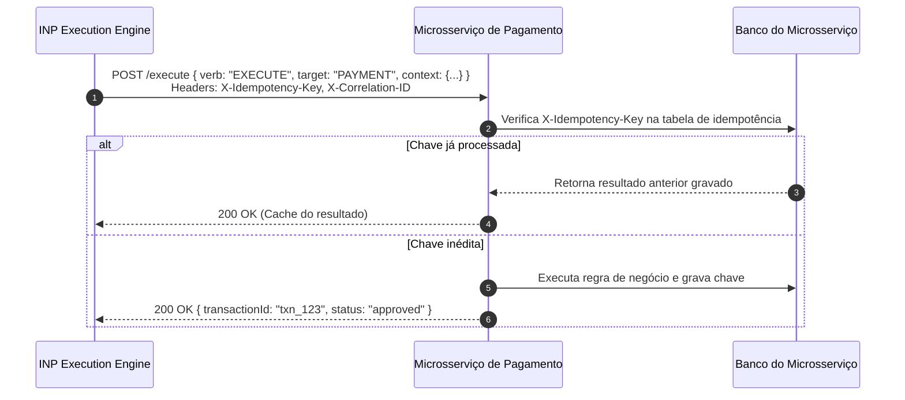
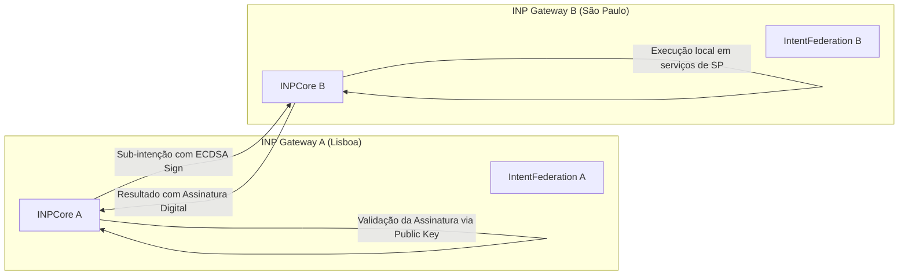

# Guia de Microsserviços e Federação P2P - INP Protocol

Este guia detalha como desenvolver, registrar e operar microsserviços compatíveis com o ecossistema do **Intent Network Protocol (INP)**, além de explicar o funcionamento da federação descentralizada entre múltiplos gateways.

---

## 1. Anatomia de um Microsserviço Compatível com INP

Para que um microsserviço participe da rede INP, ele deve disponibilizar um servidor HTTP atendendo a dois requisitos básicos:

1. **Endpoint de Execução (`POST /execute`)**: Ponto por onde o `ExecutionEngine` do INP despacha as ações delegadas.
2. **Tratamento de Cabeçalhos de Governança**:
   - `X-Idempotency-Key`: UUID estável e determinístico enviado pelo INP. O microsserviço deve utilizar esta chave para evitar processamentos duplicados da mesma transação.
   - `X-Correlation-ID`: Identificador de rastreamento distribuído para correlação de logs.



---

## 2. Implementação de Referência em Node.js / Express

Abaixo está um modelo completo de serviço pronto para produção:

```typescript
import express from 'express';

const app = express();
app.use(express.json());

const PORT = 3001;

// Armazenamento em memória para demonstração de idempotência
const processedKeys = new Map<string, any>();

app.post('/execute', (req, res) => {
  const idempotencyKey = req.headers['x-idempotency-key'] as string;
  const correlationId = req.headers['x-correlation-id'] as string;
  const { verb, target, context } = req.body;

  console.log(`[Service] Recebido: ${verb} ${target} | Correlation: ${correlationId} | Idempotency: ${idempotencyKey}`);

  // 1. Verificação de Idempotência
  if (idempotencyKey && processedKeys.has(idempotencyKey)) {
    console.log(`[Service] Requisito idempotente detectado. Retornando resposta em cache.`);
    return res.json(processedKeys.get(idempotencyKey));
  }

  // 2. Roteamento de Ações de Negócio
  if (verb === 'EXECUTE' && target === 'PAYMENT') {
    const responsePayload = {
      transactionId: `txn_${Date.now()}`,
      status: 'approved',
      amount: context.amount,
      authorizedAt: new Date().toISOString()
    };

    if (idempotencyKey) {
      processedKeys.set(idempotencyKey, responsePayload);
    }
    return res.json(responsePayload);
  }

  // 3. Ação de Compensação (Rollback da Saga)
  if (verb === 'REFUND' && target === 'PAYMENT') {
    const refundPayload = {
      refundId: `ref_${Date.now()}`,
      status: 'refunded',
      originalTransactionId: context.transactionId,
      amount: context.amount
    };
    return res.json(refundPayload);
  }

  return res.status(400).json({ error: `Capacidade não suportada: ${verb} ${target}` });
});

app.listen(PORT, () => {
  console.log(`Microsserviço de Pagamentos ativo na porta ${PORT}`);
});
```

---

## 3. Registro do Serviço no Catálogo do INP

O microsserviço deve enviar uma requisição `POST /services/register` para o Gateway INP contendo suas capacidades e os contratos JSON Schema correspondentes:

```bash
curl -X POST http://localhost:3000/services/register \
  -H "Content-Type: application/json" \
  -H "X-Registration-Token: inp-super-secret-registration-token-2026" \
  -d '{
    "id": "payment-service-v1",
    "name": "Gateway de Pagamentos",
    "trustScore": 98,
    "securityLevel": "HIGH",
    "endpoint": "http://localhost:3001",
    "capabilities": [
      {
        "verb": "EXECUTE",
        "target": "PAYMENT",
        "description": "Efetua cobrança no cartão",
        "requiredPermissions": ["payments.write"],
        "compensateCapability": "REFUND PAYMENT",
        "inputSchema": {
          "type": "object",
          "properties": {
            "amount": { "type": "number", "minimum": 1.0 },
            "user_id": { "type": "string" },
            "card_token": { "type": "string" }
          },
          "required": ["amount", "user_id", "card_token"]
        }
      },
      {
        "verb": "REFUND",
        "target": "PAYMENT",
        "description": "Estorna transação de cartão",
        "requiredPermissions": ["payments.refund"]
      }
    ]
  }'
```

### Manutenção do Status com Heartbeat
Microsserviços devem enviar um sinal de vida a cada intervalo regular (recomendado: a cada 30 segundos):
```bash
curl -X POST http://localhost:3000/services/heartbeat/payment-service-v1
```

---

## 4. Federação Descentralizada P2P

O INP permite conectar gateways independentes através de federação P2P assinada criptograficamente:



### Protocolo de Federação:
1. **Registro do Peer**: O Gateway A cadastra o Gateway B informando a URL base e a chave pública ECDSA (`secp256k1`) através de `POST /api/peers/register`.
2. **Delegação**: Quando um fluxo exige uma capacidade exclusiva do Gateway B, o Gateway A constrói uma sub-intenção DSL e a envia via `POST /api/peers/execute`.
3. **Assinatura e Verificação**: A resposta é assinada com a chave privada do Gateway B (`IntentFederation.signPayload`) e verificada pelo Gateway A (`IntentFederation.verifySignature`) contra a chave pública cadastrada.
