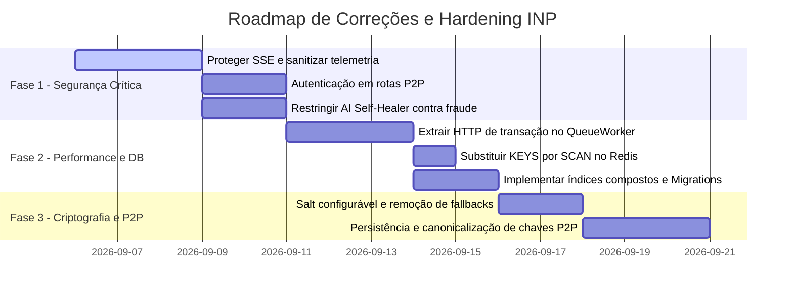

# Relatório Completo de Auditoria Técnica e Arquitetural - INP Protocol

**Projeto**: Intent Network Protocol (INP)  
**Versão Analisada**: 2.0.0  
**Data da Auditoria**: Setembro de 2026  
**Escopo**: Código-fonte TypeScript (`src/`), Camada de Persistência, Segurança, Concorrência, Resiliência Distribuída, Scripts de Teste e Infraestrutura Docker.

---

## 1. Sumário Executivo

O **Intent Network Protocol (INP)** demonstra uma maturidade arquitetural e conceitual notável. O projeto se destaca por implementar padrões distribuídos avançados de missão crítica raramente encontrados em codebases em estágio inicial, incluindo o **Padrão Saga com orquestração LIFO**, **Transactional Outbox com PostgreSQL SKIP LOCKED**, **Avaliador Lógico por AST livre de `eval`**, **Idempotência Determinística baseada em SHA-256**, **Circuit Breakers com Retry Exponencial**, e **Autocura via LLM**.

Entretanto, para atingir o nível corporativo estrito (enterprise grade), foram identificadas vulnerabilidades de segurança de alto impacto (exposição de telemetria sem autenticação, ausência de validação em endpoints federados P2P), gargalos de concorrência com conexões de banco de dados e divergências conceituais (como o uso da nomenclatura Zero-Knowledge para um esquema de hash commitment).

Abaixo é apresentado o diagnóstico minucioso dos **Pontos Fortes**, **Pontos Fracos**, **Matriz de Riscos** e o **Plano de Ação de Melhorias**.

---

## 2. Pontos Fortes (Strengths)

### A. Arquitetura e Engenharia de Software
1. **Desacoplamento Limpo em Pipeline**: A divisão clara de responsabilidades entre `IntentParser` (sintaxe), `MatchingEngine` (resolução topológica), `ExecutionEngine` (runtime de passos) e `ResponseComposer` (serialização) segue rigorosamente os princípios de Clean Architecture e SOLID.
2. **Gramática e Recursividade do Motor de Execução**: Suporte completo a grafos de execução com operadores complexos (`SEQUENCE`, `PARALLEL`, `CONDITION`, `RETRY`, `FALLBACK`, `TIMEOUT`, `DEPENDENCY`, `PIPELINE`, `SCOPE`, `CONFIDENTIAL_SCOPE`).
3. **Detecção de Dependências Circulares**: Implementação de algoritmo em grafo direcionado com busca em profundidade (DFS) que detecta ciclos de dependência (`Circular Dependency Detected`) antes do início da execução, prevenindo deadlocks lógicos.
4. **Idempotência Determinística**: Em vez de gerar UUIDs aleatórios para cada tentativa HTTP, o motor gera um hash determinístico derivado de `sha256(executionId + "-" + stepIndex)`. Isso assegura que retentativas de um passo retransmitem a mesma chave `X-Idempotency-Key`, permitindo que microsserviços detectem e neutralizem operações duplicadas.

### B. Resiliência e Transações Distribuídas
1. **Orquestração Saga com Rollback LIFO e Persistência**: Cada passo que declara uma `compensateCapability` é empilhado no banco de dados (`saga_states`). Em falha irrecuperável, a execução do rollback é feita de trás para frente, garantindo a consistência eventual do estado dos microsserviços.
2. **Forward Recovery Progressivo**: Permite que intenções com política `FORWARD_RETRY` retomem o processamento a partir do passo exato que falhou, reutilizando os resultados das etapas concluídas (`resumeFromStepIndex`), economizando recursos e evitando reprocessamento de operações dispendiosas.
3. **Padrão Transactional Outbox com Concorrência SKIP LOCKED**: Permite que múltiplos workers consumam jobs assíncronos de forma paralela através do PostgreSQL `FOR UPDATE SKIP LOCKED`, sem locks de tabela e com auto-reparação de jobs travados (`Lock Reaper`).
4. **Isolamento de Falhas com Circuit Breaker**: Integração de `circuit-breaker-js` e retentativas com backoff exponencial via `axios-retry`, blindando o ecossistema contra tempestades de falhas em cascata.
5. **Dead Letter Queue (DLQ) & Webhooks de Alerta**: Transações que esgotam retentativas são arquivadas para auditoria manual e notificam equipes de SRE através de chamadas HTTP Webhook isoladas de transações abortadas.

### C. Segurança e Blindagem Criptográfica
1. **Avaliador de Condições Seguro (`SafeEvaluator`)**: Implementação de um Parser de Descida Recursiva baseado em tokens e árvore sintática abstrata (AST). Elimina totalmente o uso de `eval()` e `new Function()`, incluindo bloqueio explícito contra ataques de poluição de protótipo (`__proto__`, `constructor`, `prototype`).
2. **Criptografia Simétrica AES-256-GCM com Rotação de Chaves**: Cifragem autenticada com AuthTag e IVs aleatórios de 12 bytes gerados por operação, com controle de versão prefixado (`v1:`, `v2:`).
3. **AI Shield Anti-Prompt Injection**: Detecção de injeções de prompt comuns, suportando detecção de ataques ofuscados em Base64 e Hexadecimal antes de enviar textos a modelos de linguagem.
4. **Contratos Estritos com JSON Schema (AJV)**: Validação antecipada dos payloads antes que qualquer requisição HTTP saia do orquestrador.

---

## 3. Pontos Fracos e Riscos (Weaknesses & Risks)

### A. Segurança e Privacidade
1. **[CRÍTICO] Endpoint SSE `/api/telemetry` Aberto com Vazamento de PII/Segredos**:
   - **Diagnóstico**: O endpoint não possui autenticação e envia o contexto completo em eventos `EXECUTION_STARTED` e `STEP_STARTED`.
   - **Impacto**: Qualquer cliente anônimo na rede pode interceptar dados confidenciais (tokens de cartão, CPFs, segredos em trânsito).
2. **[ALTO] Ausência de Autenticação na Federação P2P (`/api/peers/register`)**:
   - **Diagnóstico**: Qualquer requisitante pode registrar um nó falso com pontuação de confiança máxima, capturando fluxos e executando sub-intenções arbitrárias.
3. **[ALTO] Risco Ético/Financeiro no AI Self-Healing**:
   - **Diagnóstico**: A diretiva do `AISelfHealer` autoriza a IA a modificar valores de limites (ex: alterar `amount` de 0.5 para 1.0 para passar no schema).
   - **Impacto**: Em produção, IAs alterando montantes financeiros configuram risco de fraude e quebra de compliance.
4. **[MÉDIO-ALTO] Salt Hardcoded no Derivador de Chaves Scrypt**:
   - **Diagnóstico**: `crypto.scryptSync(keyRaw, 'salt', 32)` utiliza a string fixa `'salt'`.
   - **Impacto**: Vulnerável a ataques pré-computados com tabelas rainbow caso as chaves mestras possuam baixa entropia.
5. **[MÉDIO] Nomenclatura Indevida de "Zero-Knowledge"**:
   - **Diagnóstico**: O `ZKVerifier` exige o envio de `proof.value` em texto aberto, funcionando como um hash commitment simples e não uma prova de conhecimento zero real.

### B. Escalabilidade, Performance e Infraestrutura
1. **[ALTO] Transação Longa de Banco de Dados durante Chamadas HTTP no `QueueWorker`**:
   - **Diagnóstico**: Em `queue-worker.ts:58-163`, a chamada de execução HTTP `await execEngine.execute(...)` ocorre *dentro* da transação do PostgreSQL `AppDataSource.transaction`.
   - **Impacto**: Manter a conexão do banco de dados travada durante requisições HTTP externas que levam segundos causa esgotamento do pool de conexões (`connection pool starvation`) e derruba o gateway sob carga.
2. **[ALTO] Comando Bloqueante `KEYS inp:*` no Redis**:
   - **Diagnóstico**: Em `registry-cache.ts:160`, a invalidação de cache executa `client.keys('inp:*')`.
   - **Impacto**: Em instâncias Redis de produção com milhares de chaves, `KEYS` trava a thread principal do Redis, degradando toda a aplicação. Deve ser substituído por `SCAN`.
3. **[MÉDIO] Polling de Banco de Dados Fixo a cada 500ms**:
   - **Diagnóstico**: O `QueueWorker` consulta o banco continuamente com `setTimeout(..., 500)`.
   - **Impacto**: I/O desnecessário quando a fila está ociosa. Recomenda-se backoff progressivo ou `LISTEN/NOTIFY` nativo do PostgreSQL.
4. **[MÉDIO] Métricas de Saúde Puramente Locais em Memória**:
   - **Diagnóstico**: O `ServiceMetricsCollector` armazena métricas em um `Map` local. Em um cluster com vários gateways, os nós não compartilham a percepção de saúde dos serviços.
5. **[MÉDIO] Ausência de TypeORM Migrations e Índices Compostos**:
   - **Diagnóstico**: Em produção, `synchronize` é desativado, mas não existem scripts nem arquivos de migração. Faltam índices compostos nas tabelas `queue_jobs` (`status, scheduled_at, created_at`) e `executions` (`started_at`).

---

## 4. Matriz de Avaliação de Riscos

| Item de Risco | Categoria | Probabilidade | Impacto | Severidade Global |
| :--- | :--- | :--- | :--- | :--- |
| Exposição de PII via SSE `/api/telemetry` | Segurança | Alta | Crítico | **CRÍTICA** |
| Registro malicioso de peers P2P sem auth | Segurança | Média | Alto | **ALTA** |
| Esgotamento de pool DB por HTTP em transação | Concorrência | Alta | Alto | **ALTA** |
| AI Self-Healer alterando valores financeiros | Conformidade | Média | Crítico | **ALTA** |
| `KEYS *` no Redis bloqueando event loop | Performance | Média | Alto | **ALTA** |
| Salt estático hardcoded no Scrypt | Criptografia | Baixa | Médio | **MÉDIA** |
| Ausência de Migrations em Produção | DevOps | Alta | Médio | **MÉDIA** |
| Falta de persistência de chaves P2P | Arquitetura | Alta | Médio | **MÉDIA** |

---

## 5. Plano de Ação Recomendado (Roadmap de Evolução)

### Detalhamento das Ações Imediatas:

1. **Desacoplar Transação DB no QueueWorker**:
   - *Solução*: Dentro da transação, apenas travar o job com `SKIP LOCKED`, atualizar o status para `PROCESSING` e commitar imediatamente. Em seguida, executar `execEngine.execute` fora de qualquer transação de banco. Ao finalizar, abrir uma nova transação rápida para atualizar o job para `COMPLETED` ou `FAILED`.
2. **Sanitização de Telemetria**:
   - *Solução*: Criar função utilitária `maskSensitiveFields(payload)` que substitui campos sensíveis (`card_token`, `password`, `user_id`, etc.) por `***MASKED***` antes de emitir broadcasts via SSE.
3. **Autenticação no Stream SSE**:
   - *Solução*: Exigir token de autenticação via query param ou header em `/api/telemetry?token=...`.
4. **Substituição de `KEYS` por `SCAN` no `RegistryCache`**:
   - *Solução*: Utilizar `client.scanIterator({ MATCH: 'inp:*' })` para deletar chaves em blocos sem paralisar o Redis.
5. **Persistência de Chaves P2P e Canonicalização JSON**:
   - *Solução*: Carregar as chaves de variáveis de ambiente e utilizar `fast-json-stable-stringify` para garantir ordenação determinística das propriedades antes de gerar assinaturas ECDSA.
