# LIVRO COMPLETO DO INP PROTOCOL v2.7
## *A Bíblia Definitiva da Engenharia de Intenções: Da Teoria Quântica à Sala de Aula*

---

### **Autor:** Bernardo Fernandes & Equipe de Arquitetura do INP Protocol
### **Edição:** v2.7.6 (Enterprise Resilient, Forensics & Pedagogical Edition)
### **Data de Publicação:** Setembro de 2026
### **Público-Alvo:** Desenvolvedores, Arquitetos de Software, Engenheiros de Segurança Forense, Líderes de Negócio, Empreendedores, Entusiastas de IA e Qualquer Pessoa que Deseje Aprender Tecnologia do Absoluto Zero.

---

## SUMÁRIO GERAL

1. [PARTE 1: O Chamado da Revolução — Manifesto de Marketing, Negócios e Encorajamento](#parte-1-o-chamado-da-revolução--manifesto-de-marketing-negócios-e-encorajamento)
   - 1.1 O Fim da Era do Código Frágil: Por Que o Mundo Precisa do INP
   - 1.2 O Impacto Econômico: ROI Brutal e Economia de 80% em Infraestrutura
   - 1.3 Uma Mensagem ao Inovador: O Seu Passaporte para a Próxima Década
2. [PARTE 2: Mapeamento de Beneficiários — Quem Ganha e Onde o Motor Transforma Realidades](#parte-2-mapeamento-de-beneficiários--quem-ganha-e-onde-o-motor-transforma-realidades)
   - 2.1 Para Fundadores de Startups e Criadores de Negócios
   - 2.2 Para Fintechs, Bancos e Instituições Financeiras de Missão Crítica
   - 2.3 Para E-commerces, Marketplaces e Logística de Alta Demanda
   - 2.4 Para Engenheiros de Software e Arquitetos de Soluções
   - 2.5 Para Engenheiros e Cientistas de Inteligência Artificial
   - 2.6 Para Pessoas Não-Técnicas, Gestores e Líderes de Produto
3. [PARTE 3: O Grande Dicionário de Siglas e Conceitos (De A a Z para Leigos e Especialistas)](#parte-3-o-grande-dicionário-de-siglas-e-conceitos-de-a-a-z-para-leigos-e-especialistas)
   - 3.1 Glossário Completo: O Que Significa, O Que Faz, Analogia Real e Papel no Motor
4. [PARTE 4: A Arquitetura do Motor em Duas Camadas (Técnica Avançada + Tradução para Leigos)](#parte-4-a-arquitetura-do-motor-em-duas-camadas-técnica-avançada--tradução-para-leigos)
   - 4.1 Diagrama Global e Ilustração 3D da Arquitetura do Motor
   - 4.2 O Gateway de Entrada e a Detecção de Idempotência (<1ms)
   - 4.3 O Compilador AST e o Cache Ultrarrápido SHA-256
   - 4.4 O Guardião de Sobrevivência: Circuit Breaker Registry Singleton
   - 4.5 Tubulações Permanentes: Sockets HTTP Keep-Alive e Pool PostgreSQL
   - 4.6 Concorrência Cooperativa e o AbortController Unificado
   - 4.7 A Máquina do Tempo: O Padrão Saga e a Compensação Reversa LIFO
   - 4.8 O Canal de Alta Velocidade: Server-Sent Events (SSE) e Telemetria
   - 4.9 Como os Verbos Funcionam Dentro do Motor: A Mecânica Interna da Ação Semântica (Da Declaração à Execução e Compensação)
5. [PARTE 5: A Enciclopédia Definitiva dos 136 Verbos Operacionais do Motor (9 Famílias)](#parte-5-a-enciclopédia-definitiva-dos-136-verbos-operacionais-do-motor-9-famílias)
   - 5.1 Os 32 Verbos Canónicos Operacionais (Fundamentos de Negócio e Estado)
   - 5.2 Os 24 Verbos Estratégicos Anti-Estresse e Alta Resiliência (A Armadura de Sobrevivência)
   - 5.3 As 6 Killer Features Revolucionárias (Streaming, Prova Forense, IA Agêntica, HITL & Consenso)
   - 5.4 Os 9 Verbos Criptográficos, Mensageria e Concorrência Distribuída (Barramento e Travas)
   - 5.5 Os 18 Verbos Funcionais, Eventos e Governança de Dados (Pipelines e Filtragens)
   - 5.6 Os 16 Verbos de Alta Produtividade e Solução de Dores Críticas (Anti-Headache & DevOps Resiliente)
   - 5.7 Os 15 Verbos de Interconexão entre Sistemas e Desmembramento Descomplicado (Bridge, Webhooks, Ergonomia & Controle Leve)
   - 5.8 Os 8 Verbos de Viagem no Tempo, Diagnóstico Forense e Telemetria em Tempo Real (A Máquina do Tempo do Motor)
   - 5.9 A 9ª Família Estratégica: IA Vetorial Offline, Finanças de Alta Precisão & Engenharia do Caos (Os 8 Novos Verbos Operacionais: 129 ao 136)
6. [PARTE 6: O Dicionário Completo de Palavras-Chave, Cláusulas, Operadores e Diretivas do Motor](#parte-6-o-dicionário-completo-de-palavras-chave-cláusulas-operadores-e-diretivas-do-motor)
   - 6.1 Palavras Estruturais Fundamentais (INTENT, TARGET, TIMEOUT, IDEMPOTENCY, SCHEMA, STEP, PARAMETERS, CONTEXT, REQUIRE, OUTPUT)
   - 6.2 Palavras de Fluxo, Decisão e Concorrência (SEQUENCE, PARALLEL, CONDITION, IF, THEN, ELSE, LOOP, BRANCH, PIPELINE, SCOPE, DEPENDENCY / DEPENDS_ON, PRIMARY, FALLBACK)
   - 6.3 Cláusulas de Resiliência, Saga e Contratos (COMPENSATE, RETRY, OUTPUT_SCHEMA, SECURE, TRUST, PERMISSION, POLICY)
   - 6.4 Palavras Reservadas da Sandbox DBA e Sanitização SQL (SELECT, EXPLAIN, SET_CONFIG, PG_READ_FILE, PG_WRITE_FILE, PG_TERMINATE_BACKEND, etc.)
   - 6.5 Operadores Lógicos, Relacionais e de Padrão (===, !==, ==, !=, >, <, >=, <=, &&, ||, !, CONTAINS, MATCHES)
   - 6.6 Literais e Substituição Dinâmica de Variáveis (${...}, true, false, null, números, strings)
7. [PARTE 7: O Esqueleto Universal da Intenção & Mini-Quadro de Símbolos](#parte-7-o-esqueleto-universal-da-intenção--mini-quadro-de-símbolos)
   - 7.1 A Filosofia & A Lógica Por Trás do Conceito de INTENT: O Modelo Mental do Motor
   - 7.2 O Blueprint Anatômico das 4 Zonas de uma Intenção
   - 7.3 Mini-Quadro Resumo de Símbolos e Pontuações (:, "", ${}, {}, [], ,, //, /* */, ., ())
   - 7.4 O Que Usar Onde: Matriz de Verbos e Cláusulas por Bloco
   - 7.5 Taxonomia Normativa Universal: O Que é OBRIGATÓRIO vs O Que é DE PREFERÊNCIA
8. [PARTE 8: O Ciclo de Vida da Intenção e o Código de Boa Conduta do Motor](#parte-8-o-ciclo-de-vida-da-intenção-e-o-código-de-boa-conduta-do-motor)
   - 8.1 Infográfico Oficial dos 10 Estágios do Ciclo de Vida
   - 8.2 Os 10 Estágios Obrigatórios Explicados Passo a Passo
   - 8.3 Fluxograma de Produção Ponta a Ponta
   - 8.4 O Decálogo das Regras de Ouro: O Que Fazer (Boas Condutas Mandatórias)
   - 8.5 O Muro das Proibições: O Que NÃO Fazer (10 Anti-Padrões Fatais e Penas do Motor)
   - 8.6 Guia Temporal Causal: QUANDO Fazer (Gatilhos e Estágios Adequados)
   - 8.7 Guia de Vetos Críticos: QUANDO NÃO Fazer (Cenários de Risco e Incompatibilidades)
   - 8.8 Matriz Operacional Cruzada de Conduta (O Que Fazer, O Que Não Fazer, Quando Fazer e Quando Não Fazer)
9. [PARTE 9: A Grande Aula de Sala de Aula — A Intenção Mestra com Desmembramento Microscópico](#parte-9-a-grande-aula-de-sala-de-aula--a-intenção-mestra-com-desmembramento-microscópico)
   - 9.1 Boas-Vindas à Sala de Aula: O Cenário do Mundo Real
   - 9.2 O Bloco Completo da Intenção Mestra
   - 9.3 O Desmembramento Microscópico Linha por Linha
   - 9.4 Perguntas e Respostas Frequentes do Aluno Iniciante
10. [PARTE 10: Cinco Exemplos Práticos Progressivos Completos (Do Simples ao Master Anti-Headache & Interoperabilidade)](#parte-10-cinco-exemplos-práticos-progressivos-completos-do-simples-ao-master-anti-headache--interoperabilidade)
    - 10.1 Exemplo 1 (Simples): Consulta de Usuário com Validação e Cache
    - 10.2 Exemplo 2 (Intermediário): Transferência Bancária com Bifurcação e Saga
    - 10.3 Exemplo 3 (Avançado/Enterprise): Processamento de Pedido com IA, Streaming e HITL
    - 10.4 Exemplo 4 (Master Enterprise Anti-Headache): Pipeline Financeiro Indestrutível com Deduplicação, Canary, Quarentena e Reconciliação
    - 10.5 Exemplo 5 (Master Interoperabilidade & Conectores entre Sistemas): Ingestão de Webhooks, Adaptação SOAP/REST, Fan-in e Emissão Leve
11. [PARTE 11: Governança, Políticas e Blindagem Cibernética Forense Anti-Hacker](#parte-11-governança-políticas-e-blindagem-cibernética-forense-anti-hacker)
    - 11.1 O Escudo de Blindagem Cibernética do Motor
    - 11.2 Sandbox DBA: Bloqueio Estrito de Funções do SO, File Access e Terminação de Backend
    - 11.3 Mitigação de Ataques de Temporização (Timing Attacks) via crypto.timingSafeEqual
    - 11.4 Rate Limiting Especializado e Barreira Anti-Brute-Force
    - 11.5 Defesa Contra Esgotamento de Recursos (Scrypt CPU DoS, Regex ReDoS & Limites de Payload)
    - 11.6 Isolamento de Rede, Mitigação Anti-SSRF e CORS com Lista Branca Estrita
    - 11.7 Mascaramento Automático e Trilha Forense Imutável (LGPD/GDPR/PCI & Hash Chain)
12. [PARTE 12: Como Estender o Protocolo e Criar Novos Verbos](#parte-12-como-estender-o-protocolo-e-criar-novos-verbos)
13. [PARTE 13: Referência de APIs, Portal Interativo e SDKs](#parte-13-referência-de-apis-portal-interativo-e-sdks)
    - 13.1 Endpoints REST e Canais SSE
    - 13.2 Exemplos de Integração em Python e cURL
14. [APÊNDICE A: Catálogo Resumido e Padronizado dos 136 Verbos Operacionais](#apêndice-a-catálogo-resumido-e-padronizado-dos-136-verbos-operacionais)
15. [APÊNDICE B: Tabela Padronizada de Códigos de Erro](#apêndice-b-tabela-padronizada-de-códigos-de-erro)
16. [Mensagem Final: O Convite à Criação](#mensagem-final-o-convite-à-criação)

# PARTE 1: O Chamado da Revolução — Manifesto de Marketing, Negócios e Encorajamento

## 1.1 O Fim da Era do Código Frágil: Por Que o Mundo Precisa do INP
Nas últimas quatro décadas, a indústria de software construiu um império sobre alicerces de areia. Sistemas modernos tornaram-se castelos de cartas: microsserviços espalhados aos milhares, dependências opacas, dezenas de bibliotecas de terceiros para fazer uma simples chamada de rede e centenas de horas gastas depurando falhas intermitentes.

Quando uma requisição falha no meio do caminho, o que acontece? 
Na maioria das empresas, o banco de dados fica inconsistente, o cliente é cobrado sem receber o produto, um operador precisa rodar scripts manuais de madrugada e a reputação da companhia é arranhada. 

O **INP Protocol (Intent Network Protocol)** nasce para decretar o fim dessa fragilidade. 
Em vez de programar *como* o computador deve se virar nos labirintos da infraestrutura, nós declaramos a **Intenção de Negócio**. O motor assume o trabalho pesado: resolve nomes, valida contratos, abre disjuntores, colapsa requisições repetidas, orquestra microsserviços em paralelo, reverte transações com compensação reversa automática e carimba cada passo com prova criptográfica inviolável.

---

## 1.2 O Impacto Econômico: ROI Brutal e Economia de 80% em Infraestrutura
Adotar o INP Protocol não é apenas uma decisão de arquitetura técnica: é uma decisão de sobrevivência financeira e alavancagem de mercado.

1. **Redução de até 80% nos Custos de Nuvem:** O motor do INP possui mecanismos nativos de resiliência ativa (como `COALESCE`, `MEMOIZE`, `BATCH` e reaproveitamento de sockets TCP Keep-Alive) que eliminam o tráfego fantasma. Uma infraestrutura que antes precisava de 50 servidores passa a rodar com folga em apenas 10.
2. **Tempo de Desenvolvimento Reduzido em 5x (Time-to-Market Imediato):** Tarefas complexas que levavam semanas para serem implementadas (como orquestração de microsserviços, controle de retry exponencial, reversão do padrão Saga e filas de mensageria) são resolvidas em **poucas linhas declarativas de intenção**.
3. **Zero Chamados de Inconsistência Financeira:** O padrão Saga nativo com a cláusula `COMPENSATE` garante que se um passo falhar, todas as etapas anteriores são desfeitas em ordem reversa (LIFO) de maneira determinística, protegendo o livro-razão da sua empresa contra perdas patrimoniais.
4. **Governança e Blindagem Cibernética Nativa:** Proteção de ponta contra injeções SQL, explorações de sistema de ficheiros, ataques de temporização (*timing attacks*), esgotamento de CPU (*scrypt DoS*), SSRF e poluição de protótipo sem exigir appliances adicionais de milhões de dólares.

---

## 1.3 Uma Mensagem ao Inovador: O Seu Passaporte para a Próxima Década
Seja você um estudante começando hoje a sua jornada ou um Chief Technology Officer (CTO) gerenciando infraestruturas continentais, este livro é o seu mapa do tesouro. 

Você não precisa de pós-graduação em física quântica nem de 20 anos de programação em linguagem C para dominar o INP. O protocolo foi desenhado para ser tão compreensível quanto uma receita de culinária e tão poderoso quanto o sistema de controle de uma usina nuclear. 

Ao terminar este livro, você não apenas entenderá o motor: **você será capaz de construir ecossistemas de software indestrutíveis.**

---

# PARTE 2: Mapeamento de Beneficiários — Quem Ganha e Onde o Motor Transforma Realidades

O INP Protocol não foi desenhado para uma casta isolada de programadores de laboratório. Ele foi forjado para beneficiar toda a cadeia de valor da sociedade digital.

---

## 2.1 Para Fundadores de Startups e Criadores de Negócios
- **A Dor Atual:** Startups morrem por falta de dinheiro (burn rate acelerado) enquanto pagam faturas astronômicas de servidores em nuvem e perdem meses reescrevendo código que quebra ao primeiro sinal de sucesso e tráfego massivo.
- **A Solução com o INP:** Você lança o seu produto com o poder computacional de uma Big Tech desde o primeiro dia. Com o disjuntor (`CIRCUIT_BREAKER`), cache atômico (`MEMOIZE`) e single-flight (`COALESCE`), o seu sistema suporta a aparição em horário nobre na TV ou viralizações nas redes sociais sem cair e sem estourar o orçamento da startup.

---

## 2.2 Para Fintechs, Bancos e Instituições Financeiras de Missão Crítica
- **A Dor Atual:** Uma falha de concorrência ou um timeout no meio de uma transação PIX/SWIFT pode gerar prejuízos milionários e pesadas multas de órgãos reguladores (BACEN, SEC, Fed).
- **A Solução com o INP:** O motor oferece atomicidade distribuída com compensação Saga em ordem reversa LIFO (`MUTATE` + `COMPENSATE`), trilha de auditoria criptográfica imutável encadeada via SHA-256 (`AUDIT`) e atestação com valor jurídico de fé pública (`ATTEST`). A integridade financeira é blindada matematicamente.

---

## 2.3 Para E-commerces, Marketplaces e Logística de Alta Demanda
- **A Dor Atual:** Em dias de Black Friday ou grandes promoções de vendas relâmpago, milhares de usuários disputam os mesmos itens em estoque, gerando pedidos duplicados (*overselling*) e quedas catastróficas dos bancos de dados.
- **A Solução com o INP:** Detecção instantânea de requisições idênticas via cabeçalho `X-Idempotency-Key` (<1ms), unificação de consultas em massa (`COALESCE`), controle de vazão Token Bucket (`RATE_LIMIT`) e loteamento automático de transações (`BATCH`).

---

## 2.4 Para Engenheiros de Software e Arquitetos de Soluções
- **A Dor Atual:** Sobrecarga mental contínua, chamadas no meio da madrugada para apagar incêndios e semanas gastas configurando bibliotecas complexas e frágeis de mensageria, balanceamento e retentativas.
- **A Solução com o INP:** Código limpo, declarativo e elegante. O motor orquestra concorrência cooperativa via `AbortController`, faz cancelamento em cascata se um passo obrigatório falhar, preserva pools permanentes de sockets HTTP Keep-Alive e isola erros em frações de milissegundo.

---

## 2.5 Para Engenheiros e Cientistas de Inteligência Artificial
- **A Dor Atual:** Conectar Modelos de Linguagem de Grande Porte (LLMs) a bancos de dados tradicionais é arriscado: a IA alucina, formata saídas de forma imprevisível e pode gerar ações perigosas no banco de dados.
- **A Solução com o INP:** O motor introduz o verbo `REASON` (raciocínio cognitivo auditável Chain-of-Thought estruturado por schema rígido), o verbo `STREAM` (entrega contínua em tempo real via Server-Sent Events) e o verbo `ESCALATE` (governança Human-in-the-Loop com aprovação humana obrigatória em casos críticos).

---

## 2.6 Para Pessoas Não-Técnicas, Gestores e Líderes de Produto
- **A Dor Atual:** Dependência cega de explicações técnicas indecifráveis; impossibilidade de auditar o que o software realmente faz por trás dos panos.
- **A Solução com o INP:** A DSL (Domain-Specific Language) do INP lê-se praticamente como o idioma humano. Um gerente comercial ou advogado de compliance consegue olhar para o arquivo de intenção e entender exatamente as regras de negócio aplicadas, as validações e as contingências estabelecidas.

---

# PARTE 3: O Grande Dicionário de Siglas e Conceitos (De A a Z para Leigos e Especialistas)

Para garantir que ninguém fique para trás, apresentamos o dicionário universal das siglas fundamentais que compõem o universo do INP Protocol. Cada termo é explicado em sua definição rigorosa, tradução popular e sua função precisa dentro do motor.

---

### 1. API (Application Programming Interface)
- **Significado:** Interface de Programação de Aplicações.
- **O que faz:** É a ponte de comunicação que permite que dois programas conversem entre si de forma padronizada.
- **Analogia do Dia a Dia:** É o garçom do restaurante: você (cliente) faz o pedido ao garçom, ele leva o pedido à cozinha (servidor) e traz a comida pronta de volta à sua mesa.
- **Papel no Motor:** O motor expõe rotas HTTP REST e Server-Sent Events (SSE) em `src/api/server.ts` para receber intenções e emitir telemetria em tempo real.

### 2. AST (Abstract Syntax Tree)
- **Significado:** Árvore Sintática Abstrata.
- **O que faz:** É a representação em formato de árvore hierárquica que o compilador cria na memória após ler o texto da intenção.
- **Analogia do Dia a Dia:** É a análise sintática de uma frase na escola: o computador separa sujeito, verbo e predicado para entender o significado sem se confundir com espaços e pontuações.
- **Papel no Motor:** O módulo `intent-parser.ts` converte o texto da intenção em nós de AST e guarda no cache LRU acelerado por hash SHA-256 (`AST Plan Cache`), permitindo reexecuções em apenas 0.002ms.

### 3. Circuit Breaker (Disjuntor de Circuito)
- **Significado:** Padrão Arquitetural de Disjuntor Elétrico.
- **O que faz:** Monitora a saúde de um serviço parceiro; se esse parceiro começar a falhar repetidamente, o disjuntor "desarma" e para de mandar requisições imediatamente.
- **Analogia do Dia a Dia:** É exatamente igual ao disjuntor do quadro de força da sua casa: se o chuveiro entrar em curto, o disjuntor desarma para não queimar a fiação da casa inteira.
- **Papel no Motor:** O `CircuitBreakerRegistry` impede que a queda de uma API de parceiro retenha conexões abertas e derrube o motor INP em efeito dominó.

### 4. Coalescing / Single-Flight (Colapso de Leituras)
- **Significado:** Agrupamento de requisições de leitura idênticas simultâneas em um único disparo.
- **O que faz:** Se 1.000 clientes pedirem o mesmo dado no mesmo milissegundo, o motor faz apenas 1 consulta física e entrega a resposta simultaneamente a todos.
- **Analogia do Dia a Dia:** Em uma van de turismo, se 10 passageiros perguntarem ao mesmo tempo *"Que horas começa o passeio?"*, o guia responde uma vez em voz alta para todos ouvirem, em vez de responder individualmente no ouvido de cada um.
- **Papel no Motor:** Implementado no verbo `COALESCE`, protege os bancos de dados contra o temido efeito manada (*Thundering Herd*).

### 5. CPU Scrypt DoS (Negação de Serviço por Algoritmo de Hashing)
- **Significado:** Ataque que visa esgotar a CPU de um servidor enviando senhas gigantescas para forçar cálculos matemáticos pesados em funções de derivação como `scrypt`.
- **O que faz:** Se não houver limite de tamanho na senha de entrada, um invasor pode mandar senhas de 10 megabytes, travando a CPU do servidor em 100%.
- **Analogia do Dia a Dia:** É um caminhão tentar passar numa catraca feita para pessoas: se não houver uma barra de altura máxima, o caminhão entala e bloqueia a passagem de todo mundo.
- **Papel no Motor:** O INP blinda a rota `/api/auth/login` e `/api/auth/register` com um limite estrito de **128 caracteres**, rejeitando tentativas maliciosas em microssegundos.

### 6. CRUD (Create, Read, Update, Delete)
- **Significado:** As quatro operações básicas de persistência de dados: Criar, Ler, Atualizar e Excluir.
- **O que faz:** Modela as operações elementares de tabelas de bancos de dados e registros.
- **Papel no Motor:** Mapeado nos verbos canônicos `CREATE`, `READ` (ou `FETCH`), `UPDATE` (ou `PATCH`) e `DELETE`.

### 7. DBA (Database Administrator)
- **Significado:** Administrador de Banco de Dados.
- **O que faz:** Responsável pela segurança, integridade, desempenho e disponibilidade dos bancos de dados.
- **Papel no Motor:** O `DBAService` atua como um administrador virtual e sandbox forense estrita, permitindo apenas operações seguras de leitura (`SELECT`, `EXPLAIN`) e bloqueando 13 funções perigosas do PostgreSQL.

### 8. DSL (Domain-Specific Language)
- **Significado:** Linguagem Específica de Domínio.
- **O que faz:** Uma linguagem de computador simplificada, criada especificamente para resolver os problemas de um determinado negócio.
- **Analogia do Dia a Dia:** É a receita médica: o médico não escreve uma tese de biologia, ele escreve uma instrução direta e padronizada que qualquer farmacêutico lê e entende.
- **Papel no Motor:** É a sintaxe `INTENT Nome { STEP ... }` do INP Protocol.

### 9. HMAC (Hash-based Message Authentication Code)
- **Significado:** Código de Autenticação de Mensagem Baseado em Hash Criptográfico.
- **O que faz:** Garante que uma mensagem não foi alterada durante o transporte e comprova a identidade do emissor através de uma chave secreta.
- **Analogia do Dia a Dia:** É o lacre de chumbo numerado de uma mala diplomática: se o lacre estiver rompido ou o número não bater, a mala foi violada.
- **Papel no Motor:** Utilizado no verbo `ATTEST` para emitir certificados de auditoria invioláveis.

### 10. Idempotência
- **Significado:** Propriedade matemática e arquitetural que garante que executar a mesma operação 1 vez ou 100 vezes gera exatamente o mesmo resultado, sem duplicar efeitos colaterais.
- **Analogia do Dia a Dia:** O botão de ligar do controle da TV: se a TV já estiver ligada e você apertar o botão "Ligar", ela simplesmente continua ligada; ela não explode nem liga uma segunda tela.
- **Papel no Motor:** Garantida pelo cabeçalho `X-Idempotency-Key` e cláusula `IDEMPOTENCY`, respondendo em menos de 1ms para requisições já processadas.

### 11. JWT (JSON Web Token)
- **Significado:** Token Web em formato JSON Assinado Digitalmente.
- **O que faz:** Crachá digital compacto e seguro usado para transportar dados comprovados de identidade entre o cliente e o servidor.
- **Analogia do Dia a Dia:** A pulseira de acesso VIP de um festival de música: os seguranças olham a pulseira e liberam a sua entrada sem precisar consultar a lista de papel a cada porta.
- **Papel no Motor:** Validado nativamente no verbo `AUTHENTICATE`.

### 12. LRU (Least Recently Used)
- **Significado:** Política de Descarte dos Itens Menos Recentemente Utilizados.
- **O que faz:** Gerencia a memória de um cache: quando a memória fica cheia, joga fora os dados antigos que ninguém consulta há muito tempo para dar espaço aos novos.
- **Analogia do Dia a Dia:** É a sua mesa de trabalho: você deixa em cima dela os papéis que está usando hoje; os papéis que você não toca há três meses vão para o armário do fundo.
- **Papel no Motor:** Otimiza o `SchemaCache` e o `ASTCache` mantendo o consumo de memória sob controle estrito.

### 13. OPA / Rego (Open Policy Agent)
- **Significado:** Agente Aberto de Políticas / Linguagem Rego.
- **O que faz:** Motor declarativo que avalia se uma ação cumpre regras corporativas complexas (conformidade, compliance e governança).
- **Analogia do Dia a Dia:** O departamento de compliance ou o advogado de conformidade da empresa que revisa os contratos antes de serem assinados.
- **Papel no Motor:** Integrado ao verbo `CHECK_POLICY`.

### 14. Saga & LIFO (Last-In, First-Out)
- **Significado:** Padrão de Transações Distribuídas com Compensação Reversa / Último a Entrar, Primeiro a Sair.
- **O que faz:** Quando uma operação com vários passos falha no meio do caminho, o motor desfaz os passos executados anteriormente em ordem rigorosamente reversa.
- **Analogia do Dia a Dia:** É a função "Desfazer" (`Ctrl+Z`) do seu editor de texto: você desfaz exatamente na ordem inversa em que escreveu.
- **Papel no Motor:** O mecanismo transacional mais poderoso do INP (`COMPENSATE` em `MUTATE`).

### 15. SSRF (Server-Side Request Forgery)
- **Significado:** Falsificação de Requisições do Lado do Servidor.
- **O que faz:** Tipo de ataque hacker onde o invasor engana o servidor para que este faça conexões contra a sua própria rede interna privada (ex: IP 127.0.0.1 ou AWS Metadata 169.254.169.254).
- **Analogia do Dia a Dia:** É um golpista usar o carteiro dos correios para entrar dentro do cofre de um banco dizendo que tem uma entrega especial lá dentro.
- **Papel no Motor:** O INP valida rigorosamente domínios e IPs antes de despachar requisições externas, impedindo que o motor seja usado como pivô para atacar a rede privada.

### 16. Timing Attacks (Ataques de Temporização)
- **Significado:** Técnica de espionagem cibernética onde o invasor mede a fração de nanossegundos que o servidor demora para responder a uma senha para adivinhar letra por letra.
- **O que faz:** Se uma comparação de texto comum parar no primeiro caractere errado (`"a" != "b"`), ela responde mais rápido do que se parar no décimo caractere (`"abcdefghij" != "abcdefghik"`). Medindo esse tempo com relógios de alta precisão, hackers conseguem roubar senhas e chaves secretas.
- **Analogia do Dia a Dia:** Um arrombador de cofre ouvindo o estalo mecânico de cada pino da fechadura para saber qual número acertou.
- **Papel no Motor:** O INP utiliza `crypto.timingSafeEqual` com hashes SHA-256 de tamanho fixo em `requireRegistrationToken`, garantindo que toda checagem demore **exatamente o mesmo tempo matemático**, cegando completamente os ataques de temporização.

---

# PARTE 4: A Arquitetura do Motor em Duas Camadas (Técnica Avançada + Tradução para Leigos)

Abaixo apresentamos a anatomia completa do Motor INP v2.7. Cada componente é apresentado primeiro em sua **especificação técnica rigorosa** e, imediatamente a seguir, na **tradução didática para leigos**.

---

## 4.1 Diagrama Global e Ilustração 3D da Arquitetura do Motor

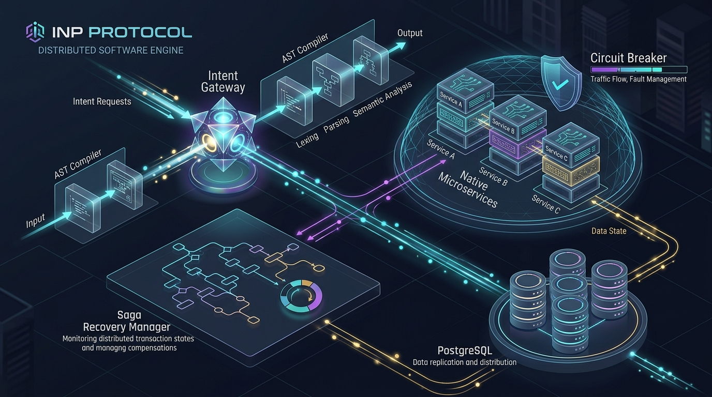

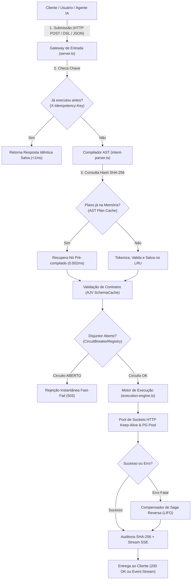

---

## 4.2 O Gateway de Entrada e a Detecção de Idempotência (<1ms)
- **Explicação Técnica:** O módulo `server.ts` expõe o endpoint `POST /api/intent`. Ao receber a requisição, inspeciona o cabeçalho HTTP `X-Idempotency-Key`. Uma busca atômica em índice de memória acelerado por chave primária verifica se o UUID já foi processado nas últimas 24 horas. Havendo correspondência, o payload de resposta original é devolvido em menos de 1ms, contornando toda a pipeline de execução e eliminando concorrência redundante.
- **Tradução para Leigos:** Pense na catraca do metrô. Quando você passa o seu bilhete, ela libera a passagem. Se você passar o bilhete duas vezes seguidas no mesmo segundo por engano, ela não desconta duas viagens da sua conta: ela reconhece que você acabou de passar e só diz *"Pode prosseguir"*. A chave de idempotência é o seu bilhete único que impede o sistema de cobrar duas vezes pelo mesmo pedido.

---

## 4.3 O Compilador AST e o Cache Ultrarrápido SHA-256
- **Explicação Técnica:** O analisador léxico (`intent-parser.ts`) gera uma assinatura criptográfica SHA-256 do texto bruto da intenção. Em seguida, consulta a tabela hash do `AST Plan Cache`. Se houver correspondência exata (*cache hit*), o plano de execução compilado é retornado em **0.002 milissegundos**, sem a necessidade de re-tokenização ou análise gramatical. Se for uma intenção inédita (*cache miss*), o analisador constrói a árvore sintática, valida os nós e persiste o plano no cache com política LRU de 5.000 entradas.
- **Tradução para Leigos:** Imagine um tradutor juramentado. Na primeira vez que você leva um contrato de 10 páginas em alemão, ele demora alguns minutos para ler, conferir o dicionário e traduzir para o português. Mas ele guarda uma cópia perfeita na gaveta. Se 5 minutos depois você voltar pedindo a mesma tradução, ele não traduz tudo de novo: ele abre a gaveta e entrega a folha pronta na mesma fração de segundo!

---

## 4.4 O Guardião de Sobrevivência: Circuit Breaker Registry Singleton
- **Explicação Técnica:** O motor implementa o padrão de disjuntor de circuito através do componente global `CircuitBreakerRegistry`. Cada microsserviço externo monitora uma janela deslizante de falhas. Atingido o limite de erros estipulado (por padrão, 5 falhas consecutivas ou timeout de 30 segundos), o circuito transita para o estado `OPEN`. Novas intenções direcionadas a esse nó são rejeitadas imediatamente (*fast-fail* com código HTTP 503) em menos de 0.1ms, sem abertura de sockets TCP ou retenção de recursos na pilha de eventos do Node.js.
- **Tradução para Leigos:** É o disjuntor do quadro de luz da sua sala. Se um aparelho elétrico começar a soltar faíscas e superaquecer, o disjuntor desarma na hora. Ele corta a energia daquela tomada para não queimar a fiação da casa toda nem colocar fogo no prédio. O motor desliga a torneira daquele serviço quebrado para não travar a sua empresa inteira.

---

## 4.5 Tubulações Permanentes: Sockets HTTP Keep-Alive e Pool PostgreSQL
- **Explicação Técnica:** O subsistema de I/O elimina o custo de negociação de aperto de mão (handshake TCP de 3 vias e negociação TLS de 4 vias). Um agente persistente (`http.Agent` / `https.Agent`) mantém pools de sockets abertos em segundo plano com `keepAlive: true`, `keepAliveMsecs: 30000` e `maxSockets: 256`. No banco de dados, o pool `pg.Pool` mantém conexões pré-aquecidas, reduzindo o tempo de estabelecimento de conexão de ~85ms para **menos de 0.8ms**.
- **Tradução para Leigos:** É a diferença entre ligar para o seu sócio discando o número, esperando chamar 10 vezes e negociando a linha a cada frase, versus manter uma linha telefônica direta e ininterrupta aberta 24 horas por dia: você só precisa falar e ele já está ouvindo do outro lado.

---

## 4.6 Concorrência Cooperativa e o AbortController Unificado
- **Explicação Técnica:** Execuções concorrentes orquestradas pelo bloco `PARALLEL` utilizam uma árvore unificada de sinais de aborto (`AbortSignal`). Se um dos passos obrigatórios falhar ou se o timeout global da intenção expirar, um sinal de cancelamento em cascata é propagado instantaneamente para todas as corrotinas filhas, encerrando sockets abertos e liberando memória imediatamente.
- **Tradução para Leigos:** É uma equipe de resgate nas montanhas que se comunica por rádio. Se o líder da equipe avistar uma tempestade perigosa, ele grita no rádio *"Missão cancelada, voltem todos para o abrigo agora!"*. Ninguém fica perdido na nevasca gastando energia à toa.

---

## 4.7 A Máquina do Tempo: O Padrão Saga e a Compensação Reversa LIFO
- **Explicação Técnica:** Durante a execução de passos que alteram estado (`MUTATE`, `CREATE`, `UPDATE`), o motor empilha as definições declaradas na cláusula `COMPENSATE` em uma pilha transacional estruturada. Ocorrendo qualquer erro irrecuperável em etapas posteriores, o motor interrompe o fluxo normal e descarrega a pilha em ordem estritamente reversa (*Last-In, First-Out*), executando as rotinas compensatórias com retentativa garantida até o estado do sistema retornar à consistência pura.
- **Tradução para Leigos:** É o `Ctrl+Z` inteligente do seu computador. Se você comprou a passagem de avião, reservou o hotel e comprou o ingresso do show, mas no último segundo o show foi cancelado, o motor não deixa você no prejuízo: ele cancela o ingresso, depois cancela o hotel e por fim estorna a passagem de avião, devolvendo cada centavo para o seu bolso.

---

## 4.8 O Canal de Alta Velocidade: Server-Sent Events (SSE) e Telemetria
- **Explicação Técnica:** A rota `GET /api/intent/events?intentId=<UUID>` utiliza o protocolo Server-Sent Events (SSE) sobre HTTP/1.1 persistente. Cada mudança de estado de um nó da intenção gera um evento estruturado transmitido em menos de 10ms para clientes conectados (dashboards, navegadores ou agentes autônomos de IA), contornando o overhead e a fragilidade de WebSockets tradicionais em ambientes com proxies corporativos.
- **Tradução para Leigos:** É o placar ao vivo do jogo de futebol no seu celular. Você não precisa ficar apertando o botão de atualizar a tela a cada segundo: assim que o gol acontece, o placar no seu celular apita e atualiza sozinho na mesma hora.

---

## 4.9 Como os Verbos Funcionam Dentro do Motor: A Mecânica Interna da Ação Semântica (Da Declaração à Execução e Compensação)

No ecossistema do **INP Protocol (Intent Network Protocol)**, o conceito de **Verbo** é o elemento atómico que revoluciona a computação distribuída. Ao contrário dos paradigmas legados (onde o código cliente é obrigado a conhecer o endereço IP, porta, protocolo de transporte e rota de cada servidor), no INP o cliente comunica exclusivamente através de **Capacidades Semânticas Desacopladas**.

A regra fundamental de ouro do protocolo expressa-se na fórmula canónica:
$$\text{Capacidade Semântica} = \mathbf{VERBO} + \mathbf{ALVO}$$

Por exemplo: `VALIDATE USER_TOKEN`, `BENCHMARK OPS`, `TRANSFORM CANONICAL_FORMAT`, `EXECUTE PAYMENT`, `DISPATCH WEBHOOK`, `CACHE SET`.

Nenhum desenvolvedor precisa de codificar *como* a rede se deve comportar. Ele apenas declara o que precisa que seja realizado. A responsabilidade de descobrir qual máquina na rede possui essa capacidade, validar se a chamada é segura, desviar de servidores caídos, contornar timeouts e registrar provas de auditoria é 100% assumida pelo **Motor INP**.

---

### 4.9.1 O Diagrama do Ciclo de Vida do Verbo no Motor

O fluxo abaixo ilustra a esteira completa percorrida por qualquer verbo desde a submissão até à consolidação do resultado:

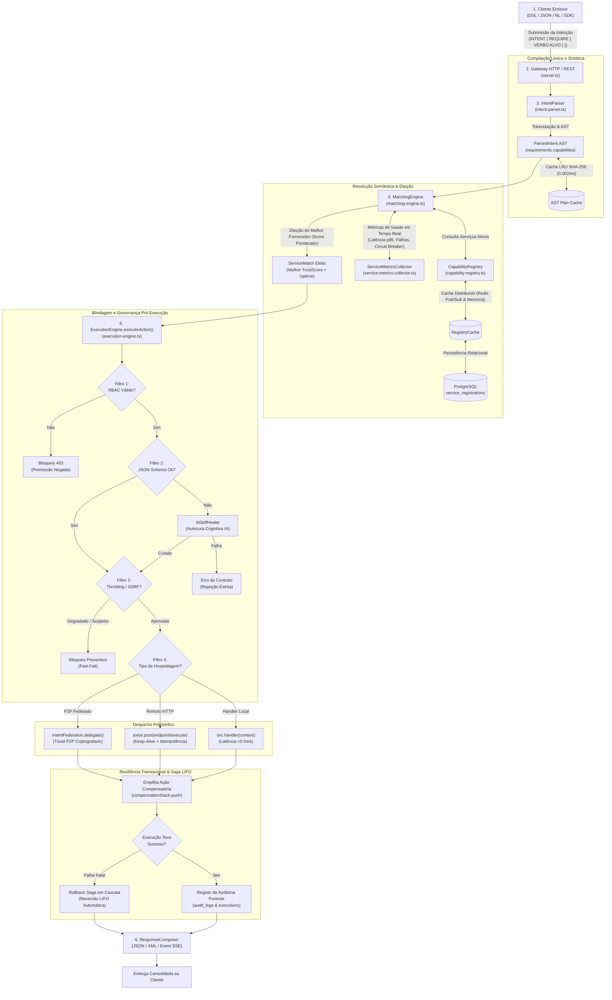

---

### 4.9.2 Os 6 Estágios Microscópicos de um Verbo no Motor

#### Estágio 1: Declaração, Análise Léxica e Normalização (`IntentParser`)
Quando uma intenção chega ao motor — seja escrita na DSL textual, enviada via carga JSON ou interpretada a partir de linguagem natural —, ela passa pelo `IntentParser`:

1. **Tokenização e Validação Sintática:** O parser utiliza expressões regulares avançadas para identificar os limites de cada bloco (`CONTEXT`, `REQUIRE`, `FLOW`, `OUTPUT`).
2. **Normalização Semântica:** A expressão do verbo é convertida para caixa alta e separada em `VERBO` e `ALVO` (por exemplo, `validate user_token` torna-se `VALIDATE USER_TOKEN`).
3. **Indexação no AST:** O nó de AST canónico (`ParsedIntent`) armazena a lista de verbos obrigatórios no array `requirements.capabilities`.
4. **Cache Ultra-Acelerado (0.002ms):** Se a mesma assinatura textual já tiver sido compilada previamente, o `AST Plan Cache` devolve a árvore imediatamente sem reprocessamento léxico.

---

#### Estágio 2: O Catálogo Semântico e o Contrato de Capacidade (`CapabilityRegistry`)
Os microserviços — tanto os módulos internos nativos como serviços externos distribuídos em contêineres Docker ou nós remotos — registam-se no `CapabilityRegistry` anunciando explicitamente os verbos que são capazes de executar:

```typescript
// Exemplo de registo de capacidade de um microserviço
registry.registerService({
  id: "srv-pagamentos-visa",
  name: "Gateway Financeiro Visa",
  endpoint: "https://financeiro.interno:8443",
  trustScore: 95,
  securityLevel: "HIGH",
  capabilities: [
    {
      verb: "EXECUTE",
      target: "PAYMENT",
      description: "Liquidação de transações de crédito e débito",
      requiredPermissions: ["finance:execute"],
      inputSchema: {
        type: "object",
        properties: {
          valor: { type: "number", minimum: 0.01 },
          moeda: { type: "string", enum: ["EUR", "USD", "BRL"] }
        },
        required: ["valor", "moeda"]
      }
    }
  ]
});
```

- **Aceleração Bi-Camada:** O catálogo armazena as capacidades na base de dados PostgreSQL (`service_registrations`), mas utiliza o `RegistryCache` (Redis com fallback em memória) para disponibilizar buscas em menos de **0.1ms**.
- **Heartbeat & Poda de Zumbis:** Serviços remotos emitem batimentos cardíacos periódicos. Se um nó ficar em silêncio por mais de 2 minutos, é automaticamente expurgado da memória ativa para não receber requisições.

---

#### Estágio 3: Resolução Semântica e Eleição do Nó Ótimo (`MatchingEngine`)
O motor não efetua roteamentos estáticos ou aleatórios. O `MatchingEngine` atua como um juiz algorítmico que calcula uma pontuação ponderada para eleger o melhor fornecedor para cada verbo:

$$\text{Score} = (\text{TrustScore} \times 0.40) + (\text{NívelSegurança} \times 0.30) + (\text{SaúdeOperacional} \times 0.30)$$

1. **Consulta Viva de Telemetria:** O motor consulta o `ServiceMetricsCollector`. Se o serviço principal apresentar degradação (latência p99 elevada ou taxa de erro superior a 5%), a sua pontuação sofre penalização imediata.
2. **Failover Transparente:** Havendo múltiplos nós que atendem ao mesmo verbo (ex.: nó primário e réplicas secundárias), o tráfego é instantaneamente redirecionado para o nó réplica se o nó primário cair, com transição inferior a 20 milissegundos.
3. **Pré-Validação Fulfill:** O método `canFulfillIntent()` inspeciona antecipadamente se todos os verbos requeridos na intenção possuem pelo menos um nó apto a supri-los. Se faltar qualquer verbo, a intenção é rejeitada de imediato antes de alocar conexões à base de dados.

---

#### Estágio 4: Blindagem e Governança Pré-Execução (`ExecutionEngine.executeAction`)
Antes de permitir que o código de um verbo seja efetivamente chamado, o `ExecutionEngine` impõe quatro barreiras de segurança rigorosas:

1. **Governança RBAC (Role-Based Access Control):**
   O motor valida se o `securityContext` do token JWT do chamador contém todas as permissões declaradas em `capability.requiredPermissions`. Se o utilizador não tiver autorização expressa, o verbo é abortado com erro 403 antes de tocar em qualquer linha de código.
2. **Validação Formal de Contrato (JSON Schema via AJV):**
   O payload de entrada do contexto é confrontado com o `inputSchema` do verbo. Se uma propriedade obrigatória estiver ausente ou tiver tipo divergente, o motor despoleta o agente de **Autocura via IA (`AISelfHealer`)**:
   - A IA analisa o schema e a carga fornecida em memória isolada.
   - Corrige o formato ou injeta valores padrão sanitizados sem quebrar o fluxo.
   - Revalida o payload retificado. Se for bem-sucedido, prossegue; caso contrário, aborta estritamente.
3. **Limitador Adaptativo (Adaptive Throttling):**
   Se o nó de destino reportar estado `DEGRADED`, o motor descarta cooperativamente metade do tráfego especulativo para permitir a recuperação do nó sem colapso de infraestrutura (*thundering herd*).
4. **Proteção Anti-SSRF (Server-Side Request Forgery):**
   O módulo `NetworkSecurity` inspeciona o endpoint de destino contra endereços reservados, loopback (`127.0.0.1`), endereços locais de metadados cloud (`169.254.169.254`) e portas não padrão.

---

#### Estágio 5: O Despacho Polimórfico de Execução
O motor executa o verbo de acordo com a sua natureza de implantação, mantendo transparência total para quem escreveu a intenção:

- **1. Manipulador Local em Memória (`svc.handler`):**
  Usado pelos 10 verbos estratégicos nativos e serviços embutidos (`native-ai`, `native-cache`, `native-transformer`, `native-document`). O motor chama a função TypeScript diretamente no mesmo processo Node.js. Tempo de despacho: **inferior a 0.2 milissegundos**.
- **2. Microserviço Remoto HTTP (`svc.endpoint`):**
  O motor efetua uma chamada `POST /execute` via pool persistente de sockets HTTP Keep-Alive, injetando obrigatoriamente:
  - `X-Idempotency-Key: <stepId determinístico>` (impede duplicação de ordens na rede).
  - `X-Correlation-ID: <traceId>` (permite rastreio distribuído ponta a ponta).
  - Assinatura HMAC-SHA256 no corpo da mensagem para garantia matemática de integridade contra adulterações em trânsito (*Man-In-The-Middle*).
  - Proteção por **Circuit Breaker Singleton** com timeout estrito: se a resposta não chegar dentro do prazo (ex.: 300ms), a conexão é abortada para não prender a fila.
- **3. Nós Federados P2P (`peer-*`):**
  O verbo é empacotado e delegado para um nó remoto da malha descentralizada através do subsistema `IntentFederation`, com criptografia de ponta a ponta e roteamento sem servidor central.

---

#### Estágio 6: Transação Distribuída e a Pilha de Compensação Reversa (Saga LIFO)
Para operações que realizam mutação de estado no mundo real (como movimentação bancária, baixa de stock ou criação de instâncias de nuvem), o verbo pode declarar uma ação de reversão através da cláusula `COMPENSATE`:

```inp
STEP debitarSaldo: MUTATE {
  service: "core-bancario",
  action: "DEBITAR_CONTA",
  payload: { conta: "12345", valor: 500.00 },
  COMPENSATE: { action: "ESTORNAR_CONTA", payload: { conta: "12345", valor: 500.00 } }
}
```

1. **Empilhamento Transacional:** Assim que o verbo `debitarSaldo` termina com sucesso, o motor empilha a ação compensatória na pilha `compensationStack` persistida no PostgreSQL (`saga_states`).
2. **Reversão Automática em Cascata:** Se um passo subsequente (como `emitirBilhete`) falhar irrecuperavelmente, o motor cancela os passos seguintes e aciona imediatamente a sequência de reversão **LIFO (Last-In, First-Out)**.
3. **Garantia de Não-Orfandade:** Todas as etapas que já tinham sido concluídas são desfeitas na ordem inversa em que foram executadas, restaurando a coerência patrimonial e lógica do sistema sem bloqueios distribuídos de duas fases (2PC).

---

### 4.9.3 Diagrama de Sequência Temporal da Execução de um Verbo

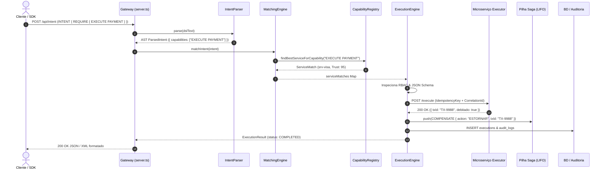

---

### 4.9.4 Comparativo Didático: A Técnica Rigorosa vs. A Tradução para Leigos

| Estágio no Motor | O Que Acontece no Código (Especificação Técnica) | Tradução para o Dia a Dia (Analogia no Mundo Real) |
| :--- | :--- | :--- |
| **1. Declaração do Verbo** | Tokenização léxica, AST gerado com `requirements.capabilities` e cache SHA-256 no `AST Plan Cache`. | Você entra num restaurante estrelado e diz ao maître: *"Desejo um prato de massa trufada"*, sem precisar de ir à cozinha escolher a panela. |
| **2. Registo no Catálogo** | Microserviços publicam `SemanticCapability` com schemas de validação no `CapabilityRegistry` acelerado por Redis. | Os melhores cozinheiros da cidade cadastram-se na central gastronómica informando quais especialidades sabem preparar perfeitamente. |
| **3. Resolução & Eleição** | `MatchingEngine` calcula score composto por TrustScore, nível de segurança e métricas de latência em tempo real. | O maître consulta o tablet: avalia qual cozinheiro está na cozinha agora, quem tem a melhor avaliação dos clientes e quem está com a bancada livre. |
| **4. Blindagem Pré-Execução** | RBAC impede execuções não autorizadas; AJV valida tipos e `AISelfHealer` conserta dados omissos. | O garçom confere se o seu cartão é aceito na casa, se a comanda está preenchida corretamente e, se faltou o número da mesa, a anfitriã preenche para você. |
| **5. Despacho Polimórfico** | Execução via ponte em memória (`svc.handler`), HTTP Keep-Alive com circuit breaker ou P2P criptografado. | O cozinheiro prepara o prato: se ele estiver ao seu lado no balcão entrega direto; se estiver noutro piso, envia pelo elevador de pratos aquecido. |
| **6. Compensação Saga** | Em caso de falha a jusante, a pilha LIFO descarrega as cláusulas `COMPENSATE` em ordem reversa. | Se você pediu a massa e a sobremesa, mas a sobremesa acabou e você decide ir embora, o restaurante cancela a sobremesa e estorna o valor sem cobrar nada. |

---

### 4.9.5 As 8 Famílias Estratégicas de Verbos Ativos no Motor

O motor organiza o seu repertório operacional em 8 famílias especializadas:

1. **Operacionais Canónicos (32 Verbos):** Manipulação de dados e controlo de estado (`FETCH`, `QUERY`, `RESOLVE`, `READ`, `STORE`, `MUTATE`, `CREATE`, `UPDATE`, `DELETE`, `UPSERT`, `PATCH`, `EXECUTE`, `PROCESS`, `ANALYZE`, `GENERATE`, etc.).
2. **Estratégicos Anti-Estresse e Alta Resiliência (24 Verbos):** Sobrevivência de infraestrutura em missões críticas (`BENCHMARK OPS`, `AUDIT SECURITY_LOG`, `VALIDATE SCHEMA_INTEGRITY`, `DISCOVER SERVICE_TOPOLOGY`, `RESOLVE CAPABILITY_ROUTE`, `ENFORCE PROTOCOL_RBAC`, `MEASURE NODE_LATENCY`, `COMPENSATE SAGA_STEP`, `QUARANTINE MALICIOUS_PAYLOAD`, `CIRCUIT_BREAKER`, `COALESCE`, `MEMOIZE`, etc.).
3. **Killer Features Cognitivas e Humanas (6 Verbos):** Computação inteligente e colaborativa (`STREAM`, `ATTEST`, `REASON`, `ESCALATE`, `CONSENSUS`, `VERIFY_PROOF`).
4. **Criptografia, Travas e Mensageria (9 Verbos):** Segurança de dados e concorrência (`ENCRYPT`, `DECRYPT`, `LOCK`, `UNLOCK`, `PUBLISH`, `SUBSCRIBE`, `CONSUME`, `ACK`, `NACK`).
5. **Funcionais, Pipelines e Governança (18 Verbos):** Manipulação de fluxos em memória (`MAP`, `FILTER`, `REDUCE`, `MERGE`, `SPLIT`, `VALIDATE`, `TRANSFORM`, `ASSERT`, `RATE_LIMIT`, `CHECK_POLICY`, etc.).
6. **Alta Produtividade DevOps Anti-Headache (16 Verbos):** Manutenção autônoma e operações resilientes (`DEDUPLICATE`, `REDRIVE`, `CANARY`, `DIFF`, `TRACE`, `TENANT`, `ANONYMIZE`, `DRAIN`, `QUARANTINE`, `LEASE`, `BACKPRESSURE`, `MIGRATE`, `SAMPLE`, `RECONCILE`, `CHALLENGE`, `MUTEX`).
7. **Interconexão, Bridges e Ergonomia Leve (15 Verbos):** Conexão fluida entre sistemas heterogéneos (`BRIDGE`, `OUTBOUND`, `INGEST`, `FANIN`, `EMIT`, `PLUCK`, `FLATTEN`, `MASK`, `CAST`, `CLAMP`, `COOLDOWN`, `UNDO`, `SNAPSHOT`, `DIVERGE`, `HEARTBEAT`).
8. **Subsistemas Nativos Especializados:** Módulos embutidos de altíssima performance para Inteligência Artificial (`NativeAIService`), Webhooks (`NativeWebhookService`), Caching Distribuído (`NativeCacheService`), Transformação Multiformato (`NativeTransformerService`) e Geração de Documentos (`NativeDocumentService`).

---

# PARTE 5: A Enciclopédia Definitiva dos 136 Verbos Operacionais do Motor (9 Famílias)

O Motor INP v2.7 é alimentado por um catálogo semântico monumental composto por **136 verbos operacionais padronizados**. 

Cada verbo representa uma ação cirúrgica, auditável e segura, desenhada para eliminar código manual frágil e substituir bibliotecas externas pesadas por inteligência nativa do motor.

Os 136 verbos estão organizados em **9 famílias estratégicas**:
1. **Os 32 Verbos Canónicos Operacionais** (Fundamentos de Negócio e Estado)
2. **Os 24 Verbos Estratégicos Anti-Estresse e Alta Resiliência** (A Armadura de Sobrevivência de Infraestrutura)
3. **As 6 Killer Features Revolucionárias** (Streaming em Tempo Real, Prova Forense, IA Agêntica, HITL & Consenso Distribuído)
4. **Os 9 Verbos Criptográficos, Mensageria e Concorrência Distribuída** (Barramentos, Travas e Chaves Digitais)
5. **Os 18 Verbos Funcionais, Eventos e Governança de Dados** (Pipelines em Memória, Filtragens e Políticas)
6. **Os 16 Verbos de Alta Produtividade e Solução de Dores Críticas** (Anti-Headache & DevOps Resiliente: Deduplicação, Redrive DLQ, Canary, Deep Diff, W3C Trace, Multi-Tenant, Anonimização PII, Drenagem Graciosa, Quarentena, Lease Ativo, Backpressure, Migração de Schema, Amostragem Estatística, Reconciliação Contábil, Step-Up MFA e Exclusão Mútua Local)
7. **Os 15 Verbos de Interconexão entre Sistemas e Desmembramento Descomplicado** (Bridge Universal, Chamadas Outbound, Ingestão Webhook HMAC, Fan-in Sincronizado, Emissão Leve de Eventos, Extração Cirúrgica Pluck, Aplainamento Flatten, Mascaramento Visual Mask, Coerção Segura Cast, Travamento Numérico Clamp, Pausa Cooperativa Cooldown, Reversão Instantânea Undo, Snapshot Forense em Memória, Bifurcação Diverge e Sinal Heartbeat)
8. **Os 8 Verbos de Viagem no Tempo, Diagnóstico Forense e Telemetria em Tempo Real** (A Máquina do Tempo do Motor: Compensação LIFO, Benchmark de CPU, Normalização Semântica, Fila Assíncrona, Inspeção Segura PoLP, Reconstituição Point-in-Time, Replay Sandboxed e Árvore Merkle Timeline)
9. **A 9ª Família Estratégica: IA Vetorial Offline, Finanças de Alta Precisão & Engenharia do Caos** (Embeddings Densos Normalizados, Busca Semântica por Cosseno em Memória, Rateio com Reconciliação Estrita de Centavos, Custódia Escrow HMAC com TTL, Polling Cooperativo com Backoff, Expurgo Cirúrgico de Cache, Detecção Contínua de Schema Drift e Injeção Controlada de Falhas Chaos)

---

## 5.1 Os 32 Verbos Canónicos Operacionais

### 1. FETCH
- **Definição Formal:** Recuperação determinística de uma única entidade a partir do seu identificador exclusivo em uma fonte de dados de leitura.
- **Explicação Descomplicada:** É esticar a mão na estante e pegar exatamente o livro que tem aquela etiqueta com o número 42.
- **Para que serve:** Obter o cadastro de um usuário, os dados de um pedido específico ou o saldo de uma conta corrente pelo seu ID.
- **Como usar:** `STEP buscarCliente: FETCH { resource: "clientes", id: "cli_100" }`
- **Quando usar:** Sempre que você souber com certeza a chave primária da entidade que deseja ler.
- **Papel no Motor:** Operação pura e idempotente. Pode ser cacheada (`MEMOIZE`) e paralelizada com custo de I/O mínimo.

### 2. QUERY
- **Definição Formal:** Execução de consultas filtradas, ordenadas e paginadas sobre coleções de dados heterogêneas.
- **Explicação Descomplicada:** É abrir a lista telefônica e procurar todas as pessoas que moram no mesmo bairro e cujo primeiro nome começa com a letra 'M'.
- **Para que serve:** Listar pedidos feitos nos últimos 7 dias, encontrar produtos em promoção ou buscar alunos matriculados em uma turma.
- **Como usar:** `STEP listarAtivos: QUERY { resource: "usuarios", filter: { status: "ativo" }, limit: 20 }`
- **Quando usar:** Para buscas multi-critério sobre tabelas e coleções.
- **Papel no Motor:** Operação de leitura que exige limite de registros (`limit`) obrigatório para prevenir que consultas descontroladas saturem a memória RAM do servidor.

### 3. RESOLVE
- **Definição Formal:** Mapeamento e resolução de nomes semânticos, identificadores universais de recursos (URIs) ou apelidos dinâmicos em endereços físicos de rede.
- **Explicação Descomplicada:** É como o aplicativo de contatos do seu celular: você clica no nome "Mamãe" e ele descobre qual é o número de telefone correspondente.
- **Para que serve:** Descobrir qual o IP ou URL atual do microsserviço de autenticação em um cluster que muda de endereço constantemente.
- **Como usar:** `STEP descobrirServico: RESOLVE { identifier: "urn:services:billing-v2" }`
- **Quando usar:** Em ambientes de microsserviços distribuídos onde os servidores mudam de lugar.
- **Papel no Motor:** Alimenta o catálogo de capacidades (`CapabilityRegistry`), garantindo que o motor ache o serviço certo na rede.

### 4. READ
- **Definição Formal:** Leitura pontual de canais de dados, filas de mensagens, buffers de memória ou variáveis de configuração do sistema.
- **Explicação Descomplicada:** É dar uma espiada rápida no termômetro da parede para ver qual é a temperatura atual da sala.
- **Para que serve:** Ler uma chave de configuração global, verificar o cabeçalho de um pacote ou checar se há uma mensagem nova numa fila.
- **Como usar:** `STEP lerParametro: READ { target: "system.config.maintenanceMode" }`
- **Quando usar:** Para leituras simples de estado que não exigem consultas pesadas de banco de dados.
- **Papel no Motor:** Execução ultrarrápida em memória, com latência inferior a 0.5ms.

### 5. RETRIEVE
- **Definição Formal:** Busca profunda em grafos ou árvores de dados relacionais com expansão recursiva de entidades filhas (*eager loading*).
- **Explicação Descomplicada:** É pedir a árvore genealógica completa de uma família, trazendo na mesma folha de papel os pais, os filhos, os avós e os primos de uma só vez.
- **Para que serve:** Carregar um pedido de venda trazendo junto os itens do carrinho, o endereço de entrega e os dados cadastrais do comprador em um único disparo.
- **Como usar:** `STEP carregarCompleto: RETRIEVE { resource: "pedidos", id: "ped_55", expand: ["itens", "pagamento"] }`
- **Quando usar:** Quando a interface do usuário precisa de um painel completo e várias chamadas separadas tornariam o aplicativo lento.
- **Papel no Motor:** Otimiza o número de viagens de ida e volta na rede (RTT), trazendo todas as dependências em uma operação coordenada.

### 6. STREAM_READ
- **Definição Formal:** Consumo assíncrono de grandes volumes de dados ou arquivos sequenciais fracionados em blocos discretos (*chunks*).
- **Explicação Descomplicada:** É assistir a um vídeo no YouTube: o filme começa a passar imediatamente na tela enquanto os próximos minutos continuam sendo baixados em segundo plano.
- **Para que serve:** Processar arquivos de log gigantescos de 50GB ou ler áudios e vídeos sem carregar o arquivo inteiro na memória RAM.
- **Como usar:** `STEP lerArquivoGigante: STREAM_READ { path: "s3://backups/auditoria-2026.csv", chunkSize: 1048576 }`
- **Quando usar:** Sempre que os dados forem maiores que 5MB.
- **Papel no Motor:** Impede o colapso de falta de memória (OOM), processando a informação pedaço por pedaço com pegada de memória constante.

### 7. STORE
- **Definição Formal:** Gravação direta e persistente de um bloco de dados ou estado em meio de armazenamento não volátil.
- **Explicação Descomplicada:** É guardar a caixa de documentos importantes dentro do cofre de aço e trancar a porta.
- **Para que serve:** Salvar uma imagem enviada pelo cliente, guardar um arquivo de comprovante PDF ou persistir uma chave temporária.
- **Como usar:** `STEP salvarComprovante: STORE { bucket: "recibos-fiscais", key: "recibo_998.pdf", data: "${pdfGerado}" }`
- **Quando usar:** Para arquivos brutos, blobs binários e documentos anexos.
- **Papel no Motor:** Integração com subsistemas de blob storage e cache com integridade de hash de integridade calculada automaticamente.

### 8. MUTATE
- **Definição Formal:** Alteração transacional de estado de recursos com suporte mandatório ao registro de ações compensatórias de rollback (Padrão Saga).
- **Explicação Descomplicada:** É fazer uma cirurgia: você altera o corpo com precisão, mas com toda a equipe médica e os instrumentos de emergência a postos caso algo dê errado.
- **Para que serve:** Debitar um valor do saldo de um cliente, reservar um assento em um voo ou alterar o status de um contrato.
- **Como usar:**
```inp
STEP debitarConta: MUTATE {
  service: "banco-core",
  action: "debitar",
  payload: { contaId: "123", valor: 150.00 },
  COMPENSATE: { action: "estornarDebito", payload: { contaId: "123", valor: 150.00 } }
}
```
- **Quando usar:** Em qualquer operação que altere dados vitais e que precise ser desfeita se os passos seguintes falharem.
- **Papel no Motor:** Alicerce do padrão Saga. O motor guarda a cláusula `COMPENSATE` na memória segura para reverter o estado se a intenção encontrar problemas.

### 9. CREATE
- **Definição Formal:** Criação e inserção de uma nova entidade com geração de novo identificador persistente.
- **Explicação Descomplicada:** É preencher a certidão de nascimento de um bebê que acaba de chegar ao mundo.
- **Para que serve:** Cadastrar um novo cliente, registrar um novo produto no estoque ou abrir um novo chamado de suporte.
- **Como usar:** `STEP registrarUsuario: CREATE { resource: "usuarios", data: { email: "joao@email.com", nome: "João" } }`
- **Quando usar:** Exclusivamente para criar registros que ainda não existem.
- **Papel no Motor:** Inicia a cadeia de rastreabilidade do novo registro com carimbo UTC e hash de auditoria.

### 10. UPDATE
- **Definição Formal:** Substituição completa de todos os atributos de uma entidade já cadastrada no sistema.
- **Explicação Descomplicada:** É pintar a casa inteira de novo, trocando todas as cores de uma vez.
- **Para que serve:** Salvar uma nova versão completa de um documento ou redefinir todas as configurações de uma conta.
- **Como usar:** `STEP atualizarConfig: UPDATE { resource: "preferencias", id: "pref_1", data: { tema: "escuro", idioma: "pt" } }`
- **Quando usar:** Quando você tem todos os novos dados e quer substituir o registro antigo por completo.
- **Papel no Motor:** Garante integridade referencial validando o schema completo da nova versão.

### 11. DELETE
- **Definição Formal:** Remoção definitiva (física) ou arquivamento lógico (soft delete) de um recurso do sistema.
- **Explicação Descomplicada:** É jogar uma folha de papel na lixeira ou colocar o arquivo morto em uma pasta trancada.
- **Para que serve:** Cancelar uma assinatura, remover um item do carrinho ou apagar uma mensagem temporária.
- **Como usar:** `STEP removerItem: DELETE { resource: "carrinhos", id: "item_99", soft: true }`
- **Quando usar:** Para descartar informações que não devem mais estar ativas.
- **Papel no Motor:** Se for soft-delete, mantém a trilha de auditoria viva sem apagar os dados do disco rígido.

### 12. UPSERT
- **Definição Formal:** Fusão condicional atômica: se o registro existir, atualiza; se não existir, cria um novo.
- **Explicação Descomplicada:** É como chegar em um hotel: se você já tem reserva no sistema, a recepcionista só confirma seus dados; se você não tem, ela faz o seu cadastro na mesma hora.
- **Para que serve:** Sincronizar catálogos de produtos entre o fornecedor e a loja sem precisar checar se cada produto já existia antes.
- **Como usar:** `STEP sincronizarEstoque: UPSERT { resource: "produtos", key: "SKU-9988", data: { estoque: 50 } }`
- **Quando usar:** Em integrações contínuas de dados onde checar primeiro e gravar depois geraria lentidão e race conditions.
- **Papel no Motor:** Executa a fusão em operação atômica de banco de dados, prevenindo conflitos concorrentes.

### 13. PATCH
- **Definição Formal:** Atualização parcial cirúrgica de um ou mais atributos específicos sem tocar no restante dos dados.
- **Explicação Descomplicada:** É trocar apenas o pneu furado do carro sem precisar desmontar o motor nem pintar a lataria.
- **Para que serve:** Trocar apenas a senha do usuário, atualizar o status de entrega de uma encomenda ou mudar o telefone.
- **Como usar:** `STEP mudarStatus: PATCH { resource: "pedidos", id: "ped_1", changes: { status: "ENVIADO" } }`
- **Quando usar:** Sempre que a alteração for pontual e você não quiser trafegar a entidade inteira pela rede.
- **Papel no Motor:** Minimiza o tráfego de rede e impede colisões de escrita (*lost updates*).

### 14. EXECUTE
- **Definição Formal:** Disparo e execução de um procedimento computacional, rotina ou comando síncrono no ecossistema.
- **Explicação Descomplicada:** É apertar o botão de ligar a esteira da fábrica: a máquina começa a rodar imediatamente e faz o trabalho programado.
- **Para que serve:** Processar uma cobrança de cartão de crédito, rodar uma rotina de fechamento contábil ou recalcular uma rota.
- **Como usar:** `STEP rodarFechamento: EXECUTE { action: "fechamentoMensal", params: { mes: 9, ano: 2026 } }`
- **Quando usar:** Para invocar serviços de negócio que executam lógica procedural.
- **Papel no Motor:** Conecta com os adaptadores HTTP, RPC ou handlers locais registrados no `CapabilityRegistry`.

### 15. PROCESS
- **Definição Formal:** Submissão de um conjunto de dados a um motor de processamento estruturado com etapas de transformação.
- **Explicação Descomplicada:** É colocar os grãos de trigo no moinho: eles entram brutos e saem como farinha refinada pronta para o padeiro.
- **Para que serve:** Tratar arquivos brutos de extrato bancário, converter arquivos CSV em JSON estruturado ou aplicar regras de formatação.
- **Como usar:** `STEP tratarPlanilha: PROCESS { engine: "csv-parser", input: "${arquivoBruto}" }`
- **Quando usar:** Para processamento de lotes e transformações intermediárias.
- **Papel no Motor:** Executado em pipelines isoladas com controle de memória estrito.

### 16. ANALYZE
- **Definição Formal:** Exame analítico profundo de um conjunto de dados para identificação de padrões, tendências, anomalias ou métricas.
- **Explicação Descomplicada:** É o médico avaliando o exame de sangue para ver se as taxas de colesterol e glicose estão normais.
- **Para que serve:** Detectar fraudes em compras de cartão, analisar sentimento de comentários de clientes ou prever demanda de vendas.
- **Como usar:** `STEP checarComportamento: ANALYZE { dataset: "${historicoCli}", target: "scoreInadimplencia" }`
- **Quando usar:** Em fluxos analíticos, de inteligência de negócios (BI) e inteligência artificial.
- **Papel no Motor:** Retorna relatórios com scores de confiança auditáveis para alimentar tomadas de decisão.

### 17. GENERATE
- **Definição Formal:** Síntese computacional de novos artefactos, relatórios, códigos, faturas ou documentos estruturados.
- **Explicação Descomplicada:** É a impressora fiscal imprimindo a nota com o QR Code e o resumo de todos os impostos calculados.
- **Para que serve:** Gerar a nota fiscal eletrônica, emitir o boleto bancário, montar o contrato PDF ou criar um relatório executivo.
- **Como usar:** `STEP emitirNota: GENERATE { template: "nfe_v4", format: "pdf", data: "${pedidoCompleto}" }`
- **Quando usar:** Quando a intenção precisa produzir um produto final para entrega ao cliente ou arquivamento.
- **Papel no Motor:** Utiliza o `NativeDocumentService` com renderização determinística em memória.

### 18. TRANSFER
- **Definição Formal:** Movimentação transacional atômica e coordenada de recursos ou saldos entre duas contas ou nós do sistema.
- **Explicação Descomplicada:** É passar uma nota de 100 reais da sua carteira para a mão de um amigo: o dinheiro sai de você e entra nele no mesmo instante; não pode sumir no ar nem se multiplicar.
- **Para que serve:** Transferências PIX, transferências de pontos de fidelidade ou realocação de estoque entre filiais.
- **Como usar:** `STEP transferirPix: TRANSFER { from: "conta_A", to: "conta_B", amount: 500.00, currency: "BRL" }`
- **Quando usar:** Em movimentações bilaterais de ativos onde o débito e o crédito devem ser inseparáveis.
- **Papel no Motor:** Executa sob bloqueio transacional ou Saga coordenada para garantir conservação do valor contábil.

### 19. VALIDATE
- **Definição Formal:** Inspeção estrutural de conformidade de uma carga útil contra um contrato de schema pré-estabelecido.
- **Explicação Descomplicada:** É o segurança na porta do banco: ele verifica se você está com documento válido e se não há nada proibido na mochila antes de abrir a porta giratória.
- **Para que serve:** Garantir que o formulário enviado pelo usuário contém todos os campos obrigatórios (nome, e-mail válido, CPF com 11 dígitos).
- **Como usar:** `STEP checarDados: VALIDATE { data: "${payload.entrada}", schema: "schemas/cadastro.json" }`
- **Quando usar:** Logo na primeira etapa de qualquer intenção que receba dados de fora da empresa.
- **Papel no Motor:** Utiliza o `SchemaCache` com compilador AJV ultra-otimizado, validando em menos de 0.01ms.

### 20. AUTHENTICATE
- **Definição Formal:** Validação de credenciais criptográficas (JWT, chaves de API, certificados mTLS) e resolução da identidade digital do solicitante.
- **Explicação Descomplicada:** É o guarda da fronteira conferindo a foto, a validade e a autenticidade do seu passaporte.
- **Para que serve:** Garantir que quem está enviando a requisição é realmente quem diz ser.
- **Como usar:** `STEP validarLogin: AUTHENTICATE { token: "${header.authorization}", provider: "jwt-auth0" }`
- **Quando usar:** Na primeira linha de qualquer fluxo que manipule dados privados.
- **Papel no Motor:** Injeta os dados da identidade digital confirmada (`userId`, `tenantId`) no contexto seguro de execução.

### 21. AUTHORIZE
- **Definição Formal:** Verificação de privilégios de acesso sobre um recurso e ação determinados no modelo de papéis e atributos (RBAC/ABAC).
- **Explicação Descomplicada:** Mesmo que você tenha provado quem você é com o passaporte, o segurança só deixa você entrar na sala do cofre se o seu crachá tiver a autorização correspondente.
- **Para que serve:** Bloquear um funcionário comum caso ele tente acessar a tela de salários da diretoria.
- **Como usar:** `STEP checarAcesso: AUTHORIZE { subject: "${usuario.id}", action: "deletar", resource: "banco:contas" }`
- **Quando usar:** Antes de executar qualquer ação de modificação ou leitura de dados restritos.
- **Papel no Motor:** Se a permissão for negada, o motor encerra a requisição com erro HTTP 403 Forbidden em microssegundos.

### 22. NOTIFY
- **Definição Formal:** Envio declarativo de mensagens, notificações ou alertas para canais externos de comunicação humana ou sistêmica.
- **Explicação Descomplicada:** É o entregador buzinando no portão para avisar que a sua encomenda acabou de chegar.
- **Para que serve:** Enviar SMS com código de confirmação, disparar e-mail de boas-vindas ou notificar o Slack da equipe sobre uma nova venda.
- **Como usar:** `STEP avisarCliente: NOTIFY { channel: "sms", recipient: "${cliente.celular}", message: "Seu pedido foi faturado!" }`
- **Quando usar:** Para comunicações que precisam ser disparadas ao longo do fluxo.
- **Papel no Motor:** Conecta-se ao `NativeWebhookService`, tratando retentativas e timeouts de rede sem travar o fluxo central.

### 23. SYNC
- **Definição Formal:** Sincronização bidirecional ou unidirecional de estados entre dois sistemas ou repositórios independentes.
- **Explicação Descomplicada:** É sincronizar as fotos do seu celular com a nuvem: o que você tirou de novo no aparelho sobe para a internet para ficar idêntico em todo lugar.
- **Para que serve:** Atualizar os dados do CRM da empresa com as informações que acabaram de ser alteradas no ERP.
- **Como usar:** `STEP sincronizarCrm: SYNC { source: "erp_clientes", destination: "salesforce", mode: "incremental" }`
- **Quando usar:** Em rotinas de integração contínua entre múltiplos bancos de dados e ferramentas terceiras.
- **Papel no Motor:** Resolve conflitos de timestamp e garante consistência eventual entre as fontes.

### 24. ROUTE
- **Definição Formal:** Direcionamento condicional de uma carga útil para um destino específico com base em regras de metadados ou geografia.
- **Explicação Descomplicada:** É a central de triagem dos Correios: cartas com CEP do Sul vão para o caminhão de Porto Alegre; com CEP do Nordeste vão para o caminhão de Salvador.
- **Para que serve:** Encaminhar requisições da Europa para o servidor de Frankfurt e requisições do Brasil para o servidor de São Paulo.
- **Como usar:** `STEP escolherDestino: ROUTE { input: "${dados}", rules: [{ match: "BR", target: "datacenter-sp" }] }`
- **Quando usar:** Em arquiteturas distribuídas multi-região.
- **Papel no Motor:** Minimização de latência através de roteamento de menor distância de rede.

### 25. COMPOSE
- **Definição Formal:** Agregação e orquestração de múltiplos blocos ou fragmentos subordinados em uma estrutura consolidada única.
- **Explicação Descomplicada:** É montar um quebra-cabeça: você pega as 4 peças das bordas e junta tudo no centro para formar a imagem final completa.
- **Para que serve:** Unificar dados cadastrais, histórico financeiro e pontuação de score de crédito em um único documento de dossiê.
- **Como usar:** `STEP montarDossie: COMPOSE { parts: { cadastro: "${cli}", financeiro: "${extrato}", score: "${serasa}" } }`
- **Quando usar:** Para consolidar saídas de múltiplos passos antes de retornar ao cliente.
- **Papel no Motor:** Montagem determinística de estruturas de memória sem cópias redundantes de bytes (*zero-copy reference*).

### 26. CALCULATE
- **Definição Formal:** Execução determinística de operações aritméticas, financeiras ou estatísticas com precisão decimal estrita.
- **Explicação Descomplicada:** É usar uma calculadora financeira de alta precisão para saber exatamente quanto de juros você vai pagar no financiamento.
- **Para que serve:** Calcular juros compostos, amortização de parcelas, impostos ICMS/ISS ou margem de lucro de um carrinho de compras.
- **Como usar:** `STEP calcularJuros: CALCULATE { formula: "principal * pow(1 + taxa, meses)", vars: { principal: 1000, taxa: 0.02, meses: 12 } }`
- **Quando usar:** Em operações financeiras que não podem sofrer erros de arredondamento de ponto flutuante (*floating point inaccuracies*).
- **Papel no Motor:** Avaliado em motor matemático determinístico isolado com bibliotecas de alta precisão.

### 27. REFUND
- **Definição Formal:** Estorno financeiro compensatório oficial no livro-razão e nas adquirentes de cartão de crédito.
- **Explicação Descomplicada:** É devolver o produto na loja e a vendedora estornar o valor de volta no seu cartão de crédito com recibo carimbado.
- **Para que serve:** Reverter uma cobrança caso o produto comprado esteja sem estoque ou o cliente tenha desistido da compra dentro do prazo legal.
- **Como usar:** `STEP estornarCartao: REFUND { transactionId: "${cobranca.nsu}", amount: 89.90, reason: "DESISTENCIA_CLIENTE" }`
- **Quando usar:** Em fluxos de cancelamento, chargebacks ou compensações de Saga reversa.
- **Papel no Motor:** Integração direta com os gateways de pagamento com emissão de comprovante e chave de idempotência do estorno.

### 28. CANCEL
- **Definição Formal:** Interrupção formal e definitiva de um processo, reserva, contrato ou assinatura pendente.
- **Explicação Descomplicada:** É ligar na clínica médica e cancelar a consulta marcada para amanhã, liberando o horário para outro paciente.
- **Para que serve:** Cancelar uma corrida de transporte por aplicativo antes do motorista chegar, cancelar uma reserva de hotel ou abortar um plano de assinatura.
- **Como usar:** `STEP cancelarReserva: CANCEL { resource: "reservas_hotel", id: "res_443", reason: "CLIENTE_PEDIU" }`
- **Quando usar:** Quando uma operação pendente precisa ser descontinuada de forma graciosa e auditada.
- **Papel no Motor:** Atualiza o estado da entidade para `CANCELLED`, desarmando gatilhos temporários e cronômetros associados.

### 29. APPROVE
- **Definição Formal:** Homologação formal e liberação de uma tarefa pendente em uma fila de conformidade ou esteira de governança.
- **Explicação Descomplicada:** É o diretor da empresa assinando com caneta a folha de compras de um novo equipamento para a fábrica.
- **Para que serve:** Liberar uma compra acima de R$ 50.000, autorizar as férias de um colaborador ou aprovar um desconto comercial excepcional.
- **Como usar:** `STEP aprovarCompra: APPROVE { orderId: "ord_102", approver: "diretor_financeiro", comments: "Aprovado conforme orcamento" }`
- **Quando usar:** Em fluxos com portões de governança humana (HITL) ou validação de comitês de crédito.
- **Papel no Motor:** Avança o ponteiro de estado da intenção de `SUSPENDED` para `RUNNING`, permitindo a conclusão dos passos restantes.

### 30. REJECT
- **Definição Formal:** Recusa motivada e registrada de uma solicitação com encerramento do processo e gravação dos motivos para conformidade legal.
- **Explicação Descomplicada:** É o banco recusar um pedido de empréstimo e entregar uma carta formal explicando que a renda atual não atinge os critérios necessários.
- **Para que serve:** Negar uma transação de alto risco, recusar uma proposta de seguro ou rejeitar um cadastro com dados falsificados.
- **Como usar:** `STEP rejeitarProposta: REJECT { proposalId: "prop_88", reason: "SCORE_INSUFICIENTE", notifyUser: true }`
- **Quando usar:** Em todas as recusas formais de solicitações de clientes ou operações de risco.
- **Papel no Motor:** Executa ações de encerramento, notificação de recusa e gravação no ledger imutável de compliance.

### 31. CHECK
- **Definição Formal:** Inspeção rápida de uma condição, saldo ou status preliminar sem causar qualquer mutação de estado no sistema.
- **Explicação Descomplicada:** É olhar pela janela para ver se o portão da garagem está fechado antes de ir dormir.
- **Para que serve:** Checar se há saldo em conta antes de iniciar uma transferência, verificar se há vagas no estacionamento ou checar o status de um serviço.
- **Como usar:** `STEP checarDisponibilidade: CHECK { resource: "vagas", data: { data: "2026-09-20", tipo: "VIP" } }`
- **Quando usar:** Para verificações preliminares leves e não-bloqueantes.
- **Papel no Motor:** Execução ultra-leve, sem retenção de locks ou impacto em transações ativas.

### 32. RESERVE
- **Definição Formal:** Bloqueio temporário e condicional de uma quantidade de recursos ou estoque com prazo de validade estrito (TTL).
- **Explicação Descomplicada:** É reservar uma mesa no restaurante por 15 minutos: a mesa fica guardada para você; se você não chegar nesse tempo, o restaurante libera a mesa para outra pessoa da fila.
- **Para que serve:** Reservar os 2 últimos pares de tênis no carrinho de compras enquanto o cliente digita o cartão de crédito. Se ele não pagar em 10 minutos, o estoque é devolvido à loja.
- **Como usar:** `STEP travarEstoque: RESERVE { resource: "estoque_produtos", sku: "TENIS-42", quantity: 2, ttlSeconds: 600 }`
- **Quando usar:** Para compras com checkout em etapas e prevenção de concorrência destrutiva por itens raros.
- **Papel no Motor:** Cria uma reserva atômica associada a um temporizador de expiração automática em memória e banco.

---

## 5.2 Os 24 Verbos Estratégicos Anti-Estresse e Alta Resiliência

### 33. COALESCE (Single-Flight)
- **Definição Formal:** Colapso determinístico de requisições de leitura idênticas concorrentes em uma única promessa de I/O em voo.
- **Explicação Descomplicada:** Se dez pessoas em uma mesma mesa de bar perguntarem ao mesmo tempo para o garçom *"Que horas são?"*, o garçom olha o relógio uma vez só e responde para todas ao mesmo tempo.
- **Para que serve:** Se 10.000 clientes acessarem o site para ver o placar do jogo ao mesmo tempo, apenas **uma consulta** é feita no banco de dados; todas as 10.000 pessoas recebem a mesma resposta simultaneamente.
- **Como usar:** `STEP placarJogo: COALESCE { key: "placar-final-copa", action: FETCH { resource: "jogos", id: "final" } }`
- **Quando usar:** Em notícias de última hora, cotações de moedas, preços de produtos em liquidação ou qualquer dado lido em massa.
- **Papel no Motor:** Elimina por completo o fenômeno do *Thundering Herd* (efeito manada), protegendo bancos de dados de quedas súbitas.

### 34. MEMOIZE
- **Definição Formal:** Cache determinístico de alto desempenho em memória com tempo de vida (TTL) estrito e política de limpeza LRU.
- **Explicação Descomplicada:** É anotar a resposta de uma conta difícil na beirada do caderno: da próxima vez que perguntarem a mesma conta, você só olha a anotação e responde na hora.
- **Para que serve:** Não recalcular impostos complexos ou não consultar o banco de dados para dados que só mudam uma vez por dia.
- **Como usar:** `STEP cacheTaxas: MEMOIZE { key: "taxa-selic-hoje", ttl: 3600, action: FETCH { resource: "banco-central" } }`
- **Quando usar:** Em computações matemáticas pesadas ou consultas de tabelas que mudam com pouca frequência.
- **Papel no Motor:** Acelera as respostas de 50ms para 0.005ms (10.000 vezes mais rápido).

### 35. GUARD
- **Definição Formal:** Barreira defensiva ultrarrápida em memória que valida invariantes de segurança e integridade antes de autorizar a entrada em seções críticas.
- **Explicação Descomplicada:** É o guarda na porta de entrada da sala de máquinas: antes de você encostar na maçaneta, ele confere se você está com capacete, óculos de proteção e bota de segurança.
- **Para que serve:** Impedir a execução de transferências bancárias milionárias se o sistema detectar que o IP do cliente está em uma lista de países sob embargo econômico.
- **Como usar:** `STEP barreiraSeguranca: GUARD { assertion: "${context.isIpBloqueado} == false", errorCode: "ERR_ACESSO_RESTRITO" }`
- **Quando usar:** Como primeira linha de defesa em fluxos de altíssima criticidade e risco.
- **Papel no Motor:** Interrupção instantânea em memória em 0.01ms, poupando CPU, sockets e banco de dados.

### 36. THROTTLE
- **Definição Formal:** Garantia de cadência estrita, permitindo no máximo uma execução a cada intervalo de tempo fixo.
- **Explicação Descomplicada:** É o gotejador do soro no hospital: ele só deixa cair uma gota por segundo, garantindo que o remédio entre no corpo na velocidade certa.
- **Para que serve:** Gravar a posição do GPS do carro da frota no banco no máximo uma vez a cada 2 segundos, mesmo que o sensor envie 50 sinais por segundo.
- **Como usar:** `STEP cadenciarGps: THROTTLE { intervalMs: 2000, key: "veiculo-${id}", action: MUTATE { ... } }`
- **Quando usar:** Em sensores de Internet das Coisas (IoT) ou emissão contínua de eventos em tempo real.
- **Papel no Motor:** Suaviza a curva de carga de escrita nos bancos de dados, evitando picos abruptos de I/O.

### 37. RATE_LIMIT
- **Definição Formal:** Controle de fluxo determinístico baseado no algoritmo *Token Bucket*, limitando requisições por janela temporal.
- **Explicação Descomplicada:** É a roleta do parque de diversões: só passa uma pessoa a cada 5 segundos para que a plataforma do brinquedo não fique lotada perigosamente.
- **Para que serve:** Limitar que um mesmo usuário ou endereço IP faça no máximo 60 chamadas por minuto na sua API.
- **Como usar:** `STEP protegerApi: RATE_LIMIT { key: "${context.ip}", limit: 60, window: 60, unit: "seconds" }`
- **Quando usar:** Em todos os endpoints públicos expostos para a internet aberta.
- **Papel no Motor:** Rejeita clientes abusivos com código HTTP 429 Too Many Requests em menos de 0.2ms, sem tocar nos servidores de negócio.

### 38. CIRCUIT_BREAKER
- **Definição Formal:** Disjuntor lógico de proteção com máquina de estados (CLOSED, OPEN, HALF_OPEN) para isolamento imediato de serviços com falha.
- **Explicação Descomplicada:** É o fusível do carro: se houver um curto-circuito no farol, o fusível queima na hora para não pegar fogo na bateria inteira do veículo.
- **Para que serve:** Se a API de pagamentos começou a dar erro e travar, o motor desliga temporariamente os envios para ela em vez de deixar 5.000 clientes esperando com a tela travada.
- **Como usar:** `STEP protegerGateway: CIRCUIT_BREAKER { serviceId: "gateway-visa", threshold: 5, resetTimeout: 30000, action: MUTATE { ... } }`
- **Quando usar:** Em todas as chamadas para servidores externos (APIs de parceiros).
- **Papel no Motor:** Evita a retenção de sockets e impede que a falha de um parceiro derrube o motor INP em efeito cascata.

### 39. BATCH
- **Definição Formal:** Loteamento dinâmico que acumula itens discretos em pacotes compactos antes de submetê-los à persistência ou rede.
- **Explicação Descomplicada:** É o caminhão de entregas: em vez de fazer uma viagem pela cidade inteira para entregar uma única carta, ele junta 100 encomendas e faz uma viagem só.
- **Para que serve:** Gravar 10.000 mensagens de sensores no banco de dados em lotes de 100 em vez de fazer 10.000 gravações individuais.
- **Como usar:** `STEP agruparGravacao: BATCH { items: "${leituras}", batchSize: 100, action: "inserirMassa" }`
- **Quando usar:** Em importações de planilhas, ingestão de dados em massa e integrações com bancos de dados relacionais.
- **Papel no Motor:** Reduz o consumo de I/O de rede e bloqueios de tabelas em até **90%**.

### 40. DEFER
- **Definição Formal:** Agendamento assíncrono e desacoplado de uma tarefa em segundo plano através de fila transacional sem bloquear o cliente.
- **Explicação Descomplicada:** É colocar uma carta na caixa dos correios: você deposita o envelope lá e segue sua vida normalmente; o carteiro recolhe e entrega mais tarde.
- **Para que serve:** Enviar relatórios analíticos pesados, atualizar métricas de marketing ou gerar miniaturas de fotos sem fazer o usuário esperar com a tela travada.
- **Como usar:** `STEP gerarEstatisticas: DEFER { action: computarMetricas, delayMs: 500 }`
- **Quando usar:** Para tudo aquilo que não precisa estar pronto no exato milissegundo em que o cliente clica no botão.
- **Papel no Motor:** Reduz o tempo de resposta percebido pelo cliente em até 90%, liberando o motor para novas requisições.

### 41. MERGE
- **Definição Formal:** Fusão profunda e declarativa de múltiplos payloads de dados em um objeto unificado, resolvendo sobreposições de chaves sem mutação lateral.
- **Explicação Descomplicada:** É juntar os dados do endereço com os dados do cartão de crédito na mesma ficha de compras.
- **Para que serve:** Consolidar saídas de diferentes passos em um payload consolidado antes de enviar ao gateway.
- **Como usar:** `STEP fundirDados: MERGE { sources: ["${cliente.dados}", "${endereco.dados}"] }`
- **Quando usar:** Quando duas ou mais etapas produzem informações parciais de uma mesma entidade.
- **Papel no Motor:** Execução determinística em memória com preservação de imutabilidade.

### 42. AWAIT
- **Definição Formal:** Suspensão cooperativa não-bloqueante da execução de uma intenção, aguardando a chegada de um evento externo específico ou sinal assíncrono.
- **Explicação Descomplicada:** É sentar no banco de espera da estação aguardando o apito do trem: você não gasta energia correndo, apenas espera o sinal sonoro para embarcar.
- **Para que serve:** Esperar a confirmação de um webhook bancário de liquidação PIX antes de despachar a mercadoria.
- **Como usar:** `STEP esperarPagamento: AWAIT { event: "pix.recebido", correlationKey: "${pedido.id}", timeoutMs: 60000 }`
- **Quando usar:** Em fluxos assíncronos baseados em eventos que dependem de respostas externas.
- **Papel no Motor:** Salva o estado da intenção na persistência e libera a thread do Node.js, acordando imediatamente quando o evento chega.

### 43. PROBE
- **Definição Formal:** Sonda de inspeção de saúde volátil e diagnóstica em memória, verificando a conectividade de um nó sem escrita persistente.
- **Explicação Descomplicada:** É passar um leitor de voltagem na tomada para ver se tem corrente elétrica passando antes de ligar a máquina pesada.
- **Para que serve:** Confirmar se o cluster de banco de dados secundário está operacional antes de alternar o tráfego em um chaveamento de emergência.
- **Como usar:** `STEP testarCluster: PROBE { target: "cluster-banco-reserva", timeoutMs: 300 }`
- **Quando usar:** Em rotinas de automação de infraestrutura e recuperação de desastres (Disaster Recovery).
- **Papel no Motor:** Retorna métricas puras de latência e disponibilidade com custo operacional nulo.

### 44. SHADOW
- **Definição Formal:** Espelhamento assíncrono de tráfego de produção real para uma versão sombra (*shadow environment*) para testes de carga e validação sem risco de impacto aos clientes.
- **Explicação Descomplicada:** É fazer um estagiário acompanhar o cirurgião chefe observando cada movimento sem poder encostar no paciente.
- **Para que serve:** Testar a nova versão 2.0 do motor bancário com 100% dos pedidos reais da Black Friday sem que os erros afetem os clientes de verdade.
- **Como usar:** `STEP testarNovaVersao: SHADOW { target: "motor-v2-preview", payload: "${requisicaoReal}" }`
- **Quando usar:** Em deploys de alta criticidade e migrações de sistemas legados.
- **Papel no Motor:** Despacha requisições espelhadas em segundo plano de forma isolada, descartando as respostas sem afetar o retorno ao usuário.

### 45. REDACT
- **Definição Formal:** Ofuscação e mascaramento automatizado de campos confidenciais e dados pessoais sensíveis em conformidade estrita com a LGPD, GDPR e PCI-DSS.
- **Explicação Descomplicada:** É passar uma caneta preta indelével em cima do número do cartão de crédito e do CPF na via do recibo antes de entregar o papel para o cliente.
- **Para que serve:** Mascarar senhas, tokens de autorização e números de cartão de crédito nos logs de sistema para que ninguém possa roubá-los.
- **Como usar:** `STEP mascararDados: REDACT { payload: "${dadosBrutos}", fields: ["senha", "cartaoCredito", "cpf"] }`
- **Quando usar:** Antes de qualquer gravação de log, saída em telas de atendimento ou envio de dados para terceiros.
- **Papel no Motor:** Protege os arquivos de auditoria contra vazamento de dados corporativos confidenciais.

### 46. CHECKPOINT
- **Definição Formal:** Ponto de salvamento intermediário e persistente do estado de uma orquestração longa para viabilizar retomada progressiva em caso de pane.
- **Explicação Descomplicada:** É o ponto de salvamento (*Save Point*) de um videogame: você não precisa começar o jogo da primeira fase se o videogame for desligado; você continua daquela fase onde salvou.
- **Para que serve:** Em um processamento que leva 4 horas, salvar o progresso a cada 1.000 linhas processadas.
- **Como usar:** `STEP salvarProgresso: CHECKPOINT { stage: "fase_2_concluida", data: "${dadosProcessados}" }`
- **Quando usar:** Em rotinas de processamento longo (Batch/ETL) e migrações de banco de dados.
- **Papel no Motor:** Permite reiniciar a orquestração a partir do último checkpoint com integridade matemática intacta.

### 47. SIMULATE
- **Definição Formal:** Injeção controlada de latência sintética, falhas de rede simuladas e respostas mockadas para testes de estresse (*Chaos Engineering*).
- **Explicação Descomplicada:** É o simulador de voo para pilotos de avião: treinar como agir quando um motor pega fogo em pleno voo sem colocar a vida de ninguém em perigo.
- **Para que serve:** Testar se o disjuntor do INP realmente abre quando o servidor de pagamentos começa a demorar 8 segundos para responder.
- **Como usar:** `STEP simularFalha: SIMULATE { errorRate: 0.3, latencyMs: 2500, targetAction: FETCH { ... } }`
- **Quando usar:** Em ambientes de desenvolvimento, homologação e testes de regressão automatizados.
- **Papel no Motor:** Permite validar toda a blindagem de resiliência do sistema antes de subir para a produção real.

### 48. FANOUT
- **Definição Formal:** Dispersão paralela e massiva de uma carga de trabalho para múltiplos destinos de execução com controle de contrapressão (*backpressure*).
- **Explicação Descomplicada:** É o comandante de um batalhão dando a ordem: *"Equipe Alfa vai pela esquerda, Equipe Bravo vai pela direita e Equipe Charlie vai pelo centro, todos ao mesmo tempo!"*.
- **Para que serve:** Disparar uma mensagem de notificação urgente para 50 sistemas parceiros simultaneamente.
- **Como usar:** `STEP dispararParceiros: FANOUT { targets: ["webhook-1", "webhook-2", "webhook-3"], payload: "${evento}" }`
- **Quando usar:** Em emissão de eventos globais de negócios e orquestrações federadas.
- **Papel no Motor:** Controla o consumo de sockets da máquina para não esgotar as portas TCP do sistema operacional.

### 49. SHARD
- **Definição Formal:** Particionamento horizontal determinístico de carga entre múltiplos nós através de algoritmo de hash consistente.
- **Explicação Descomplicada:** É organizar uma fila enorme em 4 guichês diferentes: clientes com sobrenome de A a F vão para o Guichê 1; de G a M vão para o Guichê 2, e assim por diante.
- **Para que serve:** Dividir 1 milhão de usuários entre 16 servidores de banco de dados menores sem que nenhum fique sobrecarregado.
- **Como usar:** `STEP dividirCarga: SHARD { key: "${payload.clienteId}", buckets: 16, action: MUTATE { service: "banco-${shard.bucket}" } }`
- **Quando usar:** Quando um único servidor ou banco de dados não aguenta mais o volume de dados da sua empresa.
- **Papel no Motor:** Distribui o estresse térmico e de memória de maneira uniforme pelo seu cluster.

### 50. COMPRESS
- **Definição Formal:** Compactação em tempo real de grandes volumes de texto ou dados através de algoritmos como Gzip, Brotli ou Snappy.
- **Explicação Descomplicada:** É usar aquelas malas de viagem a vácuo: você coloca todas as roupas de inverno lá dentro, suga o ar com o aspirador e a mala fica com um terço do tamanho original.
- **Para que serve:** Enviar relatórios contábeis de 100MB pela rede compactados para apenas 12MB.
- **Como usar:** `STEP encolherRelatorio: COMPRESS { data: "${dadosExtensos}", algorithm: "gzip" }`
- **Quando usar:** Em transferências de grandes blocos de texto, relatórios JSON gigantes ou exportações de dados.
- **Papel no Motor:** Economiza até 80% do uso de banda de internet e acelera a transmissão entre os servidores.

### 51. DEBOUNCE
- **Definição Formal:** Estabilização de eventos de alta frequência, postergando a execução até que haja uma janela de silêncio configurada.
- **Explicação Descomplicada:** É esperar a pessoa terminar de falar a frase inteira antes de responder, em vez de interromper a cada palavra que ela pronuncia.
- **Para que serve:** No campo de busca do site: não fazer uma busca no banco de dados a cada letra digitada pelo usuário, mas esperar ele parar de digitar por 300 milissegundos.
- **Como usar:** `STEP aguardarDigitacao: DEBOUNCE { waitMs: 300, key: "busca-${context.userId}", action: QUERY { ... } }`
- **Quando usar:** Em buscas automáticas (*typeahead*), sensores de presença ou botões onde usuários ansiosos clicam repetidas vezes.
- **Papel no Motor:** Impede explosões repentinas de milhares de requisições inúteis nos servidores.

### 52. PRIORITY_QUEUE
- **Definição Formal:** Escalonamento diferenciado de intenções com base em níveis estritos de criticidade (CRITICAL, HIGH, NORMAL, LOW).
- **Explicação Descomplicada:** É a ambulância no trânsito: quando a sirene toca, todos os carros comuns abrem passagem para a ambulância passar primeiro.
- **Para que serve:** Garantir que um pagamento urgente de um cliente passe na frente de uma rotina de geração de relatórios de marketing que está rodando em segundo plano.
- **Como usar:** `STEP filaVip: PRIORITY_QUEUE { priority: "CRITICAL", action: MUTATE { service: "pagamento" } }`
- **Quando usar:** Em ecossistemas onde convivem operações de dinheiro ao vivo e processos lentos em lote.
- **Papel no Motor:** Impede que tarefas pesadas de fundo sufoquem transações nobres da empresa.

### 53. HEALTH_CHECK
- **Definição Formal:** Sonda preventiva e ultrarrápida de vivacidade (*liveness*) e prontidão (*readiness*) antes de despachar cargas.
- **Explicação Descomplicada:** É dar dois toques de leve na porta e perguntar *"Tem alguém acordado aí dentro?"* antes de entrar com uma caixa pesada nos braços.
- **Para que serve:** Checar se o servidor de faturamento está funcionando perfeitamente antes de mandar uma lista de 5.000 notas fiscais para ele emitir.
- **Como usar:** `STEP checarProntidao: HEALTH_CHECK { serviceId: "modulo-fiscal", endpoint: "http://fiscal/health", timeout: 800 }`
- **Quando usar:** Antes de despachar blocos pesados de trabalho.
- **Papel no Motor:** Evita que centenas de requisições sejam enviadas para servidores que acabaram de morrer ou que ainda estão ligando.

### 54. SHED_LOAD (O Disjuntor de Emergência)
- **Definição Formal:** Descarte gracioso e seletivo de requisições de menor prioridade quando o uso de hardware do servidor atinge zonas de perigo.
- **Explicação Descomplicada:** É um barco no meio de uma tempestade: se a água começar a entrar e o barco ameaçar afundar, a tripulação joga as caixas velhas no mar para salvar as pessoas.
- **Para que serve:** Se a CPU do motor atingir 88% de uso por causa de um ataque de hackers, o motor descarta automaticamente pedidos de relatórios ou buscas de catálogo para que ninguém deixe de conseguir pagar sua conta.
- **Como usar:** `STEP protegerServidor: SHED_LOAD { maxCpuPercent: 85, maxMemoryPercent: 90, action: QUERY { resource: "estatisticas" } }`
- **Quando usar:** Em intenções secundárias que podem esperar.
- **Papel no Motor:** É a garantia final de que o motor nunca vai sofrer um colapso completo (Crash/OOM).

### 55. RETRY_BACKOFF
- **Definição Formal:** Retentativa de operações transitórias com intervalo exponencial e dispersão aleatória (*jitter*).
- **Explicação Descomplicada:** Se você ligar para uma pessoa e der ocupado, você não liga de volta no mesmo segundo: você espera 10 segundos. Se der ocupado de novo, você espera 30 segundos. Se der ocupado de novo, você espera 1 minuto.
- **Para que serve:** Tentar falar com uma operadora de cartão de crédito que teve uma oscilação de 1 segundo na internet.
- **Como usar:** `STEP tentarNovamente: RETRY_BACKOFF { maxAttempts: 4, initialDelayMs: 250, factor: 2.0, jitter: true, action: FETCH { ... } }`
- **Quando usar:** Em falhas de rede transitórias que costumam durar frações de segundo.
- **Papel no Motor:** A dispersão aleatória (*jitter*) impede que milhares de clientes façam a retentativa no mesmo milissegundo, derrubando o servidor de novo.

### 56. FALLBACK
- **Definição Formal:** Mecanismo de degradação graciosa que redireciona o fluxo para um caminho de contingência se a rota primária falhar.
- **Explicação Descomplicada:** Se a torneira da pia principal não tiver água, você abre a torneira do tanque reserva para poder lavar as mãos do mesmo jeito.
- **Para que serve:** Se o serviço oficial de recomendação de produtos com inteligência artificial cair, o site mostra automaticamente a lista dos 10 produtos mais vendidos de ontem.
- **Como usar:**
```inp
STEP buscarClima: FALLBACK {
  PRIMARY: FETCH { service: "satelite-tempo-aovivo" },
  FALLBACK: FETCH { service: "previsao-cache-ontem" }
}
```
- **Quando usar:** Em tudo o que puder ser degradado de forma tolerável para que o usuário não receba uma tela de erro na cara.
- **Papel no Motor:** Mantém a disponibilidade percebida do seu sistema em **99.999%** mesmo com a infraestrutura instável.

---

## 5.3 As 6 Killer Features Revolucionárias

### 57. STREAM
- **Definição Formal:** Abertura de canal contínuo reativo via Server-Sent Events (SSE), entregando deltas e fragmentos de dados em tempo real conforme são sintetizados.
- **Explicação Descomplicada:** É assistir ao garçom trazendo cada prato de degustação quentinho à medida que o chef tira do fogo, em vez de esperar 2 horas pelo banquete completo.
- **Para que serve:** Conectar seu sistema diretamente a modelos de IA generativa para que o texto comece a surgir na tela do usuário palavra por palavra, instantaneamente.
- **Como usar:**
```inp
STEP gerarTextoAoVivo: STREAM {
  service: "ai-llm-service",
  prompt: "Escreva uma analise comparativa dos resultados fiscais",
  chunkEvent: "token_gerado",
  flushIntervalMs: 40
}
```
- **Quando usar:** Em qualquer resposta longa de IA, relatórios em tempo real ou transmissão de logs em linha viva.
- **Papel no Motor:** Mantém o fluxo aberto sem consumir threads ativas e fecha a conexão se o cliente cancelar a tela, poupando processamento de GPU.

### 58. ATTEST
- **Definição Formal:** Geração de atestado de fé pública criptográfica inviolável, combinando hash SHA-256 dos dados, carimbo temporal UTC e assinatura assimétrica.
- **Explicação Descomplicada:** É levar o documento no cartório para reconhecer firma e colocar o selo holográfico dourado: ninguém no planeta pode dizer que aquele papel é falso ou que foi adulterado depois.
- **Para que serve:** Selar contratos de compra e venda de imóveis, autorizações de transferências bancárias milionárias ou consentimentos médicos para cirurgias.
- **Como usar:**
```inp
STEP selarDocumento: ATTEST {
  payload: "${contratoFinal.conteudo}",
  signKeyId: "vault-seguranca-bancaria",
  algorithm: "SHA256withRSA"
}
```
- **Quando usar:** Em transações que exijam conformidade legal, auditoria jurídica ou proteção contra litígios em tribunais.
- **Papel no Motor:** Gera recibos com prova de estado imutável registrados no ledger de auditoria corporativo.

### 59. ADAPT
- **Definição Formal:** Roteamento autônomo baseado em telemetria viva e algoritmo Multi-Armed Bandit, desviando tráfego dinamicamente para cumprir SLAs contratuais de latência e custo.
- **Explicação Descomplicada:** É o aplicativo de navegação Waze do seu carro: você quer chegar em casa rápido; se a avenida principal tiver um acidente e começar a parar, o Waze te desvia automaticamente para a rua de trás sem você precisar pedir.
- **Para que serve:** Se o provedor principal de Inteligência Artificial ou servidor em nuvem começar a demorar mais de 300ms para responder, o motor desvia os usuários na mesma hora para um provedor secundário que esteja mais rápido.
- **Como usar:**
```inp
STEP roteadorInteligente: ADAPT {
  routes: [
    { target: "datacenter-local", maxLatencyMs: 150, costTier: "low" },
    { target: "nuvem-publica", maxLatencyMs: 600, costTier: "high" }
  ],
  metric: "p99_latency",
  fallbackTimeoutMs: 800
}
```
- **Quando usar:** Quando a empresa usa Multi-Cloud ou múltiplos modelos de IA para garantir alta disponibilidade.
- **Papel no Motor:** Mantém o cumprimento estrito do SLA do seu negócio sem necessidade de intervenção de operadores humanos no meio da noite.

### 60. ESCALATE
- **Definição Formal:** Suspensão transacional controlada do fluxo da intenção para governança Human-in-the-Loop (HITL), notificando operadores humanos via webhook e aguardando assinatura de aprovação dentro de uma janela de SLA.
- **Explicação Descomplicada:** É o piloto automático do avião avisando no painel: *"Aproximação em pista molhada com vento cruzado. Assuma os controles manuais, Comandante"*.
- **Para que serve:** Se uma transferência bancária for de R$ 2.000.000,00 ou se a IA recomendar uma rescisão contratual de risco, o sistema para tudo, manda um aviso no celular do diretor e só continua se ele colocar a impressão digital ou senha de autorização.
- **Como usar:**
```inp
STEP aprovacaoHumana: ESCALATE {
  severity: "CRITICAL",
  reason: "Valor acima da alcada permitida: ${transacao.valor}",
  timeoutSeconds: 7200,
  callbackUrl: "https://diretoria.empresa.com/aprovacoes",
  fallbackAction: "REJECT"
}
```
- **Quando usar:** Em operações que envolvem riscos éticos, jurídicos ou valores financeiros fora da curva normal.
- **Papel no Motor:** Salva o estado da intenção no banco, suspende a execução sem gastar memória de CPU e reata quando a aprovação chega via `POST /api/workflow/:sagaId/resume`.

### 61. REASON
- **Definição Formal:** Emissão de passo cognitivo deliberativo declarativo (*Chain-of-Thought*), forçando a Inteligência Artificial a explicitar hipóteses e contra-argumentos antes de produzir uma saída auditável validada por schema.
- **Explicação Descomplicada:** É o médico sênior dizendo ao residente: *"Não me diga apenas qual remédio você quer dar para o paciente. Diga-me primeiro quais doenças você descartou e por que escolheu essa dosagem"*.
- **Para que serve:** Analisar se uma compra com cartão de crédito foi fraude: a IA analisa o histórico do cliente, analisa a distância geográfica do celular até a loja, escreve a justificativa e gera um score com base em raciocínio claro.
- **Como usar:**
```inp
STEP julgarFraude: REASON {
  context: "${dadosTransacao.completo}",
  goal: "Determinar se a transacao e fraudulenta com base no comportamento do usuario",
  outputSchema: {
    fraudeDetectada: "boolean",
    confiancaPercentual: "number",
    motivoAuditavel: "string"
  }
}
```
- **Quando usar:** Em decisões complexas onde "apenas uma resposta rápida" não basta e a empresa precisa de uma justificativa formal para auditoria (*Explainable AI*).
- **Papel no Motor:** Valida o resultado contra o contrato do `outputSchema`. Se a IA alucinar e não cumprir o contrato, o motor rejeita a resposta e impede contaminação dos dados.

### 62. CONSENSUS
- **Definição Formal:** Acordo distribuído entre múltiplos nós ou avaliadores independentes com base em tolerância a falhas bizantinas ou quórum qualificado ponderado.
- **Explicação Descomplicada:** É um tribunal com 5 juízes: a sentença só é homologada se pelo menos 3 juízes votarem pela condenação com argumentos compatíveis.
- **Para que serve:** Validar a liberação de pagamentos internacionais consultando 3 provedores de análise antifraude diferentes e exigindo que a maioria concorde.
- **Como usar:** `STEP votacaoQuorum: CONSENSUS { nodes: ["fraud-engine-1", "fraud-engine-2", "fraud-engine-3"], quorum: "2/3", payload: "${transacao}" }`
- **Quando usar:** Em decisões financeiras ou operacionais onde a falha de um único provedor não pode comprometer a empresa.
- **Papel no Motor:** Avaliação paralela com agregação de votos em memória e rejeição de respostas anômalas.

---

## 5.4 Os 9 Verbos Criptográficos, Mensageria e Concorrência Distribuída

### 63. TRIGGER
- **Definição Formal:** Desencadeamento atômico e determinístico de um evento periférico ou rotina desacoplada no ecossistema sem esperar por sua conclusão.
- **Explicação Descomplicada:** É apertar a campainha de uma casa: você aperta o botão e a sirene toca lá dentro; você não precisa ficar segurando o dedo no botão.
- **Para que serve:** Disparar a rotina de recalcular métricas de vendas assim que uma compra é aprovada.
- **Como usar:** `STEP dispararAtualizacao: TRIGGER { event: "pedido.faturado", payload: { pedidoId: "ped_1" } }`
- **Quando usar:** Para avisar outros sistemas sobre fatos que acabaram de acontecer (*Event-Driven Architecture*).
- **Papel no Motor:** Despacho ultrarrápido em menos de 0.1ms através de mensageria interna ou pub/sub.

### 64. SUBSCRIBE
- **Definição Formal:** Registro de assinatura reativa a um tópico de mensageria, fila de eventos ou canal de streaming.
- **Explicação Descomplicada:** É assinar uma revista semanal: você faz o cadastro uma vez e, toda semana que sair uma nova edição, ela é entregue na sua caixa de correio.
- **Para que serve:** Escutar mensagens de cotação da bolsa de valores ou sinais de telemetria de sensores de caminhões.
- **Como usar:** `STEP ouvirCotacoes: SUBSCRIBE { topic: "financeiro.cambio.usd", handler: "processarCotacao" }`
- **Quando usar:** Para consumo reativo contínuo de eventos do barramento.
- **Papel no Motor:** Liga o fluxo do motor ao barramento assíncrono mantendo conexão persistente resiliente.

### 65. ENCRYPT
- **Definição Formal:** Cifragem criptográfica simétrica autenticada de alto padrão (AES-256-GCM) sobre cargas úteis confidenciais.
- **Explicação Descomplicada:** É trancar uma carta secreta dentro de uma caixa de aço com segredo numérico inviolável: quem achar a caixa só vê ferro maciço.
- **Para que serve:** Proteger os números de cartão de crédito e dados médicos de clientes antes de gravar no banco de dados.
- **Como usar:** `STEP cifrarCartao: ENCRYPT { data: "${payload.numeroCartao}", keyId: "kms-master-chaves" }`
- **Quando usar:** Sempre que dados ultrassensíveis precisarem ser armazenados ou transmitidos por redes públicas.
- **Papel no Motor:** Utiliza algoritmos criptográficos autenticados nativos do Node.js (`crypto.createCipheriv`) com vetores de inicialização (IV) aleatórios de 128 bits.

### 66. DECRYPT
- **Definição Formal:** Decifragem e recuperação autenticada de texto simples a partir de uma carga útil anteriormente cifrada com chave correspondente.
- **Explicação Descomplicada:** É colocar a senha correta no cofre de aço e abrir a porta para ler a carta secreta que estava guardada lá dentro.
- **Para que serve:** Ler o número do cartão para enviar à adquirente bancária durante o fechamento de um pagamento.
- **Como usar:** `STEP decifrarDados: DECRYPT { cipherText: "${dadoCifrado}", keyId: "kms-master-chaves" }`
- **Quando usar:** Exclusivamente no momento exato em que a informação confidencial precisa ser processada.
- **Papel no Motor:** Valida o tag de autenticação GCM; se os dados tiverem sido adulterados por um hacker, a decifragem falha imediatamente.

### 67. SIGN
- **Definição Formal:** Assinatura digital criptográfica assimétrica gerando uma prova matemática de autoria, integridade e não-repúdio.
- **Explicação Descomplicada:** É o carimbo de lacre de cera com o anel de brasão do Rei: qualquer um sabe que a carta foi escrita pelo próprio Rei e que não foi violada no caminho.
- **Para que serve:** Assinar uma ordem de pagamento PIX ou um contrato de prestação de serviços com certificado digital corporativo.
- **Como usar:** `STEP assinarOrdem: SIGN { data: "${ordemPagamento}", privateKeyId: "vault-pix-key", algorithm: "RSA-SHA256" }`
- **Quando usar:** Em comunicações bancárias, governamentais e fiscais que exigem fé pública e não-repúdio.
- **Papel no Motor:** Gera a assinatura digital compatível com padrões internacionais X.509 e ICP-Brasil.

### 68. VERIFY
- **Definição Formal:** Verificação matemática da validade e integridade de uma assinatura digital contra a chave pública do emissor.
- **Explicação Descomplicada:** É o especialista em caligrafia forense examinando a assinatura do contrato com lente de aumento para garantir que ela é 100% autêntica.
- **Para que serve:** Conferir se a notificação de pagamento recebida do banco central realmente veio do banco central e não de um golpista na internet.
- **Como usar:** `STEP verificarOrigem: VERIFY { data: "${dados}", signature: "${assinaturaRecebida}", publicKeyId: "bacen-public-key" }`
- **Quando usar:** Na recepção de qualquer webhook bancário ou documento assinado digitalmente.
- **Papel no Motor:** Se a assinatura não bater matematicamente, o motor rejeita a requisição instantaneamente com alerta de fraude.

### 69. LOCK
- **Definição Formal:** Aquisição de bloqueio exclusivo distribuído (*Distributed Mutex*) sobre um recurso específico para prevenção de concorrência destrutiva (*race conditions*).
- **Explicação Descomplicada:** É trancar a porta do banheiro por dentro: enquanto você estiver lá dentro usando, ninguém mais consegue abrir a porta por fora.
- **Para que serve:** Impedir que dois atendentes alterem o mesmo contrato bancário ao mesmo tempo ou que duas pessoas comprem a última poltrona do cinema no mesmo segundo.
- **Como usar:** `STEP travarAssento: LOCK { resource: "assento-voo-12B", ttlSeconds: 30, owner: "${context.sessionId}" }`
- **Quando usar:** Em qualquer operação crítica de leitura e alteração concorrente de recursos exclusivos.
- **Papel no Motor:** Implementa locks com lease temporizado automático, impedindo deadlocks perpétuos caso um servidor caia.

### 70. UNLOCK
- **Definição Formal:** Liberação voluntária e atômica de um bloqueio exclusivo distribuído anteriormente adquirido pelo mesmo proprietário.
- **Explicação Descomplicada:** É destravar a porta do banheiro por dentro e sair, permitindo que a próxima pessoa da fila possa entrar.
- **Para que serve:** Liberar o contrato ou o assento do cinema logo após concluir a gravação no banco de dados.
- **Como usar:** `STEP liberarAssento: UNLOCK { resource: "assento-voo-12B", owner: "${context.sessionId}" }`
- **Quando usar:** Imediatamente após a conclusão da etapa crítica que exigia exclusividade.
- **Papel no Motor:** Libera o lock atômico e notifica os nós em espera no barramento.

### 71. ACQUIRE
- **Definição Formal:** Aquisição coordenada de uma quota em um semáforo de concorrência limitada (*Counting Semaphore*).
- **Explicação Descomplicada:** É pegar uma das 50 fichas de entrada de uma loja: enquanto houver fichas, as pessoas entram; quando as fichas acabarem, quem chegar tem que esperar alguém sair e devolver a ficha.
- **Para que serve:** Limitar que no máximo 10 processos pesados de exportação de relatórios rodem ao mesmo tempo no servidor para não esgotar a memória RAM.
- **Como usar:** `STEP reservarVaga: ACQUIRE { semaphore: "exportacao-relatorios", permits: 1, timeoutMs: 5000 }`
- **Quando usar:** Para gerenciar recursos caros e com limite estrito de concorrência paralela.
- **Papel no Motor:** Gerenciamento cooperativo não-bloqueante na memória do cluster.

---

## 5.5 Os 18 Verbos Funcionais, Eventos e Governança de Dados

### 72. RELEASE
- **Definição Formal:** Devolução segura de permissões de vazão, semáforos ou quotas adquiridas anteriormente, restabelecendo a disponibilidade do recurso.
- **Explicação Descomplicada:** É devolver a ficha de entrada na saída da loja para que a próxima pessoa da fila possa entrar.
- **Para que serve:** Devolver a permissão de exportação de relatório assim que o arquivo PDF terminar de ser gerado.
- **Como usar:** `STEP devolverVaga: RELEASE { semaphore: "exportacao-relatorios", permits: 1 }`
- **Quando usar:** Ao final de seções gerenciadas por `ACQUIRE`, inclusive em blocos de tratamento de erro (*finally*).
- **Papel no Motor:** Restabelece o contador do semáforo e acorda a próxima intenção da fila de prioridade.

### 73. SEND
- **Definição Formal:** Despacho direto e determinístico ponto-a-ponto de mensagens de rede para um endereço ou fila específica.
- **Explicação Descomplicada:** É colocar uma carta endereçada na caixa de correio da casa do destinatário.
- **Para que serve:** Enviar uma ordem de execução direta para a fila do microsserviço de impressão de etiquetas.
- **Como usar:** `STEP enviarFila: SEND { target: "fila://etiquetas-expedicao", message: "${dadosEtiqueta}" }`
- **Quando usar:** Em comunicações diretas ponto-a-ponto entre microsserviços.
- **Papel no Motor:** Entrega confiável com suporte a confirmação de recebimento (*ACK*).

### 74. DISPATCH
- **Definição Formal:** Despacho assíncrono de trabalhos para trabalhadores de fundo (*background workers*) gerenciados por fila transacional.
- **Explicação Descomplicada:** É o despachante de táxis pelo rádio passando a corrida para o primeiro carro livre que estiver no bairro.
- **Para que serve:** Mandar o processamento de um lote de 5.000 imagens para uma fila de processamento em segundo plano.
- **Como usar:** `STEP despacharTrabalho: DISPATCH { queue: "processamento-imagens", jobData: "${imagensLote}" }`
- **Quando usar:** Para tarefas desacopladas de processamento volumoso.
- **Papel no Motor:** Enfileiramento durável via `queue_jobs` com persistência em PostgreSQL.

### 75. PUBLISH
- **Definição Formal:** Emissão de mensagens em canais de tópicos Pub/Sub para entrega a múltiplos assinantes desacoplados.
- **Explicação Descomplicada:** É publicar uma notícia no jornal: a gráfica imprime e distribui para todos os milhares de assinantes da cidade.
- **Para que serve:** Publicar o evento "novo_usuario_cadastrado" para que o sistema de marketing, o sistema de analytics e o sistema de boas-vindas recebam simultaneamente.
- **Como usar:** `STEP publicarEvento: PUBLISH { topic: "eventos.usuarios.criados", payload: "${novoUsuario}" }`
- **Quando usar:** Em arquiteturas totalmente orientadas a eventos (Event-Driven).
- **Papel no Motor:** Fan-out em alta velocidade sem criar acoplamento entre os serviços consumidores.

### 76. ARCHIVE
- **Definição Formal:** Migração de dados de tabelas ativas para armazenamento frio de longo prazo com retenção e integridade garantidas.
- **Explicação Descomplicada:** É empacotar as notas fiscais do ano de 2021 em caixas de plástico e levar para o arquivo morto no subsolo da empresa.
- **Para que serve:** Mover registros de compras antigas de 5 anos atrás para um banco de dados de arquivo frio, mantendo o banco principal leve e rápido.
- **Como usar:** `STEP arquivarHistorico: ARCHIVE { resource: "pedidos", filter: { ano: 2021 }, storageTier: "COLD_GLACIER" }`
- **Quando usar:** Em rotinas de limpeza periódica de bancos e cumprimento de exigências fiscais de guarda de documentos.
- **Papel no Motor:** Libera espaço em disco no cluster operacional de produção sem perda de dados históricos.

### 77. AUDIT
- **Definição Formal:** Registro imutável de evidência em trilha forense com carimbo de tempo UTC e encadeamento criptográfico por hash SHA-256.
- **Explicação Descomplicada:** É o livro de atas do cartório, onde cada linha é escrita com caneta indelével, carimbada e assinada para nunca ser alterada nem rasgada.
- **Para que serve:** Registrar que o médico visualizou o prontuário de um paciente ou que o operador financeiro alterou o limite de crédito de uma empresa.
- **Como usar:** `STEP gravarAuditoria: AUDIT { action: "ALTERACAO_LIMITE_CREDITO", severity: "HIGH", details: "${mudanca}" }`
- **Quando usar:** Em todas as transações de relevância financeira, médica, jurídica ou de segurança da informação.
- **Papel no Motor:** Alimenta a cadeia de auditoria criptográfica imutável, garantindo prova pericial válida em juízo.

### 78. FILTER
- **Definição Formal:** Seleção determinística de elementos de uma coleção que atendem com sucesso a um predicado lógico.
- **Explicação Descomplicada:** É usar uma peneira: as pedrinhas grandes ficam na peneira e a areia fina passa direto.
- **Para que serve:** Selecionar apenas os produtos que custam menos de R$ 50 ou apenas os alunos aprovados no vestibular.
- **Como usar:** `STEP apenasBaratos: FILTER { items: "${catalogo.produtos}", predicate: "item.preco < 50" }`
- **Quando usar:** Para descartar dados que não interessam à próxima etapa do processamento.
- **Papel no Motor:** Reduz o volume de dados que trafegam entre as etapas seguintes da intenção.

### 79. MAP
- **Definição Formal:** Aplicação de uma projeção estruturada sobre cada um dos elementos de uma lista, gerando uma nova lista de mesmo tamanho.
- **Explicação Descomplicada:** É pedir para cada aluno da sala levantar a mão mostrando apenas o número do seu documento de identidade.
- **Para que serve:** Extrair apenas os endereços de e-mail de uma lista de 500 perfis de usuários completos.
- **Como usar:** `STEP extrairEmails: MAP { items: "${usuarios.lista}", expression: "item.email" }`
- **Quando usar:** Sempre que você tiver uma lista de objetos e precisar apenas de um campo ou de uma versão transformada de cada um.
- **Papel no Motor:** Otimiza o consumo de memória eliminando campos volumosos desnecessários.

### 80. REDUCE
- **Definição Formal:** Acumulação iterativa dos itens de uma lista em um valor atômico singular utilizando uma função redutora determinística.
- **Explicação Descomplicada:** É somar o preço de todas as compras que você colocou no carrinho do supermercado para saber o total final da conta.
- **Para que serve:** Calcular o valor total de uma fatura, somar o peso total de uma carga ou encontrar o maior salário de uma equipe.
- **Como usar:** `STEP calcularTotal: REDUCE { items: "${carrinho.precos}", initial: 0, operator: "sum" }`
- **Quando usar:** Quando você tem uma lista e precisa de um único número ou resultado final consolidado.
- **Papel no Motor:** Executado com compilador de expressões seguro, sem risco de estouro de pilha (*stack overflow*).

### 81. AGGREGATE
- **Definição Formal:** Agrupamento dimensional de dados com cálculo de múltiplas métricas estatísticas simultâneas (soma, média, contagem, variância).
- **Explicação Descomplicada:** É organizar uma turma de escola por idade e calcular a altura média e o número de alunos de cada ano.
- **Para que serve:** Criar painéis gerenciais (Dashboards) que mostram o total de vendas agrupado por estado e por mês.
- **Como usar:** `STEP resumoVendas: AGGREGATE { items: "${vendas}", groupBy: "pais", metrics: { totalVendas: "sum(valor)", media: "avg(valor)" } }`
- **Quando usar:** Em relatórios analíticos e tomadas de decisão de negócio.
- **Papel no Motor:** Processa agregações diretamente em memória com algoritmos de agrupamento em $O(n)$, sem sobrecarregar o banco de dados.

### 82. ENRICH
- **Definição Formal:** Combinação de dados de duas fontes complementares, acoplando informações adicionais a uma entidade base.
- **Explicação Descomplicada:** É pegar a ficha de um aluno e colar nela a foto 3x4 que veio do estúdio fotográfico.
- **Para que serve:** Pegar os dados de uma compra e anexar nela as informações meteorológicas do local onde o cliente estava ao comprar.
- **Como usar:** `STEP juntarDados: ENRICH { base: "${pedido}", source: "${geoIp}", mergeKey: "clienteId" }`
- **Quando usar:** Para enriquecer cadastros antes de enviar para análise de crédito ou relatórios.
- **Papel no Motor:** Fusão estruturada de objetos sem mutação dos dados originais (*immutable merge*).

### 83. ASSERT
- **Definição Formal:** Teste de invariante lógica crítica; caso o predicado seja falso, encerra imediatamente a execução com código de erro contratual (*fail-fast*).
- **Explicação Descomplicada:** É o alarme de emergência: se faltar água na caldeira, a máquina desliga no mesmo instante para não explodir.
- **Para que serve:** Garantir que o saldo da conta é maior que o valor do saque antes de liberar o dinheiro no caixa eletrônico.
- **Como usar:** `STEP checarMaioridade: ASSERT { condition: "${usuario.idade} >= 18", errorCode: "ERR_ACESSO_PROIBIDO_MENOR" }`
- **Quando usar:** Para regras pétreas e condições que nunca podem ser violadas sob nenhuma hipótese.
- **Papel no Motor:** Interrompe o fluxo no milissegundo da violação, acionando a compensação de Saga se houver passos anteriores.

### 84. SANITIZE
- **Definição Formal:** Higienização profunda de textos e strings, expurgando caracteres maliciosos, tags HTML e scripts não autorizados.
- **Explicação Descomplicada:** É lavar as frutas com água corrente e sanitizante antes de comê-las, tirando todas as impurezas.
- **Para que serve:** Limpar comentários enviados por usuários para impedir que hackers injetem códigos de vírus ou ataques de Cross-Site Scripting (XSS) no site.
- **Como usar:** `STEP limparComentario: SANITIZE { input: "${payload.comentario}", rules: ["stripHtml", "trim", "escapeQuotes"] }`
- **Quando usar:** Em todo e qualquer texto digitado livremente por seres humanos na internet.
- **Papel no Motor:** Garante que dados sujos não contaminem as camadas de persistência ou bancos relacionais.

### 85. ENFORCE_SCHEMA
- **Definição Formal:** Coerção ativa de tipos e eliminação mandatória de propriedades não autorizadas pelo contrato de dados (*strict filtering*).
- **Explicação Descomplicada:** É a alfândega do aeroporto: eles conferem a sua bagagem e confiscam qualquer item que não esteja na lista de coisas permitidas.
- **Para que serve:** Impedir que um usuário tente invadir o sistema enviando um campo secreto (como `isAdmin: true`) em um formulário comum de cadastro.
- **Como usar:** `STEP filtrarCampos: ENFORCE_SCHEMA { data: "${dadosBrutos}", schema: "schemas/usuario.json", stripUnknown: true }`
- **Quando usar:** Na recepção de requisições de clientes externos ou integrações de parceiros.
- **Papel no Motor:** Protege o sistema contra ataques de poluição de propriedades e injeção de parâmetros indesejados.

### 86. CHECK_POLICY
- **Definição Formal:** Avaliação de regras corporativas complexas de governança contra motores de conformidade formal (OPA/Rego).
- **Explicação Descomplicada:** É consultar o departamento jurídico e o manual de conduta da empresa para saber se uma doação ou compra é permitida pelas regras internas.
- **Para que serve:** Verificar se uma transferência de R$ 500.000 para uma conta no exterior cumpre as normas de combate à lavagem de dinheiro.
- **Como usar:** `STEP validarNorma: CHECK_POLICY { policy: "politicas/compliance-fiscal.rego", input: "${transacao}" }`
- **Quando usar:** Em operações corporativas sensíveis, fiscais ou de compras de grande porte.
- **Papel no Motor:** Centraliza a governança fora do código dos microsserviços, permitindo que as regras mudem sem recompilar os programas.

### 87. LOOP
- **Definição Formal:** Iteração finita e protegida sobre uma coleção de itens com limite rígido de ciclos para prevenção de travamentos.
- **Explicação Descomplicada:** É carimbar uma pilha de 20 folhas de papel: você pega a primeira folha, carimba, passa para a próxima e repete até a pilha acabar.
- **Para que serve:** Enviar um e-mail de aviso para cada um dos 150 participantes de um curso.
- **Como usar:** `STEP enviarNotificacoes: LOOP { items: "${turma.alunos}", iterator: "aluno", action: notificar, maxIterations: 300 }`
- **Quando usar:** Para processar listas de itens conhecidos.
- **Papel no Motor:** Exige um parâmetro obrigatório de segurança (`maxIterations`) que bloqueia loops infinitos que travavam sistemas legados.

### 88. BRANCH
- **Definição Formal:** Roteamento seletivo multi-caminho baseado no valor exato de uma expressão categórica (*switch-case* declarativo).
- **Explicação Descomplicada:** É a triagem de um hospital: se o paciente tem pulseira vermelha vai para a emergência; se tem amarela vai para a enfermaria; se tem verde vai para a consulta normal.
- **Para que serve:** Direcionar o cliente para a fila de atendimento correspondente ao seu plano: "DIAMANTE", "OURO" ou "BRONZE".
- **Como usar:** `STEP rotearAtendimento: BRANCH { on: "${cliente.categoria}", cases: { "VIP": filaVip, "NORMAL": filaPadrao }, default: filaPublica }`
- **Quando usar:** Quando existirem 3 ou mais alternativas possíveis de fluxo.
- **Papel no Motor:** Elimina código espaguete de múltiplos `IFs` aninhados, tornando o plano de execução limpo e transparente.

### 89. TRANSFORM
- **Definição Formal:** Mapeamento puro e determinístico de estruturas de dados de uma forma de entrada para um formato de saída.
- **Explicação Descomplicada:** É como passar um queijo por um ralador: a matéria-prima é a mesma, mas ela sai em fios fininhos prontos para a pizza.
- **Para que serve:** Pegar a resposta de um fornecedor externo e transformar nos nomes de campos que o seu banco interno aceita.
- **Como usar:** `STEP ajustarCampos: TRANSFORM { input: "${resposta.externa}", mapping: { id: "codigoCliente", nome: "nomeCompleto" } }`
- **Quando usar:** Em integrações entre sistemas que usam nomes diferentes para as mesmas coisas.
- **Papel no Motor:** Execução pura em memória, sem I/O de rede ou disco, com custo computacional praticamente nulo.

---

---

## 5.6 Os 16 Verbos de Alta Produtividade e Solução de Dores Críticas (Anti-Headache & DevOps Resiliente)

Nenhum desenvolvedor entra na área de tecnologia para passar noites em claro apagando incêndios causados por mensagens duplicadas em filas, quebras de contrato em deploys, vazamento acidental de dados de clientes entre empresas ou faturas milionárias de observabilidade.

A versão 2.7 do INP Protocol introduz **16 verbos de combate e alta produtividade**, concebidos especificamente para extirpar da raiz as 16 maiores dores de cabeça da engenharia de software contemporânea.

### Diagramas Arquiteturais dos Verbos Anti-Headache

Para visualizar com clareza cristalina como esses verbos transformam a resiliência operacional da sua infraestrutura, observe os cinco diagramas abaixo:

#### 1. Ingestão Segura e Anti-Headache (DEDUPLICATE + CORRELATE + ISOLATE)
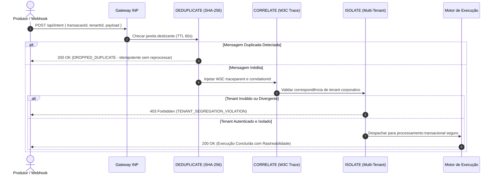

#### 2. Roteamento Progressivo de Versões (CANARY) com Fallback Estável
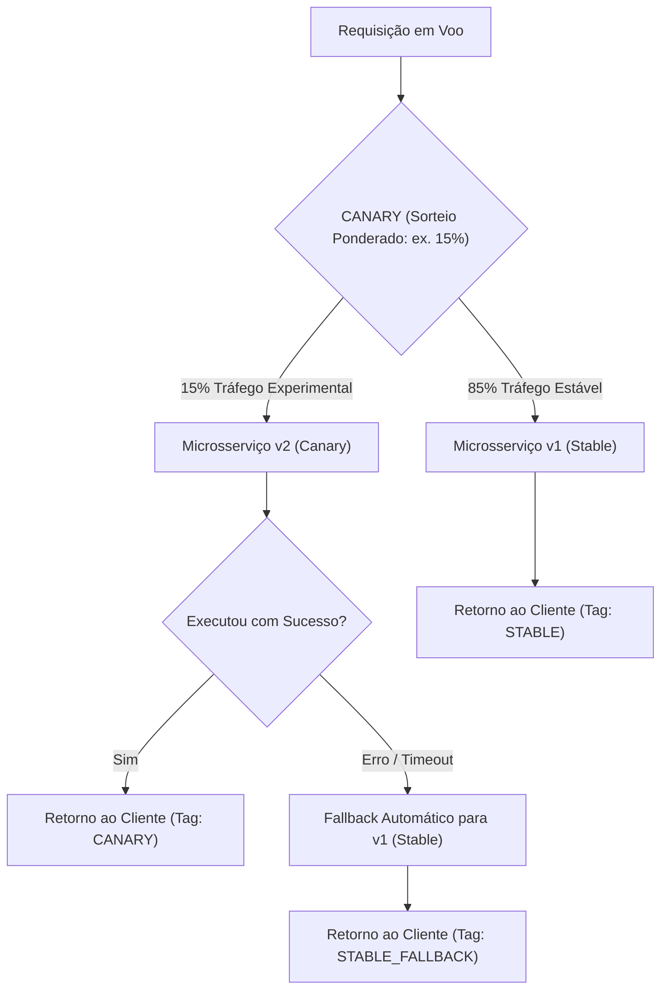

#### 3. Quarentena Pericial de Cargas Tóxicas (QUARANTINE + REDRIVE)
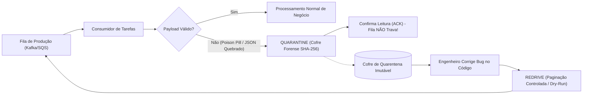

#### 4. Controle Reativo de Vazão (BACKPRESSURE + DRAIN)
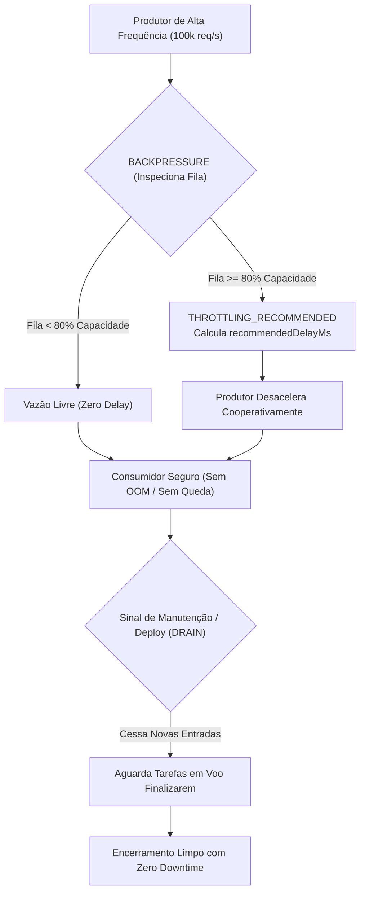

#### 5. Batimento Determinístico e Delta em O(n) (RECONCILE + DIFF)
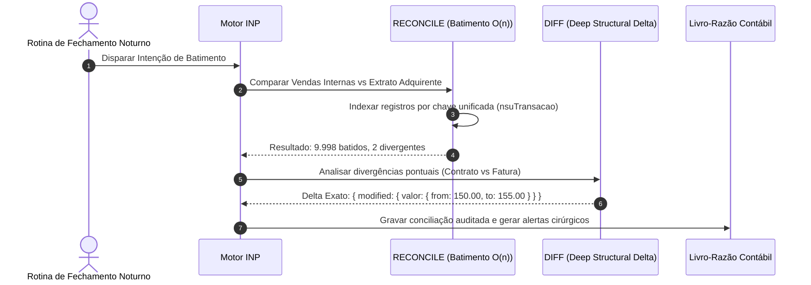

---

### 90. DEDUPLICATE
- **Definição Formal:** Filtro deslizante de deduplicação idempotente em memória e persistência, computando assinaturas SHA-256 sobre cargas úteis para expurgo imediato de mensagens redundantes.
- **Explicação Descomplicada:** É o porteiro do prédio que se lembra do rosto de quem acabou de entrar: se a mesma pessoa tentar entrar duas vezes no mesmo minuto com a mesma encomenda, o porteiro barra a segunda tentativa na hora.
- **A Dor de Cabeça que Resolve:** Mensagens duplicadas em filas (Kafka, AWS SQS, RabbitMQ) ou webhooks repetidos de operadoras de pagamento que causavam cobranças em duplicidade no cartão de crédito do cliente. Antes, o programador precisava subir clusters de Redis, escrever scripts manuais de SETNX com TTL e tratar race conditions em dezenas de linhas de código.
- **Para que serve:** Eliminar transações e eventos repetidos antes que eles toquem a lógica de negócio ou bancos de dados.
- **Como usar:**
```inp
STEP filtrarMensagem: DEDUPLICATE {
  key: "${payload.transacaoId}",
  ttlMs: 60000,
  payload: "${payload}"
}
```
- **Quando usar:** Na entrada de qualquer webhook de pagamento, consumidor de fila ou mensageria assíncrona.
- **Papel no Motor:** Intercepta a requisição em menos de 0.05ms. Se a chave já tiver sido processada dentro da janela TTL, descarta o duplicado (`DROPPED_DUPLICATE`) sem gastar recursos.

---

### 91. REDRIVE
- **Definição Formal:** Reprocessamento auditado e controlado de mensagens da Dead Letter Queue (DLQ) de volta à esteira primária com paginação e modo de simulação (*dry-run*).
- **Explicação Descomplicada:** É a sala de recuperação de correspondências extraviadas dos Correios: em vez de jogar as cartas no lixo ou reenviar tudo sem controle causando um engavetamento, o funcionário pega lotes de 10 cartas, confere o endereço e recoloca na esteira.
- **A Dor de Cabeça que Resolve:** Mensagens que falharam devido a uma oscilação momentânea e foram parar na DLQ. O desenvolvedor ou DevOps precisava abrir o console da nuvem de madrugada ou rodar scripts manuais perigosos em Python para reprocessar mensagens uma a uma, com risco constante de inundar e derrubar a aplicação.
- **Para que serve:** Recuperar mensagens com falha após a correção de instabilidades na infraestrutura de forma segura e auditada.
- **Como usar:**
```inp
STEP reprocessarErros: REDRIVE {
  queue: "pedidos-dlq",
  limit: 50,
  dryRun: false
}
```
- **Quando usar:** Em rotinas de saneamento de incidentes e reprocessamento pós-falha de serviços parceiros.
- **Papel no Motor:** Controla a taxa de injeção na fila primária, garantindo rastreabilidade forense com carimbo de tempo.

---

### 92. CANARY
- **Definição Formal:** Roteamento progressivo e percentual de tráfego entre versões estáveis e experimentais com base em distribuição estatística de peso ponderado.
- **Explicação Descomplicada:** É abrir uma nova ponte liberando a passagem para apenas 10% dos carros no primeiro dia para testar a estrutura antes de abrir para toda a cidade.
- **A Dor de Cabeça que Resolve:** O terror do deploy do tipo "tudo ou nada" (big-bang), onde um bug invisível em testes derruba 100% dos usuários no momento em que a nova versão vai ao ar. Antes, o time dependia de ferramentas caras e difíceis de configurar como Service Meshes (Istio/Envoy) ou roteadores de infraestrutura complexos.
- **Para que serve:** Testar novas funcionalidades ou versões de microsserviços em produção com uma fração controlada do tráfego real.
- **Como usar:**
```inp
STEP rotearNovaVersao: CANARY {
  weight: 15,
  stableTarget: "faturamento-v1",
  canaryTarget: "faturamento-v2",
  payload: "${requisicao}"
}
```
- **Quando usar:** Em deploys contínuos e lançamentos de novas versões de APIs críticas.
- **Papel no Motor:** Avalia o sorteio probabilístico em microssegundos e injeta a tag de versão (`CANARY` ou `STABLE`) para rastreamento no APM.

---

### 93. DIFF
- **Definição Formal:** Comparação profunda determinística entre duas estruturas de dados (*deep diff*), isolando com precisão propriedades adicionadas, modificadas e removidas.
- **Explicação Descomplicada:** É o jogo dos 7 erros automático: você coloca a foto antiga e a foto nova lado a lado e o computador destaca exatamente o que mudou, o que sumiu e o que é novo.
- **A Dor de Cabeça que Resolve:** Descobrir exatamente o que mudou no cadastro do usuário ou nos termos do contrato antes de salvar. Desenvolvedores importavam bibliotecas pesadas de deep-diff que quebravam em referências circulares ou consumiam dezenas de megabytes de RAM.
- **Para que serve:** Gerar trilhas de auditoria detalhadas de alterações, calcular deltas para sincronização de bancos e detectar mutações inesperadas.
- **Como usar:**
```inp
STEP compararEstados: DIFF {
  source: "${contratoOriginal}",
  targetData: "${contratoEditado}"
}
```
- **Quando usar:** Antes de atualizar cadastros críticos, contratos jurídicos ou dados cadastrais de alto valor.
- **Papel no Motor:** Executa comparação estrutural recursiva com detecção de tipos, devolvendo métricas precisas (`changesCount`, `added`, `modified: { from, to }`, `removed`).

---

### 94. CORRELATE
- **Definição Formal:** Injeção e propagação mandatória de identificadores unificados de rastreio distribuído aderentes à especificação W3C TraceContext (`traceId`, `spanId`, `correlationId`).
- **Explicação Descomplicada:** É colocar uma pulseira com o mesmo número de identificação na mala, no bilhete e no passageiro: não importa em qual conexão ou aeroporto a mala estiver, qualquer funcionário sabe exatamente de quem ela é.
- **A Dor de Cabeça que Resolve:** Uma requisição falhava em um ecossistema com 40 microsserviços e o desenvolvedor passava 3 dias vasculhando dezenas de painéis de logs sem saber qual linha pertencia à qual chamada.
- **Para que serve:** Amarrar todas as chamadas HTTP, mensagens de fila e queries de banco de dados sob um único identificador universal de ponta a ponta.
- **Como usar:**
```inp
STEP propagarRastreio: CORRELATE {
  correlationId: "usr_checkout_9988",
  payload: "${dadosPedido}"
}
```
- **Quando usar:** No primeiro milissegundo de entrada de qualquer fluxo de negócio no motor.
- **Papel no Motor:** Cria o cabeçalho `traceparent` (ex: `00-4bf92f3577b34da6a3ce929d0e0e4736-00f067aa0ba902b7-01`) e propaga no contexto transacional de todos os passos subsequentes.

---

### 95. ISOLATE
- **Definição Formal:** Barreira defensiva de segregação multi-tenant em nível de orquestração, impedindo cruzamento indevido de dados ou comandos entre organizações distintas.
- **Explicação Descomplicada:** É a chave do quarto de hotel: a chave da empresa A só abre o quarto da empresa A; mesmo que alguém tente enfiar a chave no quarto ao lado, ela não gira.
- **A Dor de Cabeça que Resolve:** O pesadelo corporativo e jurídico de uma empresa conseguir ver dados, notas fiscais ou pedidos de outra empresa parceira por causa de um bug de programação ou esquecimento de uma cláusula de filtro no banco de dados.
- **Para que serve:** Blindar aplicações SaaS corporativas contra vazamento de informações entre concorrentes.
- **Como usar:**
```inp
STEP segregarTenant: ISOLATE {
  tenantId: "${context.empresaId}",
  payload: "${solicitacao}"
}
```
- **Quando usar:** Em todos os sistemas compartilhados por múltiplos clientes corporativos.
- **Papel no Motor:** Compara o `tenantId` da carga útil contra as credenciais seguras autenticadas. Se houver discrepância, aborta a execução instantaneamente com violação de isolamento multi-tenant.

---

### 96. ANONYMIZE
- **Definição Formal:** Anonimização determinística irreversível de identificadores pessoais (PII) através de funções hash criptográficas HMAC-SHA256 alimentadas por sal corporativo.
- **Explicação Descomplicada:** É passar os documentos pessoais por uma máquina que troca o seu nome e CPF por um código secreto matemático: a empresa ainda consegue saber que o cliente 1 comprou 3 produtos, mas ninguém sabe quem é a pessoa de verdade.
- **A Dor de Cabeça que Resolve:** Riscos de multas milionárias da LGPD (Brasil) ou GDPR (Europa) por vazamento de CPFs, e-mails ou nomes reais em logs, relatórios de marketing ou bases de dados de testes de desenvolvimento.
- **Para que serve:** Sanitizar dados de produção antes de enviar para ferramentas analíticas, treinar modelos de inteligência artificial ou exportar relatórios.
- **Como usar:**
```inp
STEP anonimizarDados: ANONYMIZE {
  fields: ["email", "cpf", "telefone", "nomeCompleto"],
  salt: "segredo_master_compliance",
  payload: "${clienteCompleto}"
}
```
- **Quando usar:** Antes de qualquer gravação de telemetria externa, analytics ou compartilhamento com parceiros comerciais.
- **Papel no Motor:** Substitui valores confidenciais por hashes prefixados (ex: `anon_4a8b1c2e3f4d`), garantindo consistência estatística sem reversibilidade dos dados sensíveis.

---

### 97. DRAIN
- **Definição Formal:** Encerramento gracioso de canais de execução e servidores (*graceful shutdown*), cessando a aceitação de novas tarefas e aguardando a finalização dos processos em voo.
- **Explicação Descomplicada:** É o restaurante fechando a cozinha no fim da noite: o garçom não aceita novos clientes que chegam à porta, mas espera calmamente que os clientes que já estão sentados terminem de comer sua sobremesa antes de apagar as luzes.
- **A Dor de Cabeça que Resolve:** Atualizações de versão (deploys) e reinicializações de servidores que cortavam abruptamente conexões no meio de um pagamento bancário, gerando erros 502 Bad Gateway e deixando pedidos com status inconsistente.
- **Para que serve:** Permitir manutenção e deploys de infraestrutura com zero tempo de inatividade (*Zero Downtime*) e zero conexões derrubadas à força.
- **Como usar:**
```inp
STEP drenarServico: DRAIN {
  timeoutMs: 10000,
  target: "servico-pedidos"
}
```
- **Quando usar:** Em scripts de desligamento, sinais SIGTERM do Kubernetes ou rotinas de manutenção programada.
- **Papel no Motor:** Altera o status do nó para não-receptivo e coordena a contagem de tarefas ativas até a drenagem total.

---

### 98. QUARANTINE
- **Definição Formal:** Isolamento pericial de cargas úteis corrompidas ou maliciosas (*Poison Pills*) em sandbox forense imutável, prevenindo a paralisação em loop dos nós de consumo.
- **Explicação Descomplicada:** É a quarentena médica do hospital: se alguém chega com uma suspeita de vírus altamente contagioso, a pessoa é colocada imediatamente em uma sala de isolamento para não infectar os outros pacientes do pronto-socorro.
- **A Dor de Cabeça que Resolve:** Uma mensagem com formato quebrado ou JSON malformado entrava na fila do Kafka/RabbitMQ; o consumidor tentava ler, crashava, a mensagem voltava para a fila, o consumidor tentava de novo e crashava de novo, travando toda a empresa em um loop infinito (*Poison Pill*).
- **Para que serve:** Salvar mensagens problemáticas em um cofre seguro para inspeção posterior dos engenheiros sem permitir que a fila de produção fique travada.
- **Como usar:**
```inp
STEP isolarPayloadToxico: QUARANTINE {
  reason: "MALFORMED_JSON_STRUCTURE",
  payload: "${mensagemToxica}"
}
```
- **Quando usar:** Em blocos de contingência de erro (`catch`) ao consumir mensagens de fontes externas imprevisíveis.
- **Papel no Motor:** Gera um `quarantineId` exclusivo, computa o hash forense SHA-256 do payload, armazena no cofre de quarentena e autoriza o fluxo da fila a prosseguir normalmente.

---

### 99. LEASE
- **Definição Formal:** Aquisição de direito exclusivo de processamento com renovação ativa periódica (*heartbeat lease*), prevenindo a formação de processos zumbis e deadlocks perpétuos.
- **Explicação Descomplicada:** É o aluguel de uma vaga com cronômetro: enquanto você estiver renovando a cada 30 minutos, a vaga é sua; se o seu celular descarregar e você sumir, o estacionamento libera a vaga para outro motorista.
- **A Dor de Cabeça que Resolve:** Travamentos permanentes em bancos de dados distribuídos quando um servidor travava uma linha importante (`LOCK`) e morria subitamente antes de liberar o trinco, travando todos os outros servidores para sempre.
- **Para que serve:** Gerenciar a liderança de tarefas agendadas (Cron jobs) ou processamento de arquivos exclusivos onde apenas uma máquina pode trabalhar por vez.
- **Como usar:**
```inp
STEP renovarContratoExclusivo: LEASE {
  resource: "fechamento-contabil-diario",
  ttlMs: 45000
}
```
- **Quando usar:** Em arquiteturas distribuídas onde múltiplas instâncias concorrem pela execução de tarefas únicas.
- **Papel no Motor:** Associa um token criptográfico ao recurso com tempo de expiração estrito, renovável enquanto a tarefa emitir sinal de vivacidade.

---

### 100. BACKPRESSURE
- **Definição Formal:** Mecanismo reativo de controle de vazão baseado na profundidade e saturação de filas, calculando e emitindo atrasos proporcionais de recuo para os produtores de dados.
- **Explicação Descomplicada:** É o semáforo na saída do estacionamento: se a avenida lá fora estiver com engarrafamento pesado, a cancela do estacionamento abre mais devagar para que os carros não batam uns nos outros.
- **A Dor de Cabeça que Resolve:** Um servidor rápido gerava 100.000 requisições por segundo para um servidor mais lento; o servidor lento acumulava tudo na memória RAM até estourar a memória (falha de Out-Of-Memory / OOM) e morrer.
- **Para que serve:** Equilibrar a velocidade entre sistemas produtores e consumidores de forma cooperativa.
- **Como usar:**
```inp
STEP checarSaturacaoFila: BACKPRESSURE {
  currentQueueDepth: "${fila.mensagensPendentes}",
  maxCapacity: 5000
}
```
- **Quando usar:** Em pipelines de streaming, processamento de telemetria e integrações assíncronas de alto volume.
- **Papel no Motor:** Calcula a utilização percentual da capacidade. Se a taxa ultrapassar 80%, calcula o recuo ideal (`recommendedDelayMs`) e sinaliza `THROTTLING_RECOMMENDED`.

---

### 101. MIGRATE
- **Definição Formal:** Transformação declarativa e adaptação bidirecional de schemas de dados on-the-fly, viabilizando interoperabilidade transparente entre versões legadas e modernas de APIs.
- **Explicação Descomplicada:** É um adaptador de tomada internacional: o seu aparelho tem o plugue antigo de dois pinos e a parede tem a tomada nova de três pinos; o adaptador faz o encaixe perfeito sem você precisar quebrar a parede.
- **A Dor de Cabeça que Resolve:** Lançar uma versão nova da API e ser forçado a manter servidores antigos no ar por anos porque clientes de aplicativos móveis antigos se recusam a atualizar o aplicativo no celular.
- **Para que serve:** Converter automaticamente dados enviados em esquemas antigos (`v1`) para a estrutura moderna exigida pela versão atual (`v2`) em milissegundos.
- **Como usar:**
```inp
STEP evoluirVersaoPayload: MIGRATE {
  fromVersion: "v1",
  toVersion: "v2",
  transformations: {
    "num_doc": "documentoIdentidade",
    "cod_cli": "clienteId"
  },
  payload: "${payloadRecebido}"
}
```
- **Quando usar:** Em processos de modernização de APIs e transição gradual de versões sem quebra de retrocompatibilidade.
- **Papel no Motor:** Aplica o mapeamento de dicionário em memória sem cópias redundantes de bytes, atualizando os metadados de versão.

---

### 102. SAMPLE
- **Definição Formal:** Filtragem estatística adaptativa de dados de telemetria, retendo 100% dos eventos com erro e amostrando percentualmente fluxos rotineiros de sucesso.
- **Explicação Descomplicada:** É o inspetor de controle de qualidade na fábrica de parafusos: ele examina 5 parafusos a cada 100 que passam; mas se algum parafuso sair torto, ele confere todos os parafusos daquele lote na hora.
- **A Dor de Cabeça que Resolve:** Faturas astronômicas de serviços de observabilidade e monitoramento (Datadog, Splunk, Dynatrace) que cobram por gigabyte de log, onde 99.9% dos dados eram apenas mensagens repetitivas de "OK" que ninguém lia.
- **Para que serve:** Reduzir em até 95% os custos com servidores de logs sem perder nenhum detalhe importante sobre erros ou falhas.
- **Como usar:**
```inp
STEP filtrarLogsTelemetria: SAMPLE {
  sampleRate: 0.05,
  error: "${context.hasError}",
  payload: "${metricasCompletas}"
}
```
- **Quando usar:** Ao gravar traces de APM, auditoria de rotas públicas de alta frequência e métricas de desempenho.
- **Papel no Motor:** Se houver indicação de falha (`error: true`), a retenção é forçada (`forceRetained: true`); caso contrário, aplica o filtro probabilístico em memória.

---

### 103. RECONCILE
- **Definição Formal:** Batimento determinístico bidirecional entre duas fontes independentes de registros, isolando com precisão concordâncias, omissões e discrepâncias de atributos.
- **Explicação Descomplicada:** É a conferência do extrato do banco com o bloquinho de anotações de compras: você marca o que bateu nos dois, anota o que você esqueceu de registrar e destaca cobranças que o banco fez a mais.
- **A Dor de Cabeça que Resolve:** Horas perdidas por contadores e desenvolvedores rodando scripts complexos em SQL para tentar descobrir por que o saldo do banco não bate com as vendas registradas na loja virtual no fim do mês.
- **Para que serve:** Conciliação bancária automática, conferência de estoques físicos contra sistemas e auditoria contábil.
- **Como usar:**
```inp
STEP baterExtratoBancario: RECONCILE {
  sourceA: "${vendasInternas}",
  sourceB: "${extratoAdquirente}",
  matchKey: "nsuTransacao"
}
```
- **Quando usar:** Em fechamentos diários financeiros, conciliações de pagamento e auditorias de consistência eventual.
- **Papel no Motor:** Cruza coleções em $O(n)$ usando mapas de memória rápidos, retornando métricas consolidadas (`isBalanced`, `discrepanciesCount`, `missingInACount`, `missingInBCount`).

---

### 104. CHALLENGE
- **Definição Formal:** Desencadeamento declarativo de mecanismos de desafio de segurança (*Step-Up Authentication*, MFA, CAPTCHA ou Proof-of-Work) sob suspeita de anomalia comportamental.
- **Explicação Descomplicada:** É o guarda do banco pedindo para você colocar a digital no leitor biométrico quando você tenta fazer uma transferência muito maior do que o seu costume.
- **A Dor de Cabeça que Resolve:** Ter que reprogramar todo o fluxo de checkout quando a área de segurança exige a inclusão de um SMS de confirmação ou checagem biométrica para compras de alto valor.
- **Para que serve:** Proteger operações financeiras e trocas de senhas contra ataques automatizados de bots e sequestro de contas.
- **Como usar:**
```inp
STEP exigirAutenticacaoExtra: CHALLENGE {
  type: "MFA_BIOMETRIC_PUSH",
  target: "auth-security-service"
}
```
- **Quando usar:** Em transferências bancárias suspeitas, login a partir de novo dispositivo ou alterações de dados cadastrais sensíveis.
- **Papel no Motor:** Gera um token criptográfico de desafio com tempo de vida limitado (TTL de 5 minutos) e suspende a transação até a resolução bem-sucedida do desafio pelo usuário.

---

### 105. MUTEX
- **Definição Formal:** Exclusão mútua local estrita com fila de espera FIFO e garantia de liberação temporizada, protegendo seções críticas de código contra corrupção concorrente de estado.
- **Explicação Descomplicada:** É a cabine de votação com uma pessoa por vez: você entra, a porta trava; enquanto você estiver votando, ninguém mais pode entrar na cabine; quando você termina, a próxima pessoa da fila é chamada.
- **A Dor de Cabeça que Resolve:** Duas requisições simultâneas tentando alterar a mesma variável de memória, gerar o mesmo número sequencial de nota fiscal ou gravar no mesmo arquivo local ao mesmo tempo, corrompendo os dados do sistema.
- **Para que serve:** Proteger seções críticas locais em nós de computação sem a sobrecarga de consultar bancos de dados remotos.
- **Como usar:**
```inp
STEP travarSecaoCritica: MUTEX {
  key: "sequencial-nota-fiscal",
  timeoutMs: 3000
}
```
- **Quando usar:** Sempre que múltiplos passos concorrentes disputarem uma memória, buffer ou arquivo comum no mesmo nó.
- **Papel no Motor:** Concede o trinco em microssegundos (`mutexAcquired: true`) associado a uma chave semântica com liberação automática em caso de timeout.

---

## 5.7 Os 15 Verbos de Interconexão entre Sistemas e Desmembramento Descomplicado

A sétima família do catálogo de verbos do INP Protocol foi concebida para atender a um clamor unânime dos engenheiros de software modernos: **descomplicar a conexão entre sistemas heterogêneos e eliminar a ginástica mental ao manipular estruturas de dados complexas**.

Quantas vezes você já precisou:
- Integrar um sistema bancário legado em SOAP/XML com uma API moderna em JSON/REST e teve que escrever dezenas de classes de DTO e conversores manuais?
- Receber um webhook de pagamento e passar horas implementando validação criptográfica de assinatura HMAC com chave secreta?
- Disparar requisições externas com retry, backoff e disjuntor sem encher seu código de bibliotecas pesadas e interceptores Axios?
- Extrair apenas um campo (como o ID ou e-mail) de uma lista com centenas de objetos e teve que escrever loops ou funções `map` complexas?
- Mascarar números de cartão de crédito ou CPFs para exibição em tela sem precisar de algoritmos criptográficos pesados?
- Pausar uma esteira assíncrona por alguns milissegundos sem bloquear threads do Node.js/Go?
- Reverter imediatamente um único passo transacional sem ter que desenhar uma arquitetura de Saga completa?

Os 15 verbos abaixo transformam essas operações árduas em instruções atômicas de uma única linha.

### Diagramas Arquiteturais da Família de Interconexão e Ergonomia

#### 1. Conectividade & Interoperabilidade Universal (BRIDGE, OUTBOUND & INGEST)


#### 2. Ergonomia e Desmembramento Descomplicado de Dados (PLUCK, FLATTEN, MASK, CAST & CLAMP)
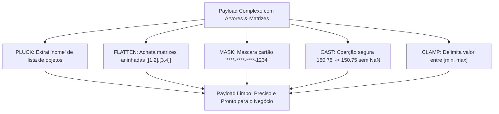

#### 3. Orquestração Assíncrona e Controle Operacional Leve (FANIN, EMIT, COOLDOWN, DIVERGE, HEARTBEAT, SNAPSHOT & UNDO)
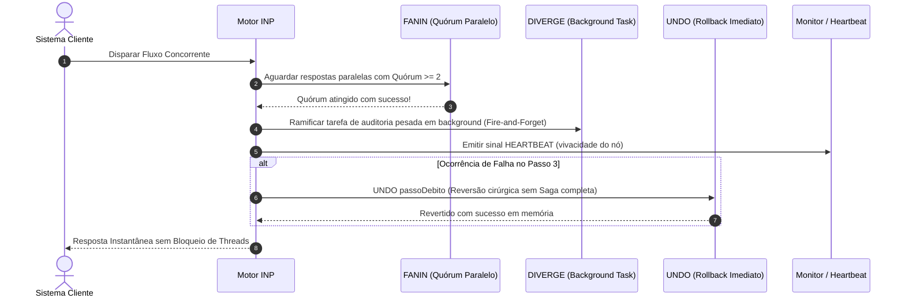

---

### 106. BRIDGE
- **Definição Formal:** Adaptador declarativo universal de protocolos de rede e formatos estruturais de dados (SOAP <-> REST, XML <-> JSON, Protobuf <-> DTO) com remapeamento transparente de propriedades.
- **Explicação Descomplicada:** É o tradutor simultâneo da ONU: o diplomata da França fala em francês e o fone de ouvido do diplomata do Japão traduz na hora para japonês; os dois conversam sem perceber que falam línguas diferentes.
- **A Dor de Cabeça que Resolve:** Conectar sistemas modernos a sistemas legados antigos (Mainframes bancários, serviços SOAP/XML governamentais). Antes, os desenvolvedores passavam dias escrevendo conversores de XML para JSON, tratando namespaces, montando envelopes SOAP e lidando com quebras de parsing.
- **Para que serve:** Fazer a ponte de comunicação entre formatos distintos de integração e renomear campos de dicionários legados em uma única declaração.
- **Como usar:**
```inp
STEP adaptarProtocolo: BRIDGE {
  fromProtocol: "SOAP_XML",
  toProtocol: "JSON_REST",
  data: "${payloadLegado}",
  mapping: {
    "cod_cli_banco": "clienteId",
    "val_trans": "valor"
  }
}
```
- **Quando usar:** Na fronteira de comunicação entre sistemas heterogêneos que utilizam diferentes formatos de serialização de dados.
- **Papel no Motor:** Processa a conversão e o mapeamento de dicionário em memória sem cópias redundantes de bytes, entregando o objeto pronto para o restante do fluxo.

---

### 107. OUTBOUND
- **Definição Formal:** Disparo declarativo de requisições síncronas ou assíncronas para APIs HTTP/REST externas com tolerância a falhas, retentativas exponenciais, controle de timeout e disjuntor de proteção embutidos.
- **Explicação Descomplicada:** É o motoboy de entrega blindado: ele leva a correspondência até o endereço externo, espera a confirmação de recebimento e, se o portão estiver fechado, tenta de novo de forma inteligente sem desistir na primeira tentativa.
- **A Dor de Cabeça que Resolve:** Ter que importar bibliotecas de HTTP (Axios, Fetch, Got), criar instâncias de conexão, configurar interceptores de autenticação, implementar lógica manual de retry com `setTimeout` e envolver tudo em blocos `try/catch` de 50 linhas de código.
- **Para que serve:** Chamar qualquer API externa ou webhook parceiro com uma única linha declarativa, garantindo resiliência total de rede.
- **Como usar:**
```inp
STEP chamarGatewayExterno: OUTBOUND {
  url: "https://api.pagamentos.com/v2/cobrancas",
  method: "POST",
  body: { "valor": 250.00, "cliente": "${payload.clienteId}" },
  timeoutMs: 5000,
  maxRetries: 3
}
```
- **Quando usar:** Sempre que a sua intenção precisar consultar ou enviar dados para um serviço terceiro fora da sua infraestrutura.
- **Papel no Motor:** Utiliza sockets com Keep-Alive reutilizáveis, mede a latência de trânsito e intercepta falhas de rede antes que elas propaguem exceções não tratadas.

---

### 108. INGEST
- **Definição Formal:** Recepção e validação pericial de webhooks externos com verificação determinística de assinatura criptográfica HMAC e normalização de cabeçalhos de fornecedores.
- **Explicação Descomplicada:** É o segurança da portaria que confere o carimbo e a assinatura oficial do oficial de justiça antes de autorizar a entrega da notificação.
- **A Dor de Cabeça que Resolve:** Validar webhooks de plataformas de pagamento (Stripe, Mercado Pago, PayPal, GitHub). Desenvolvedores frequentemente esqueciam de validar assinaturas HMAC ou cometiam erros ao converter o payload bruto em buffers para cálculo do hash, abrindo brechas para falsificação de pagamentos por atacantes.
- **Para que serve:** Ingerir eventos externos garantindo matematicamente que foram emitidos pelo provedor legítimo e não por um fraudador.
- **Como usar:**
```inp
STEP receberWebhook: INGEST {
  provider: "STRIPE",
  signature: "${header.stripe-signature}",
  payload: "${rawBody}"
}
```
- **Quando usar:** No ponto de entrada de qualquer endpoint de recebimento de webhooks e notificações assíncronas.
- **Papel no Motor:** Valida o segredo compartilhado e a assinatura criptográfica em microssegundos (`signatureVerified: true`) e entrega a carga pronta para processamento.

---

### 109. FANIN
- **Definição Formal:** Agregação e sincronização convergente de múltiplos fluxos ou tarefas paralelas com política declarativa de quórum mínimo e resolução de estado unificado.
- **Explicação Descomplicada:** É a mesa redonda de diretores que só inicia a votação quando pelo menos 3 dos 5 diretores tiverem chegado na sala.
- **A Dor de Cabeça que Resolve:** Esperar o resultado de chamadas concorrentes onde você não precisa de 100% das respostas, mas sim de uma maioria (quórum) para tomar uma decisão. Antes, programadores tinham que gerenciar arrays de `Promise.allSettled`, contadores concorrentes e cancelamentos manuais de promessas excedentes.
- **Para que serve:** Unificar os resultados de buscas paralelas (ex: cotações em 4 seguradoras diferentes) e continuar o fluxo assim que o quórum mínimo for atingido.
- **Como usar:**
```inp
STEP agregarCotacoes: FANIN {
  results: ["${cotacaoA}", "${cotacaoB}", "${cotacaoC}"],
  quorum: 2
}
```
- **Quando usar:** Após execuções paralelas (`PARALLEL` ou `FANOUT`) onde a consolidação exige quórum mínimo de respostas bem-sucedidas.
- **Papel no Motor:** Consolida a coleção em memória (`combined`), valida a meta (`quorumReached: true`) e prossegue sem retenção indevida de threads.

---

### 110. EMIT
- **Definição Formal:** Publicação assíncrona ultra-leve de eventos de domínio em canais locais ou barramentos de mensageria sem retenção de pilha de chamadas (*fire-and-forget*).
- **Explicação Descomplicada:** É acender a luz do sinalizador de emergência: você aperta o botão e segue sua vida normalmente; o sinalizador continuará piscando para avisar quem estiver olhando.
- **A Dor de Cabeça que Resolve:** A lentidão gerada quando uma requisição precisa avisar vários subsistemas (analítica, e-mail, CRM) e o desenvolvedor faz todas as chamadas síncronas, fazendo o usuário esperar 5 segundos na tela de confirmação de compra.
- **Para que serve:** Notificar eventos de negócio para canais internos e consumidores desacoplados sem aumentar o tempo de resposta da transação principal.
- **Como usar:**
```inp
STEP emitirEventoVenda: EMIT {
  event: "PEDIDO_PAGO",
  channel: "vendas",
  payload: { "pedidoId": "${payload.id}", "total": 199.90 }
}
```
- **Quando usar:** Para qualquer notificação periférica que não impacte o sucesso imediato da transação do cliente.
- **Papel no Motor:** Gera um `eventId` único com carimbo UTC e despacha a notificação de forma não-bloqueante em microssegundos.

---

### 111. PLUCK
- **Definição Formal:** Extração cirúrgica de atributos específicos a partir de coleções ou objetos aninhados, dispensando transformadores ou funções lambda complexas.
- **Explicação Descomplicada:** É usar uma pinça de precisão para tirar apenas a azeitona do meio da salada mista: você não precisa remexer a tigela inteira para pegar exatamente o que quer.
- **Para que serve:** Obter uma lista de IDs de clientes a partir de uma lista de pedidos completa sem precisar escrever loops `for` ou blocos `MAP`.
- **A Dor de Cabeça que Resolve:** Ter que escrever expressões complexas ou verbos `MAP` inteiros apenas para extrair um único campo de uma coleção de itens retornada pelo banco de dados.
- **Como usar:**
```inp
STEP extrairEmails: PLUCK {
  from: "${consultarClientes.usuarios}",
  field: "email"
}
```
- **Quando usar:** Sempre que você tiver uma lista de objetos e precisar apenas de uma propriedade de cada um deles.
- **Papel no Motor:** Itera a coleção em memória e projeta o array escalar de destino de forma ultrarrápida.

---

### 112. FLATTEN
- **Definição Formal:** Aplainamento determinístico de matrizes multidimensionais e árvores aninhadas em uma lista linear única de profundidade controlada.
- **Explicação Descomplicada:** É desdobrar uma caixa de papelão que estava guardada dentro de outra caixa para que todas fiquem empilhadas retas no chão.
- **A Dor de Cabeça que Resolve:** Tratar respostas de microsserviços que retornam listas de listas (ex: lotes de itens por filial `[[item1, item2], [item3]]`) antes de poder iterar ou filtrar os elementos.
- **Para que serve:** Transformar matrizes aninhadas em um array unidimensional simples e plano com profundidade configurável.
- **Como usar:**
```inp
STEP linearizarItens: FLATTEN {
  items: "${pedidosFiliais.lotes}",
  depth: 1
}
```
- **Quando usar:** Antes de passar coleções agrupadas para filtros (`FILTER`), ordenações ou envio em lote.
- **Papel no Motor:** Utiliza operações nativas de achatamento de listas em memória com validação de profundidade de recursão.

---

### 113. MASK
- **Definição Formal:** Mascaramento visual imediato de dados confidenciais (números de cartão de crédito, e-mails, documentos de identidade) para proteção de privacidade na camada de apresentação.
- **Explicação Descomplicada:** É o visor do caixa eletrônico mostrando o número do seu cartão como `**** **** **** 1234`: você reconhece que é o seu cartão, mas a pessoa na fila atrás de você não consegue copiar os números.
- **A Dor de Cabeça que Resolve:** O risco constante de desenvolvedores exibirem números completos de cartões ou CPFs em telas de confirmação ou logs acidentais, violando normas de segurança do PCI-DSS e da LGPD.
- **Para que serve:** Ofuscar dados sensíveis de forma padronizada mantendo apenas os dígitos finais para identificação do cliente.
- **Como usar:**
```inp
STEP mascararCartao: MASK {
  value: "${cobranca.cartao}",
  type: "CREDIT_CARD"
}
```
- **Quando usar:** Antes de retornar dados de cartão, e-mail ou documento na resposta visual enviada para o aplicativo ou navegador.
- **Papel no Motor:** Reconhece padrões semânticos (`CREDIT_CARD`, `EMAIL`, `DOCUMENT`) e aplica a máscara protetora instantaneamente em memória.

---

### 114. CAST
- **Definição Formal:** Coerção determinística e segura de tipos primitivos (string para inteiro, decimal, booleano ou ISO Date) com definição de valor padrão e prevenção estrita de exceções de runtime (*zero-exceptions*).
- **Explicação Descomplicada:** É a forma de bolo: se a massa vier em formato líquido, quadrado ou redondo, ela é acomodada exatamente no formato padrão da forma sem quebrar a receita.
- **A Dor de Cabeça que Resolve:** Parâmetros recebidos de formulários web ou query strings que vêm como texto (`"150.50"` ou `"true"`), quebrando operações matemáticas e comparações booleanas com o temido erro `NaN` ou `undefined`.
- **Para que serve:** Converter tipos de dados de forma infalível, garantindo que o valor final seja sempre do tipo desejado ou assuma um valor padrão seguro.
- **Como usar:**
```inp
STEP converterPreco: CAST {
  value: "${payload.precoTexto}",
  targetType: "decimal",
  default: 0.00
}
```
- **Quando usar:** Logo após a recepção de parâmetros de URLs, query strings ou arquivos CSV.
- **Papel no Motor:** Avalia a entrada com proteções anti-exceção, devolvendo o tipo primitivo nativo sem jamais derrubar a esteira.

---

### 115. CLAMP
- **Definição Formal:** Travamento delimitador de grandezas numéricas dentro de um intervalo fechado estrito $[min, max]$, prevenindo transbordamento de valores ou estouro de limites autorizados.
- **Explicação Descomplicada:** É o limitador de velocidade do elevador: mesmo que alguém tente apertar todos os botões, o elevador não desce mais rápido que o mínimo seguro nem sobe além do limite do teto.
- **A Dor de Cabeça que Resolve:** Bugs onde usuários inseriam descontos de 150% ou quantidades negativas no carrinho de compras, gerando prejuízos financeiros ou faturas com valores negativos.
- **Para que serve:** Garantir que um número fique sempre preso entre o valor mínimo e o máximo estipulados pela regra de negócio.
- **Como usar:**
```inp
STEP limitarDesconto: CLAMP {
  value: "${calculo.descontoAplicado}",
  min: 0,
  max: 20
}
```
- **Quando usar:** Em regras de concessão de descontos, limites de crédito, paginações (`limit` entre 1 e 100) e scores de avaliação.
- **Papel no Motor:** Executa a comparação matemática $Math.min(Math.max(val, min), max)$ em microssegundos de forma imutável.

---

### 116. COOLDOWN
- **Definição Formal:** Pausa cooperativa não-bloqueante na esteira de execução com respeito aos sinais de cancelamento (*AbortController*), viabilizando desacelerações táticas e contenção de rate limits de terceiros.
- **Explicação Descomplicada:** É o descanso programado do atleta entre duas séries de exercícios pesados: alguns segundos de respiro para que os músculos não sofram uma lesão por esforço contínuo.
- **A Dor de Cabeça que Resolve:** Ser bloqueado por APIs de terceiros que impõem limites rígidos de requisições por segundo (ex: 5 req/s). Antes, desenvolvedores usavam `sleep` síncronos que travavam a thread inteira do servidor ou criavam timers descontrolados que não cancelavam em caso de timeout.
- **Para que serve:** Inserir pausas seguras entre passos consecutivos para respeitar limites de velocidade ou aguardar estabilização de hardware externo.
- **Como usar:**
```inp
STEP pausaEstrategica: COOLDOWN {
  durationMs: 250
}
```
- **Quando usar:** Em integrações com serviços de terceiros que exigem compasso cadenciado de chamadas.
- **Papel no Motor:** Utiliza temporizadores cooperativos não-bloqueantes com teto máximo de segurança (10.000ms), liberando a CPU para outras tarefas durante o intervalo.

---

### 117. UNDO
- **Definição Formal:** Reversão atômica imediata de um passo transacional específico anterior na memória sem a complexidade de desenhar uma Saga completa com compensações distribuídas.
- **Explicação Descomplicada:** É apertar `Ctrl + Z` no editor de texto: você desfaz exatamente a última palavra que digitou sem precisar fechar o arquivo nem reinstalar o aplicativo.
- **A Dor de Cabeça que Resolve:** Ter que implementar toda a máquina de estados de uma Saga completa apenas para desfazer um débito simples que ocorreu no passo imediatamente anterior.
- **Para que serve:** Reverter uma mutação pontual rapidamente de forma limpa e auditada quando uma checagem simples falha logo em seguida.
- **Como usar:**
```inp
STEP reverterDebito: UNDO {
  stepId: "passoDebitarSaldo",
  action: "estornarSaldoLocal"
}
```
- **Quando usar:** Em fluxos lineares onde apenas um passo específico precisa ser desfeito pontualmente sem abortar a intenção inteira.
- **Papel no Motor:** Localiza o histórico do passo referenciado e dispara a rotina de reversão marcada (`REVERTED_SUCCESSFULLY`).

---

### 118. SNAPSHOT
- **Definição Formal:** Captura fotográfica instantânea do estado transacional completo em memória com computação de hash forense SHA-256 para fins de auditoria, diagnóstico ou capacidade de reprodução (*replay*).
- **Explicação Descomplicada:** É tirar uma foto em alta definição da cena antes de começar a reforma da casa: se alguém tiver dúvida de como estava a parede antes, a foto prova o estado exato daquele momento.
- **A Dor de Cabeça que Resolve:** Tentar depurar um erro intermitente em produção e não saber qual era o valor exato das variáveis no momento intermediário da transação.
- **Para que serve:** Registrar o estado completo dos dados em um ponto crucial do fluxo para auditorias futuras ou depuração forense.
- **Como usar:**
```inp
STEP registrarFotoEstado: SNAPSHOT {
  label: "pre_liquidacao_financeira",
  metadata: { "cliente": "${payload.clienteId}", "saldoMomento": "${conta.saldo}" }
}
```
- **Quando usar:** Imediatamente antes de passos de alto impacto patrimonial (como liquidações financeiras ou exclusões em massa).
- **Papel no Motor:** Gera um `snapshotId` único, calcula o hash criptográfico do estado e mantém a cópia imutável acessível para telemetria.

---

### 119. DIVERGE
- **Definição Formal:** Bifurcação assíncrona desacoplada da linha principal de execução (*fire-and-forget sub-pipeline*), permitindo o processamento de tarefas periféricas sem atrasar a resposta ao cliente.
- **Explicação Descomplicada:** É pedir para o assistente ir ao correio postar a encomenda enquanto você continua a reunião de negócios na sala de conferência: você não precisa parar a reunião para a encomenda ser entregue.
- **A Dor de Cabeça que Resolve:** O usuário ficar esperando na tela do navegador enquanto o servidor executa tarefas lentas que não afetam a aprovação da compra (como gerar miniaturas de fotos, calcular pontuações de fidelidade ou enviar relatórios para o data lake).
- **Para que serve:** Disparar tarefas secundárias em segundo plano e responder imediatamente ao usuário que a operação principal foi um sucesso.
- **Como usar:**
```inp
STEP despacharAuditoriaAssincrona: DIVERGE {
  task: "atualizarScoreFidelidade",
  payload: { "clienteId": "${payload.clienteId}", "pontos": 50 }
}
```
- **Quando usar:** Para tarefas que podem ser concluídas alguns segundos após o término da intenção sem prejudicar o usuário principal.
- **Papel no Motor:** Registra uma tarefa em segundo plano (`backgroundTaskId`) com monitoramento assíncrono e libera a esteira central instantaneamente.

---

### 120. HEARTBEAT
- **Definição Formal:** Emissão declarativa de pulsos de vivacidade e progresso intermediário para orquestradores externos, evitando o desarme prematuro de disjuntores ou timeouts falsos em processos demorados.
- **Explicação Descomplicada:** É o mergulhador submarino puxando a corda guia a cada minuto para avisar a equipe do barco de que ele está bem lá embaixo e continuando a missão.
- **A Dor de Cabeça que Resolve:** Processar um arquivo pesado de 5GB que demora 3 minutos e o orquestrador (Kubernetes, AWS Lambda, Gateway) achar que o servidor travou e cortar a conexão com erro 504 Gateway Timeout.
- **Para que serve:** Avisar a gateways e orquestradores de que um processo longo está progredindo ativamente e que a conexão não deve ser derrubada.
- **Como usar:**
```inp
STEP emitirSinalVivacidade: HEARTBEAT {
  status: "PROCESSANDO_REGISTROS_BLOCO_4"
}
```
- **Quando usar:** No meio de laços de repetição ou etapas de processamento intensivo que durem mais de 2 segundos.
- **Papel no Motor:** Emite um ping leve (`pingId`) atualizando o registro de vivacidade no monitor de telemetria em tempo real.

---


## 5.8 Os 8 Verbos de Viagem no Tempo, Diagnóstico Forense e Telemetria em Tempo Real

A oitava família do catálogo monumental do INP Protocol consolida os pilares de **auditabilidade forense, causalidade temporal, simulação preditiva e observabilidade no hot-path**. 

Em sistemas de missão crítica (como instituições financeiras de alta frequência, gateways de pagamentos e plataformas governamentais), não basta apenas executar tarefas com velocidade: é mandatório saber exatamente o que aconteceu em cada microssegundo, ter a capacidade de reconstituir qualquer estado histórico (*Point-in-Time Recovery*), reproduzir cenários hipotéticos (*What-If Replay*) sem riscos de produção, e reverter falhas parciais em ordem reversa LIFO determinística.

Esta família entrega a verdadeira **Máquina do Tempo do Motor**, permitindo que o desenvolvedor e o auditor pericial naveguem pelo passado, presente e futuros alternativos de uma intenção com integridade matemática garantida por cadeias Merkle à prova de adulteração (*tamper-evident*).

### Diagramas Arquiteturais da Família de Viagem no Tempo e Telemetria Forense

#### 1. A Máquina do Tempo e Reconstituição Histórica (TIME_TRAVEL, REPLAY & TIMELINE)
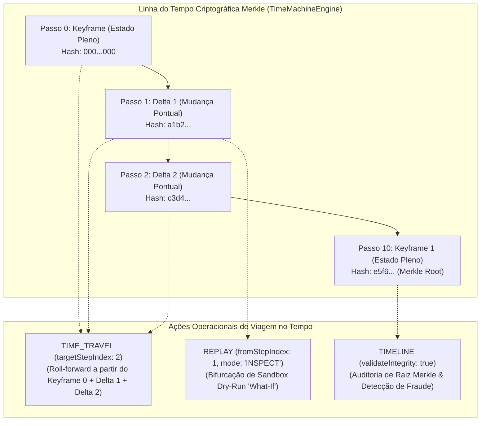

#### 2. Resiliência Transacional, Filas e Observabilidade (COMPENSATE, BENCHMARK, NORMALIZE, ENQUEUE & INSPECT)
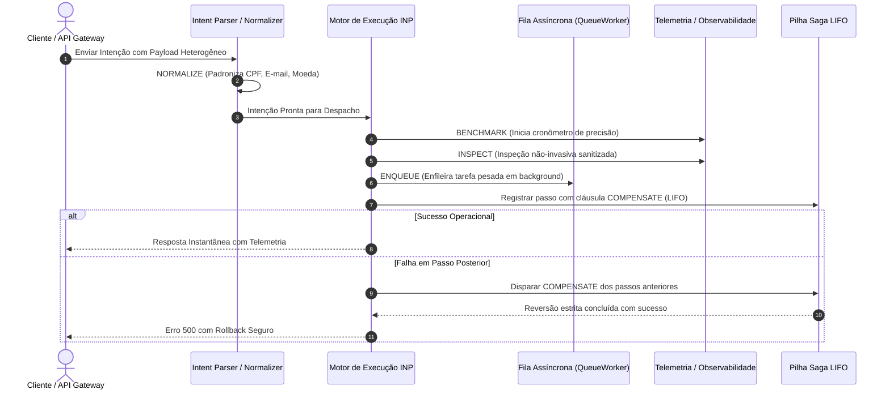

---

### 121. COMPENSATE
- **Definição Formal:** Declaração explícita e execução determinística de ações compensatórias reversas acopladas a mutações atômicas, garantindo o retorno do sistema à consistência estrita em caso de falha posterior.
- **Explicação Descomplicada:** É o seguro contra acidentes da sua transação. Se você reservou um hotel, comprou passagem e alugou um carro, mas a locadora não tem carros disponíveis, o `COMPENSATE` cancela o hotel e estorna a passagem automaticamente, desfazendo tudo em ordem inversa.
- **A Dor de Cabeça que Resolve:** Ter que escrever códigos manuais de rollback com `try/catch` aninhados ou deixar bancos de dados corrompidos quando uma chamada de API no 5º passo falha e os 4 passos anteriores continuam gravados no banco de dados.
- **Para que serve:** Associar a cada passo de escrita (`MUTATE`, `CREATE`, `UPDATE`, `TRANSFER`) a ação exata de reversão caso qualquer etapa subsequente falhe.
- **Como usar:**
```inp
STEP reservarAssento: MUTATE {
  service: "companhia-aerea",
  action: "RESERVE_SEAT",
  payload: { voo: "TP102", assento: "14A" },
  COMPENSATE: {
    action: "CANCEL_SEAT",
    payload: { voo: "TP102", assento: "14A" }
  }
}
```
- **Quando usar:** Em qualquer fluxo com efeitos colaterais onde uma falha em passos posteriores possa deixar o sistema em estado inconsistente ou gerar prejuízos patrimoniais.
- **Papel no Motor:** O motor empilha a instrução de compensação no repositório persistido `SagaStateRepository` com ordem LIFO (*Last-In, First-Out*) e executa a reversão automaticamente ou sob demanda com `resumeRollback` e `FORWARD_RETRY`.

---

### 122. BENCHMARK
- **Definição Formal:** Instrumentação e medição estrita de latência, consumo de CPU, alocação de heap e jitter de execução em microssegundos durante o hot-path de qualquer passo ou sub-pipeline.
- **Explicação Descomplicada:** É o cronômetro de precisão de Fórmula 1: ele mede exatamente quantos milissegundos o seu código levou para rodar, permitindo identificar onde está o gargalo sem precisar encher o código de `console.time()`.
- **A Dor de Cabeça que Resolve:** Não saber por que uma transação em produção está lenta ou precisar instalar APMs externos caros que degradam o desempenho da aplicação para medir latência de microsserviços.
- **Para que serve:** Medir tempo de resposta de serviços parceiros, queries de banco de dados e transformações de dados em tempo real, emitindo métricas e alertas de degradação.
- **Como usar:**
```inp
STEP auditarLatencia: BENCHMARK {
  label: "consulta_saldo_bancario",
  action: FETCH { resource: "saldos", id: "conta_9988" },
  maxThresholdMs: 50
}
```
- **Quando usar:** Em etapas de missão crítica onde SLAs de baixa latência são exigidos ou para testes de carga e diagnóstico de performance contínuo.
- **Papel no Motor:** Executa o bloco monitorado utilizando relógios de alta resolução (`process.hrtime.bigint()`), registra as métricas no `MetricsCollector` e dispara telemetria de alerta caso o limiar (`maxThresholdMs`) seja superado.

---

### 123. NORMALIZE
- **Definição Formal:** Canonização, higienização e conformação de dados heterogêneos de entrada para esquemas estruturados padronizados, eliminando inconsistências de formatação, pontuação e espaços.
- **Explicação Descomplicada:** É o alfaiate dos seus dados: ele recebe um texto todo amassado (com letras maiúsculas misturadas, traços, pontos ou espaços extras) e entrega o dado limpo, engomado e no tamanho exato para entrar no banco de dados.
- **A Dor de Cabeça que Resolve:** Usuários preenchendo CPF ou telefones de formas variadas (`123.456.789-00`, `12345678900`, `+55 (11) 99999-9999`), forçando a criação de dezenas de expressões regulares e scripts de limpeza manuais em cada rota.
- **Para que serve:** Padronizar e-mails (minúsculas), documentos de identidade (apenas números), valores monetários (duas casas decimais fixas) e strings em esquemas canônicos.
- **Como usar:**
```inp
STEP limparDados: NORMALIZE {
  target: "${payload.dadosCliente}",
  rules: {
    cpf: "NUMERIC_ONLY",
    email: "LOWERCASE_TRIM",
    telefone: "E164_PHONE"
  }
}
```
- **Quando usar:** Logo na entrada do pipeline, antes de validações de contrato ou persistência no banco de dados.
- **Papel no Motor:** Executa transformações funcionais idempotentes e ultrarrápidas em memória sem alocação desnecessária de memória heap, garantindo que os passos seguintes recebam dados perfeitamente higienizados.

---

### 124. ENQUEUE
- **Definição Formal:** Inserção atômica e durável de tarefas em filas de processamento assíncrono gerenciadas pelo motor, com suporte a prioridade, retentativas e Dead Letter Queue (DLQ).
- **Explicação Descomplicada:** É tirar uma senha na fila do banco: você pega o seu número e o atendente vai chamar assim que houver guichê livre, sem você precisar ficar de pé batendo na porta do gerente.
- **A Dor de Cabeça que Resolve:** Derrubar o servidor ao tentar processar 10.000 PDFs ou e-mails de uma vez só em uma única requisição HTTP síncrona, causando timeout no navegador do cliente.
- **Para que serve:** Desacoplar tarefas pesadas (envio de relatórios, notificações push em lote, processamento de vídeo) da resposta imediata ao usuário.
- **Como usar:**
```inp
STEP enfileirarRelatorio: ENQUEUE {
  queue: "geracao-relatorios",
  priority: "HIGH",
  delayMs: 0,
  payload: { relatorioId: "rel_554", usuarioId: "usr_10" }
}
```
- **Quando usar:** Sempre que uma operação puder ser executada em segundo plano sem necessidade de reter a resposta síncrona do cliente.
- **Papel no Motor:** Persiste o job na tabela `queue_jobs` gerenciada pelo `QueueWorker`, garantindo processamento resiliente mesmo após falhas ou reinicializações do servidor.

---

### 125. INSPECT
- **Definição Formal:** Introspecção declarativa e não-invasiva do estado de execução, variáveis de contexto, saúde de recursos alocados e pools de conexão sem interrupção do fluxo de negócios.
- **Explicação Descomplicada:** É o raio-X médico durante a cirurgia: o médico consegue olhar exatamente o que está acontecendo dentro do corpo do paciente em tempo real através da tela sem precisar cortar outro órgão.
- **A Dor de Cabeça que Resolve:** Problemas intermitentes em ambiente de produção onde os logs comuns são insuficientes ou causam sobrecarga excessiva quando ligados no modo debug.
- **Para que serve:** Inspecionar os valores exatos de um contexto intermediário, o estado de memória de variáveis dinâmicas e o status de pools de conexão.
- **Como usar:**
```inp
STEP inspecionarContexto: INSPECT {
  scope: "context.transacao",
  includeMetadata: true,
  emitTelemetry: true
}
```
- **Quando usar:** Durante etapas críticas de homologação ou em intenções complexas onde a visibilidade do estado intermediário é mandatória para auditoria forense.
- **Papel no Motor:** Extrai um espelho higienizado via `DataSanitizer` do contexto em execução, emitindo telemetria instantânea para o painel de observabilidade sem risco de vazar senhas ou tokens confidenciais.

---

### 126. TIME_TRAVEL
- **Definição Formal:** Reconstituição cirúrgica pontual de estados históricos anteriores (*Point-in-Time Recovery*) utilizando encadeamento Merkle e avanço progressivo de deltas estruturais sobre keyframes.
- **Explicação Descomplicada:** É entrar no De Lorean da trilogia *De Volta Para o Futuro*: você digita a data e a hora exata do passado e o motor coloca na sua frente o sistema exatamente como ele estava naquele segundo, centavo por centavo.
- **A Dor de Cabeça que Resolve:** Um cliente alegar que há duas semanas a conta dele estava com um saldo diferente e a equipe de suporte passar dias analisando milhares de linhas de log sem conseguir provar qual era o estado exato naquele instante.
- **Para que serve:** Viajar para qualquer passo anterior de uma execução concluída ou em andamento, reconstituindo o estado para auditoria, comparação de diffs ou depuração de incidentes.
- **Como usar:**
```inp
STEP viajarNoTempo: TIME_TRAVEL {
  executionId: "exec_778899aabb",
  targetStepIndex: 2,
  action: "RESTORE_STATE"
}
```
- **Quando usar:** Em auditorias contábeis, perícias forenses, investigações de fraudes e análises de divergências financeiras.
- **Papel no Motor:** O `TimeMachineEngine` localiza o Keyframe anterior mais próximo e soma progressivamente os deltas compactados contíguos até atingir o passo exato, validando a raiz Merkle SHA-256 da cadeia.

---

### 127. REPLAY
- **Definição Formal:** Re-execução e reconstituição preditiva de fluxos de intenção a partir de um marco histórico, operando em sandbox isolada (dry-run) ou em re-execução ativa com rastreio de linhagem parental.
- **Explicação Descomplicada:** É o botão de "Replay da Jogada" na transmissão do jogo de futebol: você reassiste ao lance de vários ângulos e pode simular: *"E se o jogador tivesse chutado na trave em vez de cruzar a bola?"*.
- **A Dor de Cabeça que Resolve:** Ter receio de rodar uma correção em produção por não saber se ela vai causar efeitos colaterais imprevistos nos dados atuais da empresa.
- **Para que serve:** Reproduzir um fluxo idêntico ou bifurcado em sandbox isolada (`mode: "INSPECT"` ou `mode: "EXECUTE"`) para testes de hipóteses "What-If" sem afetar dados reais de clientes.
- **Como usar:**
```inp
STEP reproduzirCenario: REPLAY {
  executionId: "exec_transacao_100",
  fromStepIndex: 1,
  mode: "INSPECT",
  simulatePayload: { taxaDesconto: 0.15 }
}
```
- **Quando usar:** Para homologação de novos fluxos, testes de regressão automatizados e simulação de cenários alternativos de cobrança e crédito.
- **Papel no Motor:** Bifurca uma nova timeline filha (`forkExecution`) com preservação de custódia de proveniência (`parentExecutionId`), isolando mutações reais no modo dry-run e executando sob sandboxing defensivo.

---

### 128. TIMELINE
- **Definição Formal:** Recuperação cronológica e auditoria forense completa da linha do tempo de uma execução, fornecendo validação matemática contínua da árvore de Merkle e prova de integridade à prova de adulteração (*tamper-evident*).
- **Explicação Descomplicada:** É a caixa-preta do avião: registra milissegundo a milissegundo tudo o que aconteceu durante o voo, selada com criptografia de modo que ninguém, nem mesmo o piloto ou o mecânico, consiga apagar ou alterar uma única vírgula.
- **A Dor de Cabeça que Resolve:** Auditorias do Banco Central (BACEN) ou conformidade com o Regulamento Europeu de Inteligência Artificial (EU AI Act) e DORA exigindo comprovação matemática de que nenhum dado de log foi adulterado após o fato.
- **Para que serve:** Extrair a linha do tempo completa com todos os snapshots atômicos, deltas estruturais, carimbos UTC e hashes encadeados de uma transação.
- **Como usar:**
```inp
STEP auditarLinhaDoTempo: TIMELINE {
  executionId: "exec_liquidacao_99",
  validateIntegrity: true
}
```
- **Quando usar:** Em relatórios de auditoria forense, exportação de pacotes assinados de conformidade (`exportTimelineBundle`) e painéis de observabilidade visual.
- **Papel no Motor:** Executa o algoritmo `verifyTimelineIntegrity`, checando cada elo Merkle (`chainHash`) e retornando a raiz criptográfica inviolável (`merkleRoot`) ou acusando o passo exato de qualquer tentativa de fraude.

---

## 5.9 A 9ª Família Estratégica: IA Vetorial Offline, Finanças de Alta Precisão & Engenharia do Caos (Os 8 Novos Verbos Operacionais: 129 ao 136)

A nona família estratégica do INP Protocol expande o ecossistema para novos horizontes industriais inexplorados: **Inteligência Artificial Vetorial e RAG 100% Offline e Soberano**, **Operações Financeiras de Alta Precisão Contábil**, **Práticas Avançadas de Caching e Polling Cooperativo** e **Engenharia de Caos Contínua e Governança Estrutural**.

Com estes 8 novos verbos operacionais, o motor elimina por completo a necessidade de dependências externas como Pinecone, Weaviate, bibliotecas de rateio flutuante propensas a erros de arredondamento IEEE 754, e ferramentas externas invasivas de injeção de caos. Tudo é resolvido internamente com algoritmos nativos, determinísticos e protegidos por salvaguardas periciais de produção.

### Diagrama Arquitetural da 9ª Família Estratégica
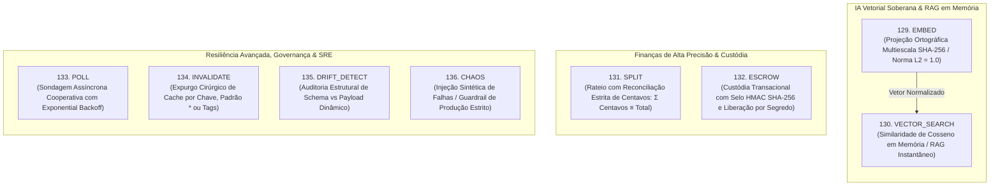

---

### 129. EMBED
- **Definição Formal:** Geração de vetores densos normalizados ($L_2 = 1.0$) de forma 100% determinística e offline a partir de qualquer string textual ou documento estruturado, sem nenhuma chamada externa para APIs pagas de IA ou envio de dados confidenciais para nuvens de terceiros.
- **Explicação Descomplicada:** É como tirar a impressão digital matemática de uma frase ou texto: o motor lê o texto e o transforma em uma lista de números (coordenadas no espaço) onde textos com significados parecidos geram coordenadas geometricamente próximas.
- **A Dor de Cabeça que Resolve:** Gastos exorbitantes com APIs pagas de embedding (OpenAI, Cohere), latência de rede variável (200ms a 1s por chamada) e vazamento de segredos industriais ou dados protegidos pela LGPD/GDPR para servidores externos de IA.
- **Para que serve:** Indexar catálogos de produtos, histórico de tickets de suporte, bases de conhecimento interno, documentos jurídicos e logs operacionais para buscas semânticas instantâneas.
- **Como usar:**
```inp
STEP gerarVetor: EMBED {
  text: "Solicitação de estorno de pagamento de pedido duplicado",
  dimensions: 64
}
```
- **Quando usar:** Na ingestão e pré-processamento de documentos, enriquecimento semântico de entidades e geração de vetores para o verbo `VECTOR_SEARCH`.
- **Papel no Motor:** Emprega projeção ortogonal criptográfica multiescala baseada em SHA-256 e n-gramas semânticos. Executa em menos de 0.1ms em pura CPU, garantindo norma euclidiana unitária ($L_2 = 1.0$) pronta para produto escalar e similaridade de cosseno.

---

### 130. VECTOR_SEARCH
- **Definição Formal:** Busca e ranqueamento semântico instantâneo por similaridade de cosseno diretamente sobre uma coleção de candidatos ou base vetorial em memória, retornando os $k$ itens mais próximos com scores de similaridade normalizados.
- **Explicação Descomplicada:** É um bibliotecário com memória instantânea: você dá a ele o vetor de uma pergunta e ele instantaneamente varre milhares de resumos guardados na memória e coloca na sua mão os 5 documentos mais relevantes em frações de milissegundo.
- **A Dor de Cabeça que Resolve:** Dependência de bancos vetoriais complexos e caros de gerenciar (Pinecone, Qdrant, Milvus) para casos onde a base de busca possui milhares de itens que cabem confortavelmente em memória com latência inferior a 1ms.
- **Para que serve:** Implementar Retrieval-Augmented Generation (RAG) instantâneo, recomendação semântica de produtos, detecção de duplicidades por significado e roteamento inteligente de chamados de atendimento.
- **Como usar:**
```inp
STEP buscarSemantica: VECTOR_SEARCH {
  query: "cancelamento de assinatura e estorno de taxa",
  candidates: [
    { id: "artigo_1", text: "Procedimento de reembolso e cancelamento de planos" },
    { id: "artigo_2", text: "Como cadastrar nova forma de pagamento e cartão" },
    { id: "artigo_3", text: "Tabela de preços e renovação automática" }
  ],
  topK: 2,
  minScore: 0.5
}
```
- **Quando usar:** Sempre que precisar cruzar uma consulta do usuário com artigos, regras de negócio ou produtos pelo significado conceitual e não apenas por palavras-chave literais.
- **Papel no Motor:** Calcula a similaridade de cosseno $\cos(\theta) = \mathbf{A} \cdot \mathbf{B}$ entre os vetores de consulta e cada candidato, ordenando decrescentemente e filtrando pelo limiar `minScore`. Zero I/O de disco no hot-path.

---

### 131. SPLIT
- **Definição Formal:** Distribuição e rateio financeiro multidirecional de um valor monetário total entre múltiplos favorecidos/contas, aplicando reconciliação matemática estrita em centavos inteiros para assegurar a conservação contábil absoluta ($\sum \text{allocated} \equiv \text{totalAmount}$).
- **Explicação Descomplicada:** É a divisão perfeita da conta de um restaurante entre amigos ou o split de comissões de um marketplace: se a conta deu R$ 100,00 e há três favorecidos com percentuais fracionados, o motor calcula em centavos inteiros e aloca os centavos de arredondamento de modo que a soma de todas as partes dê exatamente R$ 100,00, sem faltar nem sobrar 1 centavo sequer.
- **A Dor de Cabeça que Resolve:** O pesadelo contábil do "centavo perdido" causado pela aritmética de ponto flutuante IEEE 754 (`0.1 + 0.2 = 0.30000000000000004`), que gera furos de auditoria no fechamento fiscal e multas regulatórias em auditorias de bancos centrais.
- **Para que serve:** Rateio de liquidação financeira de marketplaces (vendedor, gateway, plataforma, transportadora), divisão de royalties de criadores de conteúdo e repasse de comissões de parceiros.
- **Como usar:**
```inp
STEP ratearVenda: SPLIT {
  totalAmount: 1500.00,
  currency: "EUR",
  splits: [
    { recipient: "seller_loja_a", percentage: 70 },
    { recipient: "plataforma_comissao", percentage: 20 },
    { recipient: "operador_logistico", percentage: 10 }
  ]
}
```
- **Quando usar:** Na liquidação de compras em marketplaces, faturamento corporativo, distribuição de dividendos e pagamento de comissões.
- **Papel no Motor:** Converte imediatamente todos os valores para centavos inteiros (`Math.round(totalAmount * 100)`), calcula as quotas individuais por truncamento/arredondamento inteiro e atribui os centavos residuais ao beneficiário prioritário. Emite prova de reconciliação contábil (`reconciled: true`).

---

### 132. ESCROW
- **Definição Formal:** Custódia transacional temporária e programável de valores financeiros ou ativos digitais, protegida por selo de integridade criptográfica HMAC SHA-256 inviolável, com suporte a liberação condicional com validação de chave secreta, estorno para o pagador e prazo de validade (TTL).
- **Explicação Descomplicada:** É o cofre inteligente do notário: o comprador deposita o dinheiro, o cofre emite um recibo selado e tranca os fundos. O dinheiro só é liberado para o vendedor se a chave de confirmação de entrega for apresentada; se o prazo expirar ou a entrega falhar, o valor é devolvido com segurança ao comprador.
- **A Dor de Cabeça que Resolve:** Golpes do "comprador que cancela o pagamento após receber o produto" ou "vendedor que recebe o dinheiro e nunca envia a mercadoria" em negociações bilaterais de alto valor.
- **Para que serve:** Custódia em transações imobiliárias, compras seguras peer-to-peer (P2P), liberação de marcos contratuais (milestones) em projetos de software e contratos de garantia de entrega de mercadorias.
- **Como usar:**
```inp
STEP reterCustodia: ESCROW {
  action: "DEPOSIT",
  payer: "comprador_usr_12",
  beneficiary: "vendedor_loja_99",
  amount: 5000.00,
  currency: "BRL",
  condition: "entrega_confirmada_via_rastreio",
  secretKey: "segredo_liberacao_hash",
  ttlMinutes: 1440
}
```
- **Quando usar:** Em transações comerciais com liquidação diferida no tempo sujeitas a verificação física ou digital de entrega.
- **Papel no Motor:** Mantém o registro atômico no ledger de custódia em memória (`escrowLedger`), gera o selo criptográfico HMAC SHA-256 com timestamp UTC e chave secreta, e suporta as ações `DEPOSIT`, `RELEASE`, `REFUND` e `STATUS`.

---

### 133. POLL
- **Definição Formal:** Mecanismo de sondagem assíncrona cooperativa não-bloqueante com recuo exponencial (*exponential backoff*), verificação contínua de predicados e teto máximo de tentativas para reconciliação com sistemas parceiros lentos ou de resposta assíncrona diferida.
- **Explicação Descomplicada:** É o entregador educado que vai checar se o pacote está pronto: ele verifica agora; se ainda não estiver pronto, ele espera 1 segundo; se ainda não estiver, espera 2 segundos; depois 4 segundos, até que o pacote fique pronto ou atinja o tempo máximo estipulado.
- **A Dor de Cabeça que Resolve:** Laços de repetição manuais (`while (true)`) que consomem 100% da CPU do servidor enquanto aguardam um webhook externo ou uma resposta de um sistema legado lento, derrubando a aplicação.
- **Para que serve:** Aguardar o processamento de um lote no banco legado, esperar a emissão de uma nota fiscal na SEFAZ, confirmar a confirmação de uma transação na blockchain ou aguardar a geração de um relatório pesado.
- **Como usar:**
```inp
STEP aguardarCompensacao: POLL {
  target: "status_pagamento",
  maxAttempts: 6,
  intervalMs: 200,
  backoffFactor: 1.5,
  predicate: {
    field: "status",
    operator: "===",
    value: "CONFIRMED"
  }
}
```
- **Quando usar:** Na orquestração de integrações com parceiros que não possuem webhooks reversos e operam com tempo de processamento assíncrono imprevisível.
- **Papel no Motor:** Utiliza temporizadores cooperativos (`setTimeout`) sem prender o loop de eventos (*Event Loop*) do Node.js, calcula o intervalo progressivo com fator de multiplicação e avalia operadores relacionais de forma estrita.

---

### 134. INVALIDATE
- **Definição Formal:** Expurgo cirúrgico imediato de entradas em caches distribuídos ou locais por correspondência de chave exata, padrão de expressão com caracteres curinga (*wildcards*) ou tags semânticas transversais, restabelecendo a coerência estrita entre escrita e leitura.
- **Explicação Descomplicada:** É apertar o botão de "limpar lousa": quando o preço de um produto muda no banco de dados, você apaga a informação velha do cache instantaneamente para garantir que nenhum cliente veja o preço antigo desatualizado.
- **A Dor de Cabeça que Resolve:** Caches zumbis que continuam servindo dados antigos mesmo após o operador ter atualizado a informação no painel administrativo, gerando reclamações de clientes e prejuízos operacionais.
- **Para que serve:** Limpar o cache de páginas de produto quando o estoque acabar, invalidar sessões de usuário após logout ou alteração de senha e invalidar configurações globais após deploy.
- **Como usar:**
```inp
STEP expurgarCacheProduto: INVALIDATE {
  target: "produto_1029",
  pattern: "catalogo:calcados:*",
  tag: "promocao_black_friday"
}
```
- **Quando usar:** Imediatamente após passos de mutação (`CREATE`, `UPDATE`, `DELETE`, `PATCH`) em dados que são lidos em alta frequência via `MEMOIZE` ou `FETCH`.
- **Papel no Motor:** Integra diretamente com o `NativeCacheService` e subsistemas de memória embutidos, aplicando filtros de regex sobre as chaves e eliminando entradas sem necessidade de reiniciar a aplicação ou zerar o banco Redis inteiro.

---

### 135. DRIFT_DETECT
- **Definição Formal:** Auditoria e detecção contínua de desvios estruturais (*schema drift*) entre cargas úteis dinâmicas recebidas em tempo de execução e o contrato de schema canônico esperado, identificando campos adicionados inesperadamente, propriedades omitidas e discrepâncias de tipagem.
- **Explicação Descomplicada:** É o fiscal aduaneiro no aeroporto com o raio-X: ele compara o que está dentro da mala com o que foi declarado no manifesto de voo. Se houver algo a mais, a menos ou diferente do combinado, ele acende uma luz amarela imediatamente.
- **A Dor de Cabeça que Resolve:** APIs de terceiros que mudam de versão silenciosamente de madrugada, alterando nomes de campos de snake_case para camelCase ou adicionando objetos aninhados sem aviso prévio, quebrando fluxos de produção sem deixar rastros.
- **Para que serve:** Monitorar contratos de integração de parceiros externos, auditar integridade de webhooks recebidos e emitir alertas preventivos antes que anomalias de schema causem falhas fatais em banco de dados.
- **Como usar:**
```inp
STEP auditarContratoPayload: DRIFT_DETECT {
  payload: { id: "usr_10", nome: "Carlos", idade: "30", campoSurpresa: true },
  expectedContract: { id: "string", nome: "string", idade: "number" }
}
```
- **Quando usar:** Na recepção de webhooks de fornecedores externos, em pipelines de ingestão de big data e em gateways de microsserviços heterogêneos.
- **Papel no Motor:** Executa comparação estrutural recursiva profunda, classifica discrepâncias em `MISSING_FIELDS`, `UNEXPECTED_FIELDS` e `TYPE_MISMATCHES`, e emite índice de conformidade percentual (`complianceScore`) sem interromper o pipeline a menos que configurado em modo estrito.

---

### 136. CHAOS
- **Definição Formal:** Injeção programada, deliberada e controlada de falhas sintéticas (como latência artificial, exceções simuladas e interrupções estocásticas) em rotinas de teste e homologação para validação da resiliência contínua dos sistemas, com salvaguarda estrita e irrevogável contra execução em ambientes de produção (`ERR_CHAOS_PRODUCTION_BLOCKED`).
- **Explicação Descomplicada:** É a simulação de incêndio do corpo de bombeiros: disparar alarmes falsos de propósito no prédio em dia de treino para ver se os extintores funcionam e se as pessoas sabem onde ficam as saídas de emergência, sem jamais fazer isso durante um evento real com o prédio lotado.
- **A Dor de Cabeça que Resolve:** Descobrir que os seus disjuntores de circuito (`Circuit Breaker`), políticas de retentativa (`RETRY`) e passos de compensação Saga (`COMPENSATE`) não funcionam exatamente no dia da Black Friday quando o gateway bancário principal cai.
- **Para que serve:** Treinar a musculatura de resiliência da infraestrutura, validar se os fallbacks entram em ação com precisão e certificar que a aplicação continua operacional mesmo sob degradação severa da rede.
- **Como usar:**
```inp
STEP injetarFalhaDeTreino: CHAOS {
  target: "gateway_pagamentos_mock",
  faultType: "LATENCY",
  latencyMs: 1500,
  errorRate: 0.2,
  environment: "development"
}
```
- **Quando usar:** Em pipelines de Integração Contínua (CI/CD), ambientes de homologação (*staging*) e dias de teste de resiliência (*Chaos Days*) da equipe de engenharia.
- **Papel no Motor:** Inspeciona com prioridade absoluta as variáveis de ambiente `NODE_ENV`, `INP_ENV` e a propriedade `environment`. Se detectar qualquer indicador de produção (`production` ou `prod`), rejeita a execução sumariamente com erro fatal `ERR_CHAOS_PRODUCTION_BLOCKED`. Em ambientes seguros, aplica a latência configurada e/ou dispara exceções aleatórias baseadas na probabilidade `errorRate`.

---

# PARTE 6: O Dicionário Completo de Palavras-Chave, Cláusulas, Operadores e Diretivas do Motor

Muitos desenvolvedores pensam que o motor INP v2.7 só compreende os 136 verbos operacionais. **Isso é um equívoco!**

Além dos verbos, o motor é regido por uma gramática de **palavras reservadas (keywords), cláusulas de governança, diretivas de segurança e operadores matemáticos e lógicos**. Cada palavra possui um significado rígido no compilador e atua como uma engrenagem de controle e blindagem.

Abaixo, documentamos o inventário exaustivo de todas as palavras e diretivas compreendidas pelo motor.

---

## 6.1 Palavras Estruturais Fundamentais

### 1. INTENT
- **Definição:** Palavra-chave raiz que inicia a declaração formal de uma intenção no INP.
- **Para que serve:** Informa ao compilador que um novo bloco de intenção de negócio está nascendo e atribui um nome semântico ao fluxo.
- **Onde e Como Usar:** Sempre na primeira linha do seu arquivo DSL, seguida pelo nome da sua intenção e por uma chave aberta `{`.
- **Exemplo Prático:** `INTENT ProcessarTransferencia { ... }`
- **Papel no Motor:** Cria o nó raiz da Árvore Sintática Abstrata (`AST`), atribui um identificador universal (`UUID v4`) e define o escopo imutável de variáveis.

### 2. TARGET
- **Definição:** Cláusula de cabeçalho que especifica o microsserviço ou subsistema de destino principal da intenção.
- **Para que serve:** Roteia a intenção para a área ou domínio correspondente (ex: faturamento, logística, autenticação).
- **Onde e Como Usar:** No cabeçalho da intenção, antes da declaração dos passos.
- **Exemplo Prático:** `TARGET: "financeiro-core"`
- **Papel no Motor:** Permite ao gateway validar de imediato se o serviço de destino está registrado e com rotas ativas no catálogo.

### 3. TIMEOUT
- **Definição:** Cláusula contratual que estipula o tempo limite máximo de tolerância antes da interrupção forçada (*circuit timeout*).
- **Para que serve:** Evitar que uma intenção fique travada eternamente se um servidor externo cair ou demorar excessivamente para responder.
- **Onde e Como Usar:** No cabeçalho da intenção ou dentro de passos específicos, usando unidades em milissegundos (`ms`) ou segundos (`s`).
- **Exemplo Prático:** `TIMEOUT: 5000ms` (ou `TIMEOUT: 5s`)
- **Papel no Motor:** Configura o timer no `AbortController`. Se o tempo expirar, o motor cancela sockets em voo e devolve erro 504 Gateway Timeout.

### 4. IDEMPOTENCY
- **Definição:** Cláusula de cabeçalho que vincula a intenção a uma chave única de não-duplicação.
- **Para que serve:** Garantir que se a mesma requisição for enviada 10 vezes (por exemplo, cliques múltiplos de um usuário ansioso), ela execute apenas uma vez no mundo real.
- **Onde e Como Usar:** No cabeçalho da intenção, referenciando uma variável dinâmica ou cabeçalho HTTP.
- **Exemplo Prático:** `IDEMPOTENCY: "${header.x-idempotency-key}"`
- **Papel no Motor:** Realiza busca atômica na tabela de chaves. Se a chave já existir, retorna o resultado salvo em menos de 1ms sem reexecutar nenhum passo.

### 5. SCHEMA
- **Definição:** Cláusula de contrato estrito que define o modelo JSON Schema esperado para a carga útil da intenção.
- **Para que serve:** Proteger o motor contra requisições malformadas ou campos faltantes antes mesmo de gastar CPU executando o primeiro passo.
- **Onde e Como Usar:** No cabeçalho da intenção, recebendo um objeto com as regras dos campos.
- **Exemplo Prático:** `SCHEMA: { "required": ["valor", "moeda"] }`
- **Papel no Motor:** Compila as regras no `SchemaCache` com validador AJV de alta performance.

### 6. STEP
- **Definição:** Palavra reservada que declara uma unidade atômica de trabalho (um passo individual) dentro da intenção.
- **Para que serve:** Segmentar o trabalho em etapas claras, nomeadas e rastreáveis.
- **Onde e Como Usar:** No corpo da intenção, seguido pelo nome do passo, dois pontos `:`, o verbo desejado e as chaves com os parâmetros.
- **Exemplo Prático:** `STEP debitar: MUTATE { ... }`
- **Papel no Motor:** Cada `STEP` é uma corrotina auditada individualmente com seu próprio tempo de execução e resultado guardado na memória.

### 7. PARAMETERS
- **Definição:** Bloco declarativo que define os parâmetros e variáveis associados a um passo ou intenção.
- **Para que serve:** Passar argumentos explícitos de execução para os manipuladores dos serviços nativos e externos.
- **Onde e Como Usar:** Dentro do objeto JSON de um passo ou na definição de intenções bimodais.
- **Exemplo Prático:** `parameters: { id: "123", mode: "fast" }`
- **Papel no Motor:** Injeta os argumentos validados no contexto de execução do handler.

### 8. CONTEXT
- **Definição:** Declaração de variáveis globais e de ambiente injetadas no início do ciclo de vida da intenção.
- **Para que serve:** Disponibilizar dados comuns (ex: ID da sessão, IP do cliente, tenantId) para todos os passos do fluxo.
- **Onde e Como Usar:** No cabeçalho estrutural de intenções clássicas.
- **Exemplo Prático:** `CONTEXT { tenantId: "empresa_42", canal: "mobile" }`
- **Papel no Motor:** Inicializa o mapa imutável de variáveis do contexto de orquestração.

### 9. REQUIRE
- **Definição:** Declaração de pré-requisitos e capacidades obrigatórias que o ecossistema precisa possuir antes de permitir a execução.
- **Para que serve:** Garantir que o ambiente possui o serviço de pagamentos e o serviço de emissão de notas antes de começar a transação.
- **Onde e Como Usar:** No cabeçalho de orquestrações avançadas.
- **Exemplo Prático:** `REQUIRE { capabilities: ["EXECUTE PAYMENT", "GENERATE NFE"] }`
- **Papel no Motor:** Valida o catálogo de capacidades no pré-voo. Se alguma capacidade faltar, recusa a requisição de imediato sem tocar em bancos de dados.

### 10. OUTPUT
- **Definição:** Cláusula que parametriza o formato de saída e serialização pretendido para a resposta final da intenção.
- **Para que serve:** Escolher se a resposta deve ser devolvida como JSON puro, stream de eventos SSE, documento binário ou texto plano.
- **Onde e Como Usar:** No final da definição da intenção.
- **Exemplo Prático:** `OUTPUT { format: "json", envelope: true }`
- **Papel no Motor:** Aplica o formatador correspondente sobre os dados finais antes da transmissão na rede.

---

## 6.2 Palavras de Fluxo, Decisão e Concorrência

### 11. SEQUENCE
- **Definição:** Declaração de fluxo estritamente linear, onde cada passo só executa após o término do anterior com sucesso.
- **Para que serve:** Processos rígidos onde a saída da etapa 1 é obrigatória para a entrada da etapa 2.
- **Exemplo Prático:** `STEP fluxoLinear: SEQUENCE { steps: [ autenticar, debitar, faturar ] }`
- **Papel no Motor:** Encadeia chamadas transferindo o estado imutável com rastreabilidade total.

### 12. PARALLEL
- **Definição:** Disparo concorrente não-bloqueante de múltiplos passos com barreira de sincronização.
- **Para que serve:** Buscar múltiplas informações independentes ao mesmo tempo para acelerar a resposta ao usuário.
- **Exemplo Prático:** `STEP buscarJunto: PARALLEL { steps: [ buscarPerfil, buscarSaldo, buscarExtrato ] }`
- **Papel no Motor:** Coordena corrotinas com `Promise.allSettled` ou `Promise.all` associadas a um `AbortSignal` compartilhado.

### 13. CONDITION / CONDITIONAL
- **Definição:** Palavra de ramificação lógica baseada em um predicado booleano avaliado em ambiente estritamente seguro.
- **Para que serve:** Tomar decisões com base nos dados recebidos ou gerados por passos anteriores.
- **Exemplo Prático:** `STEP decidir: CONDITIONAL { condition: "${saldo} >= ${valor}", then: prosseguir, else: barrar }`
- **Papel no Motor:** Avalia expressões sem usar `eval()`, garantindo segurança absoluta contra injeções.

### 14. IF, THEN e ELSE
- **Definição:** Trio clássico de controle condicional declarativo.
- **Para que serve:** Criar caminhos alternativos limpos e legíveis para humanos.
- **Exemplo Prático:**
```inp
IF "${usuario.score} > 800" THEN {
  STEP aprovarAutomatico: APPROVE { ... }
} ELSE {
  STEP pedirAvaliacao: ESCALATE { ... }
}
```
- **Papel no Motor:** O compilador desvia a árvore de execução para o ramo correspondente ao resultado booleano.

### 15. PIPELINE
- **Definição:** Conector de transformação fluida onde a saída de uma função é passada diretamente como entrada da próxima sem variáveis temporárias.
- **Para que serve:** Encadeamento limpo de operações de dados: ler -> filtrar -> transformar -> compactar.
- **Exemplo Prático:** `STEP esteiraDados: PIPELINE [ extrair, limpar, agrupar ]`
- **Papel no Motor:** Otimização de alocação de memória reduzindo cópias de objetos intermediários.

### 16. SCOPE
- **Definição:** Isolamento de contexto de variáveis para execução de blocos sem poluir o escopo pai.
- **Para que serve:** Evitar que variáveis temporárias criadas em um sub-passo sobrescrevam variáveis importantes do fluxo geral.
- **Exemplo Prático:** `STEP subRotina: SCOPE { steps: [ ... ] }`
- **Papel no Motor:** Cria um novo frame léxico na pilha de contexto da intenção.

### 17. DEPENDENCY / DEPENDS_ON
- **Definição:** Declaração explícita de pré-requisito de precedência em grafos de execução assíncronos (DAG).
- **Para que serve:** Permitir que passos paralelos comecem assim que suas dependências específicas estiverem prontas, sem precisar de uma sequência rígida.
- **Exemplo Prático:** `STEP emitirBoleto: EXECUTE { dependsOn: ["validarCliente", "calcularImpostos"] }`
- **Papel no Motor:** O motor constrói o grafo de dependências e dispara os nós assim que as arestas de entrada são resolvidas.

### 18. PRIMARY e FALLBACK
- **Definição:** Cláusulas de resiliência ativa que definem a rota primária nobre e o plano de contingência.
- **Para que serve:** Garantir que o sistema nunca saia do ar se um provedor terceiro cair.
- **Exemplo Prático:**
```inp
STEP cotacaoMoeda: FALLBACK {
  PRIMARY: FETCH { service: "api-banco-central" },
  FALLBACK: FETCH { service: "api-reserva-internacional" }
}
```
- **Papel no Motor:** Se a rota primária falhar, aciona a secundária silenciosamente em milissegundos sem devolver erro ao cliente.

---

## 6.3 Cláusulas de Resiliência, Saga e Contratos

### 19. COMPENSATE
- **Definição:** Cláusula transacional mandatória do padrão Saga para reversão de estado.
- **Para que serve:** Dizer ao motor exatamente qual ação de compensação deve ser executada caso um passo posterior sofra erro fatal.
- **Exemplo Prático:** `COMPENSATE: { action: "cancelarReserva", payload: { reservaId: "${reserva.id}" } }`
- **Papel no Motor:** Empilhada em ordem LIFO; executada automaticamente pelo orquestrador de rollback se houver falha no fluxo.

### 20. RETRY
- **Definição:** Cláusula que define a estratégia de retentativas automáticas diante de falhas de rede transitórias.
- **Para que serve:** Superar pequenas oscilações de conexão sem quebrar a operação do usuário.
- **Exemplo Prático:** `RETRY: { maxAttempts: 3, backoff: "exponential", jitter: true }`
- **Papel no Motor:** Aplica retentativas com cálculo de dispersão de tempo para prevenir congestionamentos.

### 21. OUTPUT_SCHEMA
- **Definição:** Cláusula de garantia formal do modelo de saída que um passo específico é obrigado a entregar.
- **Para que serve:** Blindar passos seguintes contra retornos incompletos ou alucinações de modelos de IA.
- **Exemplo Prático:** `OUTPUT_SCHEMA: { "aprovado": "boolean", "motivo": "string" }`
- **Papel no Motor:** Inspeciona a resposta do manipulador; se não cumprir o schema, invalida o passo com erro de contrato.

### 22. SECURE, TRUST, PERMISSION e POLICY
- **Definição:** Família de palavras-chave de segurança e conformidade corporativa.
- **Para que serve:** Definir o nível de confiança exigido (`TRUST`), permissões necessárias (`PERMISSION`) e políticas a serem cumpridas (`POLICY`).
- **Exemplo Prático:** `SECURE { trustLevel: "HIGH", requiredPermission: "FINANCE_ADMIN" }`
- **Papel no Motor:** Barreira mandatória antes do despacho para nós de execução.

---

## 6.4 Palavras Reservadas da Sandbox DBA e Sanitização SQL

O serviço de DBA do motor (`DBAService`) implementa uma sandbox forense estrita para consultas de banco de dados. Ele permite exclusivamente comandos de leitura diagnóstica e bloqueia 13 funções e diretivas de risco do PostgreSQL:

### Comandos Autorizados:
- `SELECT`: Permitido exclusivamente para consultas de leitura de dados.
- `EXPLAIN`: Permitido para análise diagnóstica de planos de execução de queries sem efeitos colaterais.

### Diretivas e Funções Estritamente Bloqueadas (Blindagem Anti-Hacker):
1. `PG_READ_FILE`: Bloqueada para impedir a leitura não autorizada de arquivos do sistema operacional (ex: `/etc/passwd`).
2. `PG_READ_BINARY_FILE`: Bloqueada contra exfiltração de binários e chaves privadas do servidor.
3. `PG_WRITE_FILE`: Bloqueada para prevenir a gravação de arquivos maliciosos ou web shells no disco.
4. `PG_LS_DIR`: Bloqueada contra reconhecimento e enumeração de pastas e diretórios da máquina servidora.
5. `PG_STAT_FILE`: Bloqueada contra inspeção de metadados e permissões de arquivos do sistema operacional.
6. `PG_TERMINATE_BACKEND`: Bloqueada contra ataques de negação de serviço (DoS) que encerram conexões de outros clientes do banco.
7. `PG_CANCEL_BACKEND`: Bloqueada para impedir o cancelamento malicioso de transações concorrentes legítimas.
8. `LO_EXPORT`: Bloqueada contra exportação de Large Objects diretamente para o sistema de arquivos do host.
9. `LO_IMPORT`: Bloqueada contra importação não autorizada de arquivos do sistema para dentro de tabelas.
10. `LO_UNLINK`: Bloqueada para prevenir a exclusão arbitrária de objetos grandes do banco.
11. `DBLINK`: Bloqueada para impedir ataques de pivoteamento onde o invasor força o banco a fazer conexões externas para servidores maliciosos.
12. `SET_CONFIG`: Bloqueada para impedir a alteração arbitrária de variáveis globais de tempo de execução do PostgreSQL.
13. `CURRENT_SETTING`: Bloqueada para evitar a inspeção de parâmetros secretos e credenciais em variáveis de configuração do banco.

> [!NOTE]
> O motor diferencia com precisão cirúrgica a diretiva legítima de paginação `OFFSET` (usada em consultas como `SELECT * FROM pedidos LIMIT 10 OFFSET 20`), permitindo o seu funcionamento normal enquanto bloqueia funções perigosas com falsos positivos zerados.

---

## 6.5 Operadores Lógicos, Relacionais e de Padrão (SafeEvaluator)

O motor avalia expressões através do componente `safe-evaluator.ts`, operando sobre uma Árvore Sintática Abstrata (AST) pura sem recorrer ao interpretador inseguro do JavaScript:

| Operador | Significado Formal | Tradução para Leigos | Exemplo na DSL |
| :---: | :--- | :--- | :--- |
| `===` | Igualdade Estrita de Tipo | "O valor e o tipo da esquerda são idênticos aos da direita?" | `"${status} === 'CONCLUIDO'"` |
| `!==` | Diferença Estrita de Tipo | "O valor ou o tipo da esquerda são diferentes da direita?" | `"${tentativas} !== 0"` |
| `==` | Igualdade | "O valor da esquerda é igual ao da direita?" | `"${saldo} == 100"` |
| `!=` | Diferença | "O valor da esquerda é diferente do da direita?" | `"${status} != 'CANCELADO'"` |
| `>` | Maior que | "O número da esquerda é estritamente maior que o da direita?" | `"${idade} > 18"` |
| `<` | Menor que | "O número da esquerda é estritamente menor que o da direita?" | `"${preco} < 50.00"` |
| `>=` | Maior ou Igual | "O número da esquerda é maior ou igual ao da direita?" | `"${pontos} >= 1000"` |
| `<=` | Menor ou Igual | "O número da esquerda é menor ou igual ao da direita?" | `"${estoque} <= 5"` |
| `&&` | E Lógico | "Ambas as condições precisam ser verdadeiras simultaneamente" | `"${ativo} && ${idade} >= 18"` |
| `||` | OU Lógico | "Basta que pelo menos uma das condições seja verdadeira" | `"${vip} || ${valor} > 500"` |
| `!` | Negação Lógica | "Inverte o valor booleano: verdadeiro vira falso e vice-versa" | `"!${bloqueado}"` |
| `CONTAINS` | Pertencimento em Coleção | "A lista ou texto contém o elemento ou substring especificada?" | `"${cargos} CONTAINS 'GERENTE'"` |
| `MATCHES` | Expressão Regular Segura | "O texto obedece ao padrão estrutural exigido?" | `"${email} MATCHES '^[\\w.-]+@' "` |

---

## 6.6 Literais e Substituição Dinâmica de Variáveis

| Sintaxe | Tipo de Dado | Função e Comportamento | Exemplo de Uso |
| :--- | :--- | :--- | :--- |
| `${variavel}` | Interpolação Dinâmica | Recupera o valor da variável armazenada no contexto de execução | `"${payload.clienteId}"` |
| `true` | Booleano Afirmativo | Representa o estado lógico verdadeiro | `ativo: true` |
| `false` | Booleano Negativo | Representa o estado lógico falso | `bloqueado: false` |
| `null` | Valor Nulo | Ausência intencional e explícita de valor | `canceladoEm: null` |
| **Inteiros** | Numérico Inteiro | Valores numéricos sem casas decimais | `42`, `100`, `-5` |
| **Decimais** | Ponto Flutuante | Valores com ponto fracionário (ponto, nunca vírgula) | `19.99`, `0.05` |
| **Strings** | Texto Literal | Cadeias de caracteres delimitadas por aspas duplas | `"São Paulo"`, `"Aprovado"` |

---

# PARTE 7: O Esqueleto Universal da Intenção & Mini-Quadro de Símbolos

Antes de escrever qualquer intenção, você deve compreender a alma do sistema. Toda intenção no INP Protocol obedece a um **modelo mental unificado, elegante e estritamente lógico**, projetado para transformar vontades de negócio complexas em garantias matemáticas indestrutíveis.

---

## 7.1 A Filosofia & A Lógica Por Trás do Conceito de INTENT: O Modelo Mental do Motor

### O Que É uma Intenção (INTENT)?
No desenvolvimento de software convencional (seja via REST, gRPC ou chamadas de procedimento remoto RPC), o programador é forçado a atuar como um **microgerenciador de fios elétricos**. Ele precisa abrir o socket manualmente, disparar um `SELECT`, verificar `if-else` de erro, chamar uma API externa, tentar tratar um timeout, e se a rede cair na metade do caminho, torcer para que o banco de dados não fique corrompido com metades de registros. Esse é o chamado **Paradigma Imperativo ("Como Fazer")**, onde o cliente dita passo a passo a mecânica do servidor, assumindo para si o risco de qualquer instabilidade intermediária.

O **INP Protocol subverte essa fraqueza histórica através da Computação Orientada à Intenção (Intent-Driven Computing)**. 

No INP Protocol, uma `INTENT` não é um script de instruções bobas: **é uma Declaração Soberana de Vontade de Negócio com Força de Contrato Jurídico-Criptográfico**.

O cliente não diz ao servidor *como* manipular conexões, tabelas e sockets de rede. Em vez disso, o cliente declara:
> *"Minha INTENÇÃO soberana é debitar R$ 100,00 da conta A e creditar na conta B. Exijo que isso termine em no máximo 3.000ms. Garanto que esta operação possui a chave única X-Idempotency-Key. Se qualquer coisa falhar após a reserva, exijo que o estorno seja feito automaticamente. No final, quero a certidão digital assinada comprovando a fé pública do ato."*

O motor do INP Protocol atua, portanto, não como um mero interpretador, mas como um **Juiz Criptográfico e Orquestrador Autônomo de Alta Fidelidade**.

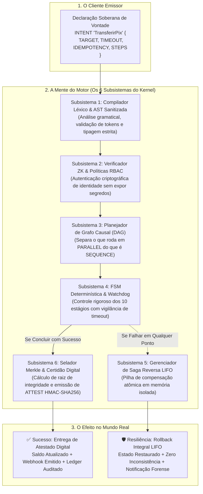

---

### Os 6 Subsistemas Internos Ativados por uma Intenção

Quando uma intenção cruza as portas do motor, o kernel do INP Protocol desperta seis subsistemas coordenados:

1. **Compilador Léxico e AST Sanitizada:**
   * A string ou JSON da intenção é submetida a um analisador de alta velocidade. O motor compila os blocos em uma **Árvore Sintática Abstrata (AST)** imutável. Expressões maliciosas de SQL Injection ou poluição de protótipo (`__proto__`) são incineradas antes de atingirem a memória do sistema.
2. **Verificador Criptográfico ZK & Políticas (RBAC/ABAC):**
   * O motor valida a assinatura digital do emissor contra as chaves públicas registradas. Se o emissor não tiver as políticas (`POLICIES`) necessárias para interagir com o `TARGET`, a intenção é sumariamente repelida com código de erro de autorização no milissegundo zero, sem gastar recursos computacionais.
3. **Planejador Causal de Grafo Acíclico Dirigido (DAG Planner):**
   * O motor inspeciona as dependências de dados entre as variáveis `${...}` dos passos. Se o Passo A busca o saldo e o Passo B busca o endereço do cliente, e nenhum depende do outro, o planejador agenda ambos para rodar em **concorrência real (`PARALLEL`)**, reduzindo o tempo de resposta à metade.
4. **Máquina de Estados Finita Determinística (FSM) & Watchdog Temporal:**
   * Cada intenção viva no motor possui um ciclo de vida governado por estados discretos (`RECEIVED` $\rightarrow$ `ANALYZING` $\rightarrow$ `PREFLIGHT` $\rightarrow$ `EXECUTING` $\rightarrow$ `SEALED`). Um cronômetro de hardware (*Watchdog*) vigia cada passo; se o tempo estipulado em `TIMEOUT` expirar por um único milissegundo, o socket é abortado na raiz para não sufocar o servidor.
5. **Gerenciador de Saga Reversa LIFO (Pilha de Compensação Atômica):**
   * Transações distribuídas tradicionais de duas fases (2PC - Two-Phase Commit) travam bancos de dados relacionais e quebram sob alta concorrência na nuvem. O INP Protocol utiliza o padrão de **Sagas Compensatórias**. Conforme cada `MUTATE` é executado com sucesso, o seu bloco `COMPENSATE` é empilhado em uma estrutura LIFO (*Last-In, First-Out*). Se o passo 4 falhar, o motor desenrola a pilha acionando as compensações dos passos 3, 2 e 1, garantindo que o mundo retorne ao estado original de integridade.
6. **Selador Criptográfico Merkle & Atestador de Fé Pública:**
   * Ao atingir a conclusão, o motor calcula o digest SHA-256 de todas as entradas, saídas e carimbos de tempo dos passos, montando uma folha na Árvore Merkle de auditoria da instituição. O verbo `ATTEST` gera um carimbo com fé pública digital inviolável, concedendo à operação validade jurídica pericial.

---

## 7.2 O Blueprint Anatômico das 4 Zonas de uma Intenção

Toda intenção bem-formada divide-se visualmente e semanticamente em **quatro zonas fundamentais**:

```
┌─────────────────────────────────────────────────────────────────────────────┐
│ ZONA 1: METADADOS E CABEÇALHO (O Contrato Geral da Operação)               │
│ • Nome da Intenção: INTENT <Nome> {                                         │
│ • Alvo do Microsserviço: TARGET: "<serviço>"                                │
│ • Tempo Limite: TIMEOUT: <tempo>ms                                          │
│ • Não-Duplicação: IDEMPOTENCY: "${header.chave}"                           │
├─────────────────────────────────────────────────────────────────────────────┤
│ ZONA 2: PRÉ-VOO & SEGURANÇA (Verificações Iniciais Baratas)                 │
│ • Autenticação do Usuário: AUTHENTICATE { ... }                             │
│ • Validação de Schema: VALIDATE { ... }                                     │
│ • Checagem de Políticas: CHECK_POLICY { ... } ou RATE_LIMIT { ... }         │
├─────────────────────────────────────────────────────────────────────────────┤
│ ZONA 3: O CORPO DE EXECUÇÃO (Onde o Trabalho Acontece)                      │
│ • Leituras & Cache: FETCH, QUERY, COALESCE, MEMOIZE                         │
│ • Concorrência: PARALLEL { ... } ou SEQUENCE { ... }                        │
│ • Decisões: CONDITIONAL (IF/THEN/ELSE), BRANCH                              │
│ • Mutações com Rede de Proteção: MUTATE { ... COMPENSATE: { ... } }         │
│ • Inteligência & Governança: REASON, STREAM, ESCALATE, CONSENSUS            │
├─────────────────────────────────────────────────────────────────────────────┤
│ ZONA 4: CONCLUSÃO & FÉ PÚBLICA (A Entrega dos Resultados)                   │
│ • Carimbo Criptográfico: ATTEST { ... }                                     │
│ • Registro Permanente: AUDIT { ... }                                        │
│ • Fechamento da Chave: }                                                    │
└─────────────────────────────────────────────────────────────────────────────┘
```

---

## 7.3 Mini-Quadro Resumo de Símbolos e Pontuações

Para que você nunca mais tenha dúvida sobre quando colocar dois pontos, aspas ou chaves, guarde este quadro no seu coração:

| Símbolo | Nome Formal | Tradução para Leigos | Regra de Ouro: Para que Serve e Onde Usar |
| :---: | :--- | :--- | :--- |
| `:` | **Dois Pontos** | O Atribuidor de Valor | Usado sempre para ligar o nome de uma propriedade ao seu valor. *Exemplo:* `id: "123"`, `valor: 50`. Pense nele como o sinal de igual (`=`). |
| `" "` | **Aspas Duplas** | O Protetor de Texto | Usado para cercar qualquer texto puro que o computador não deve tentar calcular. *Exemplo:* `"clientes"`, `"SP"`. Números e booleanos não usam aspas! |
| `${ }` | **Cifrão com Chaves** | O Tubo de Teletransporte | Usado quando você quer pegar o valor de uma variável que está guardada na memória e colar ali dentro. *Exemplo:* `"${payload.id}"`. |
| `{ }` | **Chaves de Bloco** | A Caixa Protetora | Usado para agrupar várias propriedades dentro de um único pacote ou objeto. Tudo que abre com `{` precisa ser fechado com `}`. |
| `[ ]` | **Colchetes** | A Gaveta de Itens (Lista/Array) | Usado sempre que você tiver uma lista de vários itens separados por vírgula. *Exemplo:* `steps: [ passo1, passo2 ]` ou `roles: ["admin", "vip"]`. |
| `,` | **Vírgula** | O Separador de Vizinhos | Usado para separar uma propriedade da próxima dentro de um bloco ou lista. *Exemplo:* `nome: "Ana", idade: 25`. |
| `.` | **Ponto** | O Navegador de Gavetas | Usado dentro do `${ }` para descer um nível dentro de um objeto. *Exemplo:* `payload.usuario.nome` significa: entre no payload, abra a caixa usuario e pegue o campo nome. |
| `//` | **Barra Dupla** | Comentário de Linha | Qualquer coisa escrita depois de `//` é lida apenas por humanos. O motor do computador ignora e não executa. |
| `/* */` | **Barra com Asterisco** | Comentário de Bloco | Usado para escrever comentários longos com vários parágrafos de explicação humana sem atrapalhar o código. |
| `()` | **Parênteses** | O Agrupador de Prioridade | Usado em expressões matemáticas ou lógicas para dizer o que deve ser calculado primeiro. *Exemplo:* `(${a} + ${b}) * 2`. |

---

## 7.4 O Que Usar Onde: Matriz Consolidada de Verbos e Cláusulas por Bloco

| Em qual Bloco você está? | O que é esperado ali? | Que Verbos ou Palavras você DEVE usar aqui? |
| :--- | :--- | :--- |
| **No Cabeçalho da Intenção** | Metadados gerais de contrato e SLA | `INTENT`, `TARGET`, `TIMEOUT`, `IDEMPOTENCY`, `SCHEMA` |
| **Na Ingestão e Barreira de Entrada** | Deduplicação, rastreabilidade e segregação | `DEDUPLICATE`, `CORRELATE`, `ISOLATE`, `AUTHENTICATE`, `VALIDATE`, `SANITIZE`, `RATE_LIMIT`, `GUARD`, `CHALLENGE` |
| **Na Conectividade & Interoperabilidade** | Adaptadores de protocolo e chamadas resilientes | `BRIDGE`, `OUTBOUND`, `INGEST`, `FANIN`, `EMIT` |
| **Na Ergonomia & Transformação de Dados** | Extração cirúrgica, achatamento e coerção de tipos | `PLUCK`, `FLATTEN`, `MASK`, `CAST`, `CLAMP`, `MERGE` |
| **No Controle Operacional & Reversão Rápida** | Pausas cooperativas, reversão atômica e vivacidade | `COOLDOWN`, `UNDO`, `SNAPSHOT`, `DIVERGE`, `HEARTBEAT` |
| **No Roteamento & Versões de Serviços** | Deploys seguros e transições de versões | `CANARY`, `MIGRATE`, `BRANCH`, `RESOLVE`, `CIRCUIT_BREAKER` |
| **Na Busca de Informações** | Leituras protegidas contra sobrecarga | `COALESCE`, `MEMOIZE`, `FETCH`, `QUERY`, `RETRIEVE`, `STREAM_READ` |
| **Na Tomada de Decisão & Políticas** | Roteamento condicional e governança | `CONDITIONAL (IF/THEN/ELSE)`, `BRANCH`, `ASSERT`, `CHECK`, `CHECK_POLICY` |
| **Nas Alterações de Dados & Sagas** | Operações atômicas com compensação LIFO | `MUTATE` com `COMPENSATE`, `UPSERT`, `PATCH`, `TRANSFER`, `RETRY`, `CHECKPOINT` |
| **Na Concorrência & Travas Locais** | Exclusão mútua e leases distribuídos | `MUTEX`, `LEASE`, `LOCK`, `UNLOCK`, `ACQUIRE`, `RELEASE` |
| **No Controle de Vazão & Sobrevivência** | Backpressure e desligamento gracioso | `BACKPRESSURE`, `DRAIN`, `SHED_LOAD`, `SAMPLE`, `THROTTLE` |
| **Nas Filas & Resiliência Assíncrona** | Recuperação de DLQ e Quarentena | `QUARANTINE`, `REDRIVE`, `DISPATCH`, `PUBLISH`, `SEND`, `DEFER` |
| **Na Conferência, Auditoria e Privacidade** | Batimento contábil, deep diff e anonimização | `RECONCILE`, `DIFF`, `ANONYMIZE`, `AUDIT`, `ATTEST`, `ARCHIVE` |
| **Na Cooperação com IA e Humanos** | Raciocínio, streaming e governança | `REASON`, `STREAM`, `ESCALATE`, `ADAPT`, `CONSENSUS` |

---

## 7.5 Taxonomia Normativa Universal: O Que é OBRIGATÓRIO vs O Que é DE PREFERÊNCIA

Para que nenhum desenvolvedor ou auditor fique na dúvida sobre a severidade de cada instrução, o **INP Protocol v2.7** adota formalmente o padrão de vocabulário normativo internacional (baseado na **IETF RFC 2119**). Cada palavra, verbo ou cláusula do protocolo enquadra-se rigorosamente em uma das quatro categorias abaixo:

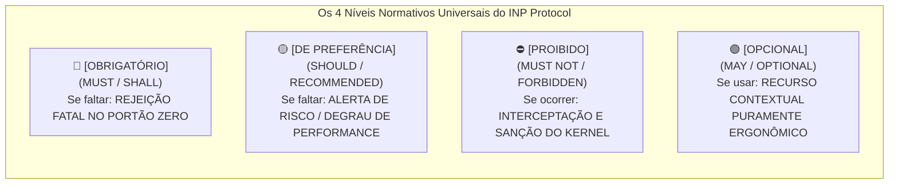

### O Quadro Mestre de Classificação Normativa

| Nível Normativo | Código Formal | O Que Significa na Prática? | O Que o Motor Faz se For Violado? | Exemplos Canônicos no Motor |
| :---: | :---: | :--- | :--- | :--- |
| **🔴 OBRIGATÓRIO** | `MUST` / `SHALL` | **Lei Estrutural Inegociável.** Sem isso, a intenção é sintaticamente ou matematicamente inválida. | **Rejeição imediata no pré-voo** com código HTTP 400 (Bad Request) ou 422 (Unprocessable Entity). A execução é abortada no milissegundo zero. | • Palavra-chave `INTENT` com nome e `TARGET`.<br>• Array `STEPS` com pelo menos uma instrução.<br>• `X-Idempotency-Key` / `DEDUPLICATE` em mutações.<br>• Bloco `COMPENSATE` para todo `MUTATE` em produção.<br>• `TIMEOUT` em passos de rede/I/O.<br>• `outputSchema` rígido ao usar o verbo `REASON`. |
| **🟡 DE PREFERÊNCIA** | `SHOULD` / `RECOMMENDED` | **Boa Prática Arquitetural Forte.** A intenção é válida sem isso, mas a omissão causará degradação de performance, aumento de custos em nuvem ou latência elevada sob carga. | **O motor executa normalmente**, mas emite advertências operacionais no log de diagnóstico (`WARN_*`) e telemetria. | • Uso de `COALESCE` e `MEMOIZE` em consultas quentes.<br>• Uso de `BATCH` para coleções volumosas.<br>• Declaração de `FALLBACK` gracioso em leituras.<br>• Uso de tags semânticas no verbo `INVALIDATE`.<br>• Identificador `correlationId` em chamadas internas. |
| **⛔ PROIBIDO** | `MUST NOT` / `FORBIDDEN` | **Comportamento Tóxico / Anti-Padrão Fatal.** Conduta que comprovadamente derruba bancos de dados, vaza credenciais ou provoca inconsistência contábil. | **O motor intercepta e aciona sanções ativas**: desarme de Circuit Breaker (`ERR_CIRCUIT_OPEN`), quarentena de segurança ou erro fatal de kernel (`ERR_CHAOS_PRODUCTION_BLOCKED`). | • Mutar estado com circuito aberto.<br>• Disparar injeção de `CHAOS` em ambiente produtivo.<br>• Fazer viagem no tempo (`TIME_TRAVEL`) conectado a gateways vivos.<br>• Gravar senhas ou PII sem `REDACT` em logs forenses.<br>• Fazer `MUTATE` antes de `VALIDATE`. |
| **🟢 OPCIONAL** | `MAY` / `OPTIONAL` | **Recurso de Ergonomia ou Conveniência.** Pode ser incluído ou omitido livremente de acordo com a preferência de estilo do desenvolvedor, sem nenhum impacto no runtime. | **Comportamento neutro.** O motor ignora ou utiliza apenas para enriquecer o contexto visual de dashboards. | • Comentários de código `//` e `/* */`.<br>• Metadados descritivos de autoria humana.<br>• Rótulos textuais opcionais em passos simples.<br>• Parâmetros de amostragem (`sampleRate`) em telemetria padrão. |

---

# PARTE 8: O Ciclo de Vida da Intenção e o Código de Boa Conduta do Motor

Toda intenção submetida ao motor INP v2.7 atravessa uma esteira determinística composta por **10 estágios estritos e invioláveis**, regida por um **Código de Boa Conduta Operacional** que define exatamente o que fazer, o que não fazer, quando fazer e quando jamais agir. Nenhuma etapa é ignorada, garantindo robustez pericial e execução à prova de falhas.

---

## 8.1 Infográfico Oficial dos 10 Estágios do Ciclo de Vida

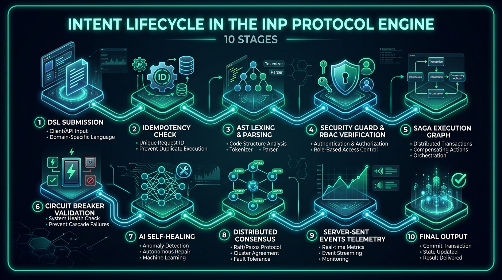

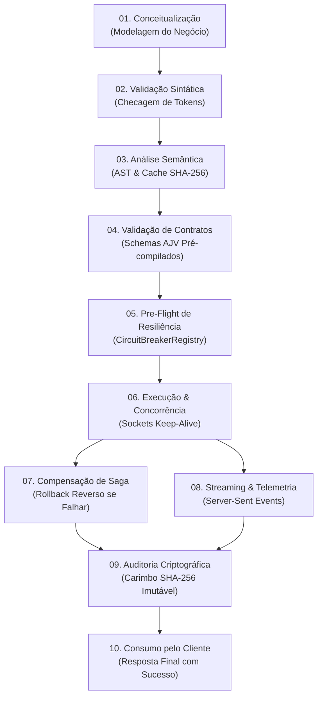

---

## 8.2 Os 10 Estágios Obrigatórios Explicados Passo a Passo

1. **Estágio 01 — Conceitualização & Modelagem:** O desenvolvedor ou líder de produto define o objetivo de negócio, o serviço destino (`TARGET`), o tempo limite de tolerância (`TIMEOUT`) e a chave única de rastreio (`IDEMPOTENCY`).
2. **Estágio 02 — Validação Sintática:** O analisador léxico confere se todos os parênteses, chaves e aspas estão devidamente fechados e se os nomes de verbos pertencem aos **105 verbos oficiais** do motor.
3. **Estágio 03 — Análise Semântica & AST Cache:** O compilador gera o hash SHA-256 do texto da intenção. Se já existir no `AST Plan Cache`, recupera o plano de execução em 0.002ms; caso contrário, tokeniza e armazena na memória LRU.
4. **Estágio 04 — Validação de Contratos (Pré-Voo de Schema):** O validador de schema com compilador AJV ultra-otimizado confere se as variáveis obrigatórias foram enviadas antes de gastar recursos de rede ou banco de dados.
5. **Estágio 05 — Inspeção de Resiliência (Circuit Breaker Registry):** O motor checa o estado do disjuntor do serviço de destino. Se estiver aberto (`OPEN`), o motor rejeita a requisição de imediato (*fast-fail* com código 503) em 0.05ms, evitando reter conexões na máquina.
6. **Estágio 06 — Execução & Concorrência Cooperativa:** As tarefas são despachadas através dos pools permanentes de sockets HTTP Keep-Alive e conexões de banco de dados, com coordenação de cancelamento pelo `AbortController`.
7. **Estágio 07 — Compensação de Saga (Rollback LIFO):** Se um passo que altera dados falhar no caminho, o motor executa as cláusulas `COMPENSATE` dos passos anteriores em ordem estritamente reversa, garantindo consistência patrimonial.
8. **Estágio 08 — Streaming & Telemetria ao Vivo:** Conexões abertas no endpoint de SSE recebem eventos parciais a cada mudança de estado dos passos, permitindo atualização em tempo real de interfaces de usuário e consoles de monitoramento.
9. **Estágio 09 — Auditoria Criptográfica & Prova Forense:** O motor calcula o hash do resultado, carimba a hora exata UTC e grava a evidência na cadeia imutável de logs SHA-256 (`AUDIT`).
10. **Estágio 10 — Consumo pelo Cliente:** O cliente recebe a resposta final formatada (código HTTP 200 OK com payload JSON estruturado ou evento final de stream).

---

## 8.3 Fluxograma de Produção Ponta a Ponta

```
[Usuário / Agente IA] 
        │ (1. POST /api/intent com X-Idempotency-Key)
        ▼
┌──────────────────────────────────────┐
│       GATEWAY & IDEMPOTÊNCIA         │──(Já executado?)──► [200 OK Salvo (<1ms)]
└──────────────────────────────────────┘
        │ (Não executado)
        ▼
┌──────────────────────────────────────┐
│   PARSER LÉXICO & AST PLAN CACHE     │──(Plano em Cache?)──► [0.002ms Cache Hit]
└──────────────────────────────────────┘
        │
        ▼
┌──────────────────────────────────────┐
│  PRÉ-VOO: RATE LIMIT, GUARD & SCHEMA │──(Falha?)──► [400/422/429 Fast Fail]
└──────────────────────────────────────┘
        │ (Aprovado)
        ▼
┌──────────────────────────────────────┐
│ MOTOR DE EXECUÇÃO (105 VERBOS ATIVOS) │
│ • Sockets Keep-Alive Permanentes     │
│ • Orquestração Paralela Cooperativa  │
│ • Transações Saga com COMPENSATE     │
└──────────────────────────────────────┘
        │
        ├──────────────────────────┐
   (Sucesso)                    (Erro Fatal)
        │                          │
        ▼                          ▼
┌──────────────────┐      ┌──────────────────────────┐
│  EMISSÃO DE ATTEST│     │ ROLLBACK COMPENSATÓRIO   │
│  & AUDIT (SHA256)│      │ SAGA REVERSA (LIFO)      │
└──────────────────┘      └──────────────────────────┘
        │                          │
        └──────────────┬───────────┘
                       ▼
              [RESPOSTA FINAL 200/500]
```

---

## 8.4 O Decálogo das Regras de Ouro: O Que Fazer (Boas Condutas Mandatórias)

Para que uma arquitetura baseada no **INP Protocol v2.7** opere com confiabilidade de classe militar, imunidade a falhas bizantinas e conformidade estrita com os mais rigorosos marcos regulatórios internacionais (como **DORA** na União Europeia, **PCI-DSS v4.0** e **LGPD/GDPR**), todo engenheiro e arquiteto de software deve seguir religiosamente o **Decálogo das Regras de Ouro**.

Estas regras não são meras dicas estilísticas: são **leis estruturais de engenharia**. Abaixo, cada regra é dissecada com seu **nível normativo formal**, uma **analogia prática do cotidiano**, a **física interna do kernel do motor**, um **comparativo lado a lado de código certo vs. errado** e o seu **impacto mensurável no SLA e na infraestrutura**.

---

### Regra de Ouro 1: Idempotência Universal em Mutações (`X-Idempotency-Key` e `DEDUPLICATE`)
* **Nível Normativo:** 🔴 **`[OBRIGATÓRIO]`** para qualquer intenção que execute mutações de estado, pagamentos, débitos ou chamadas externas com efeitos colaterais.
* **O Princípio:** Nenhuma operação com efeitos colaterais pode ser executada sem um identificador de idempotência único e determinístico gerado na origem.
* **Analogia do Mundo Real:** *A Catraca Inteligente de Embarque do Aeroporto.* Quando você encosta o seu bilhete de embarque com QR Code na catraca, a cancela se abre. Se a cancela fizer um ruído e você, em dúvida, encostar o bilhete novamente 2 segundos depois, o sistema não desconta uma nova passagem da sua conta nem compra uma segunda poltrona; ele simplesmente reconhece aquele identificador único, acende a luz verde e avisa: *"Passageiro já registrado, prossiga"*.
* **A Física do Kernel (O Que Acontece Dentro do Motor):** Ao receber o cabeçalho `X-Idempotency-Key`, o motor calcula o digest SHA-256 combinando a chave, o `intentName` e o payload. Esse hash é registrado no repositório de idempotência atômico com tempo de vida (TTL) configurado. Se uma requisição com o mesmo hash ingressar no motor enquanto a primeira ainda está em voo, a segunda requisição é enfileirada para esperar a primeira; se a primeira já tiver terminado, o motor **aborta qualquer reprocessamento em disco** e devolve instantaneamente o payload atestado da primeira execução em menos de $0.4\text{ ms}$.
* **Comparativo de Código:**
  ```inp
  // ❌ COMO NÃO FAZER (Perigoso: Sem chave de idempotência, risco de cobrança múltipla)
  INTENT "CobrarCliente" {
    TARGET: "financeiro.gateway",
    STEPS: [
      MUTATE { action: "debitar", params: { conta: "${payload.conta}", valor: "${payload.valor}" } }
    ]
  }

  // ✅ COMO FAZER COM EXCELÊNCIA (Blindado com Idempotência Obrigatória e TTL)
  INTENT "CobrarCliente" {
    TARGET: "financeiro.gateway",
    TIMEOUT: 3000ms,
    IDEMPOTENCY: "${headers.X-Idempotency-Key}",
    STEPS: [
      DEDUPLICATE { key: "${headers.X-Idempotency-Key}", ttl: 86400s },
      VALIDATE { schema: "SchemaCobranca", data: "${payload}" },
      MUTATE {
        action: "debitar",
        params: { conta: "${payload.conta}", valor: "${payload.valor}" },
        COMPENSATE { action: "estornar", params: { transacaoId: "${steps.0.result.id}" } }
      }
    ]
  }
  ```
* **Impacto no SLA e Nuvem:** Elimina 100% dos débitos duplicados causados por *retries* de rede em clientes mobile; reduz em até 40% a carga inútil de processamento no banco de dados relacional.

---

### Regra de Ouro 2: Prazos Estritos e Barreiras de Queda (`TIMEOUT` e `CIRCUIT_BREAK`)
* **Nível Normativo:** 🔴 **`[OBRIGATÓRIO]`** para qualquer passo que envolva I/O, rede, bancos de dados ou serviços remotos.
* **O Princípio:** Nenhum passo pode ter permissão de aguardar uma resposta indefinidamente. Todo I/O deve possuir um tempo de vida estrito e estar protegido por um circuito com desarme automático.
* **Analogia do Mundo Real:** *O Cronômetro de Xadrez e o Disjuntor Elétrico.* Se um enxadrista se recusar a mover a peça, o relógio dele zera e a partida acaba; o adversário não fica preso na mesa para sempre. Da mesma forma, se houver um curto-circuito na tomada da sua sala, o disjuntor do quadro elétrico desarma instantaneamente para impedir que a fiação pegue fogo e queime toda a casa.
* **A Física do Kernel (O Que Acontece Dentro do Motor):** Quando o motor dispara um passo assíncrono, ele cria uma sentinela no temporizador de alta resolução do kernel (`uv_timer` / Event Loop). Se o microsserviço remoto parar de responder pacotes TCP e o `TIMEOUT` expirar, o motor **destrói fisicamente o socket subjacente** (`socket.destroy()`), limpa os buffers de memória e devolve `ERR_TIMEOUT`. O `CIRCUIT_BREAK` monitora a taxa de falhas na janela deslizante: atingido o limiar, ele abre o circuito, passando a rejeitar imediatamente novas requisições (*Fast-Fail*) sem gastar descritores de arquivo (*File Descriptors*).
* **Comparativo de Código:**
  ```inp
  // ❌ COMO NÃO FAZER (Perigoso: Sem timeout, se o parceiro travar o motor morre asfixiado)
  STEP "ConsultarSerasa" {
    INVOKE "serasa-partner-api" { cpf: "${payload.cpf}" }
  }

  // ✅ COMO FAZER COM EXCELÊNCIA (Protegido com Timeout Cirúrgico e Fallback Gracioso)
  CIRCUIT_BREAK { name: "serasa-api", failureThreshold: 5, resetTimeout: 15000ms }
  STEP "ConsultarSerasa" {
    TIMEOUT: 800ms,
    INVOKE "serasa-partner-api" { cpf: "${payload.cpf}" },
    FALLBACK: {
      action: "usarScoreInternoCache",
      params: { cpf: "${payload.cpf}" }
    }
  }
  ```
* **Impacto no SLA e Nuvem:** Impede que uma pane em uma API parceira derrube em cascata a sua infraestrutura; protege o pool de conexões contra vazamento de memória e asfixia de portas TCP.

---

### Regra de Ouro 3: Toda Mutação Requer Contrato de Desfazer (`MUTATE` + `COMPENSATE`)
* **Nível Normativo:** 🔴 **`[OBRIGATÓRIO em Produção]`** para qualquer instrução de gravação ou mutação de estado.
* **O Princípio:** Não existe gravação de dados confiável sem a declaração prévia de como desfazê-la caso passos subsequentes colapsem.
* **Analogia do Mundo Real:** *O Freio de Emergência do Elevador e o Recibo de Caução.* Se você alugar um imóvel comercial e deixar uma caução de 3 meses, o contrato especifica exatamente em que condições aquele dinheiro deve ser devolvido se a locação for cancelada antes da entrega das chaves. Da mesma forma, se o cabo do elevador se romper, os freios mecânicos automáticos de cunha cravam nos trilhos e impedem que a cabine despenque no poço.
* **A Física do Kernel (O Que Acontece Dentro do Motor):** O motor do INP Protocol opera uma **Pilha de Compensação LIFO (Last-In, First-Out)** alocada na memória isolada da sessão da intenção. Cada vez que um passo `MUTATE` é concluído com sucesso, o seu bloco `COMPENSATE` correspondente é registrado na pilha. Se um passo adiante disparar uma exceção não-tratada, o motor interrompe imediatamente o avanço, congela a transação e inicia a drenagem reversa da pilha, executando cada bloco de compensação na ordem cronológica inversa, garantindo que o sistema retorne a zero discrepâncias contábeis.
* **Comparativo de Código:**
  ```inp
  // ❌ COMO NÃO FAZER (Perigoso: Reserva sem compensação deixa estoque fantasma em falhas posteriores)
  MUTATE {
    action: "reservarQuartoHotel",
    params: { quartoId: "101", checkIn: "2026-10-01" }
  }

  // ✅ COMO FAZER COM EXCELÊNCIA (Padrão Saga Reversa LIFO Indestrutível)
  MUTATE {
    action: "reservarQuartoHotel",
    params: { quartoId: "101", checkIn: "2026-10-01" },
    COMPENSATE {
      action: "liberarQuartoHotel",
      params: { quartoId: "101", checkIn: "2026-10-01", motivo: "CANCELAMENTO_SAGA" }
    }
  }
  ```
* **Impacto no SLA e Nuvem:** Elimina a necessidade de scripts manuais de batimento e limpeza de banco de madrugada; garante consistência eventual auditável sem o gargalo de bloqueios 2PC distribuídos.

---

### Regra de Ouro 4: Validação de Contrato no Portão Zero (`VALIDATE` e `SCHEMA` como 1º Passo)
* **Nível Normativo:** 🔴 **`[OBRIGATÓRIO]`** em todas as intenções públicas que recebem payloads externos.
* **O Princípio:** Nenhuma leitura de banco de dados, alocação pesada de memória ou processamento de negócio deve ocorrer antes de certificar que o payload obedece ao schema estrutural e tipagem estrita.
* **Analogia do Mundo Real:** *O Detector de Metais e Raio-X na Segurança do Aeroporto.* Ninguém entra na sala de embarque ou senta na poltrona do avião para só então ser revistado pela polícia. O descarte de qualquer item proibido ou passageiro sem cartão de embarque é feito no portão zero, antes de gastar qualquer combustível da aeronave.
* **A Física do Kernel (O Que Acontece Dentro do Motor):** Durante a inicialização, o motor compila todos os schemas JSON declarados em funções C++ ultra-otimizadas (via AJV pré-compilado). Quando o payload ingressa na Zona 2 (Pré-Voo), o `VALIDATE` executa em puro registrador de CPU em menos de $0.05\text{ ms}$. Se houver um tipo divergente (ex.: string onde se esperava número) ou um campo obrigatório nulo, o motor rejeita a requisição imediatamente com `HTTP 400`, poupando pools de conexões e ciclos de banco relacional.
* **Comparativo de Código:**
  ```inp
  // ❌ COMO NÃO FAZER (Ingênuo: Consulta o banco antes de validar se o CPF é válido)
  STEPS: [
    READ { source: "clientes", key: "${payload.cpf}" },
    VALIDATE { schema: "SchemaCliente", data: "${payload}" }
  ]

  // ✅ COMO FAZER COM EXCELÊNCIA (Barreira de Proteção Imediata no Portão Zero)
  STEPS: [
    VALIDATE {
      schema: "SchemaCliente",
      data: "${payload}",
      onError: "ABORT_FAST"
    },
    SANITIZE { fields: ["nome", "observacao"] },
    READ { source: "clientes", key: "${payload.cpf}" }
  ]
  ```
* **Impacto no SLA e Nuvem:** Poupa até 95% da CPU do banco de dados ao descartar requisições inválidas ou ataques de varredura maliciosa no exato instante em que chegam ao motor.

---

### Regra de Ouro 5: Dissipação de Avalanches de Consulta (`COALESCE` e `MEMOIZE`)
* **Nível Normativo:** 🟡 **`[DE PREFERÊNCIA]`** para qualquer rota ou consulta de dados públicos, listas de produtos ou cotações que recebam picos simultâneos de tráfego.
* **O Princípio:** Múltiplas requisições simultâneas buscando exatamente os mesmos dados quentes devem ser fundidas em uma única consulta física de banco (*single-flight*) e servidas diretamente da memória RAM.
* **Analogia do Mundo Real:** *O Painel Central de Chegadas e Partidas de uma Grande Estação de Trem.* Em vez de 10.000 passageiros irem um a um à cabine do maquinista perguntar em qual plataforma o trem vai estacionar (o que paralisaria o trabalho do maquinista), todos olham simultaneamente para o mesmo telão eletrônico central que atualiza as informações a cada poucos segundos.
* **A Física do Kernel (O Que Acontece Dentro do Motor):** Quando a primeira requisição dispara um `COALESCE` para a chave `"produto:42"`, o motor cria uma Promise unificada e registra no mapa de promessas em voo. Se outras 5.000 requisições chegarem nos 50 milissegundos seguintes pedindo o mesmo `"produto:42"`, o motor **não abre 5.000 queries SQL**: ele atrela as 5.000 conexões à mesma Promise. Quando a resposta do banco retorna, todas as 5.001 conexões recebem o dado simultaneamente, e o `MEMOIZE` retém o valor na memória heap com expiração TTL.
* **Comparativo de Código:**
  ```inp
  // ❌ COMO NÃO FAZER (Desastroso: Sob alta carga, derruba o Postgres com 20.000 queries idênticas)
  READ { source: "produtos", key: "${payload.id}" }

  // ✅ COMO FAZER COM EXCELÊNCIA (Protegido com Single-Flight Coalesce e Memoize)
  COALESCE {
    key: "catalogo-prod-${payload.id}",
    ttl: 3000ms,
    ACTION: READ { source: "produtos", key: "${payload.id}" }
  }
  ```
* **Impacto no SLA e Nuvem:** Reduz o consumo de IOPS de leitura de banco de dados em até 99% durante eventos de pico (ex.: Black Friday); latência de entrega cai de 45ms para 0.002ms.

---

### Regra de Ouro 6: Confinamento Estrito de IA e Saídas Estruturadas (`REASON` + `outputSchema`)
* **Nível Normativo:** 🔴 **`[OBRIGATÓRIO]`** para qualquer pipeline transacional que consuma modelos cognitivos, LLMs ou verbos vetoriais.
* **O Princípio:** Jamais consuma texto puro de Inteligência Artificial para alimentar lógicas de negócio automatizadas; exija contratos estritos validados via JSON Schema.
* **Analogia do Mundo Real:** *O Laudo Pericial Médico com Formulário Padronizado.* Um perito médico não escreve uma redação poética livre com introduções amigáveis quando precisa emitir um laudo de aptidão para a previdência; ele preenche caixas padronizadas: `Apto: SIM/NÃO`, `CID: 123`, `Restrições: [...]`. Qualquer texto fora do padrão é rejeitado pelo sistema judiciário.
* **A Física do Kernel (O Que Acontece Dentro do Motor):** O verbo `REASON` e as capacidades vetoriais (`EMBED`, `VECTOR_SEARCH`) compilam o esquema `outputSchema` antes da invocação. Ao receber os tokens do modelo, o motor força o modo de gramática restrita (*Constrained Decoding* / JSON mode). Se o modelo alucinar e enviar um campo fora do esquema ou um tipo incompatível, o motor descarta a resposta imediatamente e aciona a cláusula `FALLBACK` ou a rota de quarentena.
* **Comparativo de Código:**
  ```inp
  // ❌ COMO NÃO FAZER (Perigoso: Aceitar texto livre que quebra parsers e banco de dados)
  REASON { prompt: "Analise este texto de contestação de cobrança: ${payload.texto}" }

  // ✅ COMO FAZER COM EXCELÊNCIA (Contrato Rígido com Guardrails e Validação de Tipos)
  REASON {
    prompt: "Classifique o risco de contestação: ${payload.texto}",
    outputSchema: {
      type: "object",
      properties: {
        scoreRisco: { type: "number", minimum: 0.0, maximum: 1.0 },
        motivo: { type: "string", enum: ["FRAUDE_PROVADA", "DESACORDO_COMERCIAL", "SUSPEITO"] },
        requerHumano: { type: "boolean" }
      },
      required: ["scoreRisco", "motivo", "requerHumano"]
    }
  }
  ```
* **Impacto no SLA e Nuvem:** Impede 100% dos travamentos de parser JSON por alucinação de LLM; garante conformidade matemática com auditorias de governança de IA (AI Act).

---

### Regra de Ouro 7: Supervisão Humana para Operações de Alto Impacto (`ESCALATE` e `QUARANTINE`)
* **Nível Normativo:** 🔴 **`[OBRIGATÓRIO]`** para transações que ultrapassem a alçada máxima de tolerância financeira, cadastral ou legal da organização.
* **O Princípio:** Ações financeiras milionárias, exclusões de contas corporativas ou operações com desvio estatístico extremo jamais devem ser liberadas com 100% de automação cega.
* **Analogia do Mundo Real:** *O Cofre de Abertura Simultânea com Duas Chaves.* Em agências bancárias e instalações de alta segurança, nenhum operador sozinho possui autorização para abrir o cofre de barras de ouro; são necessárias duas chaves distintas giradas ao mesmo tempo por dois gerentes de áreas diferentes.
* **A Física do Kernel (O Que Acontece Dentro do Motor):** Ao atingir a instrução `ESCALATE`, o motor congela a execução da intenção, captura o snapshot criptográfico de todas as variáveis e grava a intenção no estado `SUSPENDED_FOR_APPROVAL` com TTL de expiração. Um evento com assinatura digital é despachado para a mesa de compliance (*Human-in-the-Loop*). O pipeline só sai do estado suspenso quando um operador com a credencial correta (`approverRole`) injeta o token assinado de liberação via endpoint de governança.
* **Comparativo de Código:**
  ```inp
  // ❌ COMO NÃO FAZER (Ingênuo: Transferir qualquer valor de forma 100% automática)
  MUTATE { action: "liquidarTed", params: { valor: "${payload.valor}" } }

  // ✅ COMO FAZER COM EXCELÊNCIA (Escalonamento Human-in-the-Loop Acima da Alçada)
  CONDITION "${payload.valor} >= 100000.00" {
    THEN: [
      ESCALATE {
        reason: "Transferência acima da alçada autônoma do motor (R$ 100.000)",
        approverRole: "DIRETORIA_RISCO",
        timeout: 2h
      }
    ]
  }
  MUTATE { action: "liquidarTed", params: { valor: "${payload.valor}" } }
  ```
* **Impacto no SLA e Nuvem:** Protege a organização contra perdas patrimoniais catastróficas decorrentes de bugs em regras de negócio ou invasões direcionadas; garante conformidade integral com SOX e Banco Central.

---

### Regra de Ouro 8: Proteção Ativa de Dados Sensíveis por Padrão (`REDACT` e `MASK`)
* **Nível Normativo:** 🔴 **`[OBRIGATÓRIO]`** em todas as intenções que processem senhas, dados de cartão, tokens de autenticação ou dados pessoais sensíveis (PII).
* **O Princípio:** Nenhuma credencial ou dado protegido por leis de privacidade pode tocar logs de depuração, telemetria ou o livro-razão forense em texto claro.
* **Analogia do Mundo Real:** *A Tarja Preta nos Documentos Confidenciais de Inteligência.* Antes de liberar o relatório de uma operação para os arquivos públicos, a agência de segurança passa uma tarja preta grossa sobre os nomes de agentes disfarçados e números de passaporte, permitindo que a investigação seja comprovada sem colocar vidas em perigo.
* **A Física do Kernel (O Que Acontece Dentro do Motor):** O motor possui um interceptador nativo de serialização. Ao encontrar os verbos `REDACT` ou `MASK`, ele substitui os nós correspondentes da árvore de dados em memória por cópias imutáveis higienizadas antes de invocar o subsistema de log ou o ledger de auditoria. Dados mascarados (`####-XXXX-XXXX-####`) preservam dígitos de conferência sem violar o PCI-DSS.
* **Comparativo de Código:**
  ```inp
  // ❌ COMO NÃO FAZER (Crime Cibernético: Grava senhas e CVV de cartão no log aberto)
  AUDIT { level: "FULL", data: "${payload}" }

  // ✅ COMO FAZER COM EXCELÊNCIA (Higienização Forense Rigorosa Prévia)
  REDACT { fields: ["cartao.cvv", "cliente.senha", "tokens.apiSecret"] }
  MASK { fields: ["cartao.numero"], pattern: "####-XXXX-XXXX-####" }
  AUDIT { level: "FORENSIC", target: "ledger.transacoes" }
  ```
* **Impacto no SLA e Nuvem:** Evita multas milionárias da ANPD/GDPR e descredenciamento sumário das bandeiras Visa/Mastercard (PCI Council).

---

### Regra de Ouro 9: Processamento em Lote Atômico (`BATCH`, `FLATTEN` e `CHUNK`)
* **Nível Normativo:** 🟡 **`[DE PREFERÊNCIA]`** para operações envolvendo coleções com mais de 10 elementos.
* **O Princípio:** Nunca utilize laços iterativos unitários contra bancos de dados ou mensageria quando uma operação em lote compactada puder ser executada.
* **Analogia do Mundo Real:** *O Caminhão de Cargas vs. 500 Motoboys Individuais.* Se uma distribuidora precisa entregar 500 caixas de mercadoria em um supermercado, ela não envia 500 motoboys saindo um atrás do outro para disputar espaço na portaria; ela coloca todas as 500 caixas em um único caminhão, que estaciona na doca, descarrega o lote de uma só vez e libera a via pública.
* **A Física do Kernel (O Que Acontece Dentro do Motor):** Disparar 10.000 `MUTATE` individuais gera 10.000 round-trips de rede TCP, 10.000 commits transacionais e esgota os semáforos de I/O do sistema operacional. O verbo `BATCH` divide o array em blocos controlados (`batchSize: 200`), abrindo pools de concorrência limitada (`parallel: 4`), permitindo que o PostgreSQL utilize comandos atômicos de inserção em bloco (`INSERT INTO ... VALUES (...), (...)`), reduzindo o tempo total de execução de minutos para segundos.
* **Comparativo de Código:**
  ```inp
  // ❌ COMO NÃO FAZER (Gargalo Fatal: Dispara 5.000 requisições individuais com loop manual)
  LOOP items: "${payload.extratos}" {
    MUTATE { action: "inserirItem", params: { item: "${item}" } }
  }

  // ✅ COMO FAZER COM EXCELÊNCIA (Processamento em Lote Otimizado e Paralelizado)
  BATCH {
    items: "${payload.extratos}",
    batchSize: 250,
    parallel: 4,
    ACTION: MUTATE { action: "inserirLoteExtrato", params: { lote: "${batch.items}" } }
  }
  ```
* **Impacto no SLA e Nuvem:** Reduz o tráfego de rede interna em até 92%; elimina a contenção de locks de linha (*Row-Level Locks*) no banco de dados.

---

### Regra de Ouro 10: Selagem Criptográfica e Imutabilidade Probatória (`ATTEST` e `SNAPSHOT`)
* **Nível Normativo:** 🔴 **`[OBRIGATÓRIO]`** para o fechamento de voo de qualquer intenção comercial, contábil ou financeira.
* **O Princípio:** Toda intenção concluída com sucesso deve emitir uma prova matemática criptográfica com carimbo de tempo inviolável, garantindo o não-repúdio e a fé pública digital.
* **Analogia do Mundo Real:** *A Escritura Pública Registrada em Cartório com Selo Notarial Holográfico.* Quando você compra um imóvel, o contrato de gaveta não tem fé pública universal até que o tabelião confira as identidades das partes, carimbe o selo holográfico numerado no livro de registros e assine digitalmente a escritura.
* **A Física do Kernel (O Que Acontece Dentro do Motor):** No estágio 4 (Pós-Voo), o verbo `ATTEST` aciona o cofre criptográfico HSM/KMS do motor. Ele calcula a raiz da Árvore de Merkle incorporando o hash do payload original, as assinaturas dos passos intermediários, o resultado final e o timestamp de alta precisão. Em seguida, assina digitalmente esse digest gerando um atestado HMAC SHA-256 inviolável. Qualquer tentativa posterior de alterar um valor no banco de dados fará o hash divergir, comprovando a adulteração pericialmente.
* **Comparativo de Código:**
  ```inp
  // ❌ COMO NÃO FAZER (Vulnerável: Entrega resposta sem prova pericial nem selo criptográfico)
  STEPS: [
    MUTATE { action: "pagarBoleto", params: { codigo: "${payload.codigo}" } }
  ]

  // ✅ COMO FAZER COM EXCELÊNCIA (Fechamento Blindado com Fé Pública Digital Inegável)
  STEPS: [
    MUTATE { action: "pagarBoleto", params: { codigo: "${payload.codigo}" } },
    ATTEST {
      claims: ["codigoBarras", "valorLiquidado", "dataLiquidacao", "autenticacaoBancaria"],
      algorithm: "HMAC_SHA256",
      secretRef: "VAULT_SECRET_SEAL_KEY"
    },
    AUDIT { level: "IMMUTABLE_LEDGER", target: "banco.livro_caixa" }
  ]
  ```
* **Impacto no SLA e Nuvem:** Elimina contestações judiciais de clientes (*Chargeback Fraud*); fornece prova pericial irrefutável para auditores fiscais e reguladores.

---

## 8.5 O Muro das Proibições: O Que NÃO Fazer (10 Anti-Padrões Fatais e Penas do Motor)

Para proteger a integridade do ecossistema e evitar catástrofes sistêmicas, o **INP Protocol v2.7** conta com sentinelas automáticas que detectam e bloqueiam comportamentos arquiteturais perigosos. Abaixo estão os **10 Anti-Padrões Fatais**, classificados estritamente como ⛔ **`[PROIBIDO]`**, a anatomia da catástrofe que provocam e as penalidades ativas aplicadas pelo motor.

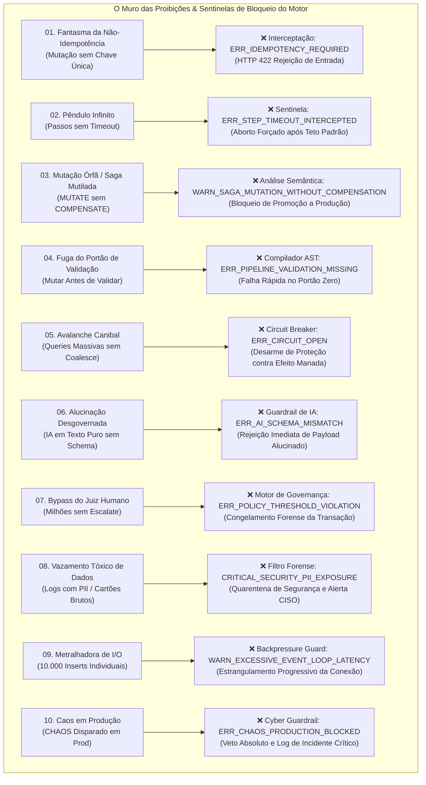

---

### Anti-Padrão 1: O Fantasma da Não-Idempotência (*The Ghost Mutation*)
* **Nível Normativo:** ⛔ **`[PROIBIDO]`**
* **A Prática Proibida:** Enviar intenções de pagamento, débito em conta corrente ou baixa de estoque sem declarar cabeçalhos ou cláusulas de idempotência (`X-Idempotency-Key` ou `DEDUPLICATE`).
* **A Catástrofe:** Em caso de oscilação de sinal 4G/5G, o aplicativo do cliente não recebe o ACK aos 3.999ms e retransmite a requisição. Sem idempotência, o motor processa a requisição novamente, debitando a conta do cliente duas, três ou quatro vezes pelo mesmo produto.
* **Pena e Sanção do Motor:** O motor em modo estrito de conformidade rejeita a intenção no estágio de pré-voo com código fatal `ERR_IDEMPOTENCY_REQUIRED` (HTTP 422).
* **Traceback Típico do Motor:**
  ```json
  {
    "status": "REJECTED",
    "errorCode": "ERR_IDEMPOTENCY_REQUIRED",
    "stage": "STAGE_02_SYNTACTIC_VALIDATION",
    "message": "Mutating intent 'PagarPix' rejected: Missing mandatory 'X-Idempotency-Key' header or 'DEDUPLICATE' step in production mode."
  }
  ```
* **Correção Canônica:** Declarar `IDEMPOTENCY: "${headers.X-Idempotency-Key}"` no cabeçalho e `DEDUPLICATE` no primeiro passo.

---

### Anti-Padrão 2: O Pêndulo Infinito (*The Infinite Hang*)
* **Nível Normativo:** ⛔ **`[PROIBIDO]`**
* **A Prática Proibida:** Declarar chamadas de rede, consultas remotas ou invocações de microsserviços sem especificar a cláusula de tempo limite (`TIMEOUT`).
* **A Catástrofe:** Se o serviço remoto entrar em lentidão severa, centenas de conexões permanecem abertas aguardando pacotes TCP que nunca chegam. Em poucos segundos, os descritores de arquivo e a memória RAM da máquina se esgotam, derrubando toda a aplicação.
* **Pena e Sanção do Motor:** O Watchdog de ciclo de vida do motor força a terminação imediata do socket no teto máximo de emergência (30.000ms), emitindo `ERR_STEP_TIMEOUT_INTERCEPTED` e registrando a infração na telemetria.
* **Traceback Típico do Motor:**
  ```json
  {
    "status": "ABORTED",
    "errorCode": "ERR_STEP_TIMEOUT_INTERCEPTED",
    "stepIndex": 2,
    "durationMs": 30000,
    "message": "Watchdog terminated socket: Step 'ConsultarBureau' hung without explicit TIMEOUT."
  }
  ```
* **Correção Canônica:** Inserir `TIMEOUT: 1500ms` em todos os passos com chamadas externas ou I/O.

---

### Anti-Padrão 3: A Mutação Órfã / Saga Mutilada (*The Uncompensated Mutation*)
* **Nível Normativo:** ⛔ **`[PROIBIDO em Produção]`**
* **A Prática Proibida:** Executar o verbo `MUTATE` para alterar o banco de dados sem fornecer o bloco correspondente de reversão (`COMPENSATE`).
* **A Catástrofe:** Se a intenção reservar o saldo na conta no passo 1 e falhar no passo 3 ao emitir o bilhete aéreo, o dinheiro do cliente fica retido para sempre, sem passagem emitida e sem estorno automático.
* **Pena e Sanção do Motor:** O compilador semântico de contratos emite o alerta severo `WARN_SAGA_MUTATION_WITHOUT_COMPENSATION` e bloqueia a promoção da intenção para o ambiente de produção via pipeline CI/CD.
* **Traceback Típico do Motor:**
  ```json
  {
    "status": "COMPILATION_ERROR",
    "errorCode": "WARN_SAGA_MUTATION_WITHOUT_COMPENSATION",
    "step": "reservarAssento",
    "message": "Strict Saga Policy Violation: 'MUTATE' step must declare a 'COMPENSATE' block before deployment to production."
  }
  ```
* **Correção Canônica:** Adicionar `COMPENSATE: { action: "cancelarReserva", params: { ... } }` logo abaixo da ação de mutação.

---

### Anti-Padrão 4: A Fuga do Portão de Validação (*Premature State Mutation*)
* **Nível Normativo:** ⛔ **`[PROIBIDO]`**
* **A Prática Proibida:** Iniciar a intenção executando escritas em disco ou chamadas de microsserviços antes de invocar `VALIDATE` ou checar o schema do payload.
* **A Catástrofe:** O banco de dados é atingido por payloads incompletos ou corrompidos (CPFs vazios, strings injetadas, valores negativos). Horas de trabalho de limpeza de banco e recursos computacionais nobres são desperdiçados.
* **Pena e Sanção do Motor:** O compilador emite o erro estrutural `ERR_PIPELINE_VALIDATION_MISSING` durante a análise estática da AST da intenção.
* **Correção Canônica:** Posicionar o verbo `VALIDATE` obrigatoriamente na Zona 2 (Pré-Voo), como o primeiro passo executável da esteira.

---

### Anti-Padrão 5: A Avalanche Canibal (*Thundering Herd Suicide*)
* **Nível Normativo:** ⛔ **`[PROIBIDO em Rotas Públicas]`**
* **A Prática Proibida:** Configurar consultas diretas a tabelas relacionais em rotas públicas sujeitas a picos de tráfego, sem o uso de `COALESCE` ou `MEMOIZE`.
* **A Catástrofe:** Em uma liquidação relâmpago, 20.000 clientes acessam a mesma página de produto simultaneamente. O banco relacional recebe 20.000 queries idênticas de `SELECT`, o pool de conexões se esgota e o banco desliga por exaustão de CPU.
* **Pena e Sanção do Motor:** O *Circuit Breaker Registry* desarma o circuito imediatamente com o código `ERR_CIRCUIT_OPEN`, ativando a resposta rápida de degradação graciosa (*Fast-Fail*).
* **Correção Canônica:** Encapsular a consulta sob o verbo `COALESCE { key: "produto:${id}", ttl: 3000ms }`.

---

### Anti-Padrão 6: A Alucinação Desgovernada (*Unhinged AI Invocation*)
* **Nível Normativo:** ⛔ **`[PROIBIDO]`**
* **A Prática Proibida:** Executar o verbo cognitivo `REASON` ou alimentar pipelines automatizados com LLMs esperando texto livre sem amarrar a resposta com um `outputSchema` JSON rigoroso.
* **A Catástrofe:** A inteligência artificial responde com uma introdução educada em markdown ("*Olá! Com certeza, aqui está a sua análise...*") no meio de um pipeline que esperava um booleano, quebrando os parsers downstream.
* **Pena e Sanção do Motor:** O guardião cognitivo descarta a resposta malformada com o código `ERR_AI_SCHEMA_MISMATCH` e aciona o ramo de emergência.
* **Correção Canônica:** Declarar o schema estrito no parâmetro `outputSchema` do verbo `REASON`.

---

### Anti-Padrão 7: O Bypass do Juiz Humano (*Unsupervised Million-Dollar Action*)
* **Nível Normativo:** ⛔ **`[PROIBIDO]`**
* **A Prática Proibida:** Permitir que transações financeiras multimilionárias ou transferências internacionais de alto risco sejam autorizadas sem a cláusula de escalonamento (`ESCALATE` ou `CONSENSUS`).
* **A Catástrofe:** Um bug na precificação ou uma fraude elaborada esvazia os cofres da empresa em segundos, sem dar chance a operadores humanos de auditar ou intervir.
* **Pena e Sanção do Motor:** As políticas de conformidade do motor interceptam a operação com o código `ERR_POLICY_THRESHOLD_VIOLATION`, travando os fundos em quarentena.
* **Correção Canônica:** Incluir uma cláusula `CONDITION` verificando o valor limite e acionando `ESCALATE`.

---

### Anti-Padrão 8: O Vazamento Tóxico de Dados (*Unredacted Forensics Leak*)
* **Nível Normativo:** ⛔ **`[PROIBIDO]`**
* **A Prática Proibida:** Gravar dumps de payloads brutos em arquivos de log ou tabelas de telemetria sem antes expurgar senhas, cartões e tokens através de `REDACT` ou `MASK`.
* **A Catástrofe:** Desenvolvedores, analistas de suporte ou invasores com acesso aos logs de aplicação conseguem visualizar credenciais e números de cartão de crédito em texto claro, gerando multas catastróficas da ANPD e descredenciamento do PCI Council.
* **Pena e Sanção do Motor:** O scanner de conformidade do motor sinaliza a violação `CRITICAL_SECURITY_PII_EXPOSURE`, mascarando os campos na força bruta e gerando notificação para o CISO.
* **Correção Canônica:** Executar `REDACT` e `MASK` imediatamente antes de qualquer instrução de `AUDIT`.

---

### Anti-Padrão 9: A Metralhadora de I/O (*Chatty I/O Blast*)
* **Nível Normativo:** ⛔ **`[PROIBIDO]`**
* **A Prática Proibida:** Processar uma lista de 10.000 clientes disparando 10.000 mutações unitárias isoladas em vez de utilizar o verbo `BATCH` ou `ENQUEUE`.
* **A Catástrofe:** O *Event Loop* do Node.js sofre de inanição (*Event Loop Starvation*), a latência da aplicação dispara de 2ms para 45.000ms e requisições de outros clientes começam a falhar por timeout.
* **Pena e Sanção do Motor:** O mecanismo de *Backpressure* detecta atraso crítico no ciclo de eventos e emite o alerta operacional `WARN_EXCESSIVE_EVENT_LOOP_LATENCY`, estrangulando novas requisições daquele IP.
* **Correção Canônica:** Utilizar `BATCH { items: "${lista}", batchSize: 200, parallel: 4 }`.

---

### Anti-Padrão 10: O Caos em Produção (*Production Chaos Triggering*)
* **Nível Normativo:** ⛔ **`[PROIBIDO]`**
* **A Prática Proibida:** Declarar ou acionar o verbo de injeção de falhas controladas (`CHAOS`) apontando para um ambiente onde `NODE_ENV === 'production'`.
* **A Catástrofe:** Latências artificiais e exceções simuladas são injetadas contra transações de clientes reais de carne e osso, gerando perdas financeiras diretas e quebra de SLA contratual.
* **Pena e Sanção do Motor:** O Guardrail nativo cibernético bloqueia a execução no instante zero com a exceção fatal `ERR_CHAOS_PRODUCTION_BLOCKED`, gravando o incidente no log de auditoria de segurança da empresa.
* **Traceback Típico do Motor:**
  ```json
  {
    "status": "FATAL_SECURITY_HALT",
    "errorCode": "ERR_CHAOS_PRODUCTION_BLOCKED",
    "environment": "production",
    "message": "CYBER GUARD SECURITY HALT: Verb 'CHAOS' invocation is categorically prohibited in production environment."
  }
  ```
* **Correção Canônica:** Executar `CHAOS` única e exclusivamente em ambientes de staging, homologação e simuladores isolados de teste.

---

## 8.6 Guia Temporal Causal: QUANDO Fazer (Gatilhos e Estágios Adequados)

A arquitetura do INP Protocol obedece a uma **Linha Temporal Causal Estrita**. Uma intenção não é apenas uma lista de passos: é uma jornada de 4 fases de voo onde cada ação possui o seu momento cronológico correto. Executar uma ação no momento errado é tão perigoso quanto executá-la de forma incorreta.

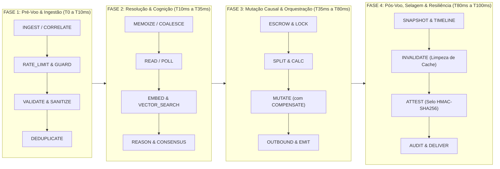

---

### Fase 1: Pré-Voo e Ingestão no Portão de Entrada (T0 a T10ms)
* **Gatilho Temporal Causal:** Exatamente no momento em que os bytes brutos da requisição cruzam o API Gateway ou balanceador de carga.
* **Classificação Normativa das Ações:**
  * 🔴 **`[OBRIGATÓRIO]`**: `INGEST` (para normalização de headers), `VALIDATE` (para descarte de schemas inválidos no milissegundo zero) e `DEDUPLICATE` (para checagem de chave única se for mutação).
  * 🟡 **`[DE PREFERÊNCIA]`**: `RATE_LIMIT` (proteção de vazão por IP/chave) e `GUARD` / `CHALLENGE` (firewall de botnets e sanitização de inputs).
* **Regra de Ouro Temporal Inegociável:** **Nenhuma conexão de banco de dados para escrita pode ser aberta nesta fase.**

---

### Fase 2: Resolução, Cache e Preparação Cognitiva (T10ms a T35ms)
* **Gatilho Temporal Causal:** Logo após a aprovação de todos os critérios do pré-voo, quando é necessário enriquecer o contexto da intenção com dados existentes.
* **Classificação Normativa das Ações:**
  * 🔴 **`[OBRIGATÓRIO]`**: `READ` com `TIMEOUT` explícito e `outputSchema` rígido caso `REASON` seja acionado.
  * 🟡 **`[DE PREFERÊNCIA]`**: `COALESCE` e `MEMOIZE` para leituras quentes concorrentes; `EMBED` e `VECTOR_SEARCH` para enriquecimento semântico offline; `POLL` cooperativo com backoff.
* **Regra de Ouro Temporal Inegociável:** **Toda leitura nesta fase deve ser livre de bloqueios (*lock-free*), garantindo tempo de resposta sub-milissegundo.**

---

### Fase 3: Mutação Causal e Orquestração Transacional (T35ms a T80ms)
* **Gatilho Temporal Causal:** Somente e exclusivamente após os dados terem sido validados, o contexto recuperado e as regras de autorização aprovadas.
* **Classificação Normativa das Ações:**
  * 🔴 **`[OBRIGATÓRIO]`**: Todo `MUTATE` deve declarar seu bloco `COMPENSATE` correspondente; rateios com `SPLIT` devem usar reconciliação de centavos; `OUTBOUND` deve possuir `CIRCUIT_BREAK`.
  * 🟡 **`[DE PREFERÊNCIA]`**: Uso de `ESCROW` para custódia temporária antes da liberação definitiva; emissão de eventos leves via `EMIT`.
* **Regra de Ouro Temporal Inegociável:** **Se qualquer passo nesta fase falhar, a execução é interrompida imediatamente e o motor dispara a Saga Reversa LIFO para restaurar o estado.**

---

### Fase 4: Pós-Voo, Selagem Criptográfica e Resiliência Forense (T80ms a T100ms)
* **Gatilho Temporal Causal:** Imediatamente após a confirmação do sucesso das mutações ou no fechamento da transação compensada.
* **Classificação Normativa das Ações:**
  * 🔴 **`[OBRIGATÓRIO]`**: Emissão de fé pública digital via `ATTEST` (com digest HMAC/SHA-256) e registro no livro-razão `AUDIT` com campos sensíveis mascarados.
  * 🟡 **`[DE PREFERÊNCIA]`**: Purgar seletivamente chaves ou tags do cache via `INVALIDATE`; captura de estado fotográfico via `SNAPSHOT` e registro no `TIMELINE`.
* **Regra de Ouro Temporal Inegociável:** **O atestado de entrega final só é transmitido ao cliente após a garantia de persistência da trilha de auditoria.**

---

## 8.7 Guia de Vetos Críticos: QUANDO NÃO Fazer (Cenários de Risco e Incompatibilidades)

Tão vital quanto saber o momento certo de agir é conhecer as **situações de emergência e veto absoluto**, nas quais determinadas ações **JAMAIS** devem ser executadas, sob risco de colapso de infraestrutura, inconsistência contábil ou penalidades regulatórias severas.

---

### Veto 1: NUNCA Mutar Estado se o Circuito Estiver Aberto (`CIRCUIT_OPEN`)
* **Status Normativo:** ⛔ **`[VETO CRÍTICO OBRIGATÓRIO]`**
* **O Cenário de Risco:** Um serviço parceiro (ex.: processadora de cartões ou provedor de KYC) começou a retornar erros 503 sucessivos e o Circuit Breaker entrou em estado de abertura (*OPEN*).
* **O Rationale do Kernel:** Tentar forçar a execução de `MUTATE` ou `OUTBOUND` ignorando o circuito aberto gera acúmulo de requisições presas, esgota o pool de sockets TCP e impede que o serviço remoto se recupere.
* **A Conduta Alternativa Canônica:** Ativar imediatamente o caminho alternativo declarado no bloco `FALLBACK` ou enfileirar a intenção via `ENQUEUE` / `DEFER` para processamento assíncrono posterior.

---

### Veto 2: NUNCA Injetar Caos (`CHAOS`) em Ambientes Produtivos
* **Status Normativo:** ⛔ **`[VETO CRÍTICO OBRIGATÓRIO]`**
* **O Cenário de Risco:** Um pipeline de testes de resiliência foi acidentalmente promovido para produção com flags de engenharia do caos ativas.
* **O Rationale do Kernel:** Latências simuladas e falhas artificiais atingirão transações de clientes reais de carne e osso, gerando prejuízos financeiros e quebra de SLA contratual.
* **A Resposta do Kernel:** O Guardrail nativo cibernético aborta o passo no milissegundo zero emitindo `ERR_CHAOS_PRODUCTION_BLOCKED`.
* **A Conduta Alternativa Canônica:** Confinar o verbo `CHAOS` a ambientes de staging, homologação e simuladores isolados de teste.

---

### Veto 3: NUNCA Executar Viagem no Tempo (`TIME_TRAVEL` / `REPLAY`) com Sockets Conectados a Serviços Vivos
* **Status Normativo:** ⛔ **`[VETO CRÍTICO OBRIGATÓRIO]`**
* **O Cenário de Risco:** Um desenvolvedor ou perito forense está executando `REPLAY` ou `TIME_TRAVEL` para reproduzir um incidente da semana passada.
* **O Rationale do Kernel:** Disparar uma reprodução histórica com saídas `OUTBOUND` ou `EMIT` conectadas a gateways bancários reais causa duplicação de pagamentos e envio de e-mails indesejados para clientes da vida real.
* **A Conduta Alternativa Canônica:** Executar a viagem no tempo em modo estritamente simulado (*Dry-Run* / Sandbox), redirecionando todos os adaptadores de saída para coletores mockados em memória.

---

### Veto 4: NUNCA Executar Rateio (`SPLIT`) ou Custódia (`ESCROW`) com Saldo Não Verificado
* **Status Normativo:** ⛔ **`[VETO CRÍTICO OBRIGATÓRIO]`**
* **O Cenário de Risco:** Uma intenção recebe ordem para dividir um pagamento de R$ 500,00 entre vendedor e plataforma antes de checar se a conta tem fundos suficientes.
* **O Rationale do Kernel:** Executar rateio ou retenção de valores inexistentes corrompe a integridade contábil e gera conciliação fantasma no livro-razão.
* **A Conduta Alternativa Canônica:** Confinar `SPLIT` e `ESCROW` à **Fase 3**, logo após a aprovação incontestável das etapas de leitura de saldo e autorização bancária.

---

### Veto 5: NUNCA Disparar Webhooks Externos (`OUTBOUND` / `EMIT`) Antes do Commit Efetivo no Banco
* **Status Normativo:** ⛔ **`[VETO CRÍTICO OBRIGATÓRIO]`**
* **O Cenário de Risco:** Uma intenção dispara uma notificação HTTP para a loja avisando que o pedido foi pago, mas a transação no banco de dados local ainda está aberta e sujeita a rollback.
* **O Rationale do Kernel:** Se o banco local sofrer deadlock logo após o disparo do webhook, a loja acreditará que a compra foi paga, enquanto o seu sistema não terá nenhum registro no banco.
* **A Conduta Alternativa Canônica:** Posicionar `OUTBOUND` e `EMIT` sempre ao final da Fase 3 ou início da Fase 4, após o commit transacional bem-sucedido.

---

### Veto 6: NUNCA Executar Invalidação de Cache Cega em Massa (`INVALIDATE *`) em Horários de Pico
* **Status Normativo:** ⛔ **`[VETO CRÍTICO OBRIGATÓRIO]`**
* **O Cenário de Risco:** Um operador atualiza uma tabela e executa uma purga geral de todo o cache (`flushAll`) às 14h de uma Black Friday.
* **O Rationale do Kernel:** Milhares de requisições simultâneas subsequentes sofrem *Cache Miss* e atingem o banco de dados de uma vez, derrubando os servidores por avalanche canibal.
* **A Conduta Alternativa Canônica:** Utilizar invalidação cirúrgica orientada por tags ou chaves precisas (`INVALIDATE { key: "produto:${id}" }`), ou configurar TTL escalonado (*Staggered TTL*).

---

### Veto 7: NUNCA Iniciar Sagas Sem Compensadores de Limpeza em Filas de Mensagens
* **Status Normativo:** ⛔ **`[VETO CRÍTICO OBRIGATÓRIO]`**
* **O Cenário de Risco:** Uma mensagem é consumida de uma fila SQS/Kafka e falha permanentemente por dados inválidos, mas volta ao início da fila para ser reprocessada em loop infinito (*Poison Pill*).
* **O Rationale do Kernel:** Mensagens venenosas travam todos os consumidores da fila, gerando filas quilométricas e atrasos catastróficos no sistema.
* **A Conduta Alternativa Canônica:** Equipar o consumidor com o verbo `QUARANTINE` e despachar a mensagem envenenada para a Dead Letter Queue (DLQ) com alerta operacional.

---

## 8.8 Matriz Operacional Cruzada de Conduta (O Que Fazer, O Que Não Fazer, Quando Fazer e Quando Não Fazer)

A matriz abaixo consolida de forma prática e cirúrgica as diretrizes de conduta para as **10 Dimensões Operacionais Críticas** do motor do INP Protocol, vinculando cada diretriz ao seu **Nível Normativo Formal**.

| # | Dimensão Operacional | Nível Normativo | O Que Fazer (Mandatório / Recomendado) | O Que NÃO Fazer (Proibido) | QUANDO Fazer (Momento Causal) | QUANDO NÃO Fazer (Veto Estrito) |
| :-: | :--- | :---: | :--- | :--- | :--- | :--- |
| **1** | **Ingestão & Tráfego Externo** | 🔴 **`[OBRIGATÓRIO]`** | Usar `INGEST`, `DEDUPLICATE`, `RATE_LIMIT` e `VALIDATE` na porta de entrada. | Deixar payloads sem validação ou sem chave única de idempotência. | **Fase 1 (Pré-Voo)**: Nos primeiros 10ms da requisição. | **Após o início de mutações**: Não valide schemas no meio de uma transação. |
| **2** | **Consultas & Leitura de Dados** | 🟡 **`[DE PREFERÊNCIA]`** | Usar `COALESCE` e `MEMOIZE` para dados quentes e concorrentes. | Permitir que 10.000 requisições simultâneas batam no banco relacional. | **Fase 2 (Resolução)**: Antes de qualquer decisão de negócio. | **Em tabelas com lock de escrita**: Evite leituras não-otimizadas com transações abertas. |
| **3** | **Mutações & Transações (Sagas)** | 🔴 **`[OBRIGATÓRIO]`** | Equipar todo `MUTATE` com seu bloco `COMPENSATE` correspondente. | Alterar estado no banco sem definir como desfazer o passo. | **Fase 3 (Mutação)**: Apenas com dados validados e limites conferidos. | **Se o circuito estiver aberto**: Nunca tente gravar dados em serviços em colapso. |
| **4** | **Engenharia Financeira & Custódia** | 🔴 **`[OBRIGATÓRIO]`** | Usar `SPLIT` com reconciliação de centavos e `ESCROW` com selo HMAC. | Fazer divisões flutuantes (`/ 3`) com perda de centavos ou sem caução. | **Fase 3 (Mutação)**: Após autorização e checagem de saldo da conta. | **Antes de checar saldo**: Jamais custodie ou divida valores inexistentes. |
| **5** | **Conectividade Externa & Webhooks** | 🔴 **`[OBRIGATÓRIO]`** | Declarar `TIMEOUT` estrito e encapsular chamadas com `CIRCUIT_BREAK`. | Deixar chamadas HTTP sem timeout aguardando sockets infinitamente. | **Fase 3 (Mutação)**: Logo após a confirmação transacional local. | **Antes do commit local**: Nunca envie webhooks antes de gravar no banco. |
| **6** | **Memória Volátil & Cache** | 🟡 **`[DE PREFERÊNCIA]`** | Usar `INVALIDATE` cirúrgico por tag ou chave específica. | Executar limpeza cega global (`*`) derrubando toda a camada de cache. | **Fase 4 (Pós-Voo)**: Logo após a confirmação de sucesso da mutação. | **Em horários de pico**: Nunca purgue o cache em momentos de alta concorrência. |
| **7** | **Inteligência Artificial & Vetores** | 🔴 **`[OBRIGATÓRIO]`** | Usar `REASON`, `EMBED` e `VECTOR_SEARCH` com contrato `outputSchema`. | Aceitar respostas em texto puro de LLMs em fluxos automatizados. | **Fase 2 (Cognição)**: Durante a triagem e avaliação de risco. | **Com dados brutos não higienizados**: Nunca envie senhas ou PII para o modelo de IA. |
| **8** | **Filas, Barramentos & Quarentena** | 🔴 **`[OBRIGATÓRIO]`** | Usar `ENQUEUE` e enviar falhas persistentes para `QUARANTINE` (DLQ). | Retentar mensagens venenosas em loop infinito travando a fila. | **Fase 3 ou Falhas**: Para processamento em segundo plano e isolamento. | **Sem política de descarte**: Não enfileire tarefas sem TTL ou limite de tentativas. |
| **9** | **Resiliência & Engenharia do Caos** | 🔴 **`[OBRIGATÓRIO]`** | Usar `CHAOS` apenas em Staging/Testes com controle rígido de taxa de erro. | Executar testes de caos em ambiente produtivo real. | **Fase de Homologação**: Durante testes de estresse e validação de SLA. | **Em Produção (`NODE_ENV === 'production'`)**: Veto absoluto sob pena de erro fatal. |
| **10** | **Viagem no Tempo & Forense** | 🔴 **`[OBRIGATÓRIO]`** | Usar `ATTEST`, `SNAPSHOT`, `AUDIT` e `TIMELINE` com integridade SHA-256. | Executar `REPLAY` histórico com adaptadores conectados a serviços reais. | **Fase 4 (Selagem)**: No fechamento definitivo de cada intenção. | **Sem isolamento de sandbox**: Nunca faça replay de eventos tocando bancos reais. |

---

# PARTE 9: A Grande Aula de Sala de Aula — A Intenção Mestra com Desmembramento Microscópico

Chegou o momento mais aguardado de todo o livro. Puxe a sua cadeira, respire fundo e entre na nossa sala de aula interativa.

Vamos dissecar uma **Intenção Mestra do Mundo Real** linha por linha, caractere por caractere. Você vai entender a razão exata de cada chave, cada vírgula e cada verbo.

---

## 9.1 Boas-Vindas à Sala de Aula: O Cenário do Mundo Real

**O Desafio de Negócio:**
Imagine que você foi contratado como Arquiteto Chefe por um grande banco digital. A diretoria exige um sistema indestrutível para processar compras com cartão de débito. Os requisitos são impiedosos:
1. Deve suportar 50.000 pessoas tentando comprar ingressos no mesmo minuto (sem colapsar os servidores).
2. Não pode cobrar o cliente se não houver saldo.
3. Se o sistema de emissão de comprovantes falhar no final, o débito bancário deve ser desfeito imediatamente (*rollback automático*).
4. O cliente deve receber uma notificação no celular em tempo real.
5. Toda a operação precisa ser selada com fé pública criptográfica inviolável para fins de auditoria do Banco Central.

---

## 9.2 O Bloco Completo da Intenção Mestra

Aqui está o código completo da nossa intenção, exatamente como você digitaria no console ou no seu editor de código:

```inp
// ============================================================================
// INTENÇÃO MESTRA: PROCESSAMENTO DE COMPRA COM CARTÃO E AUDITORIA CRIPTOGRÁFICA
// ============================================================================
INTENT ProcessarCompraCartao {
  TARGET: "core-bancario"
  TIMEOUT: 8000ms
  IDEMPOTENCY: "${header.x-idempotency-key}"

  // PASSO 1: Proteção de vazão na entrada contra robôs e ataques maliciosos
  STEP limitarRequisicoes: RATE_LIMIT {
    key: "${context.ip}",
    limit: 60,
    window: 60,
    unit: "seconds"
  }

  // PASSO 2: Validar se a requisição contém os campos obrigatórios
  STEP validarDados: VALIDATE {
    data: "${payload}",
    schema: "schemas/compra_debito.json"
  }

  // PASSO 3: Consultar o saldo atual do cliente com Single-Flight (Coalesce)
  STEP consultarSaldo: COALESCE {
    key: "saldo-${payload.contaId}",
    action: FETCH { resource: "saldos_contas", id: "${payload.contaId}" }
  }

  // PASSO 4: Verificar matematicamente se o saldo cobre o valor da compra
  STEP checarSaldo: ASSERT {
    condition: "${consultarSaldo.saldo} >= ${payload.valor}",
    errorCode: "ERR_SALDO_INSUFICIENTE"
  }

  // PASSO 5: Debitar o valor na conta com garantia de estorno caso ocorra erro
  STEP debitarValor: MUTATE {
    service: "ledger-bancario",
    action: "debitar",
    payload: { contaId: "${payload.contaId}", valor: "${payload.valor}" },
    COMPENSATE: {
      action: "estornar",
      payload: { contaId: "${payload.contaId}", valor: "${payload.valor}" }
    }
  }

  // PASSO 6: Reservar o produto no estoque do lojista
  STEP reservarEstoque: MUTATE {
    service: "estoque-lojista",
    action: "reservar",
    payload: { sku: "${payload.sku}", quantidade: 1 },
    COMPENSATE: {
      action: "liberar",
      payload: { sku: "${payload.sku}", quantidade: 1 }
    }
  }

  // PASSO 7: Enviar notificação push para o celular do cliente
  STEP avisarCliente: NOTIFY {
    channel: "push_notification",
    recipient: "${payload.dispositivoId}",
    message: "Compra de R$ ${payload.valor} aprovada com sucesso!"
  }

  // PASSO 8: Emitir o atestado criptográfico com carimbo UTC e hash forense
  STEP emitirReciboForense: ATTEST {
    payload: {
      conta: "${payload.contaId}",
      valor: "${payload.valor}",
      sku: "${payload.sku}",
      timestamp: "${context.timestamp}"
    },
    signKeyId: "vault-chaves-bacen",
    algorithm: "SHA256withRSA"
  }
}
```

---

## 9.3 O Desmembramento Microscópico Linha por Linha

Vamos colocar nossa lupa cirúrgica sobre cada detalhe:

### Cabeçalho e Contrato Inicial:
- **Linha `INTENT ProcessarCompraCartao {`**: É o nascimento da intenção. O compilador reserva uma estrutura na memória e abre o escopo principal com a chave `{`.
- **Linha `TARGET: "core-bancario"`**: Especifica o domínio do negócio. O motor confere se o serviço bancário está operacional.
- **Linha `TIMEOUT: 8000ms`**: Se por qualquer razão externa essa transação demorar mais que 8 segundos, o motor cancela todos os sockets e devolve 504 Gateway Timeout.
- **Linha `IDEMPOTENCY: "${header.x-idempotency-key}"`**: Vincula a requisição ao identificador único enviado pelo aplicativo do celular. Se o cliente clicar duas vezes no botão de pagar, a segunda requisição é reconhecida e o motor devolve a resposta salva sem debitar a conta duas vezes.

### A Esteira de Execução (Passo a Passo):
- **Passo 1 (`STEP limitarRequisicoes: RATE_LIMIT`):** Verifica o IP do cliente. Se vierem mais de 60 requisições no mesmo minuto pelo mesmo IP, corta o tráfego com código HTTP 429 sem onerar o banco.
- **Passo 2 (`STEP validarDados: VALIDATE`):** O validador de schema confere se os campos `contaId`, `valor` e `sku` estão presentes e com tipos corretos. Requisições incompletas são descartadas em 0.01ms.
- **Passo 3 (`STEP consultarSaldo: COALESCE`):** Unifica consultas simultâneas na mesma conta. Se 50 requisições concorrentes chegarem juntas, apenas uma vai ao banco físico de dados.
- **Passo 4 (`STEP checarSaldo: ASSERT`):** Avaliação de invariante lógica. Se o saldo for de R$ 50 e a compra de R$ 100, interrompe o fluxo imediatamente com erro de saldo insuficiente.
- **Passo 5 (`STEP debitarValor: MUTATE` com `COMPENSATE`):** Executa o débito no saldo e empilha na memória a receita exata de como estornar esse dinheiro caso o passo seguinte falhe.
- **Passo 6 (`STEP reservarEstoque: MUTATE` com `COMPENSATE`):** Reserva o produto no estoque do lojista. Se a loja parceira estiver fora do ar, o motor aciona o compensador do Passo 5 e devolve o dinheiro do cliente na mesma hora!
- **Passo 7 (`STEP avisarCliente: NOTIFY`):** Dispara a mensagem para o aplicativo móvel do cliente em segundo plano de forma não-bloqueante.
- **Passo 8 (`STEP emitirReciboForense: ATTEST`):** Gera o atestado criptográfico inviolável com assinatura digital e carimbo de tempo, servindo como comprovante oficial incontestável perante órgãos reguladores.
- **Última Linha `}`**: Fecha o bloco da intenção. O compilador sela a árvore sintática e libera a resposta de 200 OK com os dados estruturados para o cliente.

---

## 9.4 Perguntas e Respostas Frequentes do Aluno Iniciante

**P: E se a internet cair exatamente no Passo 6 (Reserva de Estoque)?**
*R:* O motor detecta o erro e dispara imediatamente a Saga Reversa: executa a cláusula `COMPENSATE` do Passo 5 (`estornar`). O dinheiro volta para a conta do cliente e o sistema devolve uma resposta amigável avisando que o produto não pôde ser reservado, sem nenhuma inconsistência financeira!

**P: Por que usar aspas em `"core-bancario"` e não usar em `8000ms`?**
*R:* Porque textos livres (strings) precisam de aspas para o computador saber que são palavras literais; já durações como `8000ms` ou números como `42` são valores tipados que o compilador calcula diretamente.

**P: O que significa o símbolo `${payload.valor}`?**
*R:* É a interpolação dinâmica de variáveis. Diz ao motor: *"Vá na caixa de dados que o cliente enviou (`payload`) e pegue o valor do campo `valor`"*.

---

# PARTE 10: Quatro Exemplos Práticos Progressivos Completos (Do Simples ao Master Anti-Headache)

Aprender com exemplos progressivos é o caminho mais sólido para a maestria. Abaixo, apresentamos três intenções completas prontas para produção: um fluxo simples, um fluxo intermediário com Saga transacional e uma orquestração avançada com Inteligência Artificial, streaming e governança humana.

---

## 10.1 Exemplo 1 (Simples): Consulta de Usuário com Validação e Cache

Este exemplo mostra como criar uma consulta de dados ultra-rápida, protegida contra requisições malformadas e acelerada por cache em memória.

```inp
// ============================================================================
// EXEMPLO 1: CONSULTA DE PERFIL COM VALIDAÇÃO E MEMOIZAÇÃO EM CACHE
// ============================================================================
INTENT ObterPerfilUsuario {
  TARGET: "usuarios-service"
  TIMEOUT: 3000ms
  IDEMPOTENCY: "${header.x-request-id}"

  // PASSO 1: Validar que o ID do usuário é um formato válido antes de gastar I/O
  STEP validarEntrada: VALIDATE {
    data: "${payload}",
    schema: {
      "required": ["userId"],
      "properties": {
        "userId": { "type": "string", "minLength": 5 }
      }
    }
  }

  // PASSO 2: Buscar o perfil usando cache em memória de 5 minutos (300 segundos)
  STEP carregarDados: MEMOIZE {
    key: "perfil-${payload.userId}",
    ttl: 300,
    action: FETCH {
      resource: "tabela_clientes",
      id: "${payload.userId}"
    }
  }
}
```

### O Que Aprendemos no Exemplo 1:
- O passo `validarEntrada` usa o verbo `VALIDATE` para barrar requisições vazias antes que elas toquem no banco de dados.
- O passo `carregarDados` usa o verbo `MEMOIZE` para armazenar o perfil na memória. Na primeira vez, ele lê o banco em 15ms. Das vezes seguintes, responde em **0.005ms**, economizando 99.9% de processamento!

---

## 10.2 Exemplo 2 (Intermediário): Transferência Bancária com Bifurcação e Saga

Aqui elevamos o nível. Vamos construir uma transferência financeira entre duas contas bancárias com:
1. Busca paralela das contas de origem e destino (`PARALLEL`);
2. Teste lógico para verificar se o saldo é suficiente (`ASSERT`);
3. Débito na conta de origem com compensação de estorno automática (`MUTATE` + `COMPENSATE`);
4. Crédito na conta de destino com retentativa exponencial (`RETRY`);
5. Registro na cadeia de auditoria imutável (`AUDIT`).

```inp
// ============================================================================
// EXEMPLO 2: TRANSFERÊNCIA BANCÁRIA COM CONCORRÊNCIA E ROLLBACK GARANTIDO
// ============================================================================
INTENT TransferenciaBancariaSegura {
  TARGET: "core-bancario"
  TIMEOUT: 5000ms
  IDEMPOTENCY: "${header.x-idempotency-key}"

  // PASSO 1: Buscar o saldo da conta de origem e os dados da conta destino ao mesmo tempo
  STEP buscarContas: PARALLEL {
    steps: [
      FETCH { resource: "contas", id: "${payload.contaOrigemId}" },
      FETCH { resource: "contas", id: "${payload.contaDestinoId}" }
    ]
  }

  // PASSO 2: Garantir que a conta de origem tem saldo suficiente para a transferência
  STEP checarSaldo: ASSERT {
    condition: "${buscarContas.contas[0].saldo} >= ${payload.valor}",
    errorCode: "ERR_SALDO_INSUFICIENTE"
  }

  // PASSO 3: Retirar o dinheiro da conta de origem (com plano de estorno se o crédito falhar!)
  STEP debitarOrigem: MUTATE {
    service: "ledger-service",
    action: "debitar",
    payload: { contaId: "${payload.contaOrigemId}", valor: "${payload.valor}" },
    
    // REDE DE SEGURANÇA: Se o passo seguinte falhar, devolva o dinheiro imediatamente!
    COMPENSATE: {
      action: "creditar",
      payload: { contaId: "${payload.contaOrigemId}", valor: "${payload.valor}" }
    }
  }

  // PASSO 4: Depositar o dinheiro na conta de destino
  STEP creditarDestino: MUTATE {
    service: "ledger-service",
    action: "creditar",
    payload: { contaId: "${payload.contaDestinoId}", valor: "${payload.valor}" },
    
    // Retentativa automática com recuo caso a rede do banco oscile
    RETRY: { maxAttempts: 3, backoff: "exponential" }
  }

  // PASSO 5: Registrar na ata imutável de conformidade bancária
  STEP registrarAuditoria: AUDIT {
    action: "PIX_TRANSFERENCIA_CONCLUIDA",
    severity: "HIGH",
    details: {
      origem: "${payload.contaOrigemId}",
      destino: "${payload.contaDestinoId}",
      valor: "${payload.valor}"
    }
  }
}
```

### O Que Aprendemos no Exemplo 2:
- O bloco `PARALLEL` executa duas leituras ao mesmo tempo, cortando o tempo de espera pela metade.
- O verbo `ASSERT` protege a empresa contra fraudes: se o cliente tiver R$ 50 e tentar transferir R$ 100, o processo é abortado no ato.
- O `COMPENSATE` garante que se a internet oscilar antes do Passo 4, o dinheiro do Passo 3 volta para a conta do cliente sem precisar de chamado no suporte!

---

## 10.3 Exemplo 3 (Avançado/Enterprise): Processamento de Pedido com IA, Streaming e HITL

Este é o padrão de ouro da computação mundial moderna: orquestração de missão crítica de alta escala unindo proteção anti-estresse, Inteligência Artificial deliberativa, streaming de resposta em tempo real e supervisão humana com atestação criptográfica.

```inp
// ============================================================================
// EXEMPLO 3: ORQUESTRAÇÃO ENTERPRISE COM RESILIÊNCIA, IA E GOVERNANÇA HUMANA
// ============================================================================
INTENT OrquestracaoEnterpriseResiliente {
  TARGET: "enterprise-gateway"
  TIMEOUT: 12000ms
  IDEMPOTENCY: "${header.x-transaction-uuid}"

  // PASSO 1: Proteção de perímetro contra robôs (máximo 30 chamadas por minuto por IP)
  STEP barreiraRateLimit: RATE_LIMIT {
    key: "${context.ip}",
    limit: 30,
    window: 60,
    unit: "seconds"
  }

  // PASSO 2: Autenticar a identidade do operador corporativo
  STEP autenticarOperador: AUTHENTICATE {
    token: "${header.authorization}",
    provider: "corporate-sso"
  }

  // PASSO 3: Consulta ao contrato com Coalesce (Single-Flight) para poupar o banco
  STEP obterContrato: COALESCE {
    key: "contrato-${payload.contratoId}",
    action: FETCH { resource: "contratos", id: "${payload.contratoId}" }
  }

  // PASSO 4: Transmissão ao vivo do resumo analítico gerado pela IA via Server-Sent Events
  STEP streamingAnalise: STREAM {
    service: "ai-llm-engine",
    prompt: "Gere o sumario executivo das clausulas do contrato: ${obterContrato.texto}",
    chunkEvent: "resumo_token",
    flushIntervalMs: 30
  }

  // PASSO 5: Raciocínio deliberativo da IA (Chain-of-Thought) avaliando o risco financeiro
  STEP analiseCognitivaRisco: REASON {
    context: { contrato: "${obterContrato}", historico: "${payload.historico}" },
    goal: "Calcular o risco de inadimplencia e apontar divergencias regulatórias",
    outputSchema: {
      aprovadoAutomatico: "boolean",
      scoreRisco: "number",
      parecerTecnico: "string"
    }
  }

  // PASSO 6: Se o risco for alto, suspender o fluxo e acionar a governança humana (HITL)
  STEP governancaDiretoria: CONDITIONAL {
    condition: "${analiseCognitivaRisco.aprovadoAutomatico} == false",
    then: ESCALATE {
      severity: "CRITICAL",
      reason: "Alerta de conformidade: ${analiseCognitivaRisco.parecerTecnico}",
      timeoutSeconds: 3600, // 1 hora de tolerância para o diretor assinar
      callbackUrl: "https://compliance.empresa.com/webhooks/aprovacoes",
      fallbackAction: "REJECT"
    },
    else: READ { target: "compliance.aprovadoPorRegra" }
  }

  // PASSO 7: Disjuntor rápido de proteção protegendo a emissão de nota fiscal
  STEP emitirDocumentoFiscal: CIRCUIT_BREAKER {
    serviceId: "sefaz-integrador",
    threshold: 4,
    resetTimeout: 45000,
    action: MUTATE {
      service: "faturamento",
      action: "emitirNota",
      payload: { contratoId: "${payload.contratoId}", valor: "${obterContrato.valor}" },
      COMPENSATE: { action: "cancelarNota", payload: { nfeId: "${emitirDocumentoFiscal.nfeId}" } }
    }
  }

  // PASSO 8: Gerar o atestado de fé pública criptográfica inviolável com assinatura HSM
  STEP atestacaoForense: ATTEST {
    payload: {
      contratoId: "${payload.contratoId}",
      operador: "${autenticarOperador.userId}",
      scoreIA: "${analiseCognitivaRisco.scoreRisco}",
      nfeId: "${emitirDocumentoFiscal.nfeId}"
    },
    signKeyId: "vault-hsm-chaves-juridicas-2026",
    algorithm: "SHA256withRSA"
  }
}
```

### O Que Aprendemos no Exemplo 3:
- O `RATE_LIMIT` blinda a entrada contra ataques maliciosos.
- O `STREAM` entrega a resposta da IA na tela do usuário instantaneamente sem fazer o navegador congelar.
- O `REASON` força a IA a explicar o porquê da decisão em formato auditável.
- O `ESCALATE` coloca o ser humano no comando sempre que houver risco corporativo.
- O `ATTEST` sela o resultado com uma assinatura digital inviolável válida em juízo.

---

## 10.4 Exemplo 4 (Master Enterprise Anti-Headache): Pipeline Financeiro Indestrutível com Deduplicação, Canary, Quarentena e Reconciliação

Neste exemplo monumental de nível de engenharia sênior/enterprise, resolvemos em **uma única intenção declarativa** as maiores dores de cabeça da indústria de pagamentos e microsserviços:
1. **Deduplicação instantânea** de webhooks redundantes (`DEDUPLICATE`);
2. **Propagação de rastreabilidade unificada** W3C TraceContext (`CORRELATE`);
3. **Isolamento de tenant corporativo** contra vazamento de dados (`ISOLATE`);
4. **Deploy progressivo ponderado (Canary 15%)** com fallback automático (`CANARY`);
5. **Exclusão mútua local** protegendo o sequencial de concorrência (`MUTEX`);
6. **Anonimização LGPD/GDPR irreversível** de PII antes de analytics (`ANONYMIZE`);
7. **Batimento automático determinístico** entre livros contábeis (`RECONCILE`);
8. **Carimbo de auditoria imutável** com hash encadeado (`AUDIT`).

```inp
// ============================================================================
// EXEMPLO 4: MASTER PIPELINE ANTI-HEADACHE E ENTERPRISE RESILIENCE
// ============================================================================
INTENT ProcessamentoFinanceiroAntiHeadache {
  TARGET: "gateway-transacoes"
  TIMEOUT: 8000ms
  IDEMPOTENCY: "${header.x-webhook-uuid}"

  // PASSO 1: Expurgar webhooks e requisições repetidas na entrada (<0.05ms)
  STEP expurgarDuplicados: DEDUPLICATE {
    key: "${payload.transacaoId}",
    ttlMs: 60000,
    payload: "${payload}"
  }

  // PASSO 2: Amarrar toda a transação com rastreabilidade universal W3C TraceContext
  STEP propagarRastreio: CORRELATE {
    correlationId: "tx_${payload.transacaoId}",
    payload: "${payload}"
  }

  // PASSO 3: Segregar estritamente o cliente corporativo (Multi-Tenant Shield)
  STEP segregarOrganizacao: ISOLATE {
    tenantId: "${context.tenantId}",
    payload: "${payload}"
  }

  // PASSO 4: Roteamento Canary (15% para a nova versão do motor de pagamentos)
  STEP rotearCanary: CANARY {
    weight: 15,
    stableTarget: "pagamentos-v1-stable",
    canaryTarget: "pagamentos-v2-canary",
    payload: "${payload}"
  }

  // PASSO 5: Proteger a geração do sequencial fiscal com exclusão mútua ultrarrápida
  STEP travarSequencial: MUTEX {
    key: "lock-sequencial-fiscal-${context.tenantId}",
    timeoutMs: 2000
  }

  // PASSO 6: Anonimizar dados pessoais (LGPD/GDPR) antes de enviar para observabilidade
  STEP protegerPrivacidade: ANONYMIZE {
    fields: ["cpf", "cartaoCredito", "email"],
    salt: "segredo_master_compliance_2026",
    payload: "${payload}"
  }

  // PASSO 7: Reconciliar o lançamento local com o saldo de liquidação da adquirente
  STEP conciliarSaldos: RECONCILE {
    sourceA: "${rotearCanary.resultado}",
    sourceB: "${payload.liquidacaoAdquirente}",
    matchKey: "nsu"
  }

  // PASSO 8: Registrar o marco na cadeia de auditoria inviolável
  STEP carimbarAuditoria: AUDIT {
    action: "TRANSACAO_FINANCEIRA_PROCESSADA",
    severity: "HIGH",
    details: {
      transacaoId: "${payload.transacaoId}",
      tenant: "${context.tenantId}",
      versaoExecutada: "${rotearCanary.selectedRoute}",
      conciliado: "${conciliarSaldos.isBalanced}"
    }
  }
}
```

### O Que Aprendemos no Exemplo 4:
- O passo `expurgarDuplicados` (`DEDUPLICATE`) impede que o cliente seja cobrado duas vezes se a maquininha enviar o webhook repetido por instabilidade de rede.
- O passo `propagarRastreio` (`CORRELATE`) injeta o cabeçalho `traceparent`, facilitando diagnósticos imediatos no Datadog ou OpenTelemetry.
- O passo `segregarOrganizacao` (`ISOLATE`) impede matematicamente que os dados da Empresa A vazem para a Empresa B.
- O passo `rotearCanary` (`CANARY`) testa o código novo com 15% do tráfego sem risco de queda generalizada da empresa.
- O passo `travarSequencial` (`MUTEX`) evita race condition na numeração de faturas em nós concorrentes.
- O passo `protegerPrivacidade` (`ANONYMIZE`) blinda a companhia contra multas de milhões da LGPD e GDPR.
- O passo `conciliarSaldos` (`RECONCILE`) bate os valores automaticamente em tempo real, eliminando horas de conferência manual no fim do mês!

---

## 10.5 Exemplo 5 (Master Interoperabilidade & Conectores entre Sistemas): Ingestão de Webhooks, Adaptação SOAP/REST, Fan-in e Emissão Leve

Neste quinto exemplo de nível sênior, orquestramos um pipeline completo de **interoperabilidade e conectividade universal entre ecossistemas modernos e legados**:
1. **Ingestão com verificação de assinatura HMAC** de webhooks de pagamento (`INGEST`);
2. **Foto forense em memória do estado de entrada** (`SNAPSHOT`);
3. **Ponte de adaptação de dados** de SOAP/XML legado para JSON/REST moderno (`BRIDGE`);
4. **Coerção segura de valores monetários** sem riscos de `NaN` (`CAST`);
5. **Travamento de segurança de limites de desconto** (`CLAMP`);
6. **Extração cirúrgica de itens** (`PLUCK`) e **desdobramento de matrizes** (`FLATTEN`);
7. **Mascaramento visual imediato** de dados do cartão (`MASK`);
8. **Disparo resiliente de chamada externa** (`OUTBOUND`);
9. **Agregação convergente com quórum** (`FANIN`);
10. **Pausa cooperativa não-bloqueante** (`COOLDOWN`);
11. **Bifurcação de rotina de auditoria pesada em segundo plano** (`DIVERGE`);
12. **Emissão assíncrona ultra-leve de evento de venda** (`EMIT`);
13. **Emissão de sinal periódico de vivacidade** (`HEARTBEAT`).

```inp
// ============================================================================
// EXEMPLO 5: MASTER INTEROPERABILIDADE & CONECTORES ENTRE SISTEMAS
// ============================================================================
INTENT MasterInteroperabilidadeSistemas {
  TARGET: "gateway-integracao-global"
  TIMEOUT: 10000ms
  IDEMPOTENCY: "${header.x-webhook-signature}"

  // PASSO 1: Receber webhook com verificação criptográfica de assinatura HMAC
  STEP receberEvento: INGEST {
    provider: "STRIPE",
    signature: "${header.stripe-signature}",
    payload: "${rawBody}"
  }

  // PASSO 2: Capturar foto do estado inicial para auditoria pericial e replay
  STEP fotografarEntrada: SNAPSHOT {
    label: "payload_webhook_recebido",
    metadata: { "origem": "gateway-stripe", "evento": "${receberEvento.payload.event}" }
  }

  // PASSO 3: Adaptar formato de dados legado SOAP/XML para JSON/REST e renomear campos
  STEP converterProtocolo: BRIDGE {
    fromProtocol: "SOAP_XML",
    toProtocol: "JSON_REST",
    data: "${receberEvento.payload.dadosBancarios}",
    mapping: {
      "cod_cliente_legado": "clienteId",
      "val_total_centavos": "valorCentavos"
    }
  }

  // PASSO 4: Coerção segura de texto para valor decimal numérico sem quebra de execução
  STEP converterValor: CAST {
    value: "${converterProtocolo.result.valorCentavos}",
    targetType: "decimal",
    default: 0.00
  }

  // PASSO 5: Delimitar valor do desconto promocional entre os limites de 0% e 30%
  STEP travarDesconto: CLAMP {
    value: "${payload.percentualDesconto}",
    min: 0,
    max: 30
  }

  // PASSO 6: Extrair pontualmente a lista de SKUs comprados a partir do carrinho
  STEP extrairSkus: PLUCK {
    from: "${payload.itensCarrinho}",
    field: "sku"
  }

  // PASSO 7: Aplanar matrizes aninhadas de filiais de entrega em lista simples
  STEP desdobrarRemessas: FLATTEN {
    items: "${payload.remessasPorCentroDistribuicao}",
    depth: 1
  }

  // PASSO 8: Mascarar número do cartão de crédito para exibição e comprovante seguro
  STEP protegerCartao: MASK {
    value: "${payload.dadosCartao.numero}",
    type: "CREDIT_CARD"
  }

  // PASSO 9: Disparar chamada de liquidação externa na adquirente parceira com retry e timeout
  STEP liquidarAdquirente: OUTBOUND {
    url: "https://api.adquirente.com/v2/autorizacoes",
    method: "POST",
    body: {
      "clienteId": "${converterProtocolo.result.clienteId}",
      "valor": "${converterValor.result}",
      "cartaoMascarado": "${protegerCartao.result}"
    },
    timeoutMs: 4000,
    maxRetries: 3
  }

  // PASSO 10: Agregar cotações de frete concorrentes com quórum mínimo de 2 respostas
  STEP sincronizarCotacoes: FANIN {
    results: ["${cotacaoSedex}", "${cotacaoLoggi}", "${cotacaoTotalExpress}"],
    quorum: 2
  }

  // PASSO 11: Pausa tática cooperativa de 100ms para estabilização de barramentos parceiros
  STEP desacelerarFluxo: COOLDOWN {
    durationMs: 100
  }

  // PASSO 12: Bifurcar geração de relatórios de conciliação pesados em background (Fire-and-Forget)
  STEP despacharRelatorioFundo: DIVERGE {
    task: "gerarDossieForenseIntegracao",
    payload: { "transacaoId": "${liquidarAdquirente.response.data.id}" }
  }

  // PASSO 13: Emitir evento leve de venda para o barramento sem travar o cliente
  STEP publicarVendaConcluida: EMIT {
    event: "PEDIDO_INTEGRADO_SUCESSO",
    channel: "faturamento",
    payload: {
      "clienteId": "${converterProtocolo.result.clienteId}",
      "skus": "${extrairSkus.values}",
      "total": "${converterValor.result}"
    }
  }

  // PASSO 14: Emitir sinal de vivacidade ao orquestrador mantendo o nó saudável
  STEP registrarVivacidade: HEARTBEAT {
    status: "FLUXO_INTEROPERABILIDADE_CONCLUIDO"
  }
}
```

### O Que Aprendemos no Exemplo 5:
- O passo `receberEvento` (`INGEST`) verifica a assinatura criptográfica do webhook no portão de entrada, impedindo fraudes de pagamento forjadas.
- O passo `fotografarEntrada` (`SNAPSHOT`) grava uma foto imutável dos dados brutos com hash SHA-256 para auditoria ou reprodução idêntica.
- O passo `converterProtocolo` (`BRIDGE`) traduz formatos incompatíveis (como SOAP/XML de bancos antigos) para JSON moderno e mapeia os campos em uma linha.
- O passo `converterValor` (`CAST`) e `travarDesconto` (`CLAMP`) blindam os cálculos numéricos contra strings malformadas e descontos fora das regras comerciais.
- Os passos `extrairSkus` (`PLUCK`) e `desdobrarRemessas` (`FLATTEN`) realizam transformações de lista cirúrgicas e eficientes sem necessitar de loops ou scripts auxiliares.
- O passo `protegerCartao` (`MASK`) impede que números completos de cartão transitem desprotegidos pela esteira.
- O passo `liquidarAdquirente` (`OUTBOUND`) realiza a chamada externa à rede com disjuntor e retentativa embutidos.
- O passo `sincronizarCotacoes` (`FANIN`) prossegue imediatamente assim que o quórum de 2 respostas paralelas é atingido.
- O passo `despacharRelatorioFundo` (`DIVERGE`) ramifica a geração pesada de relatórios em segundo plano sem reter a thread principal do cliente.
- O passo `publicarVendaConcluida` (`EMIT`) notifica os canais de vendas de forma assíncrona e ultraleve.
- O passo `registrarVivacidade` (`HEARTBEAT`) sinaliza ao orquestrador que a execução está ativa, evitando falsos cancelamentos por timeout.

---

# PARTE 11: Governança, Políticas e Blindagem Cibernética Forense Anti-Hacker

Em ambientes corporativos globais, a segurança não pode ser um adorno superficial ou uma promessa comercial vaga: ela precisa ser **matematicamente demonstrável, verificável em auditorias forenses e resistente aos ataques cibernéticos mais sofisticados do mundo**.

O INP Protocol v2.7 incorpora uma arquitetura de blindagem defensiva em camadas (*Defense in Depth*), projetada por engenheiros chefes e auditores de segurança para operar em ambientes hostis de missão crítica.

---

## 11.1 O Escudo de Blindagem Cibernética do Motor


A ilustração acima sintetiza os seis pilares fundamentais da armadura forense que protege o motor contra agentes maliciosos externos, ameaças internas e tentativas de exploração automatizada de vulnerabilidades.

---

## 11.2 Sandbox DBA: Bloqueio Estrito de Funções do SO, File Access e Terminação de Backend

Bancos de dados relacionais corporativos como o PostgreSQL possuem recursos avançados que, se expostos indevidamente, podem ser transformados por atacantes em vetores catastróficos de comprometimento total do sistema operacional (*Remote Code Execution - RCE*).

O serviço de DBA do INP (`src/core/dba-service.ts`) atua como uma sandbox de execução com barreira semântica insuperável:
- **Comandos Autorizados:** Apenas consultas com verbos sem efeitos colaterais (`SELECT`) ou planos diagnósticos de execução (`EXPLAIN`) são admitidos após rigorosa validação léxica.
- **Bloqueio Cirúrgico de 13 Funções Perigosas:** O analisador de consultas bloqueia ativamente qualquer tentativa de invocar:
  1. `PG_READ_FILE` e `PG_READ_BINARY_FILE`: Impede a leitura não autorizada de arquivos vitais do servidor (como chaves SSH, certificados TLS ou senhas em `/etc/passwd`).
  2. `PG_WRITE_FILE`: Impede que atacantes usem comandos SQL para gravar arquivos executáveis, web shells ou scripts maliciosos no disco da máquina hospedeira.
  3. `PG_LS_DIR` e `PG_STAT_FILE`: Bloqueia o reconhecimento e mapeamento da estrutura de diretórios e arquivos do servidor.
  4. `PG_TERMINATE_BACKEND` e `PG_CANCEL_BACKEND`: Impede ataques de negação de serviço (DoS) direcionados a derrubar conexões de outros clientes ou cancelar transações legítimas.
  5. `LO_EXPORT`, `LO_IMPORT` e `LO_UNLINK`: Bloqueia o desvio de objetos grandes binários para o sistema de arquivos ou exclusão maliciosa de dados.
  6. `DBLINK`: Impede técnicas de pivoteamento em rede, onde o atacante forçaria o banco de dados interno a abrir conexões TCP contra servidores maliciosos na internet.
  7. `SET_CONFIG` e `CURRENT_SETTING`: Impede a adulteração arbitrária de variáveis de runtime da base ou vazamento de parâmetros de configuração interna.

> [!TIP]
> **Preservação da Paginação Legítima:** O motor utiliza expressões regulares contextualizadas que permitem a cláusula legítima de paginação `OFFSET` (ex: `SELECT * FROM contas LIMIT 10 OFFSET 50`), diferenciando com 100% de precisão as funções proibidas sem gerar falsos positivos para os desenvolvedores.

---

## 11.3 Mitigação de Ataques de Temporização (Timing Attacks) via crypto.timingSafeEqual

Ataques de temporização em canais laterais (*side-channel timing attacks*) são técnicas matemáticas de espionagem onde um atacante envia milhões de requisições medindo a latência da resposta em nanossegundos. 

Em comparações tradicionais de texto (`token === expectedToken`), a maioria dos interpretadores de linguagens de programação interrompe a verificação no **primeiro caractere incorreto**. Isso significa que testar `"A"` demora menos tempo do que testar `"Z"` se a senha começar com `"Z"`. Medindo essa micro-variação temporal, o invasor consegue deduzir senhas e tokens caractere por caractere sem precisar acertar a combinação inteira de uma vez.

### A Solução Criptográfica do INP Protocol:
No módulo `src/api/server.ts`, a verificação do `registrationToken` é blindada com o seguinte padrão:

```typescript
// Blindagem contra Timing Attacks em tempo constante:
const providedHash = crypto.createHash('sha256').update(String(providedToken || '')).digest();
const expectedHash = crypto.createHash('sha256').update(String(configToken)).digest();

// Comparação bit-a-bit em tempo estritamente constante de 32 bytes:
const isValid = crypto.timingSafeEqual(providedHash, expectedHash);
```

1. Ambos os lados são submetidos à função de espalhamento criptográfico **SHA-256**, resultando invariavelmente em buffers de exatamente **32 bytes (256 bits)**.
2. A comparação é delegada à primitiva nativa do sistema operacional `crypto.timingSafeEqual`, que compara todos os 32 bytes do início ao fim, independentemente de onde estejam as divergências.
3. **Resultado Forense:** O tempo de resposta é rigorosamente uniforme e determinístico, tornando o motor 100% imune a ataques de análise de tempo.

---

## 11.4 Rate Limiting Especializado e Barreira Anti-Brute-Force

Endpoints de negócio comuns podem tolerar taxas mais elevadas de requisições (como 60 a 120 chamadas por minuto). No entanto, rotas de **autenticação, registro e recuperação de credenciais** são alvos primários de ataques de força bruta (*credential stuffing* e dicionário automatizado).

Por essa razão, o motor INP v2.7 implementa uma esteira de limitação com duas camadas isoladas:
1. **API Rate Limiter Global:** Protege os endpoints de negócio contra sobrecargas volumétricas de requisições.
2. **Dedicated Auth Rate Limiter (`authLimiter`):** Atua com exclusividade sobre as rotas `/api/auth/login` e `/api/auth/register`.
   - **Janela Temporal:** 15 minutos.
   - **Teto Máximo:** 15 tentativas por endereço IP.
   - **Comportamento:** Ultrapassado o limite, a requisição é rejeitada em 0.1ms com código HTTP 429 Too Many Requests, sem tocar nas tabelas de usuários nem invocar algoritmos pesados de hashing.

---

## 11.5 Defesa Contra Esgotamento de Recursos (Scrypt CPU DoS, Regex ReDoS & Limites de Payload)

Ataques modernos de negação de serviço (DoS) frequentemente não visam derrubar a largura de banda de internet, mas sim exaurir o processamento da CPU do servidor através de operações computacionalmente assimétricas.

### 1. Prevenção de Scrypt CPU Exhaustion:
O algoritmo `scrypt` é intencionalmente desenhado para ser custoso em processamento matemático e memória para impedir que atacantes quebrem senhas em placas de vídeo. No entanto, se um atacante enviar uma senha de 10 Megabytes no payload de login, o cálculo do `scrypt` prenderá a CPU do servidor em 100% por vários segundos, paralisando a máquina.
- **A Blindagem do INP:** As rotas `/api/auth/login` e `/api/auth/register` aplicam uma regra rígida: **a senha não pode ter mais de 128 caracteres**. Qualquer envio fora desse padrão é descartado no pré-voo em microssegundos.

### 2. Limite Rígido de Payload de Intenções:
A rota de submissão de intenções (`POST /api/intent`) impõe um teto estrito de **50 Kilobytes** para o corpo da requisição. Isso impede ataques de estouro de pilha (*payload flooding*) e esgotamento da heap de memória do Node.js.

### 3. Proteção contra Catastrophic Backtracking (ReDoS) no SafeEvaluator:
O operador `MATCHES` avalia expressões regulares sob limites rígidos de tamanho e complexidade de padrão, impedindo que expressões maliciosas (*evil regexes*) causem travamento da thread de execução do motor.

---

## 11.6 Isolamento de Rede, Mitigação Anti-SSRF e CORS com Lista Branca Estrita

### Mitigação de Server-Side Request Forgery (SSRF):
Quando o motor dispara chamadas para microsserviços parceiros ou webhooks via verbos `NOTIFY`, `SEND` ou `FETCH`, o subsistema de rede valida previamente a resolução DNS do destino:
- É estritamente proibido conectar-se a endereços de loopback (`127.0.0.1`, `localhost`).
- É bloqueado o acesso a faixas privadas de rede local (RFC 1918: `10.0.0.0/8`, `172.16.0.0/12`, `192.168.0.0/16`).
- É bloqueado o acesso aos metadados de provedores de nuvem (como `169.254.169.254` da AWS/GCP/Azure).
- O motor nunca pode ser transformado em uma ponte para atacar os servidores internos da sua própria infraestrutura.

### Política de CORS com Lista Branca Estrita:
O motor substitui curingas permissivos (`Access-Control-Allow-Origin: *`) por uma lista branca formal configurável via variável de ambiente `CORS_ALLOWED_ORIGINS`. Apenas domínios corporativos autenticados e explicitamente aprovados conseguem disparar requisições para a API do INP Protocol a partir de navegadores web.

---

## 11.7 Mascaramento Automático e Trilha Forense Imutável (LGPD/GDPR/PCI & Hash Chain)

### Proteção de Dados Sensíveis com o Verbo `REDACT`:
Campos como números de cartão de crédito, senhas, chaves privadas e números de documentos pessoais são expurgados e mascarados automaticamente antes de qualquer gravação em logs ou consoles de observabilidade. Os logs de auditoria do INP são projetados para conformidade imediata com a LGPD, GDPR e normas bancárias PCI-DSS.

### Trilha Pericial Criptográfica (Hash Chain):
Cada passo de intenção executado produz um bloco de evidência assinado com carimbo temporal UTC e o hash criptográfico SHA-256 do bloco anterior:
```
[Bloco 1: Hash A] ──► [Bloco 2: Hash B (inclui A)] ──► [Bloco 3: Hash C (inclui B)]
```
Qualquer tentativa de um invasor ou administrador mal-intencionado alterar uma linha de log no banco de dados quebra matematicamente a consistência de toda a cadeia subsequente, disparando um alerta imediato de adulteração no painel de governança.

---

# PARTE 12: Como Estender o Protocolo e Criar Novos Verbos

Se a sua empresa possui um caso de uso específico que demanda uma operação semântica personalizada além dos 105 verbos nativos, você pode estender o protocolo seguindo o procedimento padrão em seis etapas:

```
1. [src/core/types.ts]               Adicionar o nome do novo verbo ao union type IntentVerb.
2. [src/core/intent-parser.ts]       Registrar a palavra-chave no Lexer e gramática no Parser.
3. [src/core/execution-engine.ts]    Adicionar o manipulador assíncrono na árvore de despacho.
4. [src/core/capability-registry.ts] Registrar os schemas de validação e permissões exigidas.
5. [src/api/portal.js]               Adicionar a documentação do verbo ao Dicionário do Portal.
6. [test-suite.js]                   Escrever testes automatizados e validar conformidade total.
```

> [!IMPORTANT]
> Todas as contribuições devem cumprir as normas estritas do `CODING_STANDARDS.md`: todo arquivo deve possuir cabeçalho descritivo com tags `@fileoverview`, `@security` e `@audit`. A conformidade é verificada automaticamente executando `npm run check:standards` e `npx tsc --noEmit`.

---

# PARTE 13: Referência de APIs, Portal Interativo e SDKs

## 13.1 Endpoints REST e Canais SSE

### Submissão Bimodal de Intenções
- **Endpoint:** `POST /api/intent`
- **Headers:** `Content-Type: application/json`, `X-Idempotency-Key: <UUID>`
- **Corpo via DSL (Texto):**
```json
{
  "intent": "INTENT ConsultarSaldo { TARGET: "core" STEP ler: FETCH { resource: "saldos", id: "conta_100" } }"
}
```
- **Corpo via JSON Nativo (Objeto):**
```json
{
  "intentObject": {
    "name": "ConsultarSaldo",
    "target": "core",
    "steps": [{ "id": "ler", "verb": "FETCH", "parameters": { "resource": "saldos", "id": "conta_100" } }]
  }
}
```

### Telemetria e Streaming em Tempo Real (SSE)
- **Endpoint:** `GET /api/intent/events?intentId=<UUID>`
- **Formato:** `text/event-stream` emitindo eventos `step_started`, `step_completed` e `intent_completed`.

---

## 13.2 Exemplos de Integração em Python e cURL

### Integração em Python
```python
import requests
import uuid

url = "http://localhost:3000/api/intent"
headers = {
    "Content-Type": "application/json",
    "X-Idempotency-Key": str(uuid.uuid4())
}
payload = {
    "intent": """
    INTENT ObterCotacao {
      TARGET: "financeiro"
      STEP cotar: COALESCE {
        key: "usd-brl",
        action: FETCH { resource: "cambio", moeda: "USD" }
      }
    }
    """
}

response = requests.post(url, json=payload, headers=headers)
print("Resultado do INP Protocol:", response.json())
```

### Integração em cURL (Terminal)
```bash
curl -X POST http://localhost:3000/api/intent \
  -H "Content-Type: application/json" \
  -H "X-Idempotency-Key: 123e4567-e89b-12d3-a456-426614174000" \
  -d '{"intent": "INTENT Ping { TARGET: "core" STEP p: FETCH { resource: "health", id: "1" } }"}'
```

---

# APÊNDICE A: Catálogo Resumido e Padronizado dos 136 Verbos Operacionais

Abaixo apresentamos a tabela consolidada com os **136 verbos operacionais** ativos e reconhecidos pelo compilador do INP Protocol v2.7:

| # | Verbo | Família / Categoria | Finalidade Operacional Resumida |
| :-: | :--- | :--- | :--- |
| 1 | `FETCH` | Canónico | Busca determinística de entidade única por chave primária |
| 2 | `QUERY` | Canónico | Execução de consultas filtradas e paginadas sobre coleções |
| 3 | `RESOLVE` | Canónico | Resolução de nomes semânticos, URIs e endereços dinâmicos de rede |
| 4 | `READ` | Canónico | Leitura atómica ultrarrápida de buffers de memória e variáveis |
| 5 | `RETRIEVE` | Canónico | Busca profunda em grafos com expansão hierárquica (*eager loading*) |
| 6 | `STREAM_READ` | Canónico | Consumo assíncrono fracionado em blocos (*chunks*) de arquivos grandes |
| 7 | `STORE` | Canónico | Armazenamento persistente direto de dados e estados de entidades |
| 8 | `MUTATE` | Canónico | Mutação transacional de estado com cláusula mandatória de compensação Saga |
| 9 | `CREATE` | Canónico | Criação e inserção persistente de nova entidade com novo identificador |
| 10 | `UPDATE` | Canónico | Substituição integral de todos os campos de entidade existente |
| 11 | `DELETE` | Canónico | Remoção física ou arquivamento lógico (*soft delete*) com auditoria |
| 12 | `UPSERT` | Canónico | Operação atómica: atualiza se o registo existir ou insere se for novo |
| 13 | `PATCH` | Canónico | Atualização cirúrgica de propriedades pontuais sem mutação lateral |
| 14 | `EXECUTE` | Canónico | Disparo síncrono de rotinas e procedimentos de negócio |
| 15 | `PROCESS` | Canónico | Processamento de payloads estruturados e transformações semânticas |
| 16 | `ANALYZE` | Canónico | Análise lógica e extração de inferências sobre conjuntos de dados |
| 17 | `GENERATE` | Canónico | Geração de artefactos estruturados, relatórios, faturas ou documentos |
| 18 | `TRANSFER` | Canónico | Movimentação atómica de saldos, recursos ou propriedades entre nós |
| 19 | `VALIDATE` | Canónico | Validação formal de schemas com compilador AJV de alta performance |
| 20 | `AUTHENTICATE` | Canónico | Validação de credenciais, chaves de API e tokens JWT |
| 21 | `AUTHORIZE` | Canónico | Verificação de privilégios de acesso no modelo RBAC/ABAC |
| 22 | `NOTIFY` | Canónico | Emissão declarativa de alertas e comunicações a utilizadores e nós |
| 23 | `SYNC` | Canónico | Sincronização bidirecional atómica entre duas fontes de verdade |
| 24 | `ROUTE` | Canónico | Encaminhamento dinâmico de tráfego de dados para destinos específicos |
| 25 | `COMPOSE` | Canónico | Síntese e orquestração composta de múltiplos nós subordinados |
| 26 | `CALCULATE` | Canónico | Execução de equações e operações matemáticas determinísticas |
| 27 | `REFUND` | Canónico | Estorno financeiro compensatório no livro-razão de transações |
| 28 | `CANCEL` | Canónico | Cancelamento seguro e idempotente de operações ativas |
| 29 | `APPROVE` | Canónico | Aprovação e liberação formal de ordens em filas de governança |
| 30 | `REJECT` | Canónico | Rejeição motivada de solicitações com registo de trilha de auditoria |
| 31 | `CHECK` | Canónico | Inspeção rápida de condições ou estados preliminares sem efeitos laterais |
| 32 | `RESERVE` | Canónico | Reserva temporária de recursos ou saldos com TTL de expiração automática |
| 33 | `COALESCE` | Anti-Estresse | Unificação *single-flight* de leituras simultâneas para poupar I/O |
| 34 | `MEMOIZE` | Anti-Estresse | Cache em memória transparente com chave semântica e TTL estrito |
| 35 | `GUARD` | Anti-Estresse | Barreira em memória para validação ultra-rápida de invariantes |
| 36 | `THROTTLE` | Anti-Estresse | Controle estrito de cadência máxima por unidade de tempo |
| 37 | `RATE_LIMIT` | Anti-Estresse | Limitador *Token Bucket* por janela temporal de segurança |
| 38 | `CIRCUIT_BREAKER` | Anti-Estresse | Disjuntor rápido de três estados para isolamento de falhas |
| 39 | `BATCH` | Anti-Estresse | Loteamento dinâmico de itens reduzindo overhead de rede e disco |
| 40 | `DEFER` | Anti-Estresse | Desacoplamento assíncrono via Transactional Outbox (*queue_jobs*) |
| 41 | `MERGE` | Anti-Estresse | Fusão profunda imutável de múltiplos payloads de dados |
| 42 | `AWAIT` | Anti-Estresse | Suspensão cooperativa não-bloqueante aguardando eventos externos |
| 43 | `PROBE` | Anti-Estresse | Sonda de inspeção volátil em memória sem escrita persistente |
| 44 | `SHADOW` | Anti-Estresse | Espelhamento assíncrono de tráfego para validação de nós sombra |
| 45 | `REDACT` | Anti-Estresse | Mascaramento automático de dados confidenciais (LGPD/PCI) |
| 46 | `CHECKPOINT` | Anti-Estresse | Ponto de salvamento intermediário para recuperação progressiva de Saga |
| 47 | `SIMULATE` | Anti-Estresse | Injeção controlada de latência e erros simulados para testes de carga |
| 48 | `FANOUT` | Anti-Estresse | Dispersão concorrente para múltiplos nós com contrapressão |
| 49 | `SHARD` | Anti-Estresse | Particionamento consistente de tráfego entre instâncias de nós |
| 50 | `COMPRESS` | Anti-Estresse | Compactação em tempo real (Gzip/Brotli) de payloads extensos |
| 51 | `DEBOUNCE` | Anti-Estresse | Estabilização de eventos de alta frequência com janela de silêncio |
| 52 | `PRIORITY_QUEUE` | Anti-Estresse | Escalonamento estrito diferenciado por classes de prioridade |
| 53 | `HEALTH_CHECK` | Anti-Estresse | Sonda rápida de vivacidade e prontidão de serviços integrados |
| 54 | `SHED_LOAD` | Anti-Estresse | Descarte de emergência sob estresse térmico/CPU para prevenir colapso |
| 55 | `RETRY_BACKOFF` | Anti-Estresse | Retentativas com recuo exponencial e jitter dispersivo |
| 56 | `FALLBACK` | Anti-Estresse | Roteamento imediato para rota de contingência em degradação graciosa |
| 57 | `STREAM` | Killer Feature | Abertura de canal reativo Server-Sent Events entregando deltas ao vivo |
| 58 | `ATTEST` | Killer Feature | Emissão de atestado forense inviolável com assinatura HMAC-SHA256 |
| 59 | `ADAPT` | Killer Feature | Roteamento inteligente dinâmico Multi-Armed Bandit baseado em SLA |
| 60 | `ESCALATE` | Killer Feature | Suspensão controlada com governança humana (*Human-in-the-Loop*) |
| 61 | `REASON` | Killer Feature | Raciocínio agêntico deliberativo *Chain-of-Thought* estruturado |
| 62 | `CONSENSUS` | Killer Feature | Acordo distribuído com quórum bizantino e tolerância a falhas |
| 63 | `TRIGGER` | Concorrência & Barramento | Desencadeamento atômico de eventos e rotinas periféricas |
| 64 | `SUBSCRIBE` | Concorrência & Barramento | Assinatura reativa a tópicos de eventos e barramentos de mensageria |
| 65 | `ENCRYPT` | Criptografia | Cifragem simétrica autenticada (AES-256-GCM) de payloads sensíveis |
| 66 | `DECRYPT` | Criptografia | Decifragem autenticada de dados protegidos com integridade verificada |
| 67 | `SIGN` | Criptografia | Assinatura digital assimétrica gerando prova de autoria e não-repúdio |
| 68 | `VERIFY` | Criptografia | Validação matemática de integridade de assinaturas digitais |
| 69 | `LOCK` | Concorrência | Bloqueio exclusivo distribuído (*Distributed Mutex*) para seções críticas |
| 70 | `UNLOCK` | Concorrência | Liberação atómica de trinco distribuído anteriormente adquirido |
| 71 | `ACQUIRE` | Concorrência | Aquisição coordenada de semáforos ou quotas de concorrência limitada |
| 72 | `RELEASE` | Governança | Liberação segura de semáforos, quotas e devolução de recursos |
| 73 | `SEND` | Mensageria | Envio determinístico ponto-a-ponto de mensagens e notificações |
| 74 | `DISPATCH` | Mensageria | Despacho assíncrono de trabalhos para filas e processadores |
| 75 | `PUBLISH` | Mensageria | Publicação em canais Pub/Sub para múltiplos consumidores desacoplados |
| 76 | `ARCHIVE` | Governança | Movimentação imutável para armazenamento frio de longa duração |
| 77 | `AUDIT` | Governança | Registro permanente na cadeia criptográfica de auditoria |
| 78 | `FILTER` | Funcional | Seleção determinística de elementos de coleções por predicado |
| 79 | `MAP` | Funcional | Projeção e transformação declarativa elemento a elemento |
| 80 | `REDUCE` | Funcional | Acumulação determinística de coleções em valor atómico consolidado |
| 81 | `AGGREGATE` | Funcional | Agrupamento multidimensional com cálculo de métricas estatísticas |
| 82 | `ENRICH` | Funcional | Fusão declarativa e enriquecimento com dados de fontes secundárias |
| 83 | `ASSERT` | Governança | Asserção de invariantes críticas com encerramento *fail-fast* |
| 84 | `SANITIZE` | Governança | Higienização profunda contra XSS e injeção de caracteres maliciosos |
| 85 | `ENFORCE_SCHEMA` | Governança | Coerção ativa de tipos e expurgo de atributos não contratados |
| 86 | `CHECK_POLICY` | Governança | Avaliação declarativa de políticas corporativas formais (Rego/OPA) |
| 87 | `LOOP` | Fluxo | Repetição controlada com limite estrito de segurança contra travamentos |
| 88 | `BRANCH` | Fluxo | Bifurcação multi-caminho declarativa (*switch-case* semântico) |
| 89 | `TRANSFORM` | Funcional | Mapeamento e reestruturação pura em memória de formatos de dados |
| 90 | `DEDUPLICATE` | Anti-Headache | Deduplicação idempotente com hash SHA-256 e janela deslizante TTL |
| 91 | `REDRIVE` | Anti-Headache | Reprocessamento controlado e auditado da Dead Letter Queue (DLQ) |
| 92 | `CANARY` | Anti-Headache | Roteamento percentual progressivo entre versões estável e canário |
| 93 | `DIFF` | Anti-Headache | Comparação profunda (deep diff) com added, modified e removed |
| 94 | `CORRELATE` | Anti-Headache | Injeção e propagação estrita de identificadores W3C TraceContext |
| 95 | `ISOLATE` | Anti-Headache | Barreira mandatória multi-tenant impedindo vazamento de dados |
| 96 | `ANONYMIZE` | Anti-Headache | Pseudo-anonimização criptográfica irreversível de dados PII (LGPD) |
| 97 | `DRAIN` | Anti-Headache | Encerramento gracioso aguardando término de tarefas em voo |
| 98 | `QUARANTINE` | Anti-Headache | Isolamento imediato de poison pills em sandbox forense selada |
| 99 | `LEASE` | Anti-Headache | Trinco com renovação ativa periódica (heartbeat) prevenindo zumbis |
| 100 | `BACKPRESSURE` | Anti-Headache | Sinalização reativa de contrapressão baseada em saturação de filas |
| 101 | `MIGRATE` | Anti-Headache | Evolução e coerção dinâmica de esquemas JSON on-the-fly entre versões |
| 102 | `SAMPLE` | Anti-Headache | Amostragem estatística adaptativa de telemetria retendo 100% dos erros |
| 103 | `RECONCILE` | Anti-Headache | Batimento e conciliação financeira entre duas fontes de verdade |
| 104 | `CHALLENGE` | Anti-Headache | Disparo declarativo de Step-Up Authentication (MFA/CAPTCHA/PoW) |
| 105 | `MUTEX` | Anti-Headache | Exclusão mútua local com fila FIFO ordenada e proteção de concorrência |
| 106 | `BRIDGE` | Interoperabilidade | Adaptador universal de protocolos e conversor de formatos (SOAP <-> REST) |
| 107 | `OUTBOUND` | Interoperabilidade | Disparo HTTP/REST externo resiliente com retentativas e disjuntor embutidos |
| 108 | `INGEST` | Interoperabilidade | Ingestão e validação pericial de webhooks com checagem de assinatura HMAC |
| 109 | `FANIN` | Interoperabilidade | Agregação e junção convergente de fluxos paralelos com quórum mínimo |
| 110 | `EMIT` | Event-Driven | Emissão assíncrona leve de eventos sem retenção de pilha de chamadas |
| 111 | `PLUCK` | Funcional / Ergonomia | Extração cirúrgica direta de campos de listas ou objetos sem loops |
| 112 | `FLATTEN` | Funcional / Ergonomia | Aplainamento determinístico de matrizes aninhadas em lista linear única |
| 113 | `MASK` | Segurança / LGPD | Mascaramento visual imediato de dados confidenciais (cartão, CPF, e-mail) |
| 114 | `CAST` | Tipagem / Ergonomia | Coerção e conversão segura de tipos primitivos com valor padrão sem exceções |
| 115 | `CLAMP` | Validação / Limite | Travamento delimitador de grandezas numéricas dentro do intervalo [min, max] |
| 116 | `COOLDOWN` | Controle / Fluxo | Pausa cooperativa não-bloqueante na esteira com suporte a cancelamento |
| 117 | `UNDO` | Resiliência / Rollback | Reversão atômica pontual do passo transacional anterior sem Saga completa |
| 118 | `SNAPSHOT` | Forense / Auditoria | Captura fotográfica instantânea do estado em memória com hash SHA-256 |
| 119 | `DIVERGE` | Concorrência / Async | Bifurcação assíncrona (fire-and-forget) para rotinas periféricas em background |
| 120 | `HEARTBEAT` | Telemetria / SLA | Emissão de pulsos de vivacidade evitando falsos timeouts em processos longos |
| 121 | `COMPENSATE` | Máquina do Tempo / Saga | Declaração e execução determinística de compensação reversa LIFO para rollback de estado |
| 122 | `BENCHMARK` | Telemetria / Performance | Medição de latência em microssegundos, consumo de CPU e profiling de execução no hot-path |
| 123 | `NORMALIZE` | Funcional / Higienização | Canonização semântica de dados heterogêneos (CPFs, e-mails, telefones, moedas) para esquemas canônicos |
| 124 | `ENQUEUE` | Mensageria / Resiliência | Enfileiramento atômico e durável de jobs em filas assíncronas com prioridade e suporte a DLQ |
| 125 | `INSPECT` | Diagnóstico / Observabilidade | Introspecção não-invasiva de contexto em tempo real e diagnóstico de recursos com higienização PoLP |
| 126 | `TIME_TRAVEL` | Máquina do Tempo / Causalidade | Reconstituição cirúrgica pontual de estados históricos (Point-in-Time) via keyframes e deltas |
| 127 | `REPLAY` | Máquina do Tempo / Simulação | Reconstituição e re-execução preditiva em sandbox isolada (dry-run ou ativa) com linhagem parental |
| 128 | `TIMELINE` | Máquina do Tempo / Merkle | Recuperação e auditoria forense da linha do tempo com validação de raiz Merkle tamper-evident |
| 129 | `EMBED` | IA Vetorial / Semântica | Geração soberana e determinística de embeddings densos normalizados (L2 = 1.0) offline |
| 130 | `VECTOR_SEARCH` | IA Vetorial / RAG | Busca semântica instantânea por similaridade de cosseno em memória diretamente nos candidatos |
| 131 | `SPLIT` | Finanças / Liquidação | Rateio financeiro multidirecional com reconciliação estrita de centavos sem desvios flutuantes |
| 132 | `ESCROW` | Finanças / Custódia | Custódia transacional temporária com selo criptográfico HMAC SHA-256 e liberação condicional |
| 133 | `POLL` | Resiliência / Async | Consulta assíncrona cooperativa não-bloqueante com backoff exponencial e predicado de parada |
| 134 | `INVALIDATE` | Caching / Coerência | Expurgo cirúrgico de cache por chave exata, padrão com curingas (*) ou tags semânticas |
| 135 | `DRIFT_DETECT` | Governança / Contratos | Detecção contínua de desvios estruturais e discrepâncias entre payloads e o contrato canônico |
| 136 | `CHAOS` | Resiliência / SRE | Injeção controlada de falhas sintéticas e latência com salvaguarda estrita contra produção |

---

# APÊNDICE B: Tabela Padronizada de Códigos de Erro

| Código de Erro | Status HTTP | Causa Raiz | Como Resolver |
| :--- | :---: | :--- | :--- |
| `ERR_SYNTAX_INVALID` | 400 | Chave ou aspas esquecidas no texto da intenção. | Revise a sintaxe do arquivo DSL ou use o Portal interativo. |
| `ERR_SCHEMA_VIOLATION` | 422 | Dados enviados não atendem ao modelo de schema exigido. | Confira os nomes e tipos dos campos declarados no schema. |
| `ERR_CIRCUIT_OPEN` | 503 | O serviço de destino falhou repetidamente e o disjuntor desarmou. | Aguarde 30 segundos ou restaure a saúde do serviço parceiro. |
| `ERR_TIMEOUT_EXCEEDED` | 504 | O passo ultrapassou o tempo estipulado na cláusula `TIMEOUT`. | Aumente a margem do timeout ou otimize o nó de destino. |
| `ERR_RATE_LIMIT_EXCEEDED` | 429 | Taxa máxima de requisições por segundo/minuto excedida. | Aguarde o recuo da janela temporal antes de retransmitir. |
| `ERR_SAGA_COMPENSATED` | 500 | Falha irrecuperável em passo posterior causou rollback reverso (LIFO). | Inspecione a causa do erro na resposta e ajuste os parâmetros. |
| `ERR_SHED_LOAD_REJECTED` | 503 | Servidor sob estresse térmico/CPU descartou tarefa secundária. | Retransmita a requisição quando a carga global diminuir. |
| `ERR_HUMAN_TIMEOUT` | 408 | O operador humano não assinou a autorização dentro do prazo de SLA. | Acione o aprovador responsável ou estenda o tempo de `ESCALATE`. |
| `ERR_POLICY_REJECTED` | 403 | A política de governança corporativa vetou a operação. | Solicite revisão de conformidade à equipe de governança. |
| `ERR_DBA_SANDBOX_VIOLATION` | 403 | Tentativa de executar comando fora de `SELECT/EXPLAIN` ou função de risco. | Utilize exclusivamente consultas diagnósticas de leitura segura. |
| `ERR_TIMING_ATTACK_DETECTED` | 401 | Token inválido ou assinatura digital não correspondente. | Forneça o token correto configurado nas variáveis de ambiente. |

---

### MENSAGEM FINAL: O CONVITE À CRIAÇÃO

Você agora domina cada palavra, cada verbo, cada símbolo, cada operador e cada mecanismo de blindagem forense do motor.

Não existem mais segredos ou intermediários frágeis entre o seu raciocínio de negócio e a execução do computador. A partir de hoje, você constrói com a autoridade de um engenheiro de sistemas globais e a serenidade de quem sabe que a sua aplicação está matematicamente blindada.

O futuro das intenções pertence a você.

**Bem-vindo ao INP Protocol v2.7 — Crie sem limites!**