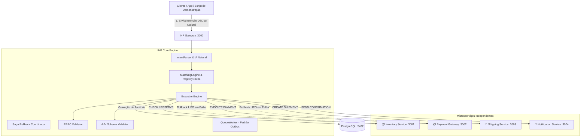

# Projeto Completo de Teste e Demonstração: Ecossistema E-Commerce (Global Shop Hub)

Bem-vindo ao projeto de referência e suíte de testes do **Intent Network Protocol (INP)**. 

Este projeto foi construído para **provar que o protocolo INP funciona e como ele funciona na prática**, através de um ecossistema realista de comércio eletrônico composto por 4 microsserviços distribuídos e independentes:

1. **📦 Microsserviço de Estoque & Armazém** (Porta `:3001`): Consulta de estoque, reservas físicas de itens e compensação automática (*Restoration*).
2. **💳 Gateway de Pagamentos Seguros** (Porta `:3002`): Processamento de cartão com verificação de permissões RBAC, JSON Schema estrito e reembolsos Saga.
3. **🚚 Logística & Rastreamento** (Porta `:3003`): Geração de etiquetas de envio, despacho de encomendas e suporte a cancelamentos com simulação de modo Chaos.
4. **🔔 Notificações & Engajamento** (Porta `:3004`): Envio de recibos por email/SMS e alertas de pedidos.

---

## 🏛️ Arquitetura da Solução

Em uma arquitetura tradicional, o cliente precisa conhecer as URLs de cada serviço, lidar manualmente com retentativas, coordenar rollbacks em caso de falhas e implementar regras de segurança espalhadas.

Com o **INP Protocol**, o cliente apenas **declara o que quer que aconteça (Intenção)**. O INP cuida de toda a orquestração distribuída:



---

## 🚀 Como Executar

### 1. Pré-requisitos
* **Node.js** v18+
* **PostgreSQL** rodando localmente (usuário `inp`, senha `inp123`, banco `inp`)

### 2. Executar a Suíte Automatizada de Provas (Recomendado)
Execute um único comando para inicializar todos os serviços e rodar as 8 provas completas:

```bash
npm run demo
```

*(Ou diretamente via `npx ts-node examples/ecommerce-ecosystem/run-demo.ts`)*

---

## 🧪 As 8 Provas de Funcionamento do INP

O script `run-demo.ts` valida e comprova os 8 pilares fundamentais do protocolo:

| # | Prova | O que é testado | Por que prova que o INP funciona? |
|---|---|---|---|
| **1** | **Descoberta & Registro Dinâmico** | Os 4 serviços publicam suas capacidades, schemas e ações compensatórias. | Prova que novos microsserviços entram na rede sem reiniciar o Gateway e são catalogados dinamicamente. |
| **2** | **Happy Path (Orquestração Completa)** | Sequência: `CHECK STOCK` ➔ `RESERVE STOCK` ➔ `EXECUTE PAYMENT` ➔ `CREATE SHIPMENT` ➔ `SEND CONFIRMATION`. | Prova a passagem contínua de contexto, composição do output e persistência de auditoria no PostgreSQL. |
| **3** | **Padrão Saga & Auto-Rollback** | Injeção de erro 500 na Logística após cobrança e reserva feitas. | Prova que o INP intercepta a falha e executa rollback compensatório LIFO (`REFUND PAYMENT` e `RESTORE STOCK`), evitando dinheiro preso ou produtos perdidos. |
| **4** | **Blindagem de Segurança RBAC** | Submissão de cobrança sem a permissão `payments.write`. | Prova que o INP bloqueia a intenção **antes** de qualquer chamada HTTP externa, protegendo a rede contra acessos não autorizados. |
| **5** | **Validação de Contrato (JSON Schema)** | Envio de valor negativo (`amount: -50.00`). | Prova que o motor valida a integridade estrutural do payload via AJV e rejeita requisições corrompidas. |
| **6** | **Processamento de Linguagem Natural** | Frase humana: *"Quero pagar 250 euros para o usuário usr_buyer_42..."*. | Prova que o `IntentParser` traduz comandos textuais livres em chamadas estruturadas de microsserviços. |
| **7** | **Processamento Assíncrono (Outbox)** | Envio de intenção com `"async": true`. | Prova resposta imediata `PENDING` e execução concorrente assíncrona pelo `QueueWorker` (`SKIP LOCKED`). |
| **8** | **Idempotência & Auditoria** | Rastreamento do cabeçalho `X-Idempotency-Key` e consulta a `executions`. | Prova que operações duplicadas são idempotentes e todo o ciclo de vida fica registrado para auditoria. |

---

## 🖥️ Painel Web Interativo

Para testar visualmente e ver os nós mudando de estado em tempo real:

1. Inicie os serviços em um terminal:
   ```bash
   npm run demo:services
   ```
2. Abra o arquivo `examples/ecommerce-ecosystem/dashboard.html` no seu navegador (ou via servidor local).
3. Clique nos botões para disparar os cenários interativos:
   * **[▶ Executar Pedido Completo]**
   * **[⚡ Simular Falha & Rollback]**
   * **[🛡️ Testar Violação RBAC]**
   * **[📋 Testar Payload Inválido]**
   * **[💬 Enviar Texto Natural]**
   * **[⏳ Testar Fila Assíncrona]**

---

## 📂 Estrutura de Arquivos

```text
examples/ecommerce-ecosystem/
├── services/
│   ├── inventory-service.ts     # Microsserviço de Estoque & Reservas
│   ├── payment-service.ts       # Microsserviço de Pagamentos & Reembolsos
│   ├── shipping-service.ts      # Microsserviço de Logística & Etiquetas
│   └── notification-service.ts  # Microsserviço de Notificações
├── client/
│   └── inp-client.ts            # SDK de consumo simplificado do INP
├── start-ecosystem.ts           # Inicializador paralelo de todos os microsserviços
├── run-demo.ts                  # Executável de validação automatizada das 8 provas
├── dashboard.html               # Interface gráfica de laboratório e demonstração
└── README.md                    # Este manual de documentação
```
